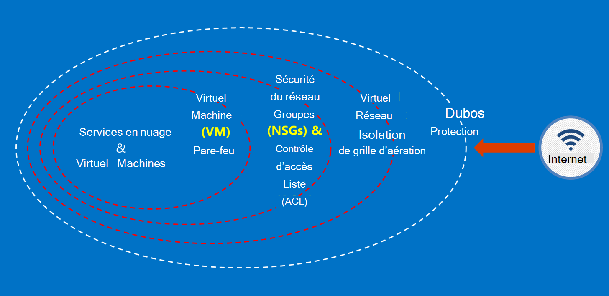

<properties
    pageTitle="Documentation de gouvernement Azure | Microsoft Azure"
    description="Cela fournit une comparaison des fonctionnalités et des conseils sur le développement d’applications pour Azure gouvernement"
    services="Azure-Government"
    cloud="gov" 
    documentationCenter=""
    authors="ryansoc"
    manager="zakramer"
    editor=""/>

<tags
    ms.service="multiple"
    ms.devlang="na"
    ms.topic="article"
    ms.tgt_pltfrm="na"
    ms.workload="azure-government"
    ms.date="08/25/2016"
    ms.author="ryansoc"/>

#  Vue d’ensemble de la Documentation du gouvernement Azure

##  Introduction à la Documentation du gouvernement Azure

Ce site décrit les fonctionnalités des services des [Administrations publiques de Microsoft Azure](https://azure.microsoft.com/features/gov/) et fournit des indications générales applicables à tous les clients. Avant d’inclure spécifiquement des données réglementées dans votre abonnement Azure gouvernement, vous devez vous familiariser avec les fonctions de gouvernement d’Azure et si vous avez des questions, consultez votre responsable de compte.

Reportez-vous à la [Page Microsoft Azure approbation centre de conformité](http://www.microsoft.com/en-us/TrustCenter/Compliance/default.aspx) pour obtenir des informations sur les services Azure gouvernement couverts par les réglementations et accréditations spécifiques. Les services Microsoft supplémentaires peuvent également être disponibles, mais ne sont pas dans le cadre des services gouvernement Azure couverts et ne sont pas abordés par ce document. Des services publics Azure peuvent également vous autorise à utiliser une variété de ressources supplémentaires, les applications ou les services qui sont fournis par des tiers, ou par Microsoft sous des termes différents de stratégies de confidentialité et d’utilisation, qui ne sont pas inclus dans la portée de ce document. Vous êtes responsable de l’examen des conditions de tous les « module complémentaire » offres en son genre, comme des offres de marché, afin de garantir qu’ils répondent à vos besoins en matière de respect de la réglementation.

Gouvernement Azure est disponible pour les entités qui gèrent les données envoyées à certaines réglementations gouvernementales en matière de (par exemple, le NIST 800.171 (DIB), ITAR, IRS 1075, DoD L4 et CJIS) où l’utilisation du gouvernement d’Azure est nécessaire pour se conformer aux réglementations. Les clients de gouvernement Azure sont soumises à validation d’éligibilité.

Entités avec des questions sur l’éligibilité pour Azure gouvernement doivent consulter leur équipe de compte.

##  Principes de sécurisation des données client dans Azure gouvernement

Gouvernement Azure propose une gamme de fonctionnalités et de services que vous pouvez utiliser pour créer des solutions de nuage pour satisfaire vos besoins réglementées/données contrôlées par le. Une solution client conforme est rien de plus que la mise en oeuvre efficace des capacités d’Azure gouvernement-de-l’emploi, couplée à une pratique de sécurité de données solides.
Lorsque vous hébergez une solution dans Azure gouvernement, Microsoft gère de nombreux de ces exigences au niveau de l’infrastructure de nuage.

Le diagramme suivant illustre le modèle de défense en profondeur Azure. Par exemple, Microsoft fournit l’infrastructure de nuage base DDOS, ainsi que des fonctionnalités de client, telles que des appliances de sécurité pour les applications spécifiques au client que DDoS doit.

Cette page décrit les principes de base pour sécuriser vos Services et applications, en fournissant des conseils et les meilleures pratiques sur l’application de ces principes ; en d’autres termes, comment clients doivent utiliser smart du gouvernement Azure pour respecter les obligations et les responsabilités qui sont requises pour une solution qui gère les informations de la réglementation ITAR.

Les principes de sécurisation des données client sont les suivantes :
* Protection des données à l’aide du cryptage
* Gestion des secrets
* Isolation pour restreindre l’accès aux données

##  Protéger les données client à l’aide du cryptage

Atténuation des risques et de respect des obligations réglementaires poussent la sélection et l’importance du cryptage de données croissante. Une implémentation de cryptage efficace permet de renforcer les mesures de sécurité réseau et des applications en cours et de réduire le risque global de votre environnement en nuage.

### Cryptage au repos
Le cryptage des données au repos s’applique à la protection du contenu client dans le stockage sur disque. Il existe plusieurs façons que cela peut se produire :

### Cryptage des services de stockage

Cryptage des Service stockage Azure est activé au niveau du compte de stockage, obtenu dans les blobs de bloc et de blobs de page sont automatiquement cryptés lors de l’écriture dans le stockage Azure. Lorsque vous lisez les données de stockage Azure, il sera décrypté par le service de stockage avant d’être retourné. Cela permet de sécuriser vos données sans avoir à modifier ou ajouter du code pour toutes les applications.

### Chiffrement de disque Azure
Utiliser le cryptage de disque Azure pour crypter les disques du système d’exploitation et les disques de données utilisés par un ordinateur virtuel de Azure. Intégration avec Azure clé coffre-fort vous offre contrôle et permet de gérer les clés de cryptage de disque.

### Cryptage côté client
Cryptage côté client est intégré dans le Java et les bibliothèques de client de stockage .NET, qui peuvent utiliser les API de stockage en chambre forte de clé Azure, ce qui en fait plus simple à implémenter. Coffre-fort de clé Azure permet d’accéder aux secrets dans Azure clé coffre-fort pour des utilisateurs spécifiques à l’aide d’Azure Active Directory.

### Cryptage en transit

Le cryptage de base disponible pour la connectivité au gouvernement d’Azure prend en charge le protocole de sécurité TLS (Transport Level Security) 1.2 et de certificats X.509. Fédérale de traitement Standard FIPS (Information) 140-2 algorithmes de chiffrement de niveau 1 sont également utilisés pour les connexions de réseau d’infrastructure entre les centres de données Azure gouvernement.  Windows Server 2012 R2 et Windows 8-plus VM et les partages de fichiers Azure peuvent utiliser SMB 3.0 pour le cryptage entre la VM et le partage de fichiers. Cryptage côté Client permet de chiffrer les données avant leur transfert dans le stockage dans une application cliente, et pour décrypter les données une fois qu’il est transféré à partir de stockage.

### Meilleures pratiques pour le cryptage

* Machines virtuelles de IaaS : Utiliser le cryptage de disque Azure. Activer le chiffrement de Service de stockage pour crypter les fichiers VHD qui sont utilisés pour sauvegarder les disques dans le stockage Azure, mais cela ne crypte les données nouvellement écrites. Cela signifie que, si vous créez un ordinateur virtuel, puis activez le chiffrement de Service de stockage sur le compte de stockage qui contient le fichier de disque dur virtuel, seules les modifications seront chiffrées, pas le fichier de disque dur virtuel d’origine.
* Le cryptage côté client : Il s’agit de la méthode la plus sûre pour le cryptage de vos données, car il crypte avant de transit et crypte les données au repos. Toutefois, elle exige que vous ajoutez du code à vos applications à l’aide de stockage que vous souhaitez pas faire. Dans ce cas, vous pouvez utiliser HTTPs pour vos données en transit et stockage Service de cryptage pour crypter les données au repos. Cryptage côté client implique également la charge plus sur le client, vous devez en tenir compte dans vos plans de l’évolutivité, en particulier si vous sont de chiffrement et de transfert d’un grand nombre de données.

Pour plus d’informations sur les options de chiffrement dans Azure, consultez le [Guide de sécurité de stockage](/storage-security-guide).

##  Protéger les données client grâce à la gestion des Secrets

Gestion sécurisée des clés sont essentielle pour la protection des données dans le nuage. Les clients doivent s’efforcer de simplifier la gestion des clés et de garder le contrôle des clés utilisés par les services et les applications en nuage pour crypter les données.

### Meilleures pratiques pour la gestion des Secrets

* Chambre forte de clé permet de minimiser les risques de secrets qui est exposés par le biais de fichiers de configuration de codées en dur, scripts, ou dans le code source. Azure coffre-fort de clé crypte les clés (par exemple, les clés de cryptage pour le chiffrement de disque Azure) et les données confidentielles (telles que les mots de passe), en les stockant dans FIPS 140-2 de niveau 2 validé des modules de sécurité matérielle (HSM). Pour la garantie, vous pouvez importer, ou générer des clés dans ces modules HSM.
* Les modèles et le code de l’application doivent contenir uniquement des références URI pour les secrets (ce qui signifie que les secrets réels ne sont pas dans le code, de configuration ou de code source référentiels). Cela empêche les attaques de phishing clé sur les pensions internes ou externes, tels que les robots de récolte dans GitHub.
* Utiliser les contrôles RBAC forts dans la chambre forte de clé. Si un opérateur de confiance quitte la société ou transferts vers un nouveau groupe au sein de la société, elles doivent être bloquées en mesure d’accéder aux secrets.  

Pour plus d’informations, consultez [Stockage en chambre forte de la clé pour Azure gouvernement](/azure-government/azure-government-tech-keyvault)

##  Isolation pour restreindre l’accès aux données

L’isolation est consacré à l’aide de limites, de segmentation et de conteneurs, pour limiter l’accès aux données pour seulement les utilisateurs autorisés, les services et les applications. Par exemple, la séparation entre les locataires est un mécanisme de sécurité essentielles pour plateformes en nuage partagé comme Microsoft Azure. Isolation logique empêche un locataire d’interférer avec les opérations de tous les autres clients.

### Isolation de l’environnement
L’environnement de gouvernement d’Azure est une instance physique qui est séparée du reste du réseau de Microsoft. Cela grâce à une série de contrôles physiques et logiques qui sont les suivants : sécurisation de barrières physiques à l’aide de périphériques biométriques et les appareils photo.  Utilisation des informations d’identification spécifiques et de l’authentification multifactorielle par le personnel Microsoft nécessitant un accès logique à l’environnement de production.  Toute infrastructure de service pour Azure gouvernement se trouve aux États-Unis.

#### Isolation par client
Azure implémente un contrôle d’accès réseau et de répartition des tâches via l’isolation de VLAN, ACL, chargent équilibreurs et les filtres IP

Les clients peuvent isoler davantage leurs ressources sur les abonnements, les groupes de ressources, les réseaux virtuels et les sous-réseaux.

Pour plus d’informations sur l’isolation de Microsoft Azure, voir la [section Isolation d’un Guide sur la sécurité Azure](/azure-security-getting-started/#isolation).

Pour des informations supplémentaires et des mises à jour, veuillez vous inscrire à la <a href="https://blogs.msdn.microsoft.com/azuregov/">Microsoft Azure gouvernement Blog.</a>
