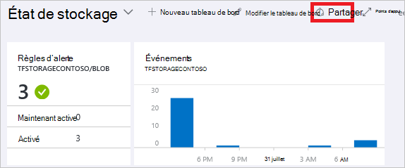
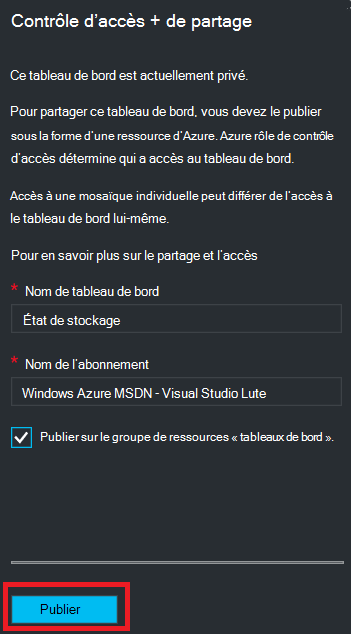
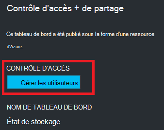
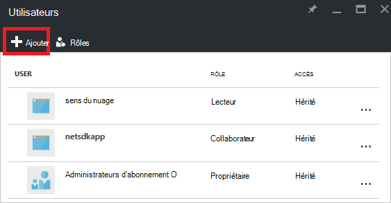
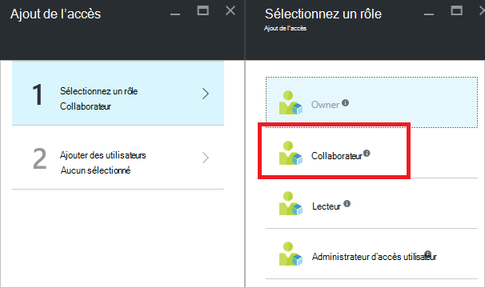
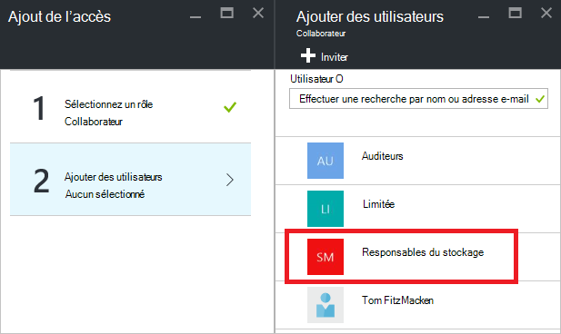
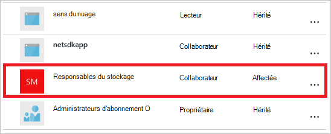

<properties
   pageTitle="Accès de tableau de bord de portail Azure | Microsoft Azure"
   description="Cet article explique comment partager l’accès à un tableau de bord dans le portail Azure."
   services="azure-portal"
   documentationCenter=""
   authors="tfitzmac"
   manager="timlt"
   editor="tysonn"/>

<tags
   ms.service="multiple"
   ms.devlang="NA"
   ms.topic="article"
   ms.tgt_pltfrm="NA"
   ms.workload="na"
   ms.date="08/01/2016"
   ms.author="tomfitz"/>

# Partage de tableaux de bord Azure

Après avoir configuré un tableau de bord, vous pouvez publier et partager avec d’autres utilisateurs de votre organisation. Vous autorisez d’autres utilisateurs à accéder à votre tableau de bord à l’aide d’Azure [Rôle de base de contrôle d’accès](../active-directory/role-based-access-control-configure.md). Vous affectez un utilisateur ou un groupe d’utilisateurs à un rôle, et que ce rôle définit si les utilisateurs peuvent afficher ou modifier le tableau de bord publié. 

Tous les tableaux de bord publiés est implémentées en tant que ressources Azure, ce qui signifie qu’ils existent en tant qu’éléments faciles à gérer dans votre abonnement et sont contenues dans un groupe de ressources.  À partir d’un point de vue du contrôle de l’accès, les tableaux de bord ne sont pas différentes de celle d’autres ressources, comme un ordinateur virtuel ou un compte de stockage.

> [AZURE.TIP] Des mosaïques dans le tableau de bord appliquent leurs propres exigences de contrôle d’accès basés sur les ressources qu’elles s’affichent.  Par conséquent, vous pouvez créer un tableau de bord largement partagée tout en protégeant les données sur les mosaïques.

## Présentation du contrôle de l’accès pour les tableaux de bord

Avec contrôle d’accès basé sur les rôles, vous pouvez affecter des utilisateurs aux rôles à trois différents niveaux de portée :

- abonnement
- groupe de ressources
- ressources

Les autorisations assignées sont héritées de l’abonnement à la ressource. Le tableau de bord publié est une ressource. Par conséquent, vous disposez peut-être déjà les utilisateurs affectés à des rôles pour l’abonnement qui fonctionnent également pour le tableau de bord publié. 

Voici un exemple.  Supposons que vous disposez d’un abonnement Azure et différents membres de votre équipe ont reçu les rôles de **propriétaire**, **collaborateur**ou **lecteur** de l’abonnement. Les utilisateurs qui sont les propriétaires ou les collaborateurs sont en mesure de répertorier, d’afficher, de créer, de modifier ou de supprimer des tableaux de bord dans l’abonnement.  Les utilisateurs qui sont des lecteurs sont en mesure de répertorier et afficher des tableaux de bord, mais ne peut pas les modifier ou les supprimer.  Les utilisateurs disposant d’un accès de lecteur sont en mesure d’apporter des modifications locales à un tableau de bord publié (comme lors de la résolution d’un problème), mais ne sont pas en mesure de publier ces modifications sur le serveur.  Ils auront la possibilité de faire une copie privée du tableau de bord pour eux-mêmes

Toutefois, vous pourriez également affecter des autorisations pour le groupe de ressources qui contient plusieurs tableaux de bord ou un tableau de bord. Par exemple, vous pouvez décider qu’un groupe d’utilisateurs doit avoir des autorisations limitées sur l’abonnement mais un accès plus large à un tableau de bord spécifique. Vous affectez ces utilisateurs à un rôle pour ce tableau de bord. 

## Publier le tableau de bord

Supposons que vous avez terminé de configurer un tableau de bord que vous souhaitez partager avec un groupe d’utilisateurs de votre abonnement. Les étapes ci-dessous décrivent un groupe personnalisé appelé responsables du stockage, mais vous pouvez nommer votre groupe à ce que vous voulez. Pour plus d’informations sur la création d’un groupe Active Directory et de l’ajout d’utilisateurs à ce groupe, consultez [Gestion des groupes Active Directory de Azure](../active-directory/active-directory-accessmanagement-manage-groups.md).

1. Dans le tableau de bord, cliquez sur **partager**.

     

2. Avant d’affecter l’accès, vous devez publier le tableau de bord. Par défaut, le tableau de bord sera publiée à un groupe de ressource nommé des **tableaux de bord**. Sélectionnez **Publier**.

     

Votre tableau de bord est désormais publié. Si les autorisations héritées de l’abonnement ne conviennent pas, vous n’avez pas besoin rien à faire plus. Autres utilisateurs de votre organisation seront en mesure d’accéder et de modifier le tableau de bord en fonction de leur rôle au niveau d’abonnement. Toutefois, dans le cadre de ce didacticiel, nous allons affecter un groupe d’utilisateurs à un rôle pour ce tableau de bord.

## Affectation d’accès à un tableau de bord

1. Après la publication du tableau de bord, sélectionnez **Gérer les utilisateurs**.

     

2. Vous verrez une liste des utilisateurs existants qui sont déjà affectés à un rôle pour ce tableau de bord. Votre liste d’utilisateurs existants sera différente de celle de l’image ci-dessous. Très probablement, les affectations sont héritées de l’abonnement. Pour ajouter un nouvel utilisateur ou un groupe, sélectionnez **Ajouter**.

     

3. Sélectionnez le rôle qui représentent les autorisations que vous voulez accorder. Pour cet exemple, sélectionnez le **contributeur**.

     

4. Sélectionnez l’utilisateur ou le groupe que vous souhaitez affecter à ce rôle. Si vous ne voyez pas l’utilisateur ou le groupe que vous recherchez dans la liste, utilisez la zone de recherche. Les groupes que vous avez créé dans Active Directory dépend de la liste des groupes disponibles.

      

5. Lorsque vous avez terminé d’ajouter des utilisateurs ou des groupes, sélectionnez **OK**. 

6. La nouvelle affectation est ajoutée à la liste des utilisateurs. Notez que son **accès** est répertorié comme **affecté** et non **hérités**.

     

## Étapes suivantes

- Pour obtenir une liste des rôles, consultez [RBAC : rôles intégrés](../active-directory/role-based-access-built-in-roles.md).
- Pour en savoir plus sur la gestion des ressources, consultez [ressources de gérer l’Azure via le portail](resource-group-portal.md).