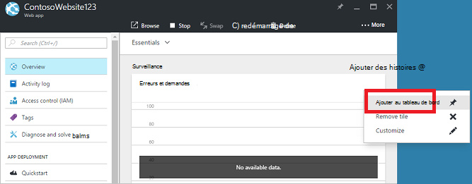
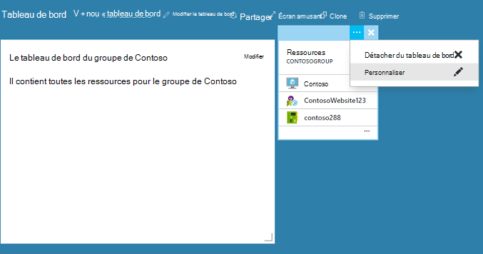

<properties
   pageTitle="Les tableaux de bord de portails Azure | Microsoft Azure"
   description="Cet article explique comment créer et modifier des tableaux de bord dans le portail Azure."
   services="azure-portal"
   documentationCenter=""
   authors="sewatson"
   manager="timlt"
   editor="tysonn"/>

<tags
   ms.service="multiple"
   ms.devlang="NA"
   ms.topic="article"
   ms.tgt_pltfrm="NA"
   ms.workload="na"
   ms.date="09/06/2016"
   ms.author="sewatson"/>

# Création et partage de tableaux de bord dans le portail Azure

Vous pouvez créer plusieurs tableaux de bord et les partager avec d’autres personnes qui ont accès à vos abonnements Azure.  Cette publication passe par les principes fondamentaux de la création/modification, la publication et la gestion de l’accès aux tableaux de bord.

## Personnalisation des tableaux de bord et lames

Depuis le lancement de tableaux de bord il y a quelques mois, il a été un ralentissement dans les personnalisations des lames et une augmentation rapide de la personnalisation du tableau de bord. Cette tendance d’utilisation fort montre que vous préférez la personnalisation des tableaux de bord sur des lames. Pour prendre en charge cette tendance, nous supprimons la possibilité de personnaliser les lames et dédier nos efforts visant à l’amélioration des fonctionnalités de tableau de bord. Si vous avez personnalisé une lame, votre personnalisation va bientôt être supprimée. Pour conserver cette personnalisation, épingler les mosaïques personnalisés à un tableau de bord. Cliquez simplement avec le bouton droit de la mosaïque et sélectionnez **Ajouter au tableau de bord** comme indiqué dans l’image suivante.

## Créer un tableau de bord

Pour créer un tableau de bord, cliquez sur le bouton **nouveau tableau de bord** en regard du nom du tableau de bord actuel.  

Cette action crée un tableau de bord privé, nouveau vide et vous place en mode de personnalisation dans laquelle vous pouvez nommer votre tableau de bord et ajouter ou réorganiser des mosaïques.  Dans ce mode, la galerie mosaïque réductible est sur le menu de navigation de gauche.  La galerie de mosaïque vous permet de rechercher des mosaïques pour vos ressources Azure de différentes façons : vous pouvez parcourir par [groupe de ressources](../azure-resource-manager/resource-group-overview.md#resource-groups), par type de ressource, par [balise](../resource-group-using-tags.md)ou en effectuant une recherche par nom pour votre ressource.  

Ajouter des mosaïques en faisant glisser et en les déposant sur la surface du tableau de bord où vous le souhaitez.

Il existe une nouvelle catégorie appelée **Général** pour les mosaïques qui ne sont pas associés à une ressource particulière.  Dans cet exemple, nous épingler la mosaïque de la démarque.  Cette mosaïque vous permet d’ajouter du contenu personnalisé à votre tableau de bord.  La mosaïque prend en charge un ensemble limité de HTML en texte brut et [syntaxe de démarque](https://daringfireball.net/projects/markdown/syntax).  (Pour la sécurité, vous ne pouvez pas faire d’injecter `<script>` balises ou utiliser certain élément de style CSS qui peuvent interférer avec le portail.) 

## Modifier un tableau de bord

Après avoir créé votre tableau de bord, vous pouvez épingler des carreaux à partir de la galerie de mosaïque ou de la représentation sous forme de mosaïque de lames. Let's épingler la représentation sous forme de notre groupe de ressources. Vous pouvez soit code pin lors de l’exploration de l’élément ou de la lame de groupe de ressources. Les deux approches entraînent l’épinglage de la représentation sous forme de mosaïque du groupe ressources.

Après avoir épinglé l’élément, il apparaît sur votre tableau de bord.

Maintenant que nous disposons d’une mosaïque de démarque et un groupe de ressources est épinglé au tableau de bord, nous pouvons redimensionner et réorganiser les morceaux dans une disposition appropriée.

En pointant et en sélectionnant «... » ou en cliquant sur une mosaïque, vous pouvez voir toutes les commandes contextuelles pour cette mosaïque. Par défaut, il existe deux éléments :

1. **Supprimer du tableau de bord** – supprime la mosaïque du tableau de bord
2.  Entrée de **personnalisation** – personnaliser le mode

En sélectionnant Personnaliser, vous pouvez redimensionner et réorganiser les mosaïques. Pour redimensionner une mosaïque, sélectionnez la nouvelle taille dans le menu contextuel, comme illustré dans l’image suivante.

Ou, si la mosaïque prend en charge n’importe quelle taille, vous pouvez faire glisser le coin inférieur droit à la taille souhaitée.

Après avoir redimensionné mosaïques, permet d’afficher le tableau de bord.

Une fois que vous avez terminé de personnaliser un tableau de bord, sélectionnez simplement le **fait de personnalisation** pour quitter personnaliser le mode ou avec le bouton droit et sélectionnez **terminé la personnalisation** dans le menu contextuel.

## Publier un tableau de bord et gérer le contrôle d’accès

Lorsque vous créez un tableau de bord, il est privé par défaut, ce qui signifie que vous êtes la seule personne qui peut le consulter.  Pour le rendre visible aux autres utilisateurs, utilisez le bouton de **partage** qui s’affiche à côté d’autres commandes du tableau de bord.

Vous êtes invité à choisir un abonnement et un groupe de ressources pour votre tableau de bord doit être publié sur. Pour intégrer en toute transparence les tableaux de bord dans l’écosystème, nous avons mis en place des tableaux de bord partagés en tant que ressources Azure (de sorte que vous ne pouvez pas partager en tapant une adresse de messagerie).  Accès aux informations affichées par la plupart des mosaïques dans le portail sont régies par [Azure rôle de contrôle d’accès](../active-directory/role-based-access-control-configure.md ). À partir d’un point de vue du contrôle de l’accès, les tableaux de bord partagés ne sont pas différentes à partir d’un ordinateur virtuel ou un compte de stockage.  

Supposons que vous disposez d’un abonnement Azure et les membres de votre équipe ont reçu les rôles de **propriétaire**, **collaborateur**ou **lecteur** de l’abonnement.  Les utilisateurs qui sont les propriétaires ou les collaborateurs sont en mesure de répertorier, d’afficher, de créer, de modifier ou de supprimer des tableaux de bord au sein de cet abonnement.  Les utilisateurs qui sont des lecteurs sont en mesure de répertorier et afficher des tableaux de bord, mais ne peut pas les modifier ou les supprimer.  Les utilisateurs disposant d’un accès de lecteur sont en mesure d’apporter des modifications locales à un tableau de bord partagé, mais ne sont pas en mesure de publier ces modifications sur le serveur.  Toutefois, ils peuvent rendre une copie privée du tableau de bord pour leur propre usage.  Comme toujours, des mosaïques dans le tableau de bord appliquent leurs propres règles de contrôle d’accès basés sur les ressources qu’ils correspondent aux.  

Pour plus de commodité, expérience de publication du portail vous guide vers un modèle où placer les tableaux de bord dans un groupe de ressources appelé des **tableaux de bord**.  

Vous pouvez également choisir de publier un tableau de bord à un groupe de ressources.  Le contrôle d’accès pour ce tableau de bord correspond le contrôle d’accès pour le groupe de ressources.  Les utilisateurs qui peuvent gérer les ressources de ce groupe de ressources est également ont pour les tableaux de bord.

Après la publication de votre tableau de bord, le volet de contrôle **partage + accès** va actualiser et affiche des informations sur le tableau de bord publié, y compris un lien permettant de gérer l’accès utilisateur au tableau de bord.  Ce lien lance la lame de contrôle d’accès rôle standard permet de gérer l’accès à toute ressource Azure.  Vous pouvez toujours revenir à cette vue en sélectionnant le **partage**.

## Étapes suivantes

- Pour gérer les ressources, consultez [ressources de gérer l’Azure via le portail](resource-group-portal.md).
- Pour déployer des ressources, consultez [ressources de déploiement avec les modèles du Gestionnaire de ressources et Azure portal](../resource-group-template-deploy-portal.md).