<properties 
    pageTitle="Permet de gérer les ressources Azure Azure portal | Microsoft Azure" 
    description="Utilisez Azure portal et gérer des ressources d’Azure pour gérer vos ressources. Montre comment utiliser des tableaux de bord pour surveiller les performances." 
    services="azure-resource-manager,azure-portal" 
    documentationCenter="" 
    authors="tfitzmac" 
    manager="timlt" 
    editor="tysonn"/>

<tags 
    ms.service="azure-resource-manager" 
    ms.workload="multiple" 
    ms.tgt_pltfrm="na" 
    ms.devlang="na" 
    ms.topic="article" 
    ms.date="09/12/2016" 
    ms.author="tomfitz"/>

# Gérer les ressources Azure via le portail

> [AZURE.SELECTOR]
- [PowerShell Azure](../powershell-azure-resource-manager.md)
- [CLI Azure](../xplat-cli-azure-resource-manager.md)
- [Portail](resource-group-portal.md) 
- [API REST](../resource-manager-rest-api.md)

Cette rubrique montre comment utiliser le [portail Azure](https://portal.azure.com) avec [Le Gestionnaire de ressources Azure](../azure-resource-manager/resource-group-overview.md) pour gérer vos ressources Azure. Pour en savoir plus sur le déploiement des ressources via le portail, consultez [ressources de déploiement avec les modèles du Gestionnaire de ressources et Azure portal](../resource-group-template-deploy-portal.md).

Actuellement, pas tous les services prend en charge le portail ou le Gestionnaire de ressources. Pour ces services, vous devez utiliser le [portail classique](https://manage.windowsazure.com). L’état de chaque service, reportez-vous à la section [graphique de la disponibilité de portail Azure](https://azure.microsoft.com/features/azure-portal/availability/).

## Gérer les groupes de ressources

1. Pour afficher tous les groupes de ressources dans votre abonnement, sélectionnez les **groupes de ressources**.

    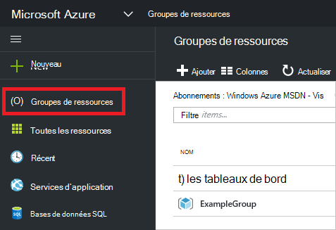

1. Pour créer un groupe de ressources vide, sélectionnez **Ajouter**.

    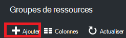

1. Fournir un nom et un emplacement pour le nouveau groupe de ressources. Sélectionnez **créer**.

    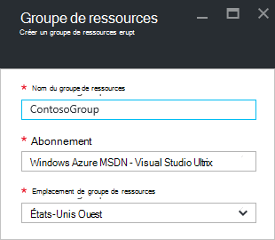

1. Vous devrez peut-être sélectionner **Actualiser** pour voir le groupe de ressources récemment créé.

    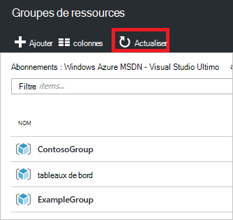

1. Pour personnaliser les informations affichées pour vos groupes de ressources, sélectionnez **les colonnes**.

    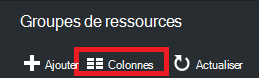

1. Sélectionnez les colonnes à ajouter, puis sélectionnez **mise à jour**.

    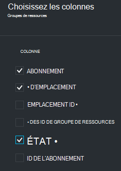

1. Pour en savoir plus sur le déploiement des ressources à votre nouveau groupe de ressources, consultez [ressources de déploiement avec les modèles du Gestionnaire de ressources et Azure portal](../resource-group-template-deploy-portal.md).

1. Pour accéder rapidement à un groupe de ressources, vous pouvez épingler la lame à votre tableau de bord.

    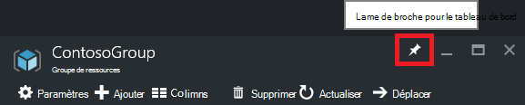

1. Le tableau de bord affiche le groupe de ressources et de ses ressources. Vous pouvez sélectionner les groupes de ressources ou une de ses ressources pour accéder à l’élément.

    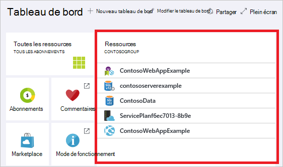

## Ressources de la balise

Vous pouvez appliquer des balises à des groupes de ressources et de ressources pour organiser logiquement de vos actifs. Pour plus d’informations sur l’utilisation de balises, voir [en utilisant des balises pour organiser vos ressources Azure](../resource-group-using-tags.md).

[AZURE.INCLUDE [resource-manager-tag-resource](../../includes/resource-manager-tag-resources.md)]

## Ressources de moniteur

Lorsque vous sélectionnez une ressource, la lame de ressource présente les graphiques par défaut et les tables pour la surveillance de ce type de ressource.

1. Sélectionnez une ressource et notez la section **analyse** . Il comprend des graphiques qui sont pertinents pour le type de ressource. L’image suivante affiche la valeur par défaut de contrôle de données pour un compte de stockage.

    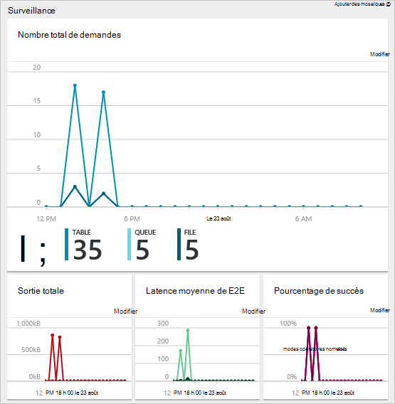

1. Vous pouvez ajouter une section de la lame à votre tableau de bord en sélectionnant le bouton de sélection (...), au-dessus de la section. Vous pouvez également personnaliser la taille de la section de la lame ou le supprimer complètement. L’image suivante montre comment ancrer, personnaliser ou supprimer la section de la mémoire et du processeur.

    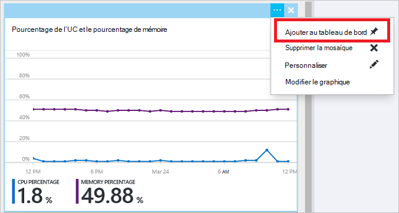

1. Après avoir épinglé à la section au tableau de bord, vous verrez le résumé sur le tableau de bord. Et, immédiatement la sélection pour plus de détails sur les données.

    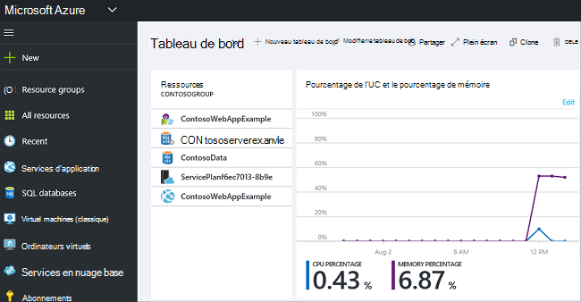

1. Pour totalement personnaliser les données que vous surveillez via le portail, accédez à votre tableau de bord par défaut et sélectionnez **nouveau tableau de bord**.

    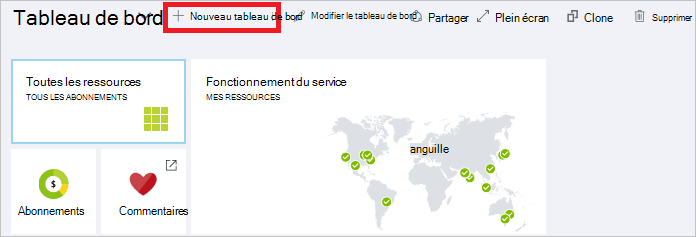

1. Donnez un nom à votre nouveau tableau de bord et faites glisser de mosaïques dans le tableau de bord. Les mosaïques sont filtrés par les différentes options.

    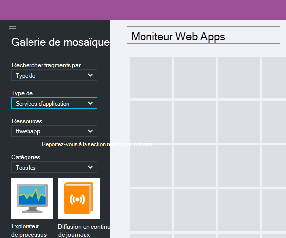

     Pour en savoir plus sur l’utilisation des tableaux de bord, reportez-vous à la section [Création et partage de tableaux de bord dans le portail Azure](azure-portal-dashboards.md).

## Gestion des ressources

De la lame d’une ressource, vous voyez les options de gestion de la ressource. Le portail présente des options de gestion de ce type de ressource particulier. Vous consultez les commandes de gestion dans la partie supérieure de la lame de ressources et sur le côté gauche.

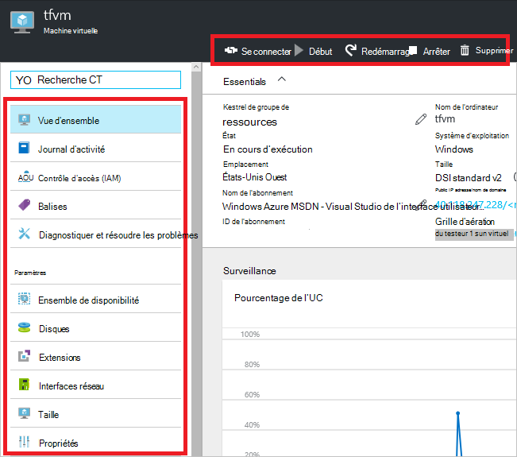

À partir de ces options, vous pouvez effectuer des opérations telles que le démarrage et l’arrêt d’une machine virtuelle ou reconfigurer les propriétés de l’ordinateur virtuel.

## Déplacer des ressources

Si vous devez déplacer les ressources vers un autre groupe de ressources ou un autre abonnement, voir [déplacer des ressources vers le nouveau groupe de ressources ou d’abonnement](../resource-group-move-resources.md).

## Ressources de verrouillage

Vous pouvez verrouiller un abonnement, un groupe de ressources ou une ressource pour empêcher d’autres utilisateurs de votre organisation accidentellement supprimer ou modifier des ressources critiques. Pour plus d’informations, consultez [ressources de verrouillage avec le Gestionnaire de ressources Azure](../resource-group-lock-resources.md).

[AZURE.INCLUDE [resource-manager-lock-resources](../../includes/resource-manager-lock-resources.md)]

## Permet d’afficher votre abonnement et les coûts

Vous pouvez afficher des informations sur votre abonnement et sur les coûts reportées pour toutes vos ressources. Sélectionnez l’abonnement que vous voulez voir et les **abonnements** . Vous pouvez uniquement avoir un abonnement pour sélectionner.

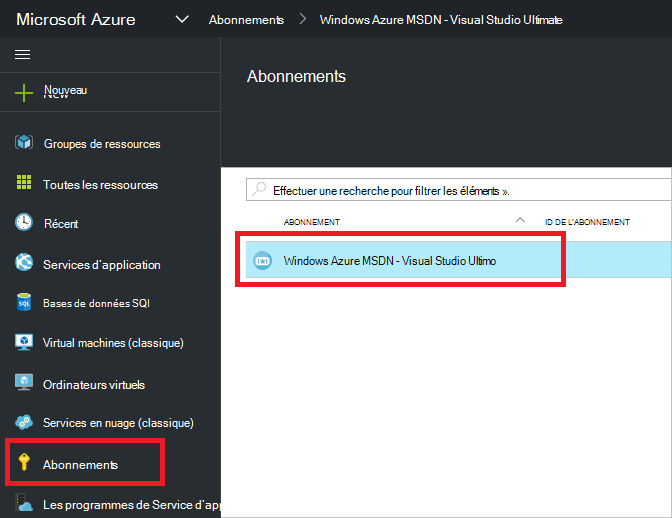

Au sein de la lame d’abonnement, vous voyez un taux d’avancement.

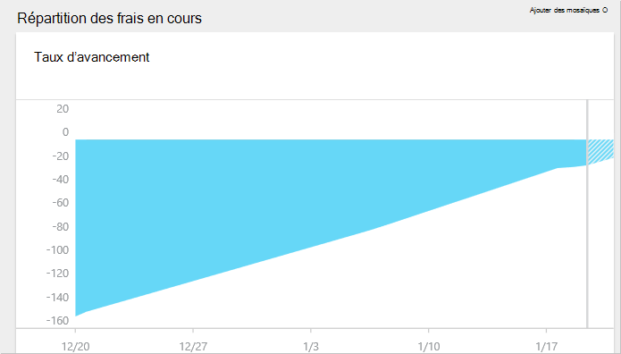

Et une ventilation des coûts par type de ressource.

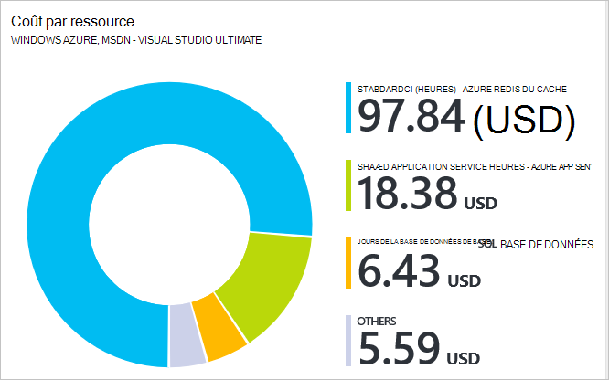

## Exporter le modèle

Après avoir configuré votre groupe de ressources, vous souhaiterez afficher le modèle du Gestionnaire de ressources du groupe de ressources. Exporter le modèle offre deux avantages :

1. Vous pouvez facilement automatiser les déploiements à venir de la solution, car le modèle contient toute l’infrastructure complète.

2. Vous pouvez vous familiariser avec la syntaxe de modèle en regardant à la Notation JSON (JavaScript Object) qui représente votre solution.

Pour obtenir des instructions, voir [modèle de gestionnaire de ressources Azure exporter à partir de ressources existantes](../resource-manager-export-template.md).

## Supprimer le groupe de ressources ou de ressources

Suppression d’un groupe de ressources supprime toutes les ressources qu’il contient. Vous pouvez également supprimer des ressources individuelles dans un groupe de ressources. Vous souhaitez faire preuve de prudence lorsque vous supprimez un groupe de ressources, car il peut y avoir des ressources dans d’autres groupes de ressources qui y sont liés. Le Gestionnaire de ressources ne supprime pas les ressources liées, mais ils ne peuvent pas fonctionner correctement sans les ressources attendues.

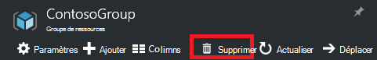

## Étapes suivantes

- Pour afficher les journaux d’audit, voir [Auditer les opérations effectuées avec le Gestionnaire de ressources](../resource-group-audit.md).
- Pour résoudre les erreurs de déploiement, consultez [déploiements de groupe de ressources de résolution des problèmes avec Azure portal](../resource-manager-troubleshoot-deployments-portal.md).
- Pour déployer des ressources via le portail, consultez [ressources de déploiement avec les modèles du Gestionnaire de ressources et Azure portal](../resource-group-template-deploy-portal.md).
- Pour gérer l’accès aux ressources, reportez-vous à la section [utiliser les affectations de rôles pour gérer l’accès aux ressources de votre abonnement Azure](../active-directory/role-based-access-control-configure.md).

