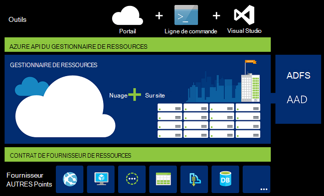
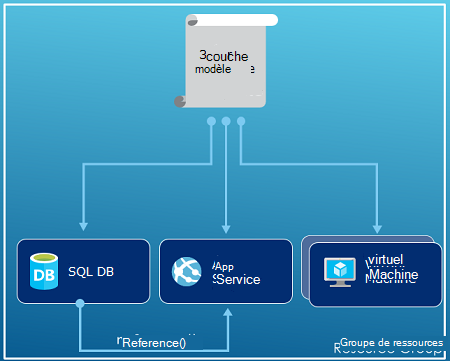
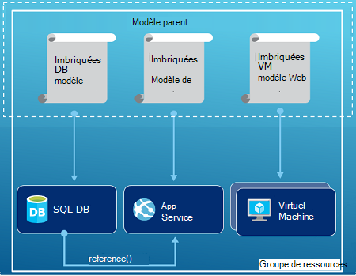
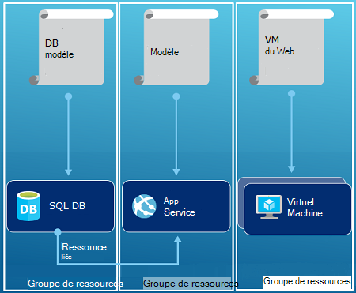

<properties
   pageTitle="Vue d’ensemble de Gestionnaire des ressources Azure | Microsoft Azure"
   description="Décrit comment utiliser le Gestionnaire de ressources Azure pour le déploiement, la gestion et contrôle d’accès ressources sur Azure."
   services="azure-resource-manager"
   documentationCenter="na"
   authors="tfitzmac"
   manager="timlt"
   editor="tysonn"/>

<tags
   ms.service="azure-resource-manager"
   ms.devlang="na"
   ms.topic="get-started-article"
   ms.tgt_pltfrm="na"
   ms.workload="na"
   ms.date="10/21/2016"
   ms.author="tomfitz"/>

# Vue d’ensemble de Gestionnaire des ressources Azure

L’infrastructure de votre application est généralement constitué de nombreux composants – peut-être une machine virtuelle, compte de stockage, réseau virtuel, ou une application web, base de données, serveur de base de données et des 3 services de tiers. Vous ne voyez pas ces composants en tant qu’entités séparées, vous consultez les parties liées et interdépendantes d’une seule entité. Vous souhaitez déployer, de gérer et de les contrôler comme un groupe. Azure le Gestionnaire de ressources vous permet de travailler avec les ressources de votre solution en tant que groupe. Vous pouvez déployer, mettre à jour ou supprimer toutes les ressources de votre solution dans une opération unique et coordonnée. Vous utilisez un modèle de déploiement, et ce modèle peut fonctionner dans différents environnements comme test, intermédiaire et de production. Resource Manager assure la sécurité, d’audit et de marquage des fonctionnalités pour vous aider à gérer vos ressources après le déploiement. 

## Terminologie

Si vous êtes gestionnaire de ressource Azure, il existe certains termes que vous ne connaissez peut-être pas.

- **ressource** - un élément facile à gérer qui est disponible par le biais de Azure. Certaines ressources communes sont une machine virtuelle compte de stockage, application web, base de données et réseau virtuel, mais il existe beaucoup d’autres.
- **groupe de ressources** : un conteneur qui conserve les ressources associées à une solution Azure. Le groupe de ressources peut inclure toutes les ressources de la solution, ou uniquement les ressources que vous souhaitez gérer en tant que groupe. Vous décidez comment vous souhaitez affecter des ressources aux groupes de ressources en fonction de ce que fait le mieux à votre organisation. Consultez les [groupes de ressources](#resource-groups).
- **fournisseur de ressources** - un service qui fournit les ressources que vous pouvez déployer et gérer par le biais du Gestionnaire de ressources. Chaque fournisseur de ressources offre des opérations permettant de travailler avec les ressources qui sont déployés. Certains fournisseurs de ressources communes sont Microsoft.Compute, qui fournit la ressource d’ordinateur virtuel, Microsoft.Storage, qui fournit la ressource compte de stockage, et Microsoft.Web, qui fournit des ressources liées à des applications web. Consultez les [fournisseurs de ressources](#resource-providers).
- **Modèle de gestionnaire de ressources** - fichier une Notation JSON (JavaScript Object) qui définit une ou plusieurs ressources pour déployer vers un groupe de ressources. Il définit également les dépendances entre les ressources déployées. Le modèle peut être utilisé pour déployer les ressources à plusieurs reprises et de façon cohérente. Consultez [déploiement du modèle](#template-deployment).
- **syntaxe déclarative** - syntaxe qui vous permet de vous indiquez « Voici ce que j’ai l’intention de créer » sans avoir à écrire de la séquence de la programmation des commandes pour le créer. Le modèle de gestionnaire de ressources est un exemple de la syntaxe déclarative. Dans le fichier, vous définissez les propriétés de l’infrastructure pour le déploiement d’Azure. 

## Les avantages de l’utilisation du Gestionnaire de ressources

Le Gestionnaire de ressources offre plusieurs avantages :

- Vous pouvez déployer, gérer et contrôler toutes les ressources de votre solution sous la forme d’un groupe, plutôt que de gérer ces ressources séparément.
- Vous pouvez à plusieurs reprises déployer votre solution tout au long du cycle de développement et en toute confiance que vos ressources sont déployés dans un état cohérent.
- Vous pouvez gérer votre infrastructure grâce à des modèles déclaratifs plutôt que des scripts.
- Vous pouvez définir les dépendances entre les ressources afin de les déployer dans le bon ordre.
- Vous pouvez appliquer le contrôle d’accès à tous les services dans votre groupe de ressources, car le contrôle d’accès basée sur les rôles (RBAC) est en mode natif intégré dans la plate-forme de gestion.
- Vous pouvez appliquer des balises aux ressources pour organiser logiquement de toutes les ressources de votre abonnement.
- Vous pouvez clarifier la facturation de votre société en affichant les coûts pour un groupe de ressources partage la même balise.  

Le Gestionnaire de ressources propose une nouvelle façon de déployer et gérer vos solutions. Si vous utiliser le modèle de déploiement antérieur et que vous souhaitez en savoir plus sur les modifications, consultez [déploiement de présentation du Gestionnaire de ressources et de déploiement classique](../resource-manager-deployment-model.md).

## Couche de gestion cohérente

Le Gestionnaire de ressources fournit une couche de gestion cohérente pour les tâches que vous effectuez par le biais de PowerShell d’Azure, Azure CLI, Azure portal, API REST et outils de développement. Tous les outils utilisent un ensemble commun d’opérations. Vous utilisez les outils qui vous conviennent le mieux et peuvent utiliser de manière interchangeable sans confusion. 

L’image suivante montre comment tous les outils interagissent avec la même API du Gestionnaire de ressources Azure. L’API transfère les demandes au service Gestionnaire de ressources, qui authentifie et autorise les demandes. Le Gestionnaire de ressources achemine ensuite les demandes pour les fournisseurs de ressources appropriée.

## Conseils

Les suggestions suivantes vous permettent de profiter pleinement du Gestionnaire de ressources lorsque vous travaillez avec vos solutions.

1. Définir et déployer votre infrastructure par le biais de la syntaxe déclarative dans les modèles du Gestionnaire de ressources, et non par le biais de commandes impératives.
2. Définissez toutes les étapes de configuration et de déploiement dans le modèle. Vous ne devez avoir aucune étapes manuelles pour la configuration de votre solution.
3. Exécuter des commandes impératives pour gérer vos ressources, par exemple en tant que pour démarrer ou arrêter une application ou un ordinateur.
4. Organiser les ressources avec le même cycle de vie dans un groupe de ressources. Utiliser des balises pour tous les autres organiser des ressources.

Pour en savoir plus, consultez [méthodes conseillées pour la création de modèles du Gestionnaire de ressources Azure](../resource-manager-template-best-practices.md).

## Groupes de ressources

Il existe certains facteurs importants à prendre en compte lors de la définition de votre groupe de ressources :

1. Toutes les ressources de votre groupe doivent partager le même cycle de vie. Vous déployez, mettre à jour et les supprimez ensemble. Si une ressource, tel qu’un serveur de base de données, doit exister sur un cycle de déploiement différentes, il doit être dans un autre groupe de ressources.
2. Chaque ressource ne peut exister que dans un groupe de ressources.
3. Vous pouvez ajouter ou supprimer une ressource à un groupe de ressources à tout moment.
4. Vous pouvez déplacer une ressource d’un groupe de ressources vers un autre groupe. Pour plus d’informations, voir [déplacer des ressources vers le nouveau groupe de ressources ou d’abonnement](../resource-group-move-resources.md).
4. Un groupe de ressources peut contenir des ressources qui se trouvent dans différentes régions.
5. Un groupe de ressources peut servir à portée de contrôle d’accès pour les opérations d’administration.
6. Une ressource peut interagir avec les ressources d’autres groupes de ressources. Cette interaction est courante lorsque les deux ressources sont liées, mais ne partagent pas le même cycle de vie (par exemple, des applications web à une base de données).

Lors de la création d’un groupe de ressources, vous devez fournir un emplacement pour ce groupe de ressources. Vous vous demandez peut-être, « pourquoi un groupe de ressources besoin un emplacement ? Et, si les ressources peuvent avoir des emplacements différents de celui du groupe de ressources, pourquoi est l’emplacement du groupe ressource importance tout ? » Le groupe de ressources stocke des métadonnées concernant les ressources. Par conséquent, lorsque vous spécifiez un emplacement pour le groupe de ressources, vous spécifiez où les métadonnées sont stockées. Pour des raisons de conformité, vous devrez vous assurer que vos données sont stockées dans une région donnée.

## Fournisseurs de ressources

Chaque fournisseur de ressources offre un ensemble de ressources et d’opérations pour l’utilisation avec un service Azure. Par exemple, si vous souhaitez stocker des clés et des secrets, vous travaillez avec le fournisseur de ressources **Microsoft.KeyVault** . Ce fournisseur de ressources propose un type de ressource appelé **coffres-forts** pour la création de la chambre forte de clé et d’un type de ressource appelé **coffres-forts/secrets** de création d’un secret dans la chambre forte de clé. 

Mise en route avec le déploiement de vos ressources, vous devez comprendre des fournisseurs de ressources disponibles. Connaître les noms de fournisseurs de ressources et de ressources vous permet de définir les ressources que vous souhaitez déployer sur Azure.

Vous récupérez tous les fournisseurs de ressources avec l’applet de commande PowerShell suivante :

    Get-AzureRmResourceProvider -ListAvailable

Ou, avec l’interface CLI d’Azure, extraire tous les fournisseurs de ressources avec la commande suivante :

    azure provider list

Vous pouvez consulter la liste retournée pour les fournisseurs de ressources dont vous avez besoin d’utiliser.

Pour obtenir plus d’informations sur un fournisseur de ressources, ajoutez l’espace de noms du fournisseur à votre commande. La commande retourne les types de ressource pris en charge pour le fournisseur de ressources et que les emplacements pris en charge et les versions des API pour chaque type de ressource. L’applet de commande PowerShell suivante obtient des informations sur Microsoft.Compute :

    (Get-AzureRmResourceProvider -ProviderNamespace Microsoft.Compute).ResourceTypes

Ou, avec l’interface CLI d’Azure, récupérer les types de ressource pris en charge, les emplacements et les versions de l’API pour Microsoft.Compute, avec la commande suivante :

    azure provider show Microsoft.Compute --json > c:\Azure\compute.json

Pour plus d’informations, consultez [fournisseurs du Gestionnaire de ressources, les régions, les versions de l’API et les schémas](../resource-manager-supported-services.md).

## Déploiement du modèle

Avec le Gestionnaire de ressources, vous pouvez créer un modèle (sous forme JSON) qui définit l’infrastructure et la configuration de votre solution Azure. À l’aide d’un modèle, vous pouvez régulièrement déployer votre solution tout au long de leur cycle de vie et font confiance à que vos ressources sont déployés dans un état cohérent. Lorsque vous créez une solution à partir du portail, la solution inclut automatiquement un modèle de déploiement. Vous n’êtes pas obligé de créer votre modèle de toutes pièces, car vous pouvez commencer avec le modèle de votre solution et le personnaliser pour l’adapter à vos besoins spécifiques. Vous pouvez récupérer un modèle pour un groupe de ressources existant par l’exportation de l’état actuel du groupe de ressources, soit en affichant le modèle utilisé pour un déploiement particulier. Affichage l' [Exporter le modèle](../resource-manager-export-template.md) est un moyen utile pour en savoir plus sur la syntaxe du modèle.

Pour en savoir plus sur le format du modèle, et comment vous le construire, consultez [Création de modèles de gestionnaire de ressources Azure](../resource-group-authoring-templates.md) et [Procédure pas à pas de gestionnaire de ressources du modèle](../resource-manager-template-walkthrough.md).

Le Gestionnaire de ressources traite le modèle comme toute autre demande (voir l’image de [couche de gestion cohérente](#consistent-management-layer)). Il analyse le modèle et sa syntaxe convertit les opérations API REST pour les fournisseurs de ressources appropriée. Par exemple, lorsque le Gestionnaire de ressources reçoit un modèle avec la définition de la ressource suivante :

    "resources": [
      {
        "apiVersion": "2016-01-01",
        "type": "Microsoft.Storage/storageAccounts",
        "name": "mystorageaccount",
        "location": "westus",
        "sku": {
          "name": "Standard_LRS"
        },
        "kind": "Storage",
        "properties": {
        }
      }
      ]

Elle convertit la définition de l’opération suivante API REST, qui est envoyée au fournisseur de ressources Microsoft.Storage :

    PUT
    https://management.azure.com/subscriptions/{subscriptionId}/resourceGroups/{resourceGroupName}/providers/Microsoft.Storage/storageAccounts/mystorageaccount?api-version=2016-01-01
    REQUEST BODY
    {
      "location": "westus",
      "properties": {
      }
      "sku": {
        "name": "Standard_LRS"
      },   
      "kind": "Storage"
    }

Comment vous définissez des modèles et des groupes de ressources dépend entièrement de vous et comment vous souhaitez gérer votre solution. Par exemple, vous pouvez déployer votre application à trois niveaux à un modèle unique pour un groupe de ressources unique.

Mais, vous n’êtes pas obligé de définir toute votre infrastructure dans un seul modèle. Souvent, il est judicieux de diviser vos exigences de déploiement dans un ensemble de modèles ciblées, usage particulier. Vous pouvez facilement réutiliser ces modèles pour différentes solutions. Pour déployer une solution particulière, vous créez un modèle maître qui relie tous les modèles nécessaires. L’image suivante montre comment déployer une solution à trois niveaux à un modèle parent qui comprend trois modèles imbriqués.

Si vous envisagez vos niveaux ayant des cycles de vie distinct, vous pouvez déployer vos trois niveaux pour séparer les groupes de ressources. Notez que les ressources peuvent toujours être liés aux ressources d’autres groupes de ressources.

Pour obtenir des suggestions sur la conception des modèles, consultez [modèles de conception de modèles de gestionnaire de ressources Azure](../best-practices-resource-manager-design-templates.md). Pour plus d’informations sur les modèles imbriqués, reportez-vous [à l’aide de modèles liés avec le Gestionnaire de ressources Azure](../resource-group-linked-templates.md).

Le Gestionnaire de ressources Azure analyse dépendances afin de ressources sont créés dans l’ordre correct. Si une ressource dépend d’une valeur à partir d’une autre ressource (par exemple, un ordinateur virtuel qui ont besoin d’un compte de stockage pour les disques), vous définissez une relation. Pour plus d’informations, consultez [définition des dépendances dans les modèles du Gestionnaire de ressources Azure](../resource-group-define-dependencies.md).

Vous pouvez également utiliser le modèle pour les mises à jour de l’infrastructure. Par exemple, vous pouvez ajouter une ressource à votre solution et ajouter des règles de configuration pour les ressources qui sont déjà déployées. Si le modèle de création d’une ressource, mais que la ressource existe déjà, le Gestionnaire de ressources Azure effectue une mise à jour au lieu de créer une nouvelle immobilisation. Azure le Gestionnaire de ressources met à jour l’immobilisation existante dans le même état qu’il serait comme nouveau.  

Le Gestionnaire de ressources fournit des extensions pour les scénarios lorsque vous avez besoin d’autres opérations telles que l’installation d’un logiciel particulier qui n’est pas inclus dans le programme d’installation. Si vous utilisez déjà un service de gestion de configuration, tels que DSC, Chef ou Marionnette, vous pouvez continuer à travailler avec le service à l’aide des extensions. Pour plus d’informations sur les extensions de la machine virtuelle, reportez-vous à la section [sur les fonctionnalités et les extensions de la machine virtuelle](../virtual-machines/virtual-machines-windows-extensions-features.md). 

Enfin, le modèle fait partie du code source pour votre application. Vous pouvez archiver dans votre référentiel de code source et mettre à jour à mesure que votre application évolue. Vous pouvez modifier le modèle par le biais de Visual Studio.

Après avoir défini votre modèle, vous êtes prêt à déployer les ressources sur Azure. Pour les commandes de déployer les ressources, consultez :

- [Déployer les ressources avec le Gestionnaire de ressources modèles et Azure PowerShell](../resource-group-template-deploy.md)
- [Déployer des ressources à l’aide des modèles du Gestionnaire de ressources et de la CLI d’Azure](../resource-group-template-deploy-cli.md)
- [Déployer les ressources avec le Gestionnaire de ressources modèles et Azure portal](../resource-group-template-deploy-portal.md)
- [Déployer les ressources avec le Gestionnaire de ressources de modèles et le REST API de gestionnaire de ressources](../resource-group-template-deploy-rest.md)

## Balises

Le Gestionnaire de ressources fournit une fonctionnalité de marquage qui vous permet de catégoriser les ressources en fonction de vos besoins en matière de gestion ou de facturation. Utiliser des balises lorsque vous disposez d’un ensemble complexe de groupes de ressources et de ressources et que vous devez visualiser ces éléments de la manière qui soit la plus pertinente pour vous. Par exemple, vous pourriez baliser des ressources qui ont un rôle similaire dans votre organisation ou qui appartiennent au même service. Sans les balises, les utilisateurs de votre organisation peuvent créer plusieurs ressources qui peuvent être difficiles à identifier et à gérer ultérieurement. Par exemple, vous souhaiterez peut-être supprimer toutes les ressources d’un projet particulier. Si ces ressources ne sont pas balisés pour le projet, vous devez les rechercher manuellement. Le balisage peut être pas un moyen important de réduire les coûts inutiles de votre abonnement. 

Ressources n’avez pas besoin de résider dans le même groupe de ressources pour partager une balise. Vous pouvez créer votre propre taxonomie de balise pour vous assurer que tous les utilisateurs de votre organisation utilisent les balises courantes plutôt que des utilisateurs par inadvertance en appliquant des balises légèrement différentes (par exemple « dept » au lieu de « service »).

L’exemple suivant affiche une balise appliquée à une machine virtuelle.

    "resources": [    
      {
        "type": "Microsoft.Compute/virtualMachines",
        "apiVersion": "2015-06-15",
        "name": "SimpleWindowsVM",
        "location": "[resourceGroup().location]",
        "tags": {
            "costCenter": "Finance"
        },
        ...
      }
    ]

Pour récupérer toutes les ressources avec une valeur de tag, utilisez l’applet de commande PowerShell suivante :

    Find-AzureRmResource -TagName costCenter -TagValue Finance

Ou bien, la commande CLI d’Azure suivante :

    azure resource list -t costCenter=Finance --json

Vous pouvez également consulter les ressources marquées par le biais du portail Azure.

Le [rapport d’utilisation](../billing/billing-understand-your-bill.md) de votre abonnement comprend les noms de balises et de valeurs, qui vous permet de diviser les coûts en balises. Pour plus d’informations sur les balises, voir [en utilisant des balises pour organiser vos ressources Azure](../resource-group-using-tags.md).

## Contrôle d’accès

Le Gestionnaire de ressources vous permet de contrôler qui a accès à des actions spécifiques de votre organisation. En mode natif, il intègre la plate-forme de gestion de contrôle d’accès basé sur les rôles (RBAC) et applique le contrôle d’accès à tous les services dans votre groupe de ressources. 

Il existe deux concepts principaux à comprendre lorsque vous travaillez avec le contrôle d’accès basé sur les rôles :

- Définitions de rôle - décrivent un jeu d’autorisations et peut être utilisé dans de nombreuses affectations.
- Attributions de rôles - associer une définition avec une identité (utilisateur ou groupe) pour une étendue particulière (abonnement, un groupe de ressources ou une ressource). L’affectation est héritée par les portées inférieures.

Vous pouvez ajouter des utilisateurs à la plate-forme prédéfini et les rôles spécifiques aux ressources. Par exemple, vous pouvez profiter du rôle prédéfini appelé lecteur qui permet aux utilisateurs d’afficher les ressources, mais pas les modifier. Vous ajoutez des utilisateurs de votre organisation qui ont besoin de ce type d’accès au rôle de lecteur et d’appliquer le rôle de l’abonnement, le groupe de ressources ou la ressource.

Azure fournit les rôles quatre plates-formes suivantes :

1.  Propriétaire - permet de gérer tous les éléments, y compris l’accès
2.  Collaborateur - permet de gérer tout à l’exception de l’accès
3.  Reader - peut afficher tous les éléments, mais ne peut pas apporter des modifications
4.  Administrateur d’accès utilisateur - peuvent gérer l’accès des utilisateurs aux ressources Azure

Azure fournit également plusieurs rôles spécifiques aux ressources. Parmi les plus courants sont les suivants :

1.  Collaborateurs de Machine virtuelle - peut gérer des ordinateurs virtuels, mais pas les autorisations d’accès et ne peut pas gérer le compte de réseau ou de stockage virtuel auquel ils sont connectés
2.  Collaborateur du réseau - peut gérer toutes les ressources réseau, mais pas accorder l’accès à ces
3.  Collaborateur du compte de stockage - peut gérer des comptes de stockage, mais pas accorder l’accès à ces
4. Collaborateurs de SQL Server - permet de gérer les serveurs SQL et bases de données, mais pas leurs stratégies de sécurité
5. Collaborateur du site Web - permet de gérer des sites Web, mais pas les plans de web auquel ils sont connectés

Pour obtenir la liste complète des rôles et des actions autorisées, consultez [RBAC : intégrées dans les rôles](../active-directory/role-based-access-built-in-roles.md). Pour plus d’informations à propos du contrôle d’accès basé sur les rôles, consultez [Contrôle d’accès basé sur les rôles d’Azure](../active-directory/role-based-access-control-configure.md). 

Dans certains cas, vous souhaitez exécuter du code ou un script qui accède à des ressources, mais vous ne souhaitez pas l’exécuter sous les informations d’identification de l’utilisateur. Au lieu de cela, vous souhaitez créer une identité, appelée service principal de l’application et attribuer le rôle approprié pour le service principal. Gestionnaire de ressources vous permet de créer des informations d’identification pour l’application et authentifier par programmation de l’application. Pour en savoir plus sur la création d’entités de service, consultez une des rubriques suivantes :

- [Utilisez PowerShell d’Azure pour créer une entité de sécurité du service d’accès aux ressources](../resource-group-authenticate-service-principal.md)
- [Azure CLI permet de créer une entité de sécurité du service d’accès aux ressources](../resource-group-authenticate-service-principal-cli.md)
- [Utiliser le portail pour créer l’application d’Active Directory et les identités de service qui peuvent accéder aux ressources](../resource-group-create-service-principal-portal.md)

Vous pouvez également explicitement verrouiller les ressources critiques pour empêcher les utilisateurs de supprimer ou de les modifier. Pour plus d’informations, consultez [ressources de verrouillage avec le Gestionnaire de ressources Azure](../resource-group-lock-resources.md).

## Journaux d’activité

Le Gestionnaire de ressources enregistre toutes les opérations de créer, de modifier ou de supprimer une ressource. Vous pouvez utiliser les journaux d’activité pour rechercher une erreur lors de la résolution des problèmes ou pour surveiller la modification d’un utilisateur de votre organisation une ressource. Pour afficher les journaux, sélectionnez **journaux d’activité** de la lame de **paramètres** pour un groupe de ressources. Vous pouvez filtrer les journaux par nombreuses valeurs différentes, y compris l’utilisateur ayant initié l’opération. Pour plus d’informations sur l’utilisation des journaux d’activité, consultez [opérations de vérification avec le Gestionnaire de ressources](../resource-group-audit.md).

## Stratégies personnalisées

Le Gestionnaire de ressources vous permet de créer des stratégies personnalisées pour la gestion de vos ressources. Les types de stratégies que vous créez peuvent inclure des scénarios divers. Vous pouvez appliquer une convention d’affectation de noms de ressources, de limiter les types et les instances de ressources peut être déployé ou limite les régions peuvent héberger un type de ressource. Vous pouvez demander une valeur de tag sur les ressources pour organiser la facturation par départements. Vous créez des stratégies pour vous aider à réduire les coûts et d’assurer la cohérence de votre abonnement. 

Vous définissez des stratégies avec JSON et appliquer les stratégies sur votre abonnement ou au sein d’un groupe de ressources. Les stratégies sont différentes de contrôle d’accès basé sur un rôle, car ils sont appliqués aux types de ressources.

L’exemple suivant montre une stratégie qui garantit la cohérence des balises en spécifiant que toutes les ressources comprennent une balise de centre de coût.

    {
      "if": {
        "not" : {
          "field" : "tags",
          "containsKey" : "costCenter"
        }
      },
      "then" : {
        "effect" : "deny"
      }
    }

Il existe de nombreux autres types de stratégies que vous pouvez créer. Pour plus d’informations, voir [Utiliser une stratégie pour la gestion des ressources et de contrôler l’accès](../resource-manager-policy.md).

## Kits de développement logiciel

Azure SDK est disponibles pour plusieurs langues et plates-formes.
Chacune de ces implémentations de langage est disponible par le biais de son gestionnaire de package d’écosystème et le GitHub.

Le code de chacune de ces kits de développement logiciel est généré à partir des spécifications d’une API RESTful d’Azure.
Ces spécifications sont open source et basé sur la spécification 2.0 de Swagger.
Le code du Kit de développement logiciel est généré via un projet open source appelé AutoRest.
AutoRest transforme ces spécifications d’une API RESTful dans les bibliothèques clientes dans plusieurs langues.
Si vous souhaitez améliorer tous les aspects du code généré dans les kits de développement, l’ensemble des outils permettant de créer les kits de développement sont ouverts, disponible gratuitement et selon un format de spécification API largement adopté.

Voici nos référentiels du Kit de développement Open Source. Nous Bienvenue dans vos commentaires, questions et que vous tirez les demandes.

[.NET](https://github.com/Azure/azure-sdk-for-net) | [Java](https://github.com/Azure/azure-sdk-for-java) | [Node.js](https://github.com/Azure/azure-sdk-for-node) | [PHP](https://github.com/Azure/azure-sdk-for-php) | [Python](https://github.com/Azure/azure-sdk-for-python) | [Ruby](https://github.com/Azure/azure-sdk-ruby)

> [AZURE.NOTE]Si le Kit de développement ne fournit pas la fonctionnalité requise, vous pouvez également appeler l' [API REST de Azure](https://msdn.microsoft.com/library/azure/dn790568.aspx) directement.

## Exemples

### .NET

- [Gérer les ressources et groupes ressources Azure](https://azure.microsoft.com/documentation/samples/resource-manager-dotnet-resources-and-groups/)
- [Déployer un SSH activé l’ordinateur virtuel avec un modèle](https://azure.microsoft.com/documentation/samples/resource-manager-dotnet-template-deployment/)

### Java

- [Gérer les ressources Azure](https://azure.microsoft.com/documentation/samples/resources-java-manage-resource/)
- [Gérer les groupes de ressources Azure](https://azure.microsoft.com/documentation/samples/resources-java-manage-resource-group/)
- [Déployer un SSH activé l’ordinateur virtuel avec un modèle](https://azure.microsoft.com/documentation/samples/resources-java-deploy-using-arm-template/)

### Node.js

- [Gérer les ressources et groupes ressources Azure](https://azure.microsoft.com/documentation/samples/resource-manager-node-resources-and-groups/)
- [Déployer un SSH activé l’ordinateur virtuel avec un modèle](https://azure.microsoft.com/documentation/samples/resource-manager-node-template-deployment/)

### Python

- [Gérer les ressources et groupes ressources Azure](https://azure.microsoft.com/documentation/samples/resource-manager-python-resources-and-groups/)
- [Déployer un SSH activé l’ordinateur virtuel avec un modèle](https://azure.microsoft.com/documentation/samples/resource-manager-python-template-deployment/)

### Ruby

- [Gérer les ressources et groupes ressources Azure](https://azure.microsoft.com/documentation/samples/resource-manager-ruby-resources-and-groups/)
- [Déployer un SSH activé l’ordinateur virtuel avec un modèle](https://azure.microsoft.com/documentation/samples/resource-manager-ruby-template-deployment/)

En plus de ces exemples, vous pouvez parcourir les exemples de la galerie.

[.NET](https://azure.microsoft.com/documentation/samples/?service=azure-resource-manager&platform=dotnet) | [Java](https://azure.microsoft.com/documentation/samples/?service=azure-resource-manager&platform=java) | [Node.js](https://azure.microsoft.com/documentation/samples/?service=azure-resource-manager&platform=nodejs) | [Python](https://azure.microsoft.com/documentation/samples/?service=azure-resource-manager&platform=python) | [Ruby](https://azure.microsoft.com/documentation/samples/?service=azure-resource-manager&platform=ruby)

## Étapes suivantes

- Pour une introduction simple à l’utilisation des modèles, consultez [exportation d’un modèle de gestionnaire de ressources Azure à partir de ressources existantes](../resource-manager-export-template.md).
- Pour une procédure pas à pas plus approfondie de la création d’un modèle, consultez [Procédure pas à pas de gestionnaire de ressources du modèle](../resource-manager-template-walkthrough.md).
- Pour comprendre les fonctions que vous pouvez utiliser dans un modèle, voir [fonctions de modèle](../resource-group-template-functions.md)
- Pour plus d’informations sur l’utilisation de Visual Studio avec le Gestionnaire de ressources, reportez-vous à la section [Création et le déploiement de groupes de ressources Azure via Visual Studio](../vs-azure-tools-resource-groups-deployment-projects-create-deploy.md).
- Pour plus d’informations sur l’utilisation de Code de VS avec le Gestionnaire de ressources, consultez [utilisation des modèles du Gestionnaire de ressources Azure dans le Code de Visual Studio](../resource-manager-vs-code.md).

Voici une démonstration vidéo de cette vue d’ensemble :

[AZURE.VIDEO azure-resource-manager-overview]

[powershellref]: https://msdn.microsoft.com/library/azure/dn757692(v=azure.200).aspx
