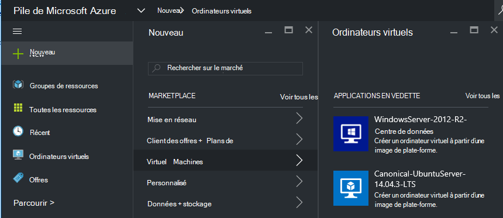

<properties
    pageTitle="Ajout d’une image de machine virtuelle pour pile d’Azure | Microsoft Azure"
    description="Ajouter Windows ou Linux VM image personnalisée votre organisation aux locataires à utiliser"
    services="azure-stack"
    documentationCenter=""
    authors="mattmcg"
    manager="darmour"
    editor=""/>

<tags
    ms.service="azure-stack"
    ms.workload="na"
    ms.tgt_pltfrm="na"
    ms.devlang="na"
    ms.topic="get-started-article"
    ms.date="09/26/2016"
    ms.author="mattmcg"/>

# <a name="make-a-custom-virtual-machine-image-available-in-azure-stack"></a>Rendre une image VM personnalisé disponible dans la pile d’Azure


Pile Azure permet aux administrateurs d’effectuer des images de machine virtuelle, comme un disque dur virtuel personnalisé de leur organisation, disponible pour les locataires. Images pouvant être référencés par les modèles du Gestionnaire de ressources Azure ou ajoutés à l’interface utilisateur de Azure Marketplace lors de la création d’un élément de marché. Une image de Windows Server 2012 R2 est incluse par défaut dans l’aperçu technique de pile Azure.

> [AZURE.NOTE] Images de machine virtuelle avec des éléments de marché peuvent être déployés en sélectionnant **Nouveau** dans l’interface utilisateur, puis en sélectionnant la catégorie de **Machines virtuelles** . Les éléments d’image de machine virtuelle sont répertoriés.


## <a name="add-a-vm-image-to-marketplace-with-powershell"></a>Ajouter une image de machine virtuelle sur Marketplace avec PowerShell

Si l’image de machine virtuelle disque dur virtuel est disponible localement sur la console de machine virtuelle (ou un autre périphérique connecté en externe), procédez comme suit :

1. Préparer une image de disque dur virtuel de système d’exploitation Windows ou Linux au format de disque dur virtuel (pas de VHDX).
    -   Pour les images système Windows, l’article [télécharger une image de machine virtuelle de Windows Azure pour les déploiements du Gestionnaire de ressources](virtual-machines-windows-upload-image.md) contient des instructions de préparation d’image dans la section **préparer le disque dur virtuel pour le téléchargement** .
    -   Pour les images de Linux, suivez les étapes pour préparer l’image ou utiliser une image de Linux de pile Azure existante comme décrit dans l’article [Linux de déployer des machines virtuelles pile d’Azure](azure-stack-linux.md).

2. Cloner le [référentiel d’outils de pile d’Azure](https://aka.ms/azurestackaddvmimage), puis importer le module **ComputeAdmin**

    ```powershell
    Import-Module .\ComputeAdmin\AzureStack.ComputeAdmin.psm1
    ```

3. Ajouter une image de machine virtuelle en invoquant l’applet de commande Add-VMImage.
    -  Inclure l’éditeur offre, SKU et version de l’image de machine virtuelle. Ces paramètres sont utilisés par les modèles d’Azure le Gestionnaire de ressources qui font référence à l’image de machine virtuelle.
    -  Spécifiez osType sous Windows ou Linux.
    -  Inclure votre ID de clients Azure Active Directory sous la forme * &lt;myaadtenant&gt;*. onmicrosoft.com.
    - Voici un appel de l’exemple de script :

    ```powershell
       Add-VMImage -publisher "Canonical" -offer "UbuntuServer" -sku "14.04.3-LTS" -version "1.0.0" -osType Linux -osDiskLocalPath 'C:\Users\AzureStackAdmin\Desktop\UbuntuServer.vhd' -tenantID <myaadtenant>.onmicrosoft.com
    ```

    > [AZURE.NOTE] L’applet de commande demande des informations d’identification pour l’ajout de l’image de machine virtuelle. Fournissent des informations d’identification d’Azure Active Directory, l’administrateur telles que serviceadmin@ * &lt;myaadtenant&gt;*. onmicrosoft.com, à l’invite.  

La commande effectue les opérations suivantes :
- S’authentifie sur l’environnement de la pile d’Azure
- Télécharge le disque dur virtuel local sur un compte nouvellement créé de stockage temporaire
- Ajoute l’image de machine virtuelle dans le référentiel image de machine virtuelle
- Crée un élément de marché

Pour vérifier que la commande a été correctement exécuté, atteindre le marché du portail, puis vérifiez que l’image de la machine virtuelle est disponible dans la catégorie des **Machines virtuelles** .

> 

Voici une description des paramètres de la commande.


| Paramètre | Description |
|----------| ------------ |
|**tenantID** | Votre ID de clients Azure Active Directory sous la forme * &lt;AADTenantID*. onmicrosoft.com&gt;. |
|**Publisher** | Le segment de nom d’éditeur de l’Image de machine virtuelle qui utilisateurs utiliser lors du déploiement de l’image. Un exemple est 'Microsoft'. N’incluez pas d’un espace ou autres caractères spéciaux dans ce champ.|
|**offre** | Le segment de nom offre de l’Image de machine virtuelle qui utilisateurs utiliser lors du déploiement de l’image de machine virtuelle. Par exemple, « Windows Server ». N’incluez pas d’un espace ou autres caractères spéciaux dans ce champ. |
| **point de stock** | Le segment de nom de référence de l’Image de machine virtuelle qui utilisateurs utiliser lors du déploiement de l’image de machine virtuelle. Par exemple, 'Datacenter2016'. N’incluez pas d’un espace ou autres caractères spéciaux dans ce champ. |
|**Version** | La version de l’Image de machine virtuelle qui utilisateurs utiliser lors du déploiement de l’image de machine virtuelle. Cette version est au format * \#.\#. \#*. Par exemple, '1.0.0'. N’incluez pas d’un espace ou autres caractères spéciaux dans ce champ.|
| **osType** | L’osType de l’image doit être « Windows » ou « Linux ». |
|**osDiskLocalPath** | Le chemin d’accès local sur le disque dur virtuel que vous téléchargez une image VM à Azure pile du disque du système d’exploitation. |
|**dataDiskLocalPaths**| Tableau facultatif des chemins locaux pour les disques de données qui peuvent être téléchargés en tant que partie de l’image de machine virtuelle.|
|**CreateGalleryItem**| Indicateur booléen qui détermine s’il faut créer un élément dans le marché. La valeur par défaut est définie sur true.|
|**titre**| Le nom complet de l’élément du marché. La valeur par défaut est définie comme la référence offre Publisher de l’image de machine virtuelle.|
|**Description**| La description de l’élément du marché. |
|**osDiskBlobURI**| Le cas échéant, ce script accepte également un URI du stockage Blob pour osDisk.|
|**dataDiskBlobURIs**| Le cas échéant, ce script accepte également un tableau de stockage des objets Blob URI pour l’ajout de disques de données de l’image.|


## <a name="add-a-vm-image-through-the-portal"></a>Ajouter une image de machine virtuelle via le portail

> [AZURE.NOTE] Cette méthode requiert la création de l’élément de marché séparément.

Une exigence d’images est qu’ils peuvent être référencés par un URI le stockage Blob. Préparer une image de disque dur virtuel de système d’exploitation Windows ou Linux au format de disque dur virtuel (pas de VHDX), puis à télécharger l’image sur un compte de stockage dans Azure ou dans la pile d’Azure. Si votre image est déjà chargé dans le stockage Blob dans Azure ou pile d’Azure, vous pouvez ignorer cette étape.

Suivez les étapes de l’article de [télécharger une image de machine virtuelle de Windows Azure pour les déploiements du Gestionnaire de ressources](https://azure.microsoft.com/documentation/articles/virtual-machines-windows-upload-image/) par le biais de l’étape **à télécharger l’image de machine virtuelle à votre compte de stockage**. Gardez à l’esprit les éléments suivants :

-   Pour une image de Linux, suivez les instructions pour préparer l’image, ou utiliser une image de Linux de pile Azure existante comme décrit dans l’article [Linux de déployer des machines virtuelles pile d’Azure](azure-stack-linux.md).

- Il est plus efficace de télécharger une image pour le stockage de Blob de pile Azure que pour le stockage des objets Blob Azure parce qu’il prend moins de temps pour pousser l’image de machine virtuelle dans le référentiel image de pile d’Azure. En suivant les instructions de téléchargement, veillez à substituer l’étape [PowerShell de s’authentifier avec Microsoft Azure pile](azure-stack-deploy-template-powershell.md) pour l’étape « Connexion à Azure ».

- Prenez note de l’URI lorsque vous téléchargez l’image du stockage des objets Blob. Elle a le format suivant : * &lt;storageAccount&gt;/&lt;blobContainer&gt;/&lt;targetVHDName&gt;*.vhd

2.  Pour rendre le blob accessibles de manière anonyme, accédez au conteneur de blob de compte de stockage où il a été téléchargé l’image de machine virtuelle VHD au **Blob** et puis sélectionnez la **Stratégie d’accès**. Si vous le souhaitez, vous pouvez à la place générer une signature d’accès partagé pour le conteneur et l’inclure dans le cadre de l’objet blob URI.


1.  Connectez-vous à la pile d’Azure en tant qu’administrateur. Allez à **gestion de la région**. Puis, sous **RPs**, sélectionnez **Fournisseur de ressources de calcul** > **Des Images de machine virtuelle** > **Ajouter.**

    

2.  Sur la lame suivante, entrez l’éditeur offre, SKU et version de l’image de machine virtuelle. Ces segments de nom font référence à l’image de machine virtuelle dans les modèles du Gestionnaire de ressources Azure. Veillez à sélectionner **osType** correctement. Pour **osDiskBlobURI**, entrez l’URI où l’image a été téléchargé à l’étape 1. Cliquez sur **créer** pour créer l’Image de machine virtuelle.

    

3.  L’Image VM devient 'Succeeded' lorsque l’image est ajouté avec succès.

4.  Locataires peuvent déployer l’Image de machine virtuelle en spécifiant l’éditeur offre, SKU et version de l’image de machine virtuelle dans un modèle de gestionnaire de ressources Azure. Pour créer une image de machine virtuelle plus facilement disponible pour la consommation de clients dans l’interface utilisateur, il est préférable de [créer un élément de marché](azure-stack-create-and-publish-marketplace-item.md).
