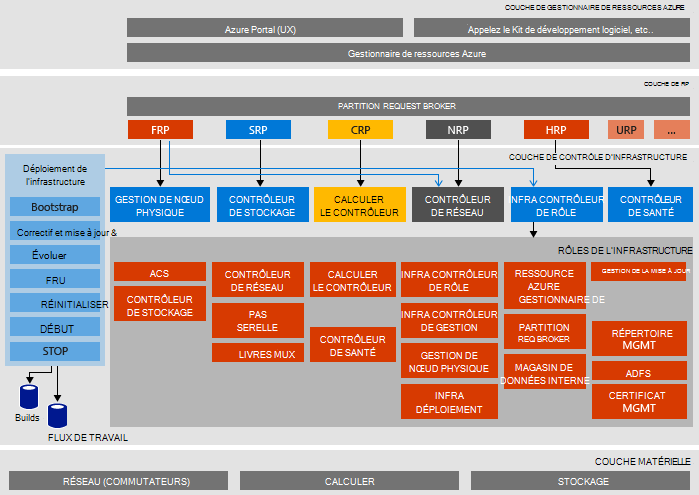

<properties
    pageTitle="Architecture de Microsoft Azure pile preuve du Concept (POC) | Microsoft Azure"
    description="Permet d’afficher l’architecture Microsoft Azure pile VT."
    services="azure-stack"
    documentationCenter=""
    authors="heathl17"
    manager="byronr"
    editor=""/>

<tags
    ms.service="azure-stack"
    ms.workload="na"
    ms.tgt_pltfrm="na"
    ms.devlang="na"
    ms.topic="article"
    ms.date="10/25/2016"
    ms.author="helaw"/>

# Architecture de Microsoft Azure pile POC

Le POC de pile Azure est un déploiement d’un nœud d’Azure pile technique Preview 2. Tous les composants sont installés sur des machines virtuelles en cours d’exécution sur une machine hôte unique. 

## Diagramme d’architecture logique
Le diagramme suivant illustre l’architecture logique de la VT pile Azure et de ses composants.

## Rôles de l’ordinateur virtuel
Le POC de pile Azure offre des services à l’aide d’ordinateurs virtuels suivants sur l’hôte de contrôle du concept :

 - **MAS-ACS01** Machine virtuelle qui héberge les services de stockage Azure pile.

 - **MAS-ADFS01** Machine virtuelle qui héberge les Services de fédération Active Directory.  Cet ordinateur virtuel n’est pas utilisé dans les 2 Aperçu technique.  

 - **MAS-ASQL01**  Ordinateur virtuel fournit un magasin de données interne pour les rôles d’infrastructure Azure pile.  

 - **MAS-BGPNAT01** Machine virtuelle agissant comme un routeur de bordure et offre des fonctions VPN et NAT pour pile d’Azure.

 - **MAS-CA01** Ordinateur virtuel fournissant des services d’autorité de certificat pour les services de rôle Azure pile.

 - **MAS-CON01** Ordinateur virtuel est disponible pour les développeurs pour l’installation de PowerShell, Visual Studio et autres outils.

 - **MAS-DC01** Machine virtuelle qui héberge les services DHCP, DNS et Active Directory pour Microsoft Azure pile.

 - **MAS-GWY01** Ordinateur virtuel fournit des services de passerelle comme les connexions de site à site VPN pour les réseaux de clients de bord.

 - **MAS-NC01**  Machine virtuelle qui héberge le contrôleur de réseau qui gère les services de réseau de pile d’Azure.  

 - **MAS-SLB01**  Ordinateur virtuel fournit des services dans la pile d’Azure pour les locataires et les services d’infrastructure Azure pile d’équilibrage de charge.  

 - **MAS-SUS01**  Virtual machine hébergeant Windows Server Update Services et de fournir des mises à jour des autres machines virtuelles de pile d’Azure.

 - **MAS-WAS01**  Machine virtuelle qui héberge le portail et services du Gestionnaire de ressources Azure.

 - **MAS-XRP01** Machine virtuelle qui héberge les fournisseurs de ressources principales de pile du Microsoft Azure, y compris les fournisseurs de ressources informatiques, de réseau et de stockage.

## Services de stockage
Les services de stockage dans le système d’exploitation sur l’hôte physique :

 - **Service d’objet Blob d’ACS** Azure service cohérent stockage Blob, qui fournit des services de stockage blob et table.

 - **SoFS** Échelle par serveur de fichiers.

 - **Réf CSV** Cluster de système de fichier résilient le Volume partagé.

 - **Disque virtuel**, **Espace de stockage**et les **Espaces de stockage Direct** sont la technologie de stockage sous-jacente respectifs dans Windows Server pour activer le fournisseur de ressources de stockage de base Microsoft Azure pile.

## Étapes suivantes

[Déployer la pile Azure](azure-stack-deploy.md)

[Scénarios de premier à essayer](azure-stack-first-scenarios.md)

