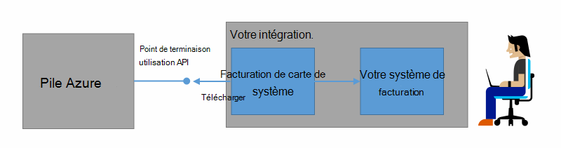
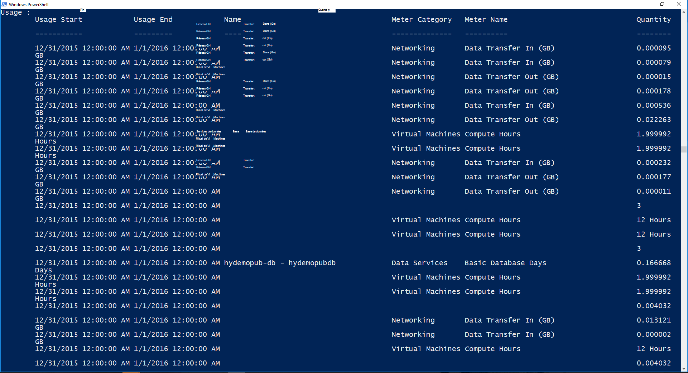

<properties
    pageTitle="Facturation du client et la refacturation dans Azure pile | Microsoft Azure"
    description="Découvrez comment récupérer les informations sur l’utilisation de ressources à partir de la pile d’Azure."
    services="azure-stack"
    documentationCenter=""
    authors="AlfredoPizzirani"
    manager="byronr"
    editor=""/>

<tags
    ms.service="azure-stack"
    ms.workload="na"
    ms.tgt_pltfrm="na"
    ms.devlang="na"
    ms.topic="article"
    ms.date="10/18/2016"
    ms.author="alfredop"/>

# Facturation client et refacturation dans la pile d’Azure

Maintenant que vous utilisez une pile d’Azure, il est judicieux de réfléchir à la manière de suivre l’utilisation. Fournisseurs de services s’appuient sur des informations d’utilisation pour facturer leurs clients et de comprendre le coût de fourniture des services.
Entreprises, suivre, généralement l’utilisation par service.

Pile Azure n’est pas un système de facturation. Il ne recharge votre locataires pour les ressources qu’ils utilisent. Mais, Azure pile l’infrastructure pour collecter et regrouper les données d’utilisation pour chaque fournisseur de ressource unique. Vous pouvez accéder à ces données et l’exporter vers un système de facturation à l’aide d’un adaptateur de facturation ou exportez-le vers un outil décisionnel comme Microsoft BI de puissance.

## Les informations d’utilisation puis-je trouver et comment ?

Les fournisseurs de ressources pile Azure génèrent des enregistrements d’utilisation à des intervalles horaires. Les enregistrements indiquent la quantité de chaque ressource qui a été consommée et abonnement consommation de la ressource. Ces données sont stockées. Vous pouvez accéder aux données via l’API REST.

Un administrateur du service peut récupérer des données d’utilisation pour tous les abonnements de clients. Locataires individuels peuvent extraire uniquement leurs propres informations.

Enregistrements d’utilisation de disposent d’informations sur le stockage, le réseau et l’utilisation du calcul. Pour obtenir une liste des compteurs, consultez [cet article](azure-stack-usage-related-faq.md).

## Récupérer des informations sur l’utilisation

Pour générer des enregistrements, il est essentiel d’avoir des ressources en cours d’exécution et activement à l’aide du système. Si vous ne savez pas si vous disposez de toutes les ressources en cours d’exécution, déploiement d’Azure Marketplace de pile, puis exécuter une machine virtuelle (VM). Coup de œil à la machine virtuelle lame de surveillance pour s’assurer qu’il est en cours d’exécution.

Nous vous conseillons d’exécuter les applets de commande de Windows PowerShell pour afficher les données d’utilisation.
PowerShell appelle les API de l’utilisation des ressources.

1.  [Installer et configurer Azure PowerShell](https://azure.microsoft.com/en-us/documentation/articles/powershell-install-configure/).

2.  Pour vous connecter au Gestionnaire de ressources Azure, utilisez l’applet de commande PowerShell **AzureRmAccount à la connexion**.

3.  Pour sélectionner l’abonnement que vous avez utilisé pour créer des ressources, tapez Get-AzureRmSubscription – SubscriptionName « votre sub » de **| Sélectionnez-AzureRmSubscription**.

4.  Pour récupérer les données, utilisez l’applet de commande PowerShell, [**Get-UsageAggregates**](https://msdn.microsoft.com/en-us/library/mt619285.aspx).
    Si les données d’utilisation ne sont disponibles, elle est retournée dans PowerShell, comme dans l’exemple suivant. PowerShell renvoie 1 000 lignes de l’utilisation par appel.
    Vous pouvez utiliser l’argument de *continuation* pour récupérer des jeux de lignes au-delà les 1000 premières. Pour plus d’informations sur les données d’utilisation, consultez la [référence des API de l’utilisation des ressources](azure-stack-provider-resource-api.md).

    

## Étapes suivantes

[Utilisation des ressources API fournisseur](azure-stack-provider-resource-api.md)

[L’utilisation des ressources API de client](azure-stack-tenant-resource-usage-api.md)

[Forum aux questions sur liés à l’utilisation](azure-stack-usage-related-faq.md)
