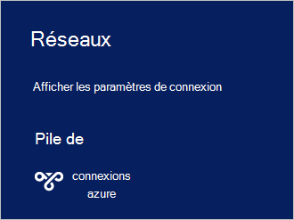

<properties
    pageTitle="Se connecter à la pile Azure | Microsoft Azure"
    description="Apprenez à connecter la pile d’Azure"
    services="azure-stack"
    documentationCenter=""
    authors="ErikjeMS"
    manager="byronr"
    editor=""/>

<tags
    ms.service="azure-stack"
    ms.workload="na"
    ms.tgt_pltfrm="na"
    ms.devlang="na"
    ms.topic="get-started-article"
    ms.date="10/18/2016"
    ms.author="erikje"/>

# <a name="connect-to-azure-stack"></a>Se connecter à la pile Azure
Pour gérer les ressources, vous devez vous connecter à l’ordinateur de démonstration de pile Azure. Vous pouvez utiliser une ou l’autre des options de connexion suivantes :

 - Bureau à distance : permet à un seul utilisateur simultané connecter rapidement à partir de l’ordinateur du contact.
 - Virtual Private Network (VPN) : permet à plusieurs utilisateurs simultanés de se connecter à partir de clients en dehors de l’infrastructure de la pile d’Azure (requiert la configuration).

## <a name="connect-with-remote-desktop"></a>Connexion Bureau à distance
Avec une connexion Bureau à distance, un seul utilisateur simultané peut fonctionner avec le portail pour gérer les ressources. Vous pouvez également utiliser des outils sur l’ordinateur virtuel MAS-CON01.

1.  Connectez-vous à l’ordinateur physique Azure pile VT.

2.  Ouvrez une connexion Bureau à distance et connectez-vous à MAS-CON01. Saisissez **AzureStack\AzureStackAdmin** comme nom d’utilisateur et le mot de passe d’administration que vous avez fourni lors de l’installation de la pile d’Azure.  

3.  Sur le bureau MAS-CON01, double-cliquez sur l’icône de **Microsoft Azure Portal de pile** (https://portal.azurestack.local/) pour ouvrir le [portail](azure-stack-key-features.md#portal).

    

4.  Connectez-vous en utilisant les informations d’identification d’Azure Active Directory spécifiées pendant l’installation.

## <a name="connect-with-vpn"></a>Se connecter avec VPN
Les connexions de réseau privé virtuelles permettent de connecter des clients à l’extérieur de l’infrastructure de la pile d’Azure plusieurs utilisateurs simultanés. Vous pouvez utiliser le portail pour gérer leurs. Vous pouvez également utiliser des outils, tels que Visual Studio et PowerShell, sur le client local.

1.  Installez le module AzureRM à l’aide de la commande suivante :
   
    ```PowerShell
    Install-Module -Name AzureRm -RequiredVersion 1.2.6 -Scope CurrentUser
    ```   
   
2. Télécharger les scripts de la pile de Azure Tools.  Prise en charge de ces fichiers peuvent être téléchargés par navigation dans le [référentiel de GitHub](https://github.com/Azure/AzureStack-Tools), soit en exécutant le script Windows PowerShell suivant en tant qu’administrateur :
    
    >[AZURE.NOTE]  Les étapes suivantes requièrent PowerShell 5.0.  Pour vérifier votre version, exécutez $PSVersionTable.PSVersion et comparer la version « Principale ».  

    ```PowerShell
       
       #Download the tools archive
       invoke-webrequest https://github.com/Azure/AzureStack-Tools/archive/master.zip -OutFile master.zip

       #Expand the downloaded files. 
       expand-archive master.zip -DestinationPath . -Force

       #Change to the tools directory
       cd AzureStack-Tools-master
    ````

3.  Dans la même session PowerShell, accédez au dossier **se connecter** et importer le module AzureStack.Connect.psm1 :

    ```PowerShell
    cd Connect
    import-module .\AzureStack.Connect.psm1
    ```

4.  Pour créer la connexion VPN de pile d’Azure, exécutez les suivantes de Windows PowerShell. Avant d’exécuter, remplir le mot de passe administrateur et les champs d’adresse hôte pile d’Azure. 
    
    ```PowerShell
    #Change the IP Address below to match your Azure Stack host
    $hostIP = "<HostIP>"

    # Change password below to reference the password provided for administrator during Azure Stack installation
    $Password = ConvertTo-SecureString "<Admin Password>" -AsPlainText -Force

    # Add Azure Stack One Node host & CA to the trusted hosts on your client computer
    Set-Item wsman:\localhost\Client\TrustedHosts -Value $hostIP -Concatenate
    Set-Item wsman:\localhost\Client\TrustedHosts -Value mas-ca01.azurestack.local -Concatenate  

    # Update Azure Stack host address to be the IP Address of the Azure Stack POC Host
    $natIp = Get-AzureStackNatServerAddress -HostComputer $hostIP -Password $Password

    # Create VPN connection entry for the current user
    Add-AzureStackVpnConnection -ServerAddress $natIp -Password $Password

    # Connect to the Azure Stack instance. This command (or the GUI steps in step 5) can be used to reconnect
    Connect-AzureStackVpn -Password $Password 
    ```

5. Lorsque vous y êtes invité, faire confiance à l’hôte de la pile d’Azure.

6. Lorsque vous y êtes invité, installez un certificat (l’invite s’affiche derrière la fenêtre de session Powershell).

7. Pour tester la connexion avec le portail, dans un navigateur Internet, accédez à *https://portal.azurestack.local*.

8. Pour consulter et gérer les connexions de la pile d’Azure, utilisez **réseaux** sur votre client :

    

>[AZURE.NOTE] Cette connexion VPN ne fournit pas de connectivité aux ordinateurs virtuels ou d’autres ressources. Pour plus d’informations sur la connectivité aux ressources, reportez-vous à la section [Une connexion VPN de nœud](azure-stack-create-vpn-connection-one-node-tp2.md)


## <a name="next-steps"></a>Étapes suivantes
[Premières tâches](azure-stack-first-scenarios.md)

[Installation et connexion avec PowerShell](azure-stack-connect-powershell.md)

[Installation et connexion avec l’interface CLI](azure-stack-connect-cli.md)


