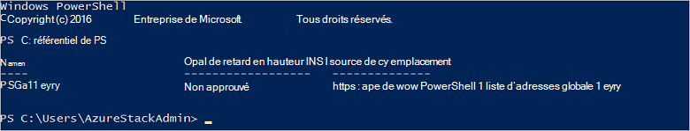

<properties
    pageTitle="Se connecter à la pile Azure avec PowerShell | Microsoft Azure"
    description="Découvrez comment gérer la pile Azure avec PowerShell"
    services="azure-stack"
    documentationCenter=""
    authors="HeathL17"
    manager="byronr"
    editor=""/>

<tags
    ms.service="azure-stack"
    ms.workload="na"
    ms.tgt_pltfrm="na"
    ms.devlang="na"
    ms.topic="article"
    ms.date="10/19/2016"
    ms.author="helaw"/>

# Installer PowerShell et se connecter à la pile d’Azure
Dans ce guide, nous vous guidons à travers les étapes de connexion à la pile d’Azure avec PowerShell. Une fois terminé, ces étapes peuvent également vous aider gérer et déployer les ressources.

## Installer les applets de commande PowerShell de pile Azure

1.  Applets de commande de AzureRM sont installés à partir de la galerie de PowerShell. Pour commencer, ouvrez une PowerShell Console sur MAS-CON01 et exécutez la commande suivante pour retourner une liste de référentiels de PowerShell disponibles :

        Get-PSRepository

      

2.  Exécutez la commande suivante pour installer le module AzureRM :

        Install-Module -Name AzureRM -RequiredVersion 1.2.6 -Scope CurrentUser

    >[AZURE.NOTE] *-Étendue CurrentUser* est facultatif. Si vous souhaitez plus que l’utilisateur actuel a accès aux modules, utilisez une invite de commandes avec élévation de privilèges et de laisser le paramètre de *portée* .

3.  Pour confirmer l’installation de modules de AzureRM, exécutez les commandes suivantes :

        Get-Command -Module AzureRM.AzureStackAdmin

## Se connecter à la pile Azure
Un module est disponible pour téléchargement qui gère la configuration de la connexion de PowerShell pour pile d’Azure pour vous.  Consultez [Outils de pile Azure](http://aka.ms/ConnectToAzureStackPS) pour le module et les étapes supplémentaires. 

## Récupérer la liste des abonnements
Dans cette section, vous vérifiez d’applets de commande PowerShell sont en cours d’exécution sur la pile d’Azure en récupérant et en sélectionnant un abonnement pour l’utilisation.

Exécutez la commande suivante pour récupérer une liste d’abonnements Azure pile associée à votre compte :

    Get-AzureRmSubscription

## Étapes suivantes
[Déployer des modèles de PowerShell](azure-stack-deploy-template-powershell.md)

[Se connecter avec l’interface CLI Azure](azure-stack-connect-cli.md)

[Déployer des modèles avec Visual Studio](azure-stack-deploy-template-visual-studio.md)

