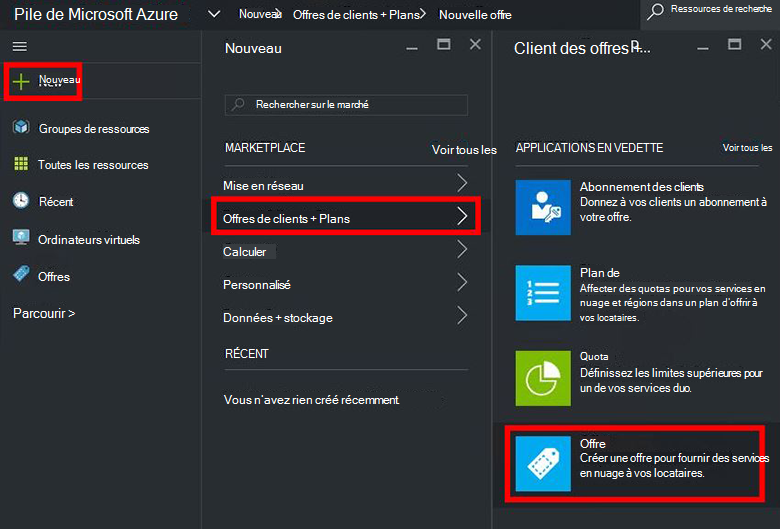
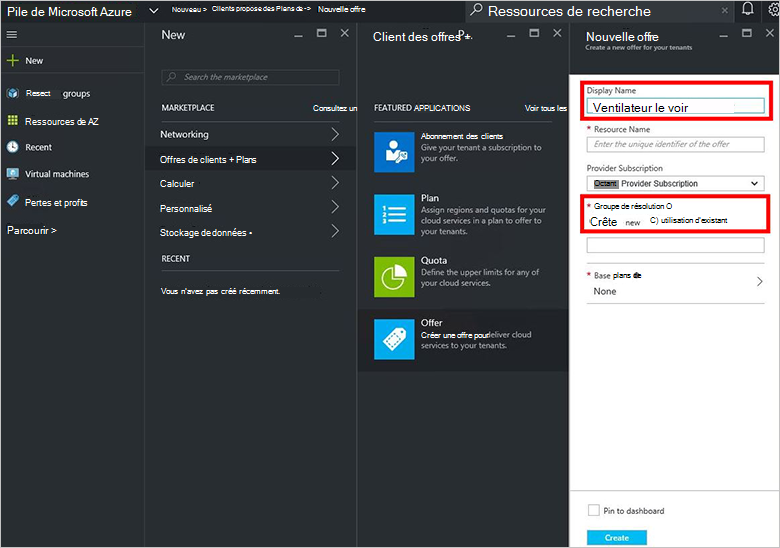
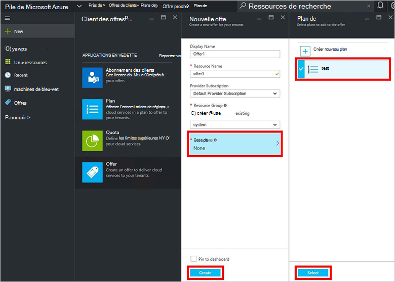
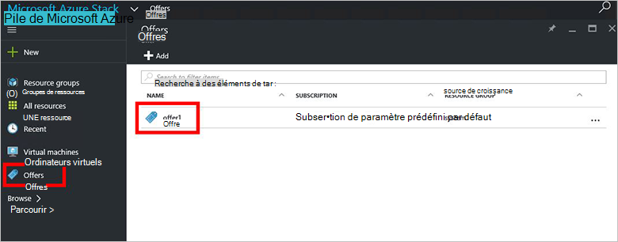
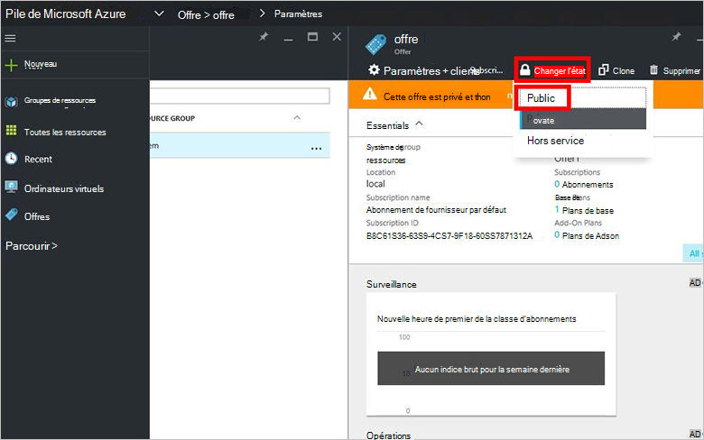

<properties
    pageTitle="Créer une offre dans la pile d’Azure | Microsoft Azure"
    description="En tant qu’un administrateur de service, savoir comment créer une offre pour votre locataires dans la pile d’Azure."
    services="azure-stack"
    documentationCenter=""
    authors="ErikjeMS"
    manager="byronr"
    editor=""/>

<tags
    ms.service="azure-stack"
    ms.workload="na"
    ms.tgt_pltfrm="na"
    ms.devlang="na"
    ms.topic="get-started-article"
    ms.date="09/26/2016"
    ms.author="erikje"/>

# Créer une offre dans la pile d’Azure

[Offre](azure-stack-key-features.md#services-plans-offers-and-subscriptions) sont des groupes d’un ou plusieurs plans qui présentent aux locataires d’acheter ou de souscrire à des fournisseurs. Ce document vous montre comment créer une offre qui inclut le [plan que vous avez créé](azure-stack-create-plan.md) dans la dernière étape. Cette offre permet aux abonnés la possibilité de configurer des ordinateurs virtuels.

1.  [Ouvrir une session](azure-stack-connect-azure-stack.md#log-in-as-a-service-administrator) sur le portail en tant qu’un administrateur de service, puis cliquez sur **Nouveau** > **locataire offre + Plans** > **offre**.
    

2.  Dans la lame **Offrent de nouvelles** , renseignez **Nom complet** et le **Nom de la ressource**et puis sélectionnez un **Groupe de ressources**de nouveau ou existant. Le nom complet est le nom convivial de l’offre. Seul l’administrateur peut voir le nom de la ressource. Il est le nom que les administrateurs permet de travailler avec l’offre en tant que gestionnaire de ressources Azure ressource.

    

3.  Cliquez sur **Base de plans** et, dans la lame de **Plan** , sélectionnez les plans que vous souhaitez inclure dans l’offre et puis cliquez sur **Sélectionner**. Cliquez sur **créer** pour créer l’offre.

    
    
4. Cliquez sur **offre** puis l’offre que vous venez de créer.

    

5.  Cliquez sur **Changer l’état**, puis cliquez sur **Public**.
  
    

Offres doivent être rendues publiques aux locataires obtenir la vue complète lorsque vous vous abonnez. Offres peuvent être :

- **Public**: Visible par les locataires.

- **Privé**: visible uniquement par les administrateurs de service. Utile lors de l’élaboration du plan ou l’offre, ou si l’administrateur de service souhaite approuver chaque abonnement.

- **Retrait de fonctionnalité**: fermé aux nouveaux abonnés. L’administrateur de service peut utiliser désactivé pour empêcher les abonnements futurs, mais laissez les abonnés actuels intacts.

Les modifications apportées à l’offre ne sont pas immédiatement visibles au locataire. Pour voir les modifications, vous devrez peut-être déconnexions/connexions pour voir le nouvel abonnement dans le sélecteur d’abonnement « » lors de la création de groupes de ressources.

## Étapes suivantes

[S’abonner à l’offre et puis mettre en service un ordinateur virtuel](azure-stack-subscribe-plan-provision-vm.md)
