<properties
    pageTitle="Créer un plan dans la pile d’Azure | Microsoft Azure"
    description="En tant qu’un administrateur de service, créez un plan qui vous permet de machines virtuelles de fourniture aux abonnés."
    services="azure-stack"
    documentationCenter=""
    authors="ErikjeMS"
    manager="byronr"
    editor=""/>

<tags
    ms.service="azure-stack"
    ms.workload="na"
    ms.tgt_pltfrm="na"
    ms.devlang="na"
    ms.topic="get-started-article"
    ms.date="09/26/2016"
    ms.author="erikje"/>

# Créer un plan dans la pile d’Azure

[Plans](azure-stack-key-features.md#services-plans-offers-and-subscriptions) sont des regroupements d’un ou plusieurs services. En tant que fournisseur, vous pouvez créer des plans d’offrir à vos locataires. À son tour, votre locataires s’abonner à vos offres à utiliser les plans et les services qu’ils comprennent. Cet exemple vous montre comment créer un plan qui inclut le calcul, le réseau et les fournisseurs de ressources de stockage. Ce plan permet aux abonnés la possibilité de configurer des ordinateurs virtuels.

1.  Dans un navigateur internet, accédez à https://portal.azurestack.local.

2.  [Ouvrez une session](azure-stack-connect-azure-stack.md#log-in-as-a-service-administrator) sur le portail de pile Azure comme un administrateur du service et entrez vos informations d’identification d’administrateur service (le compte que vous avez créé à l’étape 5 de la section [d’exécution du script PowerShell](azure-stack-run-powershell-script.md) ), puis cliquez sur **se connecter**.

    Les administrateurs de service peuvent créer des plans et des offres et gérer des utilisateurs.

3.  Pour créer un plan et une offre de locataires peuvent s’abonner, cliquez sur **Nouveau** > **clients offre + Plans** > **Plan**.

    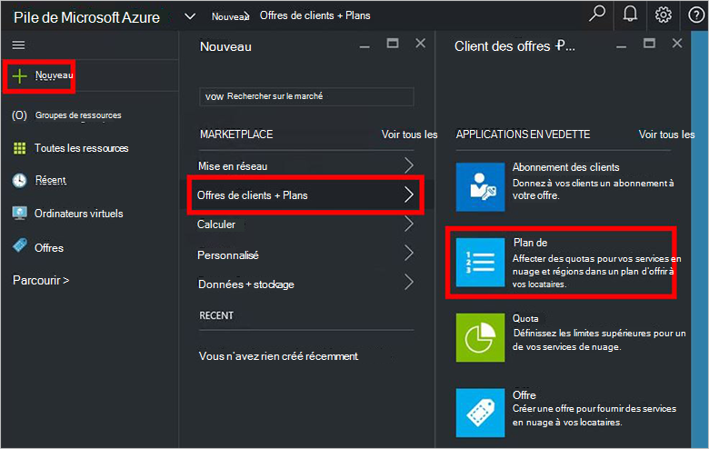

4.  Dans le **Nouveau Plan de** serveur lame, renseignez les champs **Nom complet** et le **Nom de la ressource**. Le nom complet est le nom convivial du plan locataires voir. Seul l’administrateur peut voir le nom de la ressource. Il est le nom que les administrateurs permet de travailler avec le plan en tant que gestionnaire de ressources Azure ressource.

    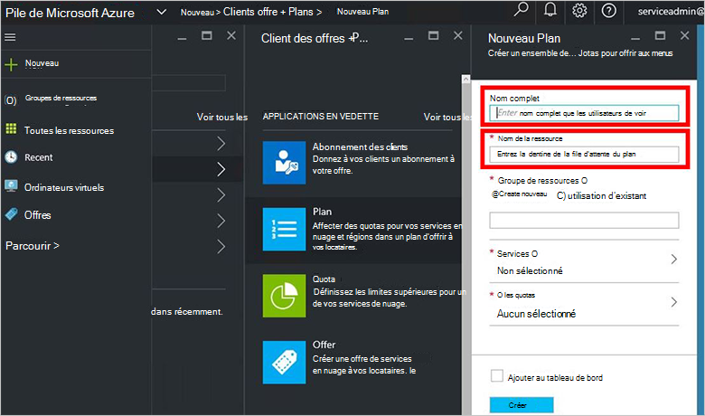

5.  Créer un nouveau **Groupe de ressources**, ou sélectionnez-en un existant, comme un conteneur pour le plan (par exemple, « OffersAndPlans »)

    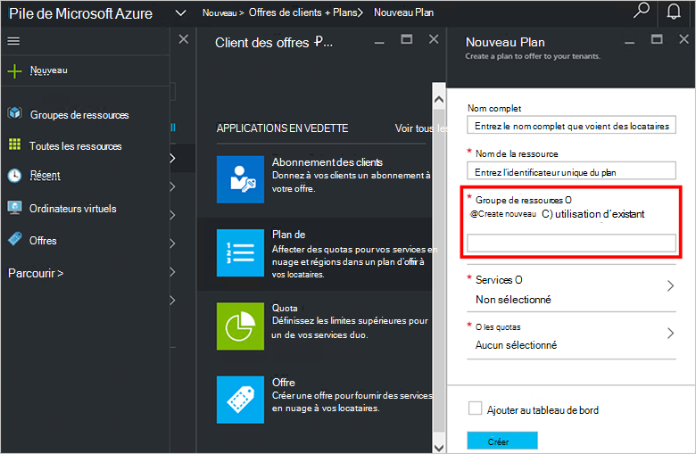

6.  Cliquez sur **Services**, sélectionnez **Microsoft.Compute**, **Microsoft.Network**et **Microsoft.Storage**, puis cliquez sur **Sélectionner**.

    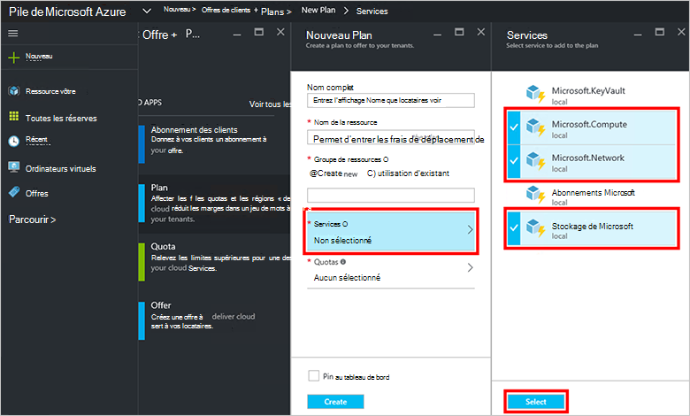

7.  Cliquez sur **les Quotas**, cliquez sur **Microsoft.Storage (local)**, puis sélectionnez le quota par défaut ou cliquez sur **créer un nouveau quota** pour personnaliser le quota.

    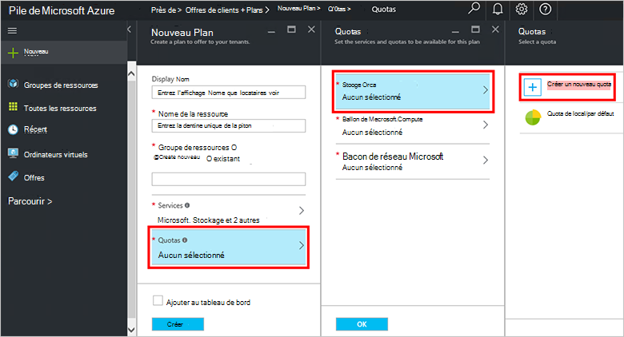

8.  Tapez un nom pour le quota et cliquez sur **Les paramètres de Quota**, définissez les valeurs de quota et cliquez sur **OK**, puis cliquez sur **créer**.

    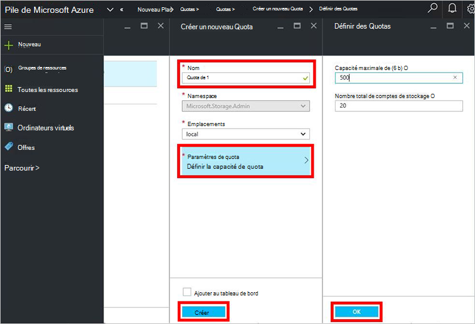

9. Cliquez sur **Microsoft.Network (local)**, puis sélectionnez le quota par défaut ou cliquez sur **créer un nouveau quota** pour personnaliser le quota.

    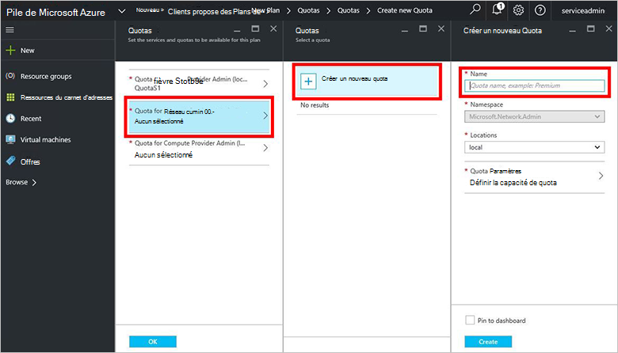

10. Tapez un nom pour le quota et cliquez sur **Les paramètres de Quota**, définissez les valeurs de quota et cliquez sur **OK**, puis cliquez sur **créer**.

    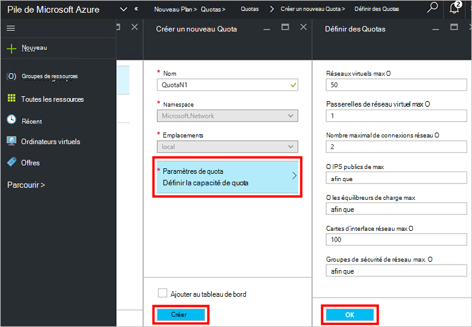

11. Cliquez sur **Microsoft.Compute (local)**, puis sélectionnez le quota par défaut ou cliquez sur **créer un nouveau quota** pour personnaliser le quota.

    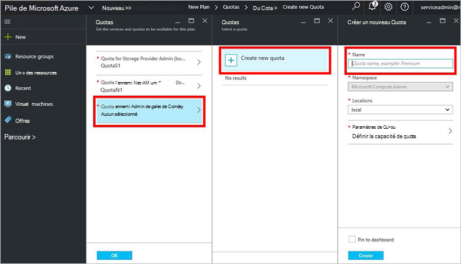

12.  Tapez un nom pour le quota et cliquez sur **Les paramètres de Quota**, définissez les valeurs de quota et cliquez sur **OK**, puis cliquez sur **créer**.

    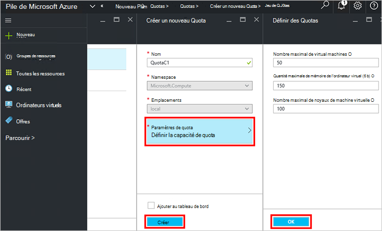

13. De la lame de **Quotas** , cliquez sur **OK**et dans la **Nouveau Plan de** lame, cliquez sur **créer** pour créer le plan.

    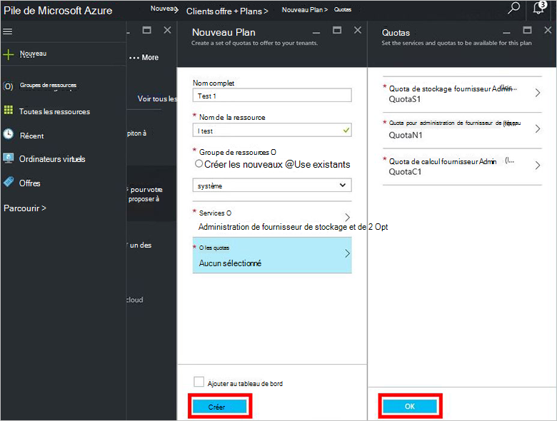

14. Pour voir votre nouveau plan, cliquez sur **toutes les ressources**, puis rechercher le plan et cliquez sur son nom.

    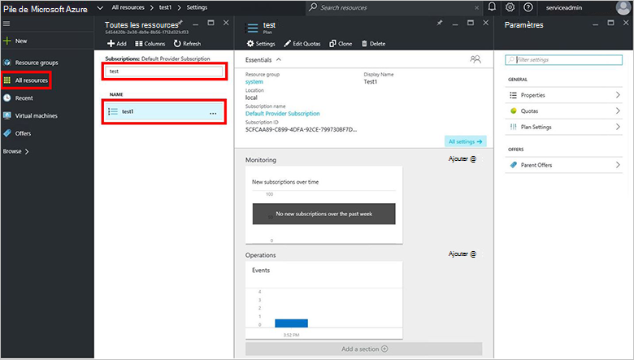

## Étapes suivantes

[Créer une offre](azure-stack-create-offer.md)
