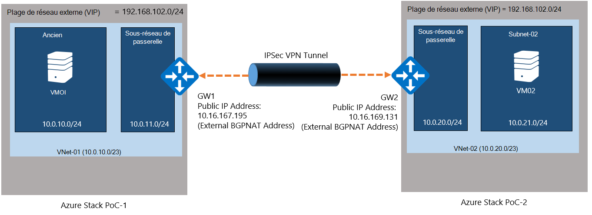
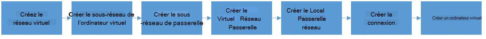
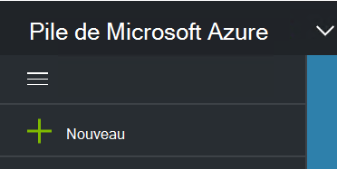
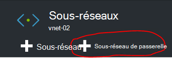
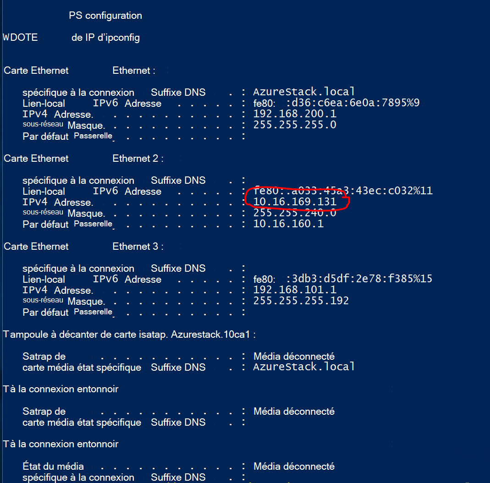
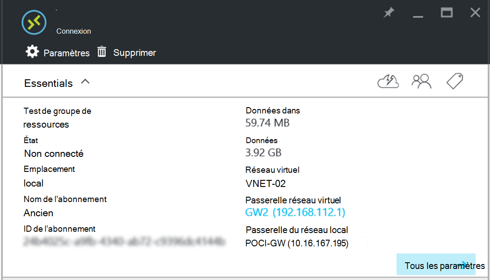

<properties
    pageTitle="Créer une connexion VPN de Site à Site entre deux réseaux virtuels dans différents environnements de PoC de pile Azure | Microsoft Azure"
    description="Procédure pas à pas qui permettra à un administrateur de nuage créer une connexion VPN de Site à Site entre deux environnements de POC d’un nœud dans le protocole TP2."
    services="azure-stack"
    documentationCenter=""
    authors="ScottNapolitan"
    manager="darmour"
    editor=""/>

<tags
    ms.service="azure-stack"
    ms.workload="na"
    ms.tgt_pltfrm="na"
    ms.devlang="na"
    ms.topic="get-started-article"
    ms.date="09/26/2016"
    ms.author="scottnap"/>

# Créer une connexion VPN de Site à Site entre deux réseaux virtuels dans différents environnements de PoC de pile Azure

## Vue d’ensemble

Cet article vous guide tout au long de la procédure de création d’une connexion VPN de Site à Site entre deux réseaux virtuels dans deux environnements distincts de pile d’Azure preuve du Concept (POC). Cela vise à aider les personnes qui envisagent de Site à Site passerelles comprennent comment configurer des connexions VPN entre réseaux virtuels dans deux différents déploiements de pile d’Azure.  En procédant ainsi, vous apprenez à connaître le fonctionnement de passerelles VPN dans la pile d’Azure.

>[AZURE.NOTE] Ce document s’applique spécifiquement pour le contrôle du concept Azure pile TP2.

### Diagramme de la connexion

Voici un diagramme qui illustre ce que notre configuration lorsque nous avons terminé.

### Avant de commencer

Pour terminer cette configuration, vous devez les éléments suivants et assurez-vous que vous avez ces éléments avant de commencer.

-   Deux serveurs répondent à la configuration matérielle de POC de pile Azure définie par les [Conditions préalables au déploiement pile Azure](azure-stack-deploy.md)et les autres conditions préalables définies par ce document.

-   Le Package de déploiement de version bêta 2 de pile Azure.

## Déploiement de l’environnement de VT

Vous allez déployer deux environnements POC de pile Azure pour terminer cette configuration.

-   Pour chaque contrôle du concept que vous déployez, vous pouvez simplement suivre les instructions de déploiement détaillées dans l’article [Déployer POC de pile Azure](azure-stack-run-powershell-script.md).
    Nous ferons référence à chaque environnement POC de ce document de façon générique en tant que POC1 et POC2.

## Configurer des Quotas pour le stockage, de réseau et de calcul

Vous devez configurer des Quotas pour le stockage, de réseau et de calcul afin que ces services peuvent être associés à un Plan et puis une offre que les utilisateurs peut s’abonner à.

>[AZURE.NOTE] Vous devez effectuer ces étapes pour chaque environnement POC de pile Azure.

L’expérience pour créer des Quotas pour les Services a changé de TP1. Vous trouverez les étapes de la création de Quotas dans le protocole TP2 à <http://aka.ms/mas-create-quotas>. Vous pouvez accepter les valeurs par défaut pour tous les paramètres de quota pour cet exercice.

## Créer un Plan et une offre

[Plans](azure-stack-key-features.md) sont des regroupements d’un ou plusieurs services. En tant que fournisseur, vous pouvez créer des plans d’offrir à vos locataires. À son tour, votre locataires s’abonner à vos offres à utiliser les plans et les services qu’ils comprennent.

>[AZURE.NOTE] Vous devez effectuer ces étapes pour chaque environnement POC de pile Azure.

1.  Tout d’abord créer un Plan. Pour ce faire, vous pouvez suivre les étapes décrites dans l’article [créer un Plan](azure-stack-create-plan.md) .

2.  Créer une offre suivant la procédure décrite dans [créer une offre dans la pile d’Azure](azure-stack-create-offer.md).

3.  Ouvrir une session sur le portail comme un administrateur et [s’abonner à l’offre que vous avez créé] (azure-pile-s’abonner-plan-prestation-vm.md.

## Créer les ressources réseau de VT 1

Nous allons maintenant créer les ressources, que nous devons définir notre configuration. Les étapes suivantes illustrent ce que nous allons faire. Ces instructions seront être montrant comment créer des ressources via le portail, mais la même chose peut être accomplie via PowerShell.

### Connectez-vous en tant qu’un locataire

Un administrateur du service peut se connecter comme un client pour tester les plans, les offres et les abonnements qui leurs locataires peuvent utiliser. Si vous n’avez pas encore, [créer un compte client](azure-stack-add-new-user-aad.md) avant de vous connecter.

### Créez le réseau virtuel et le sous-réseau de l’ordinateur virtuel

1.  Ouvrez une session en utilisant un compte client.

2.  Dans le portail Azure, cliquez sur l’icône **Nouveau** .

     
3.  Sélectionnez le **réseau** à partir du menu du marché.

4.  Cliquez sur le menu, l’élément de **réseau virtuel** .

5.  Cliquez sur le bouton **créer** dans la partie inférieure de la lame de description de ressource. Entrez les valeurs suivantes dans les champs appropriés en fonction de cette table.

  	| **Champ**             | **Valeur** |
  	|----------------------- | ------ |
  	| Nom                  |vnet-01 |
  	| Espace d’adressage         | 10.0.10.0/23 |
  	| Nom du sous-réseau           | sous-réseau-01 |
  	| Plage d’adresses de sous-réseau  | 10.0.10.0/24 |

6.  Vous devez voir l’abonnement que vous avez créé précédemment rempli dans le champ **abonnement** .

7.  Groupe de ressources, vous pouvez créer un nouveau groupe de ressources ou si vous avez déjà un, sélectionnez utilisation existant.

8.  Vérifiez que l’emplacement par défaut.

9.  Cliquez sur le bouton **créer** .

### Créer le sous-réseau de passerelle

1.  Ouvrez la ressource de réseau virtuel que vous venez de créer (Vnet-01) du tableau de bord.

2.  Sur la lame de paramètres, sélectionnez les sous-réseaux

3.  Cliquez sur le bouton **Sous-réseau de la passerelle** pour ajouter un sous-réseau passerelle au réseau virtuel.

     
4.  Par défaut, le nom du sous-réseau est défini à **GatewaySubnet** .
    Les sous-réseaux de passerelle sont spéciales et doivent disposer de ce nom spécifique pour fonctionner correctement.

5.  Dans le champ de la **plage d’adresses** , entrez **10.0.11.0/24**.

6.  Cliquez sur le bouton **créer** pour créer le sous-réseau de passerelle.

### Création de la passerelle réseau virtuel

1.  Dans le portail Azure, cliquez sur l’icône **Nouveau** .

    

2.  Sélectionnez le **réseau** à partir du menu du marché.

3.  Sélectionnez **passerelle de réseau virtuel** dans la liste des ressources du réseau.

4.  Examinez la description, puis cliquez sur **créer**.

5.  Dans le champ **nom** , tapez **GW1**.

6.  Cliquez sur l’élément de **réseau virtuel** pour choisir un réseau virtuel.
    Dans la liste, sélectionnez **Vnet-01** .

7.  Cliquez sur l’élément de menu **d’adresse IP publique** . Lorsque la lame adresse IP publique de choisir s’ouvre, cliquez sur le bouton Créer un.

8.  Dans le champ **nom** , entrez **GW1-PiP** et cliquez sur **Ok.**

9.  Le **type de passerelle** doit avoir **VPN** est sélectionnée par défaut. Conservez ce paramètre.

10. Le **type de VPN** doit avoir **basée sur un itinéraire** sélectionné par défaut.
    Conservez ce paramètre.

11. Vérifier **l’abonnement** et **l’emplacement** sont corrects. Vous pouvez ajouter la ressource au tableau de bord si vous le souhaitez. Cliquez sur **créer**.

### Création de la passerelle du réseau Local

La ressource de la passerelle de réseau Local est un peu bizarre dans notre scénario.
Elle est la même ressource que vous recherchez dans Azure, mais dans Azure, il est généralement destiné à représenter un périphérique physique, sur site, vous devrez utiliser pour se connecter à la passerelle de réseau virtuel dans Azure. Dans notre exemple, les deux extrémités de la connexion sont des passerelles de réseau virtuel en fait !

Un moyen de réflexion plus générique que la ressource de la passerelle de réseau Local est toujours sert à indiquer la passerelle distante à l’autre extrémité de la connexion. En raison de la façon dont le contrôle du concept a été conçu, il nous faut réellement fournir l’adresse de la carte réseau externe sur le NAT VM de l’autre VT, comme l’adresse IP publique de la passerelle du réseau Local. Nous créerons ensuite les mappages NAT sur la VM NAT pour vous assurer que les deux extrémités sont correctement connectées.

### Obtenir l’adresse IP de la carte externe de NAT VM

1.  Connectez-vous à l’ordinateur physique de pile d’Azure pour POC2.

2.  [Touche Windows] + R pour ouvrir le menu **exécuter** , tapez **mstsc** et appuyez sur ENTRÉE.

3.  Dans le champ de **l’ordinateur** , entrez le nom **MAS-BGPNAT01** et cliquez sur le bouton **se connecter** .

4.  Cliquez sur le Menu Démarrer avec le bouton droit sur PowerShell et sélectionnez **Exécuter en tant qu’administrateur**.

5.  Type de **IPConfig/all**.

6.  Trouver la carte Ethernet est connecté à votre réseau sur site et prenez note de l’adresse IPv4 lié à cette carte. Dans mon environnement, il est **10.16.167.195** mais vôtre sera quelque chose de différent.

7.  Enregistrer cette adresse. C’est ce que nous allons utiliser comme l’adresse IP publique de la ressource de passerelle de réseau Local que nous créons dans POC1.

### Créez la ressource de passerelle du réseau Local

1.  Connectez-vous à l’ordinateur physique de pile d’Azure pour POC1.

2.  Dans le champ **ordinateur** , entrez le nom **MAS-CON01** et cliquez sur le bouton **se connecter** .

3.  Dans le portail Azure, cliquez sur l’icône **Nouveau** .

    

4.  Sélectionnez le **réseau** à partir du menu du marché.

5.  Sélectionnez **passerelle du réseau local** dans la liste des ressources.

6.  Dans le champ **nom** , entrez **POC2-GW**.

7.  Nous ne savons pas encore l’adresse IP de notre autre passerelle, mais c’est OK, car nous pouvons y revenir et la modifier ultérieurement. Pour le moment, entrez **10.16.167.195** dans le **champ adresse IP**.

8.  Dans le champ de **l’Espace d’adressage** , entrez l’espace d’adressage de le Vnet que nous créerons dans POC2. Cela va être **10.0.20.0/23** donc entrer cette valeur.

9.  Vérifiez que votre **abonnement**, le **Groupe de ressources** et **l’emplacement** sont corrects et cliquez sur **créer**.

### Créer la connexion

1.  Dans le portail Azure, cliquez sur l’icône **Nouveau** .

     

2.  Sélectionnez le **réseau** à partir du menu du marché.

3.  Sélectionnez la **connexion** à partir de la liste des ressources.

4.  Dans la **base** lame de paramètres, choisissez **Site à site (IPSec)** comme **type de connexion**.

5.  Sélectionnez **l’abonnement**, le **Groupe de ressources** et **l’emplacement** , puis cliquez sur **Ok**.

6.  De la lame de **paramètres** , cliquez sur la **Passerelle de réseau virtuel** (**GW1**) créé précédemment.

7.  Choisissez **local** **Passerelle réseau** (**POC2-GW**) que vous avez créé précédemment.

8.  Dans le champ **Nom de la connexion** , entrez **POC1-POC2**.

9.  Dans le champ de **Clé partagée (PSK)** entrez **12345**. Cliquez sur **Ok**.

### Créer un ordinateur virtuel

Pour valider les données transmises via la connexion VPN, vous avez besoin d’ordinateurs virtuels pour envoyer et recevoir des données dans chaque contrôle du concept. Nous allons créer un ordinateur virtuel dans POC1, maintenant et le placer sur le sous-réseau de notre machine virtuelle de notre réseau virtuel.

1. Dans le portail Azure, cliquez sur l’icône  **Nouveau** .

     

2.  Sélectionnez les **ordinateurs virtuels** dans le menu du marché.

3.  Dans la liste d’images d’ordinateur virtuel, sélectionnez l’image de **Windows Server 2012 R2 Datacenter** .

4.  Sur la lame de **Notions de base** , dans le champ **nom** , entrez la valeur **VM01**.

5.  Entrez un nom d’utilisateur valide et un mot de passe. Vous utiliserez ce compte pour vous connecter à l’ordinateur virtuel après que qu’il a été créé.

6.  Fournir un **abonnement**, un **Groupe de ressources** et un **emplacement** , puis cliquez sur **Ok**.

7.  Sur la lame de **taille** , choisissez une taille de mémoire virtuelle pour cette instance et puis cliquez sur **Sélectionner**.

8.  Sur la lame de paramètres, vous pouvez accepter les paramètres par défaut, assurez-vous simplement que le réseau virtuel sélectionné est **VNET-01** et le sous-réseau est défini sur **10.0.10.0/24**. Cliquez sur **Ok**.

9.  Vérifiez les paramètres sur la lame de **Résumé** et cliquez sur **Ok**.

## Créer les ressources réseau de VT 2

### Connectez-vous en tant qu’un locataire

Un administrateur du service peut se connecter comme un client pour tester les plans, les offres et les abonnements qui leurs locataires peuvent utiliser. Si vous n’avez pas encore, [créer un compte client](azure-stack-add-new-user-aad.md) avant de vous connecter.

### Créez le réseau virtuel et le sous-réseau de l’ordinateur virtuel

1. Ouvrez une session en utilisant un compte client.

2. Dans le portail Azure, cliquez sur l’icône  **Nouveau** .

     

3.  Sélectionnez le **réseau** à partir du menu du marché.

4.  Cliquez sur l’élément de **réseau virtuel** dans le menu.

5.  Cliquez sur le bouton **créer** dans la partie inférieure de la lame de description de ressource. Entrez les valeurs suivantes pour les champs appropriés, répertoriés dans le tableau ci-dessous.

  	|**Champ**              |**Valeur** |
  	| ----------------------|----------|
  	| Nom                  | vnet-02 |
  	| Espace d’adressage         | 10.0.20.0/23 |
  	| Nom du sous-réseau           | sous-réseau-02 |
  	| Plage d’adresses de sous-réseau  | 10.0.20.0/24 |

6.  Vous devez voir l’abonnement que vous avez créé précédemment rempli dans le champ **abonnement** .

7.  Groupe de ressources, vous pouvez créer un nouveau groupe de ressources ou si vous avez déjà un, sélectionnez utilisation existant.

8.  Vérifiez **l’emplacement**par défaut. Si vous le souhaitez, vous pouvez épingler le réseau virtuel au tableau de bord pour faciliter l’accès.

9.  Cliquez sur le bouton **créer** .

### Créer le sous-réseau de passerelle

1.  Ouvrez la ressource de réseau virtuel que vous avez créé (**Vnet-02**) du tableau de bord.

2.  Sur la lame de **paramètres** , sélectionnez **sous-réseaux.**

3.  Cliquez sur le bouton **Sous-réseau de la passerelle** pour ajouter un sous-réseau passerelle au réseau virtuel.

     

4.  Par défaut, le nom du sous-réseau est défini à **GatewaySubnet** .
    Les sous-réseaux de passerelle sont spéciales et doivent disposer de ce nom spécifique pour fonctionner correctement.

5.  Dans le champ de la **plage d’adresses** , entrez **10.0.20.0/24**.

6.  Cliquez sur le bouton **créer** pour créer le sous-réseau de passerelle.

### Création de la passerelle réseau virtuel

1. Dans le portail Azure, cliquez sur l’icône  **Nouveau** .

     

2.  Sélectionnez le **réseau** à partir du menu du marché.

3.  Sélectionnez **passerelle de réseau virtuel** dans la liste des ressources du réseau.

4.  Examinez la description, puis cliquez sur **créer**.

5.  Dans le champ **nom** , tapez **cassettes numériques GW2**.

6.  Cliquez sur l’élément de **réseau virtuel** pour choisir un réseau virtuel.
    Dans la liste, sélectionnez **Vnet-02** .

7.  Cliquez sur l’élément de menu **d’adresse IP publique** . Lorsque la lame adresse IP publique de choisir s’ouvre, cliquez sur le bouton Créer un.

8.  Dans le champ **nom** , entrez **Cassettes numériques GW2-PiP** et cliquez sur **Ok.**

9.  Le **type de passerelle** doit avoir **VPN** est sélectionnée par défaut. Conservez ce paramètre.

10. Le **type de VPN** doit avoir **basée sur un itinéraire** sélectionné par défaut.
    Conservez ce paramètre.

11. Vérifier **l’abonnement** et **l’emplacement** sont corrects. Vous pouvez ajouter la ressource au tableau de bord si vous le souhaitez. Cliquez sur **créer**.

### Création de la passerelle du réseau Local

#### Obtenir l’adresse IP de la carte externe de NAT VM

1.  Connectez-vous à l’ordinateur physique de pile d’Azure pour POC1.

2.  Appuyez sur et maintenez [touche Windows] + R pour ouvrir le menu **exécuter** , tapez **mstsc** et appuyez sur entrer.

3.  Dans le champ de **l’ordinateur** , entrez le nom **MAS-BGPNAT01** et cliquez sur le bouton **se connecter** .

4.  Cliquez sur le Menu Démarrer avec le bouton droit sur PowerShell et sélectionnez **Exécuter en tant qu’administrateur**.

5.  Type de **IPConfig/all**.

6.  Trouver la carte Ethernet est connecté à votre réseau sur site et prenez note de l’adresse IPv4 lié à cette carte. Dans mon environnement, il est **10.16.169.131** mais vôtre sera quelque chose de différent.

7.  Enregistrer cette adresse. C’est ce que nous allons utiliser ultérieurement comme l’adresse IP publique de la ressource de passerelle de réseau Local que nous créons dans POC1.

#### Créez la ressource de passerelle du réseau Local

1.  Connectez-vous à l’ordinateur physique de pile d’Azure pour POC2.

2.  Dans le champ de **l’ordinateur** , entrez le nom **MAS-CON01** et cliquez sur le bouton **se connecter** .

3. Dans le portail Azure, cliquez sur l’icône **Nouveau** .

     

4.  Sélectionnez le **réseau** à partir du menu du marché.

5.  Sélectionnez **passerelle du réseau local** dans la liste des ressources.

6.  Dans le champ **nom** , entrez **POC1-GW**.

7.  Nous devons maintenant l’adresse IP publique, nous avons enregistré de la passerelle de réseau virtuel dans POC1. Entrez **10.16.169.131** dans le **champ adresse IP**.

8.  Dans le champ de **l’Espace d’adresse** Entrez l’espace d’adressage de **Vnet-01** à partir de POC1 - **10.0.0.0/16**.

9.  Vérifiez que votre **abonnement**, le **Groupe de ressources** et **l’emplacement** sont corrects et cliquez sur **créer**.

## Créer la connexion

1. Dans le portail Azure, cliquez sur l’icône  **Nouveau** .

     

2.  Sélectionnez le **réseau** à partir du menu du marché.

3.  Sélectionnez la **connexion** à partir de la liste des ressources.

4.  Dans la **base** lame de paramètres, choisissez **Site à site (IPSec)** comme **type de connexion**.

5.  Sélectionnez **l’abonnement**, le **Groupe de ressources** et **l’emplacement** , puis cliquez sur **Ok**.

6.  De la lame de **paramètres** , cliquez sur la **Passerelle de réseau virtuel** (**GW1**) créé précédemment.

7.  Choisissez **local** **Passerelle réseau** (**POC1-GW**) que vous avez créé précédemment.

8.  Dans le champ **Nom de la connexion** , entrez **POC2-POC1**.

9.  Dans le champ de **Clé partagée (PSK)** entrez **12345**. Si vous choisissez une valeur différente, gardez à l’esprit qu’il doit correspondre à la valeur de clé partagée que vous avez affectée dans POC1. Cliquez sur **Ok**.

## Créer un ordinateur virtuel

Créer une machine virtuelle dans POC1 et placez-la sur notre sous-réseau de la machine virtuelle de notre réseau virtuel.

1.  Dans le portail Azure, cliquez sur l’icône **Nouveau** .

     

2.  Sélectionnez les **ordinateurs virtuels** dans le menu du marché.

3.  Dans la liste d’images d’ordinateur virtuel, sélectionnez l’image de **Windows Server 2012 R2 Datacenter** .

4.  Sur la lame de **Notions de base** , dans le champ **nom** , entrez la valeur **VM02**.

5.  Entrez un nom d’utilisateur valide et un mot de passe. Vous utiliserez ce compte pour vous connecter à l’ordinateur virtuel après que qu’il a été créé.

6.  Fournir un **abonnement**, un **Groupe de ressources** et un **emplacement** , puis cliquez sur **Ok**.

7.  Sur la lame de **taille** , choisissez une taille de mémoire virtuelle pour cette instance et puis cliquez sur **Sélectionner**.

8.  Sur la lame de paramètres, vous pouvez accepter les paramètres par défaut, assurez-vous simplement que le réseau virtuel sélectionné est **VNET-02** et le sous-réseau est défini sur **20.0.0.0/24**. Cliquez sur **Ok**.

9.  Vérifiez les paramètres sur la lame de **Résumé** et cliquez sur **Ok**.

## Configurer la NAT VM dans chaque contrôle du concept pour le parcours de la passerelle

Étant donné que le contrôle du concept a été conçu pour être autonome et isolée du réseau sur lequel l’hôte physique est déployé, le réseau VIP « Externes » qui les passerelles sont connectés à n’est pas réellement externe, mais au lieu de cela est masqué derrière un routeur de traduction d’adresses réseau (NAT) de faire. Le routeur est en fait un Windows Server VM (**MAS-BGPNAT01**) qui exécute le rôle de RRAS Routing and Remote Access Services () dans l’infrastructure de test. Nous devons configurer NAT sur l’ordinateur virtuel de BGPNAT01-MAS pour permettre la connexion VPN de Site à Site pour se connecter aux deux extrémités.

>[AZURE.NOTE] Cette configuration est nécessaire pour les environnements de test uniquement.

### Configurer NAT

Vous devez suivre ces étapes dans des environnements de démonstration à la fois.

1.  Connectez-vous à l’ordinateur physique de pile d’Azure pour POC1.

2.  Appuyez sur et maintenez [touche Windows] + R pour ouvrir le menu **exécuter** , tapez **mstsc** et appuyez sur entrer.

3.  Dans le champ de **l’ordinateur** , entrez le nom **MAS-BGPNAT01** et cliquez sur le bouton **se connecter** .

4.  Cliquez sur le Menu Démarrer avec le bouton droit sur PowerShell et sélectionnez **Exécuter en tant qu’administrateur**.

5.  Type de **IPConfig/all**.

6.  Trouver la carte Ethernet est connecté à votre réseau sur site et prenez note de l’adresse IPv4 lié à cette carte. Dans mon environnement, il est **10.16.169.131** (entouré en rouge ci-dessous), mais les vôtres seront différents.

     

7.  Entrez la commande PowerShell suivante pour désigner l’adresse externe de NAT pour les ports que l’authentification IKE. N’oubliez pas de modifier l’adresse IP à celle qui correspond à votre environnement.

        Add-NetNatExternalAddress -NatName BGPNAT -IPAddress 10.16.169.131 PortStart 499 -PortEnd 501

8. Ensuite, nous allons créer un mappage NAT statique pour mapper l’adresse externe avec l’adresse IP publique de passerelle pour mapper le port ISAKMP 500 pour la PHASE 1 du tunnel IPSEC.

        Add-NetNatStaticMapping -NatName BGPNAT -Protocol UDP -ExternalIPAddress 10.16.169.131 -InternalIPAddress 192.168.102.1 -ExternalPort 500 -InternalPort 500

9.  Enfin, nous devrons faire de parcours NAT qui utilise le port 4500 pour établir le tunnel IPEC complète sur les périphériques NAT.

         Add-NetNatStaticMapping -NatName BGPNAT -Protocol UDP -ExternalIPAddress 10.16.169.131 -InternalIPAddress 192.168.102.1 -ExternalPort 4500 -InternalPort 4500

10.  Répétez les étapes 1 à 9 dans POC2.

## Tester la connexion

Maintenant que la connexion de Site à Site a été établie, que nous devons valider que nous pouvons obtenir le trafic qu’il véhicule. Cette tâche est simple car il implique simplement la connexion à l’un des ordinateurs virtuels nous créés dans l’environnement de VT et exécutée sur la machine virtuelle créée au cours de l ' autre environnement. Pour vous assurer que nous mettons le trafic via la connexion de Site à Site, nous souhaitons vous assurer que nous ping sur l’adresse IP directe (DIP) de la machine virtuelle sur le sous-réseau à distance, pas l’adresse IP virtuelle. Pour ce faire, nous devrons découvrir les nouveautés de l’adresse à l’autre extrémité de notre connexion.

### Ouvrir une session sur le client VM dans POC1

1.  Se connecter à la machine physique de pile d’Azure pour POC1 et ouvrir une session sur le portail à l’aide d’un compte client.

3.  Cliquez sur l’icône de **Machines virtuelles** dans la barre de navigation de gauche.

4.  Rechercher les **VM01** que vous avez créé précédemment dans la liste des ordinateurs virtuels et cliquez dessus.

5. Sur la lame pour l’ordinateur virtuel, cliquez sur **se connecter**.

     

6.  Ouvrez une invite de commande à partir d’à l’intérieur de la machine virtuelle et le type **IPConfig/all**.

7.  Recherche de l' **Adresse IPv4** dans la sortie et prenez note de ce dernier. Il s’agit de l’adresse que vous sera d’une commande ping à partir de POC2. Dans cet environnement, l’adresse est **10.0.10.4**, mais dans votre environnement, il peut être différent. Il doit toutefois relèvent du sous-réseau **10.0.10.0/24** qui a été créé précédemment.

### Ouvrir une session sur le client VM dans POC2

1.  Connectez-vous à la machine physique Azure pile pour POC2 et journal au portail à l’aide d’un compte client.

3.  Cliquez sur l’icône de **Machines virtuelles** dans la barre de navigation de gauche.

4.  Rechercher les **VM02** que vous avez créé précédemment dans la liste des ordinateurs virtuels et cliquez dessus.

5.  Sur la lame pour l’ordinateur virtuel, cliquez sur **se connecter**.

     

6.  Ouvrez une invite de commande à partir d’à l’intérieur de la machine virtuelle et le type **IPConfig/all**.

7.  Vous devez voir une adresse IPv4 qui se situe dans 10.0.20.0/24. Dans mon laboratoire de test, l’adresse est 10.0.20.4 mais vôtre peut être différente.

8.  À partir de la machine virtuelle dans POC2 nous souhaitons désormais ping de la machine virtuelle dans POC1, via le tunnel. Pour ce faire, nous ping DIP que nous avons enregistré à partir de VM01.
    Dans mon laboratoire de cela est 10.0.10.4, mais veillez à la commande ping de l’adresse que vous avez trouvé dans votre laboratoire. Vous devez voir un résultat qui ressemble à ceci.

     

9.  Une réponse à partir de la machine virtuelle à distance indique un test réussi ! Vous pouvez fermer la fenêtre de connexion de l’ordinateur virtuel ou, si vous le souhaitez, essayez d’effectuer des transferts de données pour tester votre connexion (par exemple, une copie du fichier).

### Statistiques par le biais de la connexion de la passerelle de transfert de données d’affichage

Si vous souhaitez connaître la quantité de données est en passant par le biais de votre connexion Site à Site, cette information est disponible dans la carte de connexion. Ce test est également un bon moyen pour vérifier que la commande ping que vous venez d’envoyer alliez via la connexion VPN.

1.  Bien que toujours connecté à **ClientVM** dans POC2, se connecter à la **Pile du contact portail de Microsoft Azure** à l’aide de votre compte clients.

2.  Cliquez sur **Parcourir** et sélectionnez **connexions**.

3.  Cliquez sur la connexion de **POC2-POC1** dans la liste.

4.  Sur la lame de connexion, vous pouvez visualiser les statistiques de données et des données. Dans l’image ci-dessous, vous voyez que des nombres plus grands que ping simplement comptant pour. C’est parce que nous avons fait également certains transferts de fichiers. Vous devriez voir des valeurs zéro.

     
