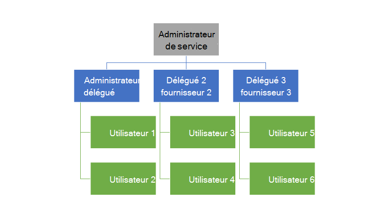
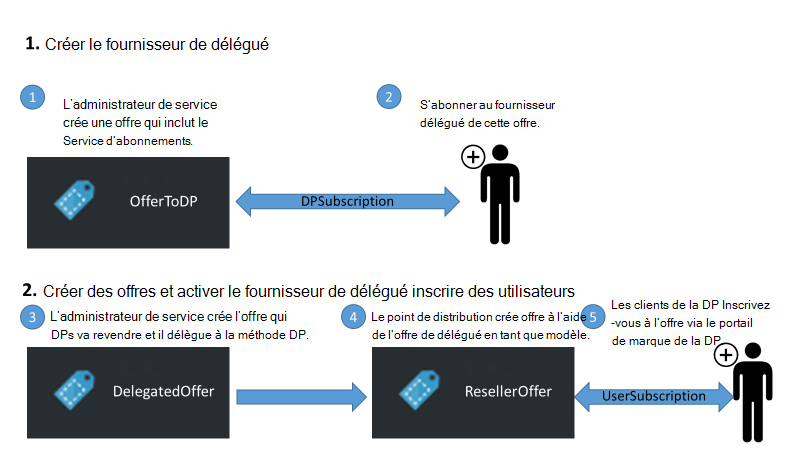
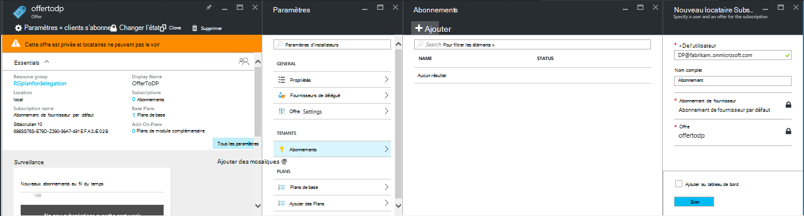
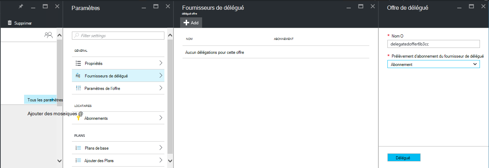
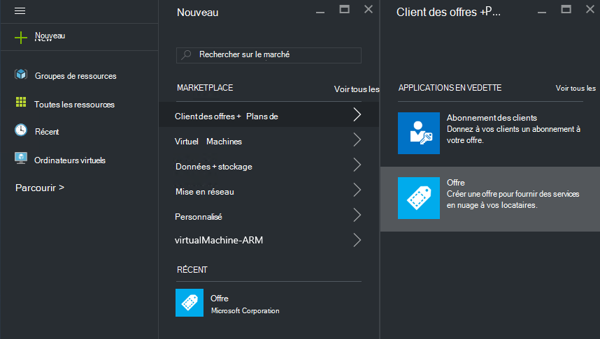
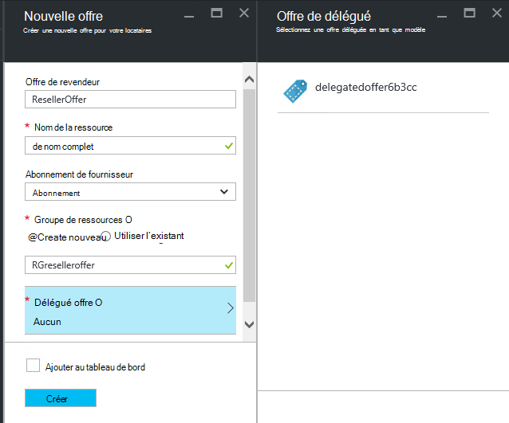
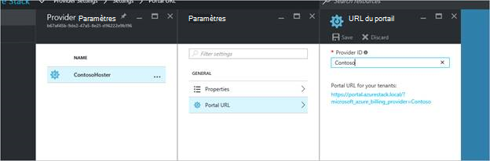
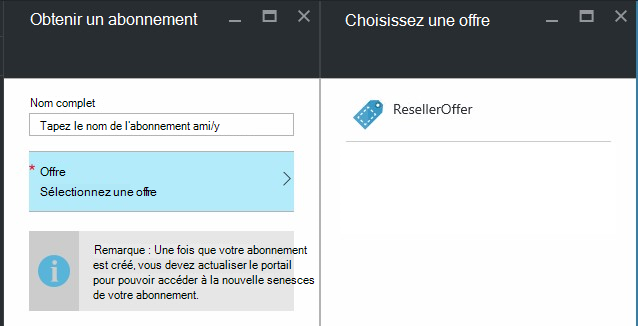

<properties
    pageTitle="Délégation des offres dans la pile d’Azure | Microsoft Azure"
    description="Apprenez à placer les autres responsables pour les offres de création et d’inscription d’utilisateurs pour vous."
    services="azure-stack"
    documentationCenter=""
    authors="AlfredoPizzirani"
    manager="byronr"
    editor=""/>

<tags
    ms.service="azure-stack"
    ms.workload="na"
    ms.tgt_pltfrm="na"
    ms.devlang="na"
    ms.topic="article"
    ms.date="10/07/2016"
    ms.author="alfredop"/>

#Délégation des offres dans la pile d’Azure

En tant qu’un administrateur de service, vous souhaitez souvent placer les autres responsables pour les offres de création et d’inscription d’utilisateurs pour vous. Par exemple, cela peut se produire si vous êtes un fournisseur de services et revendeurs pour inscrire les clients et de les gérer à votre place. Il peut également se produire dans une entreprise si vous font partie d’un groupe informatique central et que vous souhaitez que les divisions ou filiales pour inscrire des utilisateurs sans intervention de votre part.

Délégation vous aide à ces tâches, vous aidant à atteindre et de gérer plus d’utilisateurs que vous ne pourrez pas faire directement. L’illustration suivante montre un seul niveau de délégation, mais Azure pile prend en charge plusieurs niveaux. Fournisseurs de délégué peuvent à son tour déléguer à d’autres fournisseurs, jusqu'à cinq niveaux.

Les administrateurs peuvent déléguer la création d’offres et les locataires à d’autres utilisateurs à l’aide de la fonctionnalité de délégation.

##Les rôles et les étapes de la délégation

Pour comprendre la délégation, gardez à l’esprit qu’il existe trois rôles impliqués :

-   L' **administrateur de service** gère l’infrastructure de la pile d’Azure, crée un modèle d’offre et délègue à d’autres personnes à proposer à leurs utilisateurs.

-   Les utilisateurs délégués sont appelés **déléguée des fournisseurs**. Ils peuvent appartenir à d’autres organisations (comme les autres locataires Azure Active Directory).

-   **Les utilisateurs** s’inscrire pour les offres et les utiliser pour gérer leurs charges de travail, la création d’ordinateurs virtuels, stockage de données, etc..

Comme le montre le graphique suivant, il existe deux étapes du paramétrage de délégation.

1.  Identifier les fournisseurs de délégué. Cela leur abonnement à l’offre selon un plan qui contient uniquement le service d’abonnements.
    D’acquérir certaines des fonctions de l’administrateur service, notamment la possibilité d’étendre les offres et de déconnecter des utilisateurs pour les utilisateurs de s’abonner à cette offre.

2.  Déléguer une offre au fournisseur de délégué. Cette offre fonctionne comme un modèle pour que le fournisseur de délégué peut offrir. Le fournisseur délégué est désormais en mesure de prendre l’offre, choisissez un nom (mais pas modifier ses services et ses quotas) et elle offre à ses clients.

Pour agir en tant que fournisseurs déléguées, les utilisateurs ont besoin d’établir une relation avec le fournisseur principal ; en d’autres termes, ils doivent créer un abonnement. Dans ce scénario, cet abonnement identifie les fournisseurs de délégués comme ayant le droit d’offres présentes pour le compte du fournisseur principal.

Une fois que cette relation est établie, l’administrateur système peut déléguer une offre au fournisseur de délégué. Le fournisseur de délégué est maintenant en mesure de prendre de l’offre, renommez-le (mais pas modifier sa substance) et proposer à ses clients.

Pour établir un fournisseur délégué, déléguer une offre et vérifiez que les utilisateurs peuvent y souscrire, suivez les instructions dans les sections suivantes.

##Définir des rôles

Pour voir un fournisseur délégué au travail, vous devez les comptes Azure Active Directory supplémentaires en plus de votre compte d’administrateur de service. Si vous ne les avez pas, créez les deux comptes. Les comptes peuvent appartenir à n’importe quel client DAS. Nous ferons référence à eux comme fournisseur de délégué (DP) et de l’utilisateur.

| **Rôle** | **Droits d’organisation** |
| -------------------- | ----------------------- |
|  Fournisseur de délégué | Utilisateur |
| Utilisateur | Utilisateur |

##Identifier les fournisseurs de délégué

1.  Ouvrez une session en tant qu’administrateur de service.

2.  Créer l’offre qui permettre de locataires de devenir des fournisseurs de délégué. Cela nécessite la création d’un plan et une offre basés sur celui-ci :

    une barre d’outils.  [Créer un plan](azure-stack-create-plan.md).
        Ce plan doit inclure uniquement le service d’abonnements. Dans cet article, nous utilisons un mode appelé PlanForDelegation.

    b.  [Créer une offre](azure-stack-create-offer.md) 
     basé sur ce plan. Dans cet article, nous utilisons une offre appelée OfferToDP.

    c.  Une fois la création de l’offre est terminée, ajoutez l’ID d’utilisateur du fournisseur de délégué comme un client de cette offre en cliquant sur     **abonnements** &gt; **Ajouter** &gt; **Nouvel abonnement de clients**.

  

> [AZURE.NOTE]Comme avec toutes les offres de pile d’Azure, vous avez la possibilité de rendre l’offre publique et permettant ainsi ouvrir, ou protéger la confidentialité et à administrateur de service gérer la procédure d’abonnement. Délégué les fournisseurs sont généralement un petit groupe et que vous souhaitez contrôler qui est admis, afin de protéger la confidentialité de cette offre vous paraîtront dans la plupart des cas.

##Service admin crée l’offre de délégué

Vous avez désormais établi votre fournisseur déléguée. L’étape suivante consiste à créer le plan et l’offre que vous vous apprêtez à déléguer et qui seront utilisés par vos clients. Vous devez définir cette offre exactement comme vous souhaitez les clients pour l’afficher, car le fournisseur délégué ne sera pas en mesure de modifier les plans et les contingents qu’il comprend.

1.  En tant qu’administrateur de service, [créer un plan](azure-stack-create-plan.md) et [une offre](azure-stack-create-offer.md) basé sur celui-ci. Pour cet article, nous utilisons une offre appelée DelegatedOffer.
> [AZURE.NOTE]Cette offre n’a pas besoin d’être rendue publique. Elle peut être rendue publique si vous choisissez, mais, dans la plupart des cas, vous souhaitez uniquement les fournisseurs déléguées à y avoir accès. Une fois que vous déléguez une offre privée comme décrit dans les étapes suivantes, le fournisseur de délégués auront accès à elle.

2.  Déléguer l’offre. Accédez à DelegatedOffer, dans le volet Paramètres, cliquez sur **Fournisseurs de délégué** &gt; **Ajouter**.

3.  Sélectionnez l’abonnement de délégué du fournisseur à partir de la zone de liste déroulante et cliquez sur **déléguer**.

> 

##Fournisseur de délégué personnalise l’offre

Connectez-vous comme fournisseur délégué et créer une nouvelle offre à l’aide de l’offre de délégué en tant que modèle.

1.  Cliquez sur **Nouveau** &gt; **clients offre + Plans** &gt; **offre**.

    

2.  Attribuer un nom à l’offre. Ici, nous avons choisi ResellerOffer. Sélectionnez l’offre déléguée à baser sur et puis cliquez sur **créer**.
    
    

    >[AZURE.NOTE] Notez la différence comparée afin de proposer la création comme rencontrés par l’administrateur de service. Le fournisseur de délégué ne construit pas l’offre à partir de la base de plans et de plans de module complémentaire ; elle peut uniquement choisir à partir d’offres qui lui ont été délégués et pas les modifications apportées à leur.

3. Rendre l’offre publique en cliquant sur **Parcourir** &gt; **offre**, sélection de l’offre et en cliquant sur le **Changement d’état**.

4. Le fournisseur de délégué expose ces offres portail de sa propre URL. Notez que ces offres sont visibles uniquement par l’intermédiaire de ce portail délégué. Pour rechercher et modifier cette URL :

    une barre d’outils.  Cliquez sur **Parcourir** &gt; **paramètres fournisseur** &gt; **URL du portail**.

    b.  Modifiez l’ID du fournisseur si vous le souhaitez.

    c.  Copier le portail URL à un emplacement distinct, tel que le bloc-notes.

    
<!-- -->
Vous avez maintenant terminé la création d’une offre de délégué en tant que délégué fournisseur. Vous déconnecter comme fournisseur de délégué. Fermez l’onglet navigateur que vous utilisez.

##Inscrivez-vous à l’offre

1.  Dans une nouvelle fenêtre de navigateur, rendez-vous sur le portail du délégué URL que vous avez enregistré à l’étape précédente. Connectez-vous au portail en tant qu’utilisateur. Remarque : vous devez utiliser le portail délégué pour cette étape. L’offre déléguée ne sera pas visible dans le cas contraire.

2.  Dans le tableau de bord, cliquez sur **obtenir un abonnement**. Vous verrez qu’uniquement les offres délégués créés par le fournisseur de délégué sont présentées à l’utilisateur :

> 

Ceci termine le processus de délégation de l’offre. L’utilisateur Inscrivez-vous dès aujourd'hui pour cette offre en obtenant un abonnement pour lui.

##Délégation d’à plusieurs niveaux

Délégation d’à plusieurs niveaux permet au fournisseur de délégué déléguer l’offre avec d’autres entités. Cela permet, par exemple, la création de revendeurs plus profonds, dans lequel le fournisseur de gestion de la pile d’Azure délègue une offre d’un distributeur, qui à son tour délègue au revendeur.
Pile Azure prend en charge jusqu'à cinq niveaux de délégation.

Pour créer plusieurs niveaux de délégation de l’offre, le fournisseur de délégué à son tour délègue l’offre au fournisseur suivant. Le processus est le même pour le fournisseur de délégué comme il l’a été pour l’administrateur de service (voir [Service admin crée l’offre de délégué](#service-admin-creates-the-delegated-offer)).

##Étapes suivantes
[Mettre en service un ordinateur virtuel](azure-stack-provision-vm.md)
