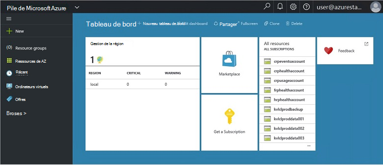
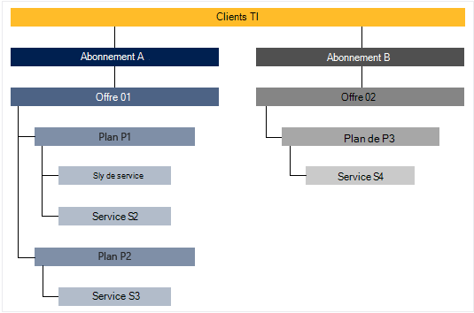

<properties
    pageTitle="Fonctionnalités clés et concepts dans la pile d’Azure | Microsoft Azure"
    description="Découvrez les fonctionnalités et les concepts de la pile d’Azure."
    services="azure-stack"
    documentationCenter=""
    authors="Heathl17"
    manager="byronr"
    editor=""/>

<tags
    ms.service="azure-stack"
    ms.workload="na"
    ms.tgt_pltfrm="na"
    ms.devlang="na"
    ms.topic="article"
    ms.date="10/25/2016"
    ms.author="helaw"/>

# Les principales fonctionnalités et les concepts de pile d’Azure

Si vous êtes novice dans la pile de Microsoft Azure, ces termes et les descriptions de la fonctionnalité peuvent être utiles.

## Personnages

Il existe deux types d’utilisateurs pour la pile de Microsoft Azure, l’administrateur du service et le client (client).

-  Un **administrateur de service** peuvent configurer et gérer les fournisseurs de ressources, des offres de clients, plans, services, quotas et de tarification.
-  Un **locataire** acquiert (ou achats) services qui offre de l’administrateur de service. Locataires peuvent configurer, surveiller et gérer les services qu’ils ont souscrit, telles que les applications Web, de stockage et de Machines virtuelles.

## Portail

Les principales méthodes d’interaction avec Microsoft Azure pile est le portail et PowerShell.

Le portail de Microsoft Azure pile est une instance d’Azure portal en cours d’exécution sur vos serveurs. Il s’agit d’un site web qui fournit une expérience de libre-service pour les administrateurs de service et les locataires avec contrôle d’accès basé sur les rôles (RBAC) aux ressources et aux capacités de nuage, l’activation d’une application rapide et de développement de services et de déploiement.

## Régions, des services, des plans, des offres et abonnements

Dans la pile d’Azure, les services sont fournis aux locataires à l’aide de régions, les abonnements, les offres et les plans. Locataires peuvent s’abonner à plusieurs offres. Offres peuvent avoir un ou plusieurs plans et plans peuvent avoir un ou plusieurs services.

Exemple de hiérarchie d’abonnements d’un client aux offres, chacun avec différents plans et de services.

### Régions
Régions de pile Azure sont un élément base d’échelle et de gestion.  Une organisation peut disposer de plusieurs régions avec les ressources disponibles dans chaque région.  Régions peuvent également avoir des offres de services disponibles.

### Services

Pile de Microsoft Azure permet à des fournisseurs fournir un large éventail de services et d’applications, telles que des machines virtuelles, SQL Server bases de données, SharePoint, Exchange et bien plus encore.

### Plans de

Les plans sont des regroupements d’un ou plusieurs services. En tant que fournisseur, vous créez des plans d’offrir à vos locataires. À son tour, votre locataires s’abonner à vos offres à utiliser les plans et les services qu’ils comprennent.

Chaque service ajouté à un plan peut être configuré avec les paramètres de quota pour vous aider à gérer les capacités de votre nuage. Les quotas peuvent inclure des restrictions comme les limites de la machine virtuelle, la mémoire et du processeur et sont appliquées par abonnement de l’utilisateur. Les quotas peuvent être différenciés par emplacement. Par exemple, un plan contenant les services de calcul à partir de la zone A peut avoir un quota de 10 cœurs de processeur, 4 Go de RAM et deux machines virtuelles.

Lorsque vous composez une offre, l’administrateur du service peut inclure des **plans de base**. Ces plans de base sont inclus par défaut lorsqu’un client s’abonne à cette offre. Dès qu’un utilisateur s’abonne (et la création de l’abonnement), l’utilisateur a accès à tous les fournisseurs de ressources spécifié dans les plans de base (avec les contingents correspondants).

L’administrateur de service peut également inclure des **plans de module complémentaire** dans une offre. Plans de module complémentaire ne sont pas inclus par défaut dans l’abonnement. Plans de modules complémentaires sont des plans supplémentaires (quotas) disponibles dans une offre propriétaire d’un abonnement peut ajouter à leurs abonnements.

### Offres

Offres sont des groupes de plans d’un ou plusieurs fournisseurs de présentent aux locataires d’acheter (s’abonner à). Par exemple, proposer un Alpha peut contenir Plan A (à partir de 1 et la région contenant un ensemble de services de calcul) et Plan de B (de 2 de la région contenant un ensemble de services de stockage et réseau).

Une offre est livré avec un ensemble de plans de base, et les administrateurs de service peuvent créer des plans de module complémentaire qui locataires peuvent ajouter à leur abonnement.

### Abonnements

Un abonnement est comment les locataires achètent vos offres. Un abonnement est une combinaison d’un client avec une offre. Un client peut avoir plusieurs offres des abonnements. Chaque abonnement s’applique à une seule offre. Les abonnements d’un client de déterminer les plans de services qu’ils peuvent accéder.

Abonnements organiser fournisseurs d’accès et l’utilisation des services et des ressources de cloud.

## Gestionnaire de ressources Azure

En utilisant le Gestionnaire de ressources Azure, vous pouvez travailler avec les ressources de votre infrastructure dans un modèle basé sur un modèle, déclaratives.   Il fournit une interface unique qui vous permet de déployer, gérer et surveiller vos composants de la solution, tels que les ordinateurs virtuels, des comptes de stockage, des applications web et des bases de données. Pour plus d’informations et de conseils, consultez la [vue d’ensemble du Gestionnaire de ressources Azure](../azure-resource-manager/resource-group-overview.md).

### Groupes de ressources

Groupes de ressources sont des ensembles de ressources, des services et applications, et chaque ressource a un type, tel que les ordinateurs virtuels, réseaux virtuels, public IPs, comptes de stockage et des sites Web. Chaque ressource doit être dans un groupe de ressources et organiser afin d’aident les groupes de ressources logiquement les ressources, telles que par la charge de travail ou un emplacement.

Voici quelques éléments importants à prendre en compte lors de la définition d’un groupe de ressources :

-   Chaque ressource ne peut exister que dans un groupe de ressources.

-   Vous déployer, mettre à jour et supprimer des éléments dans un groupe de ressources entre eux. Si une ressource, tel qu’un serveur de base de données, doit exister sur un cycle de déploiement différentes, il doit être dans un autre groupe de ressources.

-   Vous pouvez ajouter ou supprimer une ressource à un groupe de ressources à tout moment.

-   Vous pouvez déplacer une ressource d’un groupe de ressources vers un autre groupe.

-   Un groupe de ressources peut contenir des ressources qui se trouvent dans différentes régions.

-   Un groupe de ressources peut servir à portée de contrôle d’accès pour les opérations d’administration.

-   Une ressource peut être liée à une ressource dans un autre groupe de ressources lorsque les deux ressources doivent interagir entre eux, mais ils ne partagent pas le même cycle de vie. Par exemple, plusieurs applications doivent se connecter à une base de données, mais cette base de données ne doit pas être mis à jour ou supprimé au même rythme que les applications.

-   Dans la pile de Microsoft Azure, des ressources telles que les plans et les offres sont également gérés dans des groupes de ressources.

-   Vous pouvez redéployer un groupe de ressources.  Cela est utile à des fins de test ou de développement.  

### Modèles de gestionnaire de ressources Azure

Avec le Gestionnaire de ressources d’Azure, vous pouvez créer un modèle simple (au format JSON) qui définit la configuration de votre application et de déploiement. Ce modèle est appelé un modèle de gestionnaire de ressources Azure et offre un moyen déclaratif pour définir le déploiement. À l’aide d’un modèle, vous pouvez à plusieurs reprises déployer votre application tout au long du cycle de vie d’application et avoir confiance que vos ressources sont déployés dans un état cohérent.

## Les fournisseurs de ressources (RPs) : réseau RP, calculer RP, stockage RP

Les fournisseurs de ressources sont les services web qui constituent la base pour IaaS basée sur Azure de toutes les et les services PaaS. Azure le Gestionnaire de ressources s’appuie sur différents RPs pour fournir l’accès à des services d’un hébergeur.

Il existe trois RPs principal : réseau, de stockage et de calcul. Chacun de ces RPs vous permet de configurer et de contrôler ses ressources respectives. Les administrateurs de service peuvent également ajouter des nouveaux fournisseurs de ressources personnalisées.

### Calculer le RP

Le fournisseur de ressources de calcul (CRP) permet de locataires de la pile d’Azure créer leurs propres ordinateurs virtuels. Il fournit également des fonctionnalités pour l’administrateur du service installer et configurer le fournisseur de ressources pour les locataires. Le CRP inclut la possibilité de créer des machines virtuelles, ainsi que des extensions de la Machine virtuelle. Le service extension de Machine virtuelle permet de fournir des fonctions de IaaS pour les machines virtuelles Windows et Linux.

### Réseau RP

Le fournisseur de ressources réseau (NRP) propose une série de fonctionnalités de mise en réseau défini par logiciel (SDN) et la virtualisation de fonction réseau (NFV) pour le cloud privé. Ces fonctionnalités sont cohérentes avec le nuage public Azure afin que les modèles d’application peuvent être écrites une seule fois et déployés à la fois dans le nuage public Azure ou sur site Microsoft Azure pile. Le RP de réseau vous donne un contrôle plus précis, des balises de métadonnées, une configuration plus rapide, personnalisation rapide et reproductible et plusieurs interfaces de contrôle (y compris PowerShell, Kit de développement .NET, Node.JS SDK, API basée sur le reste). Vous pouvez utiliser le NRP pour créer des groupes de sécurité logiciel charge équilibreurs, public IPs, réseau, réseaux virtuels, entre autres.

### Stockage RP

Le RP de stockage offre quatre services de stockage Azure cohérents : blob, table, file d’attente et la gestion des comptes. Il offre également un service d’administration stockage cloud pour faciliter l’administration du service fournisseur de services de stockage Azure cohérents. Stockage Azure offre la possibilité de stocker et de récupérer de grandes quantités de données non structurées, telles que des documents et des fichiers de support avec les objets BLOB Azure, NoSQL structuré les données et les tables Azure. Pour plus d’informations sur le stockage Azure, consultez [Introduction au stockage Azure de Microsoft](../storage/storage-introduction.md).

#### Stockage des objets BLOB

Stockage des objets BLOB stocke un jeu de données. Un blob peut être n’importe quel type de données texte ou binaires, comme un document, un fichier multimédia ou un programme d’installation de l’application. Stockage de table stocke les jeux de données structurées. Stockage de table est un magasin de données de l’attribut clé NoSQL qui permet un développement rapide et un accès rapide à grandes quantités de données. Stockage de la file d’attente fournit une messagerie fiable pour le traitement de flux de travail et pour la communication entre les composants des services en nuage.

Chaque objet blob est organisée sous un conteneur. Les conteneurs fournissent également un moyen pratique d’affecter des stratégies de sécurité à des groupes d’objets. Un compte de stockage peut contenir un nombre quelconque de conteneurs et un conteneur peut contenir un nombre quelconque d’objets BLOB, dans la limite de capacité de 500 To du compte de stockage. BLOB de stockage offre trois types d’objets BLOB, bloquer les objets BLOB, ajouter des objets BLOB et les objets BLOB (disques) de la page. BLOB de bloc est optimisées en continu et le stockage d’objets de nuage et constitue un bon choix pour le stockage des documents, des fichiers multimédias, des sauvegardes, etc.. Ajouter des objets BLOB sont semblables aux objets BLOB de bloc, mais sont optimisés pour les opérations d’ajout. Un blob append peut être mis à jour uniquement par l’ajout d’un nouveau bloc à la fin. Ajouter des objets BLOB sont un bon choix pour les scénarios tels que la journalisation, où les nouvelles données doivent être écrites uniquement à la fin de l’objet blob. BLOB de page est optimisés pour les représentant les disques IaaS et aléatoire écrit et peut être jusqu'à 1 To de taille. Un réseau des machines virtuelles Azure joint IaaS disque est un disque dur virtuel stocké sous la forme d’un blob de la page.

#### Stockage de table

Stockage de table est banque de clé/attribut NoSQL de Microsoft : il possède un design sans schémas, ce qui diffère des bases de données relationnelles traditionnelles. Dans la mesure où les schémas de manque de banques de données, il est facile d’adapter vos données selon les besoins du evolve de votre application. Stockage de table est facile à utiliser, afin que les développeurs peuvent créer rapidement des applications. Stockage de table est un magasin de la clé-attribut, c'est-à-dire que chaque valeur dans une table est stockée sous un nom de propriété typée. Le nom de propriété peut être utilisé pour filtrer et définir des critères de sélection. Une collection de propriétés et leurs valeurs comprennent une entité. Depuis les schémas de Table stockage manque deux entités dans la même table peuvent contenir différents ensembles de propriétés, et ces propriétés peuvent être de différents types. Vous pouvez utiliser le stockage de Table pour stocker des groupes de données flexible, comme les données utilisateur pour les applications web, des carnets d’adresses, informations sur les périphériques et tout autre type de métadonnées nécessaires à votre service. Vous pouvez stocker n’importe quel nombre d’entités dans une table, et un compte de stockage peut contenir un nombre quelconque de tables, dans la limite de la capacité du compte de stockage.

#### Stockage de la file d’attente
Stockage de file d’attente Azure fournit nuage entre les composants de l’application de messagerie. Dans la conception d’applications à l’échelle, les composants d’application sont souvent découplées, afin qu’ils peuvent faire évoluer indépendamment. Stockage de la file d’attente offre une messagerie asynchrone pour des communications entre les composants de l’application, si elles sont en cours d’exécution dans le nuage, sur le bureau, sur un serveur local ou sur un périphérique mobile. Stockage de la file d’attente prend également en charge la gestion des tâches asynchrones et la création de flux de travail de processus.

## Contrôle d’accès (RBAC) basée sur les rôles

Vous pouvez utiliser RBAC pour accorder l’accès de système pour les utilisateurs autorisés, les groupes et les services en leur attribuant des rôles au niveau de la ressource, groupe de ressources ou abonnement. Chaque rôle définit le niveau d’accès qu'un utilisateur, un groupe ou un service a les ressources Microsoft Azure pile.

RBAC Azure a trois rôles de base qui s’appliquent à tous les types de ressources : propriétaire, collaboration et lecture. Propriétaire dispose d’un accès complet à toutes les ressources, y compris le droit de déléguer l’accès à d’autres personnes. Collaborateur peut créer et gérer tous les types de ressources Azure, mais ne peut pas accorder l’accès à d’autres personnes. Lecteur peut uniquement visualiser les ressources existantes Azure. Le reste des rôles RBAC dans Azure autoriser la gestion des ressources Azure spécifiques. Par exemple, le rôle de collaborateur de Machine virtuelle permet la création et la gestion des machines virtuelles, mais ne permet pas de gestion de réseau virtuel ou le sous-réseau que l’ordinateur virtuel se connecte à.

## Données d’utilisation

Microsoft Azure pile collecte et rassemble les données d’utilisation entre tous les fournisseurs de ressources afin de fournir un rapport concis par utilisateur. Données peuvent être aussi simple que le nombre de ressources consommées, ou aussi complexe que les compteurs de performances et d’évolutivité. Les données sont disponibles via l’API REST. Il est un Azure cohérentes locataire API ainsi que fournisseur et déléguée des API de fournisseur pour obtenir des données d’utilisation sur tous les abonnements de clients. Ces données peuvent être utilisées pour s’intégrer à un outil externe ou un service de facturation ou de refacturation.

## Étapes suivantes

[Déployer la pile Azure Technical Preview 2 (VT)](azure-stack-deploy.md)
