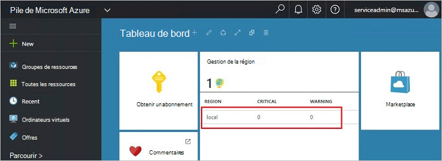
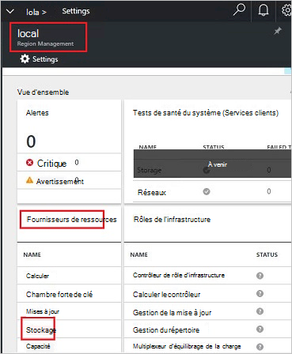
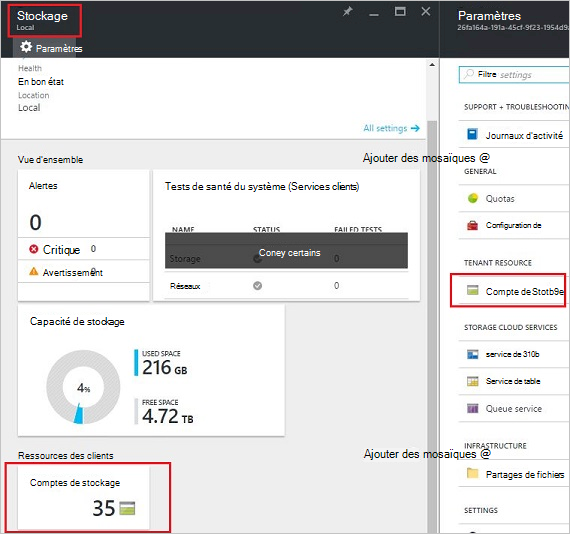
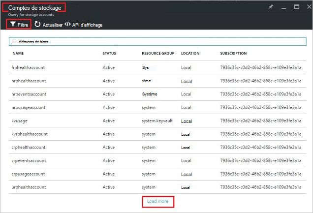
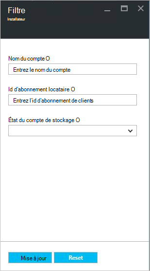
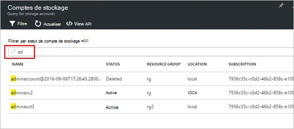
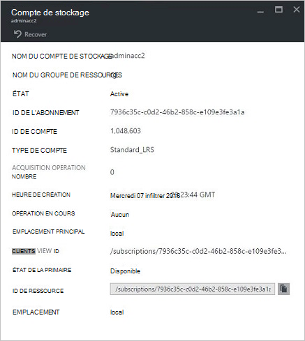
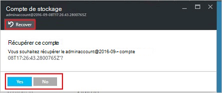
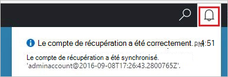
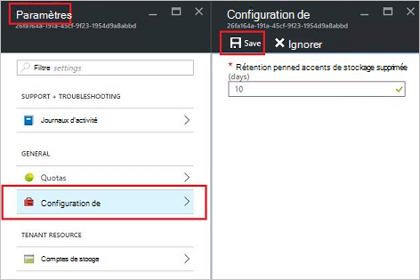

<properties
    pageTitle="Gérer les comptes de stockage Azure pile | Microsoft Azure"
    description="Découvrez comment trouver, gérer, récupérer et récupérer des comptes de stockage Azure pile"
    services="azure-stack"
    documentationCenter=""
    authors="AniAnirudh"
    manager="darmour"
    editor=""/>

<tags
    ms.service="azure-stack"
    ms.workload="na"
    ms.tgt_pltfrm="na"
    ms.devlang="na"
    ms.topic="get-started-article"
    ms.date="09/26/2016"
    ms.author="anirudha"/>

# <a name="manage-storage-accounts-in-azure-stack"></a>Gérer les comptes de stockage dans une pile Azure

Apprenez à gérer les comptes de stockage dans la pile d’Azure pour rechercher, récupérer et récupérer de la capacité de stockage en fonction des besoins de l’entreprise.

## <a name="find-a-storage-account"></a>Rechercher un compte de stockage

Vous pouvez consulter la liste des comptes de stockage dans la région de pile Azure par :

1.  Dans un navigateur internet, accédez à [https://portal.azurestack.local](https://portal.azurestack.local/).

2.  Connectez-vous au portail de la pile d’Azure en tant qu’administrateur (en utilisant les informations d’identification que vous avez fournies pendant le déploiement)

3.  Sur le tableau de bord par défaut – trouver la liste de la **gestion de la région** et cliquez sur la zone que vous souhaitez Explorer – par exemple **(local**).

    

4.  Sélectionner le **stockage** dans la liste de **Fournisseurs de ressources** .

    

5.  Maintenant, sur la lame Admin de fournisseur de ressources de stockage – accédez à l’onglet « Comptes de stockage », puis cliquez dessus.

    
    
    La page qui en résulte est la liste des comptes de stockage dans cette région.

    

Par défaut, les 10 premiers comptes sont affichés. Vous pouvez choisir d’extraire plusieurs, cliquez sur « charger plus » en bas de la liste <br>
OU <br>
Si vous êtes intéressé par un compte de stockage particulier, vous pouvez **filtrer et extraire les comptes concernés** uniquement.<br>

Pour filtrer des comptes :

1. Cliquez sur le bouton de filtre en haut de la lame.

2. Sur la lame de filtre, il vous permet de spécifier le **nom du compte**,  **ID d’abonnement** ou **état** pour affiner la liste des comptes de stockage à afficher. Les utiliser comme il convient.

3. Cliquez sur mise à jour. Actualisez la liste en conséquence.

    

4. Pour réinitialiser le filtre, cliquez sur le bouton Filtre, effacer les sélections et mettre à jour.

La zone de recherche, en haut de la lame de liste de comptes de stockage, vous permet de mettre en surbrillance le texte sélectionné dans la liste des comptes. Ceci est très pratique dans le cas lorsque le nom complet ou l’id n’est pas facilement disponible.<br>
Vous pouvez utiliser ici financière pour aider à trouver le compte qui que vous intéressez.




## <a name="look-at-account-details"></a>Examinez les détails de compte

Une fois que vous avez localisé les comptes qui que vous intéressez, vous pouvez cliquer sur le compte à afficher certains détails. Les détails du compte comme le type du compte, l’heure de création, emplacement etc. ouvre une nouvelle lame.




## <a name="recover-a-deleted-account"></a>Restaurer un compte supprimé

Vous êtes peut-être dans une situation où vous souhaitez restaurer un compte supprimé.<br>
Dans AzureStack, il existe un moyen très simple pour le faire.

1.  Accédez à accéder à la liste des comptes de stockage. [Consultez trouver un compte de stockage](#find-a-storage-account)

2.  Recherchez ce compte dans la liste. Vous devrez peut-être filtrer.

3.  Vérifiez l’état du compte. Vous devriez voir « supprimé ».

4.  Cliquez sur le compte qui s’ouvre à la lame de détails du compte.

5.  Sur cette blade – recherchez le bouton « Restaurer », puis cliquez dessus.

6.  Confirmez en appuyant sur « Oui »

    

7.  La restauration est maintenant en cours... attente pour indiquer qu’il a réussi.
    Vous pouvez également cliquer sur l’icône « cloche » en haut du portail pour afficher les indications de la progression.

    

  Une fois le compte récupéré est correctement synchronisé, un peut revenir à l’utiliser.

### <a name="some-gotchas"></a>Des problèmes

- Votre compte affiche l’état en tant que « de rétention ».

  Cela signifie que le compte supprimé a dépassé la période de rétention et qu’il ne peut pas être récupérée plus.

- Votre compte supprimé n’affiche pas dans la liste des comptes.

  Cela signifie que le compte supprimé a été déjà par le garbage collecté. Dans ce cas il est impossible de récupérer plus. Voir « récupérer de la capacité » ci-dessous.

## <a name="set-retention-period"></a>Définir la période de rétention

Définition de période de rétention permet de spécifier une période en jours (entre 0 et 9 999 jours) pendant laquelle un compte supprimé peut potentiellement être récupérée à l’administrateur. La période de rétention par défaut est définie à 15 jours. Définition de la valeur à « 0 » signifie que n’importe quel compte supprimé sera immédiatement de rétention et marquées pour le nettoyage périodique.

Pour modifier la période de rétention :

1.  Dans un navigateur internet, accédez à [https://portal.azurestack.local](https://portal.azurestack.local/).

2.  Connectez-vous au portail de la pile d’Azure en tant qu’administrateur (en utilisant les informations d’identification que vous avez fournies pendant le déploiement)

3.  Sur le tableau de bord par défaut – trouver la liste de la **gestion de la région** et cliquez sur la zone que vous souhaitez Explorer – par exemple **(local**).

4.  Sélectionner le **stockage** dans la liste de **Fournisseurs de ressources** .

5.  Cliquez sur l’icône de paramètres dans la partie supérieure pour ouvrir la lame de paramètre.

6.  Cliquez sur configuration - période de rétention.

7.  Vous pouvez modifier la valeur et l’enregistrer.

 Cette valeur sera immédiatement efficace et reflètent votre région entière.



## <a name="reclaim-capacity"></a>Récupérer de la capacité

Un des effets secondaires de disposer d’une période de rétention est qu’un compte supprimé continue consommer les capacités jusqu'à ce qu’il sort de la période de rétention. En tant qu’administrateur que vous devrez peut-être un moyen de récupérer ce supprimé espace de comptes même si la période de rétention n’a pas encore expiré. Actuellement, vous pouvez utiliser une ligne de commande pour substituer explicitement la période de rétention et de récupérer immédiatement de la capacité. Pour ce faire :

1.  En supposant que vous avez Azure-PowerShell installé et configuré. Dans le cas contraire, suivez les instructions fournies ici : pour installer la dernière version de PowerShell d’Azure et l’associer à votre abonnement Azure, voir [Comment faire pour installer et configurer Azure PowerShell](http://azure.microsoft.com/documentation/articles/powershell-install-configure/).
    Pour plus d’informations sur les applets de commande Azure le Gestionnaire de ressources, reportez-vous [à l’aide du PowerShell Azure avec le Gestionnaire de ressources Azure](http://go.microsoft.com/fwlink/?LinkId=394767)

2.  Exécutez la cmdlet suivante :

    ```
    PS C:\\>; Clear-ACSStorageAccount -ResourceGroupName system
    -FarmName <your farmname>
    ```

> Pour plus de détails, veuillez vous reporter à la [documentation de powershell AzureStack](https://msdn.microsoft.com/library/mt637964.aspx)

> [AZURE.NOTE] L’exécution de cette applet de commande va supprimer définitivement le compte et son contenu. Il ne sera plus récupérable. Utilisez cette option avec précaution.

