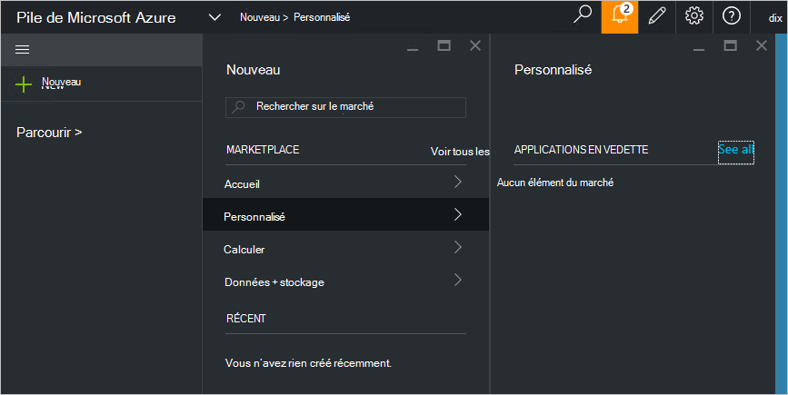

<properties
    pageTitle="Publier un élément personnalisé marketplace dans Azure pile (administrateur de service) | Microsoft Azure"
    description="En tant qu’un administrateur de service, savoir comment publier un élément personnalisé marketplace dans la pile d’Azure."
    services="azure-stack"
    documentationCenter=""
    authors="rupisure"
    manager="byronr"
    editor=""/>

<tags
    ms.service="azure-stack"
    ms.workload="na"
    ms.tgt_pltfrm="na"
    ms.devlang="na"
    ms.topic="article"
    ms.date="09/26/2016"
    ms.author="rupisure"/>

# La pile Azure Marketplace

Le marché est une collection d’éléments personnalisés pour pile d’Azure, comme les services, les applications et les ressources. Il est le lieu où les locataires sont créer des ressources et de déployer de nouvelles applications. Les administrateurs de service peuvent ajouter des éléments personnalisés, sur le marché et les locataires verra tout de suite.

Pour ouvrir le site Marketplace, cliquez sur **Nouveau**.

Le marché est mis à jour toutes les cinq minutes.

## Éléments de marché

Chaque élément de marché comprend :

-   Un modèle de gestionnaire de ressources Azure pour le provisionnement des ressources

-   Métadonnées, telles que des chaînes, des icônes et autres supports marketing

-   Informations de mise en forme pour afficher l’élément dans le portail

Chaque élément de publication sur le marché utilise un format appelé Azure galerie de Package (azpkg). Déploiement ou exécution des ressources (comme le code, les fichiers zip avec des logiciels ou images de machine virtuelle) doivent être ajoutées à la pile d’Azure séparément, pas dans le cadre de l’article Marketplace. 

## Étapes suivantes

[Créer et publier un article de la marketplace](azure-stack-create-and-publish-marketplace-item.md)
