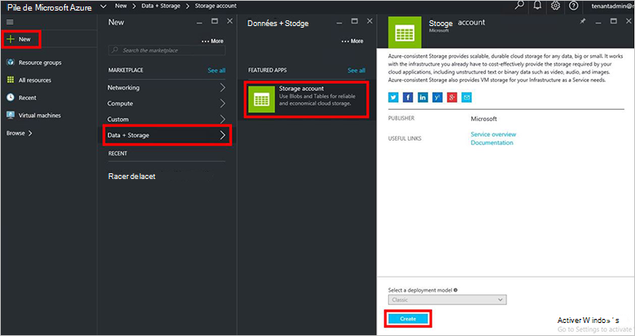

<properties
    pageTitle="Les comptes de stockage dans la pile d’Azure | Microsoft Azure"
    description="Apprenez à créer un compte de stockage Azure pile."
    services="azure-stack"
    documentationCenter=""
    authors="ErikjeMS"
    manager="byronr"
    editor=""/>

<tags
    ms.service="azure-stack"
    ms.workload="na"
    ms.tgt_pltfrm="na"
    ms.devlang="na"
    ms.topic="get-started-article"
    ms.date="09/26/2016"
    ms.author="erikje"/>

# Comptes de stockage dans la pile d’Azure

Comptes de stockage incluent les services Blob et Table et l’espace de noms unique pour vos objets de données de stockage. Par défaut, les données de votre compte sont disponibles uniquement pour vous, le compte du propriétaire du stockage.

1.  Sur l’ordinateur de démonstration de pile Azure, connectez-vous au `https://portal.azurestack.local` en tant qu' [administrateur](azure-stack-connect-azure-stack.md#log-in-as-a-service-administrator), puis cliquez sur **Nouveau** > **données + stockage** > **compte de stockage**.

    

2.  Dans la lame **compte de stockage de créer** , tapez un nom pour votre compte de stockage. Créer un nouveau **Groupe de ressources**, ou sélectionnez-en un, puis cliquez sur **créer** pour créer le compte de stockage.

    

3. Pour voir votre nouveau compte de stockage, cliquez sur **toutes les ressources**, puis recherche pour le compte de stockage et cliquez sur son nom.

    
    
## Étapes suivantes

[Utiliser les modèles du Gestionnaire de ressources Azure](azure-stack-arm-templates.md)

[En savoir plus sur les comptes de stockage Azure](../storage/storage-create-storage-account.md)

[Téléchargez le Guide de Validation de stockage Azure cohérentes pile Azure](http://aka.ms/azurestacktp1doc)
