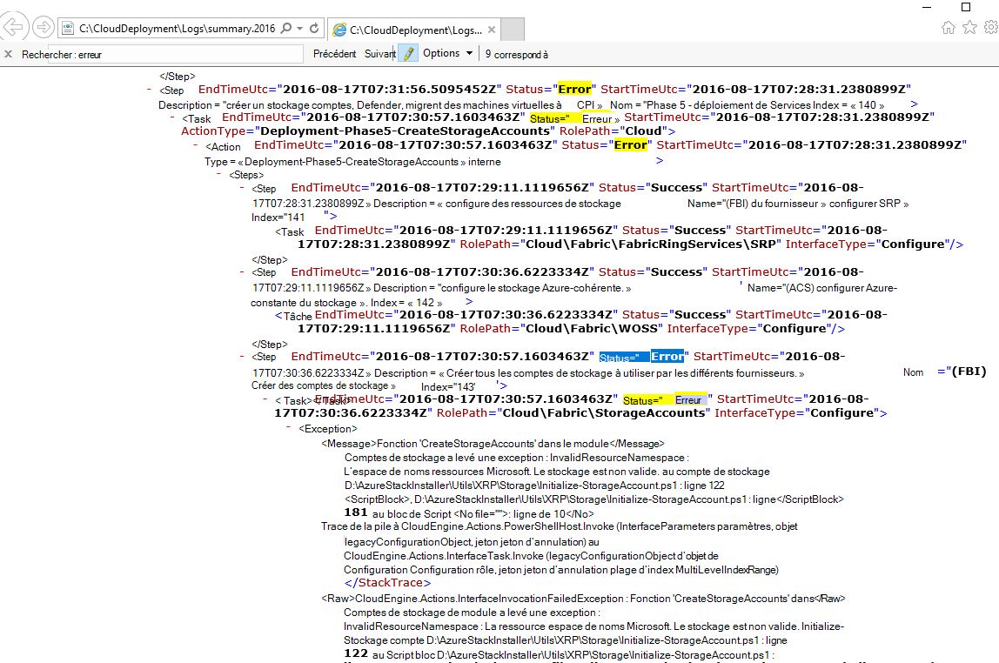
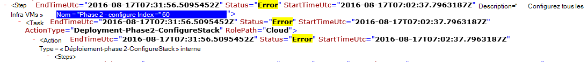

<properties
    pageTitle="Exécutez à nouveau un déploiement à partir d’une étape en échec | Microsoft Azure"
    description="Si vous rencontrez un problème pendant le déploiement, vous pouvez essayer la procédure suivante pour exécuter à nouveau le déploiement à partir de l’endroit où il a échoué."
    services="azure-stack"
    documentationCenter=""
    authors="ErikjeMS"
    manager="byronr"
    editor=""/>

<tags
    ms.service="azure-stack"
    ms.workload="na"
    ms.tgt_pltfrm="na"
    ms.devlang="na"
    ms.topic="get-started-article"
    ms.date="09/26/2016"
    ms.author="erikje"/>
    
# Exécutez à nouveau un déploiement à partir d’une étape en échec
  
Si vous rencontrez un problème pendant le déploiement, vous pouvez essayer la procédure suivante pour exécuter à nouveau le déploiement à partir de l’endroit où il a échoué.

## Rechercher l’échec

Prenez note de la défaillance, en particulier la partie qui appelle à quelle étape l’appel a échoué. Par exemple,

**2016-08-17 00:30:57 Erreur 1 1 > > Action : appel de l’étape 60.140.143 a échoué. Arrêt de l’appel du plan d’action.**

Ceci est l’étape de déploiement où vous commencerez la réexécuter du déploiement.

## Trouver plus de détails sur l’échec

Si vous souhaitez plus de détails sur l’erreur, trouvez le résumé de la **. AAAA-MM-DD.tt.N.log.xml** dans le **C:\CloudDeployment\Logs\* * dossier.
Recherchez la chaîne « Erreur » et suivez vers le bas par le biais de la sortie jusqu'à ce que vous voyiez une grande quantité de texte non-XML mis en forme qui contient le message d’erreur (cette section coïncide souvent avec la dernière instance de la chaîne « Erreur »). Par exemple :

Vous pouvez également utiliser ces informations pour effectuer le suivi de l’étape de réexécuter, suivre les numéros « Index » à partir de cette dernière erreur. Dans l’image ci-dessus, vous pouvez voir (en commençant par le bas) : 143, 140 et ensuite si défiler vers le haut, vous voyez 60 :

Placer ce tous ensemble (maintenant à partir du haut vers le bas), vous obtenez 60.140.143, comme dans la sortie de console PS de la panne (comme indiqué dans la section « Échec de la recherche » ci-dessus).

## Exécutez à nouveau le déploiement en une étape spécifique

Maintenant que vous avez l’étape que le déploiement a échoué sur, vous pouvez essayer de la barre d’outils - ré-exécution du déploiement à partir de cette étape.

> [AZURE.IMPORTANT] Les commandes suivantes doivent être exécutées par l’utilisateur, dans le contexte de l’erreur qui s’est produite. Si la défaillance s’est produite avant que l’hôte a été joint au domaine, exécutez les étapes ci-dessous en tant que compte d’administrateur local. Si l’échec s’est produit une fois que l’hôte a été joint au domaine, exécutez les étapes ci-dessous en tant qu’administrateur de domaine (azurestack\azurestackadmin).

### Exécutez la commande Invoke-EceAction

1. À partir d’une console PS élevée, importez les Modules suivants :

        Import-Module C:\CloudDeployment\CloudDeployment.psd1 -Force
        Import-Module C:\CloudDeployment\ECEngine\EnterpriseCloudEngine.psd1 -Force 

2. Puis exécutez la commande suivante (exemple dessus utilisé ici) :

        Invoke-EceAction -RolePath Cloud -ActionType Deployment -Start 60.140.143 -Verbose

3.  Ceci va démarrer le déploiement à partir de l’étape identifiée par l’option - paramètre de démarrage de la commande Invoke-EceAction

### Résultats d’a - réexécuter /-démarrage

Quel que soit l’option choisie, le déploiement commence à partir du - paramètre de démarrage.

1.  Si la défaillance est récupérable, le déploiement continue jusqu'à son achèvement.

2.  Si le déploiement échoue de nouveau à...
    
    - au même endroit : la défaillance n’est probablement pas récupérable, et une analyse plus poussée est nécessaire.

    - un nouveau lieu après échec cette fois : vous pouvez essayer ces mêmes étapes pour la faire passer à nouveau.

    - un nouvel emplacement avant échec cette fois : autre chose s’est passé avec un appel idempotent, ce qui requiert des investigations.

## Étapes suivantes

[Se connecter à la pile Azure](azure-stack-connect-azure-stack.md)

