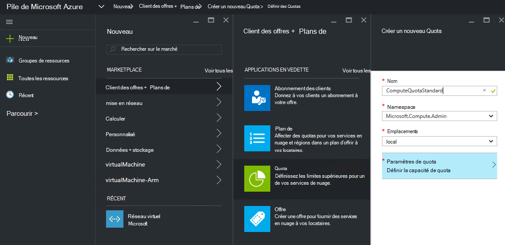
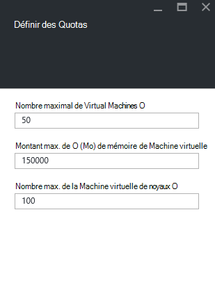
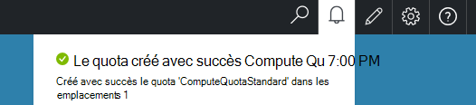

<properties
    pageTitle="Quotas de pile Azure | Microsoft Azure"
    description="Administrateurs de définir des quotas pour limiter la quantité maximale de ressources locataires ayant accès à."
    services="azure-stack"
    documentationCenter=""
    authors="mattmcg"
    manager="byronr"
    editor=""/>

<tags
    ms.service="azure-stack"
    ms.workload="na"
    ms.tgt_pltfrm="na"
    ms.devlang="na"
    ms.topic="get-started-article"
    ms.date="09/26/2016"
    ms.author="mattmcg"/>

# Définition des quotas de pile d’Azure

Quotas de définissent les limites des ressources qui un abonnement de clients peut fournir ou consommer. Par exemple, un quota peut permettre à un client à créer des ordinateurs virtuels jusqu'à cinq. Pour ajouter un service à un plan, l’administrateur doit configurer les paramètres de quota pour ce service.

Les quotas sont configurables par service et par emplacement, permettant aux administrateurs de fournir un contrôle granulaire sur la consommation de ressources. Les administrateurs peuvent créer une ou plusieurs ressources de quota et les associer à des plans, ce qui signifie qu’ils peuvent fournir des offres différenciées pour leurs services. Quotas pour un service donné peuvent être créés à partir de la blade d’administration de **Fournisseur de ressources** pour ce service.

Un client qui s’abonne à une offre contenant plusieurs plans peut utiliser toutes les ressources qui sont disponibles dans chaque plan.

## Pour créer un quota IaaS

1.  Dans un navigateur, accédez à [https://portal.azurestack.local](https://portal.azurestack.local/).

    Vous connecter sur le portail de pile d’Azure en tant qu’administrateur (en utilisant les informations d’identification que vous avez fournies pendant le déploiement).

2.  Sélectionnez **Nouveau**, puis sélectionnez le **Quota**.

3.  Sélectionnez le premier service pour lequel vous souhaitez créer un quota. Un contingent de IaaS, procédez comme suit pour les services informatiques, de réseau et de stockage.
Dans cet exemple, nous avons d’abord créer un quota pour le service de calcul. Dans la liste **Namespace** , sélectionnez l’espace de noms **Microsoft.Compute.Admin** .

    > 

4.  Choisissez l’emplacement où le quota est défini (par exemple, « local »).

5.  Sur l’élément **Paramètres de Quota** , il indique **la valeur de la capacité de Quota**. Cliquez sur cet élément pour configurer les paramètres de quota.

6.  Sur la lame de **Définir des Quotas** , vous voyez toutes les ressources de calcul pour laquelle vous pouvez configurer des limites. Chaque type a une valeur par défaut qui est associée. Vous pouvez modifier ces valeurs, ou vous pouvez sélectionner le bouton **Ok** en bas de la lame pour accepter les valeurs par défaut.

    > 

7.  Une fois que vous avez configuré les valeurs et cliqué sur **Ok**, l’élément **Paramètres de Quota** s’affiche comme **configuré**. Cliquez sur **Ok** pour créer la ressource de **Quota** .

    Vous devriez voir une notification indiquant que la ressource de quota est en cours de création.

8.   Une fois l’ensemble du quota a été créé avec succès, vous recevez une deuxième notification. Le quota de service de calcul est prêt à être associé à un plan. Répétez ces étapes avec les services de réseau et de stockage, et vous êtes prêt à créer un plan IaaS !

    >   

## Calculer les types de quota

|**Type de**                    |**Valeur par défaut**| **Description**|
|--------------------------- | ------------------------------------|------------------------------------------------------------------|
|Nombre maximum de machines virtuelles   |50|Le nombre maximum de machines virtuelles capable de créer un abonnement à cet emplacement. |
|Nombre maximal de noyaux de machine virtuelle              |100|Le nombre maximal de cœurs capable de créer un abonnement à cet emplacement (par exemple, un ordinateur virtuel de A3 a quatre cœurs).|
|Quantité maximale de mémoire de l’ordinateur virtuel (Go)         |150|La quantité maximale de mémoire vive qui peut être mis en service en mégaoctets (par exemple, un ordinateur virtuel de A1 consomme 1,75 Go de RAM).|

> [AZURE.NOTE] Calculer les quotas ne sont pas appliquées dans cet aperçu technique.

## Types de quota de stockage

|**Élément**                           |**Valeur par défaut**   |**Description**|
|---------------------------------- |------------------- |-----------------------------------------------------------|
|Capacité maximale (Go)              |500                 |Capacité de stockage totale qui peut être consommée par un abonnement à cet emplacement.|
|Nombre total de comptes de stockage   |20                  |Le nombre maximal de comptes de stockage capable de créer un abonnement à cet emplacement.|

## Types de quota de réseau

|**Élément**                                                   |**Valeur par défaut**   |**Description**|
|----------------------------------------------------------| ------------------- |--------------------------------------------------------------------------------------------------------------------------------------------------------------------|
| Adresses IP publique de max                         |50                  |Le nombre maximal d’adresses IP publique capable de créer un abonnement à cet emplacement. |
| Réseaux virtuels max                   |50                  |Le nombre maximal de réseaux virtuels capable de créer un abonnement à cet emplacement. |
| Passerelles de réseau virtuel max           |1                   |Le nombre maximal des passerelles de réseau virtuel (passerelles VPN) capable de créer un abonnement à cet emplacement. |
| Nombre maximal de connexions réseau                |2                   |Le nombre maximal de connexions réseau (point à point ou site à site) capable de créer un abonnement sur toutes les passerelles de réseau virtuel dans cet emplacement. |
| Équilibreurs de charge max                     |50                  |Le nombre maximal d’équilibreurs de charge capable de créer un abonnement à cet emplacement. |
| Cartes d’interface réseau max                               |100                 |Le nombre maximal d’interfaces réseau capable de créer un abonnement à cet emplacement. |
| Groupes de sécurité de réseau de max            |50                  |Le nombre maximal de groupes de sécurité de réseau capable de créer un abonnement à cet emplacement. |
