<properties
    pageTitle="Déployez le fournisseur de ressources de SQL Server sur la pile d’Azure | Microsoft Azure"
    description="Étapes détaillées pour déployer une carte de fournisseur de ressources de SQL Server sur la pile d’Azure."
    services="azure-stack"
    documentationCenter=""
    authors="Dumagar"
    manager="byronr"
    editor=""/>

<tags
    ms.service="multiple"
    ms.workload="na"
    ms.tgt_pltfrm="na"
    ms.devlang="na"
    ms.topic="article"
    ms.date="09/26/2016"
    ms.author="dumagar"/>

# Déployer la carte de fournisseur de ressources de SQL Server sur pile Azure

> [AZURE.NOTE] Les informations suivantes ne s’applique qu’aux déploiements de TP1 de pile Azure.

Cet article permet de suivre les étapes détaillées de configuration de l’adaptateur de fournisseur de ressources de SQL Server sur la pile d’Azure preuve du concept (POC). Reportez-vous à la section [utiliser des bases de données SQL Azure pile](azure-stack-sql-rp-deploy-short.md) de comprendre l’architecture et des fonctionnalités de fournisseur de ressources.

## Paramétrer des étapes avant de déployer

Avant de déployer le fournisseur de ressources, vous devez :

- Une image de Windows Server par défaut avec .NET 3.5
- Désactiver la sécurité renforcée d’Internet Explorer (IE)
- Installez la dernière version de PowerShell d’Azure

### Créer une image de Windows Server, y compris .NET 3.5

Vous pouvez ignorer cette étape si vous avez téléchargé les bits de la pile d’Azure après 2/23/2016, car l’image par défaut de base Windows Server 2012 R2 inclut le .NET framework 3.5 dans ce téléchargement et versions ultérieures.

Si vous avez téléchargé avant 2/23/2016, vous devez créer un disque dur virtuel de Windows Server 2012 R2 Datacenter avec .NET 3.5 image et jeu est par défaut dans le référentiel Image de plate-forme.

### Désactiver Internet Explorer enhanced security et activer les cookies

Pour déployer un fournisseur de ressources, vous exécutez l’environnement de script intégré PowerShell (ISE) en tant qu’administrateur, vous devez autoriser les cookies et JavaScript dans le profil d’Internet Explorer que vous permet de vous connecter à Active Directory de Azure pour connexions administrateur et d’utilisateur.

**Pour désactiver Internet Explorer enhanced security :**

1. Connectez-vous en Azure pile preuve de concept (PoC) tant qu’un AzureStack/administrateur et puis ouvrez le Gestionnaire de serveur.

2. Désactiver **La Configuration de sécurité renforcée d’Internet Explorer** pour les administrateurs et les utilisateurs.

3. Se connecter à la machine virtuelle de **ClientVM.AzureStack.local** en tant qu’administrateur, puis ouvrez le Gestionnaire de serveur.

4. Désactiver **La Configuration de sécurité renforcée d’Internet Explorer** pour les administrateurs et les utilisateurs.

**Pour activer les cookies :**

1. Sur l’écran de démarrage de Windows, cliquez sur **toutes les applications**et cliquez sur **Accessoires de Windows**, cliquez sur **Internet Explorer**, pointez sur **autres**, puis cliquez sur **Exécuter en tant qu’administrateur**.

2. Si vous y êtes invité, vérifiez **l’utilisation recommandée de sécurité**, puis cliquez sur **OK**.

3. Dans Internet Explorer, cliquez sur l' **icône Outils (engrenages)** &gt; **options Internet** &gt; onglet **confidentialité** .

4. Cliquez sur **Options avancées**vous assurer que les deux boutons **Accepter** sont sélectionnés et cliquez sur **OK**, puis cliquez à nouveau sur **OK** .

5. Fermez Internet Explorer et redémarrez PowerShell ISE en tant qu’administrateur.

### Installer une version compatible de la pile d’Azure de PowerShell d’Azure

1. Désinstallez tout PowerShell Azure existante à partir de votre ordinateur virtuel du Client.

2. Connectez-vous à l’ordinateur de démonstration de pile Azure en tant qu’AzureStack/administrateur.

3. À l’aide du Bureau à distance, connectez-vous à l’ordinateur virtuel de **ClientVM.AzureStack.local** en tant qu’administrateur.

4. Ouvrez le panneau de configuration, cliquez sur **désinstaller un programme** &gt; sur **Azure PowerShell** &gt; cliquez sur **désinstaller**.

5. [Téléchargez la dernière PowerShell Azure qui prend en charge la pile d’Azure](http://aka.ms/azstackpsh) et l’installer.

    Après l’installation de PowerShell, vous pouvez exécuter cette vérification script PowerShell pour vous assurer que vous pouvez vous connecter à votre instance Azure pile (une page web de connexion doit apparaître).

## Le déploiement de fournisseur de ressources PowerShell des données d’amorçage

1. Connexion Bureau à distance Azure pile VT à clientVm.AzureStack.Local et connectez-vous en tant qu’azurestack\\azurestackuser.

2. [Télécharger les fichiers binaires SQLRP](http://aka.ms/massqlrprfrsh) de fichier. Vous devrez peut-être supprimer le bloc de sécurité de téléchargement Internet par un clic droit sur le fichier, sélectionnez **Propriétés** et sous l’onglet **Général** , graduation **Débloquer**, **OK**. Ceci ne devrait empêcher 'N’a pas pu charger fichier ou l’assembly' des exceptions liées à DeploymentTelemetry.dll et les exceptions de Trace-déploiement ultérieures.

3. Extraire les fichiers à D:\\SQLRP.

4. Exécutez le lecteur D:\\SQLRP\\fichier de Bootstrap.cmd en tant qu’administrateur (azurestack\\administrateur).

    Le fichier Bootstrap.ps1 s’ouvre dans PowerShell ISE.

5. Lorsque la fenêtre PowerShell ISE termine le chargement, cliquez sur le bouton lecture ou appuyez sur F5.

    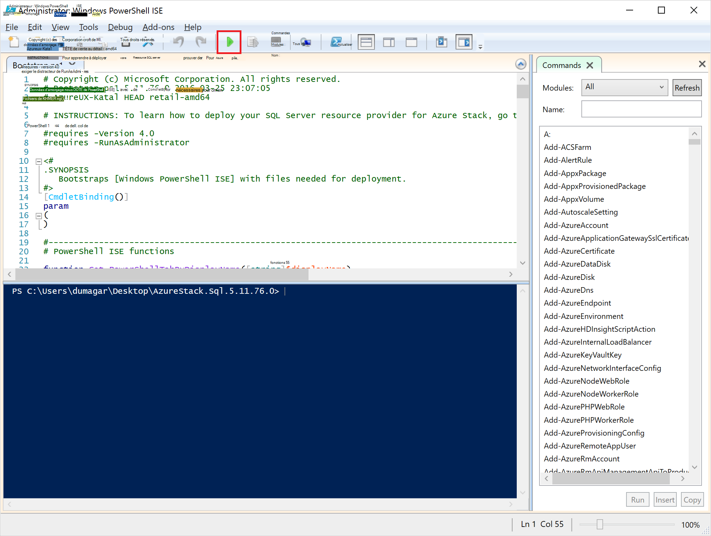

    Deux onglets principaux se charge, chacun contenant tous les scripts et les fichiers que vous devez déployer le fournisseur de ressources.

## Préparer les conditions préalables

Cliquez sur l’onglet de **Préparer les conditions préalables** pour :

- Créer des certificats requis
- Télécharger des artefacts à un compte de stockage sur la pile d’Azure
- Publier les éléments de la galerie

### Créer les certificats requis
Ce script de **Nouveau-SslCert.ps1** ajoute la \_. Certificat SSL de AzureStack.local.pfx sur le lecteur D:\\SQLRP\\conditions préalables\\BlobStorage\\dossier conteneur. Le certificat permet de sécuriser la communication entre le fournisseur de ressources et de l’instance locale du Gestionnaire de ressources Azure.

1. Dans l’onglet principal de **Préparer les conditions préalables** , cliquez sur l’onglet **Nouveau-SslCert.ps1** et exécutez-le.

2. Dans l’invite qui s’affiche, tapez un mot de passe PFX qui protège la clé privée et **Prenez note de ce mot de passe**. Vous en aurez besoin ultérieurement.

### Télécharger tous les artefacts sur un compte de stockage dans la pile d’Azure

1. Cliquez sur l’onglet **Téléchargement-Microsoft.Sql-RP.ps1** et exécutez-le.

2. Dans la boîte de dialogue demande de d’informations d’identification Windows PowerShell, tapez les informations d’identification administrateur de pile d’Azure service.

3. Lorsque vous y êtes invité pour l’ID de client Azure Active Directory, tapez votre nom de domaine complet du locataire Azure Active Directory : par exemple, microsoftazurestack.onmicrosoft.com.

    Une fenêtre contextuelle vous demande des informations d’identification.

    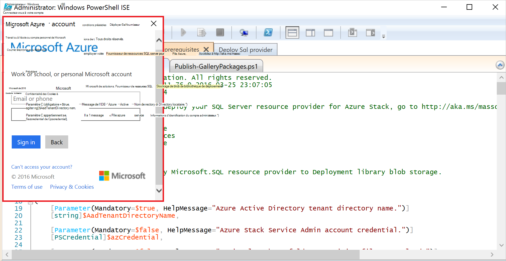

    > [AZURE.TIP] Si la fenêtre contextuelle ne s’affiche pas, vous que soit n’ont pas désactivé IE amélioré la sécurité afin d’activer JavaScript sur cet ordinateur et d’utilisateur, ou vous n’avez pas accepté les cookies dans Internet Explorer. Reportez-vous à la section [configurer les étapes avant de déployer](#set-up-steps-before-you-deploy).

4. Tapez vos informations d’identification d’administrateur de Service Azure pile et puis cliquez sur **Connexion**.

### Publier les éléments de la galerie pour la création ultérieure de la ressource

Sélectionnez l’onglet **Publier-GalleryPackages.ps1** et exécutez-le. Ce script ajoute deux éléments de marché pour le marché du portail POC de pile Azure que vous pouvez utiliser pour déployer des ressources de base de données en tant qu’éléments du marché.

## Déployez le fournisseur de ressources de machine virtuelle SQL Server

Maintenant que vous avez préparé le PoC de pile Azure avec les certificats nécessaires et les éléments de la marketplace, vous pouvez déployer un fournisseur de ressources de SQL Server. Cliquez sur l’onglet **fournisseur de déployer de SQL** pour :

   - Fournir des valeurs dans un fichier JSON qui fait référence à la procédure de déploiement
   - Déployez le fournisseur de ressources
   - Mise à jour du DNS local
   - Enregistrer la carte de fournisseur de ressources de SQL Server

### Fournir des valeurs dans le fichier JSON

Cliquez sur **Microsoft.Sqlprovider.Parameters.JSON**. Ce fichier comprend les paramètres que le modèle de gestionnaire de ressources Azure doit déployer correctement à la pile d’Azure.

1. Renseignez les paramètres **vide** dans le fichier JSON :

    - Assurez-vous de que vous fournissez le **adminusername** et **adminpassword** pour la VM de fournisseur de ressources de SQL :

        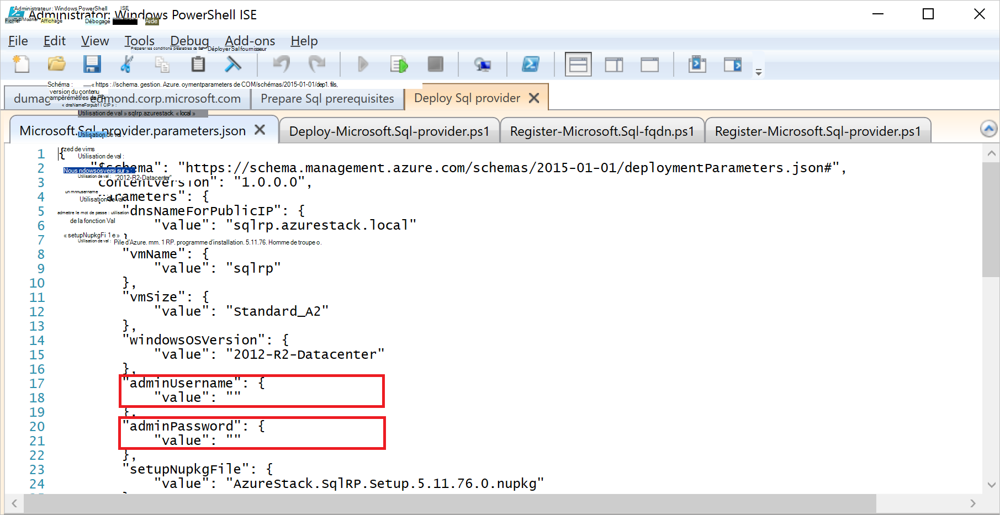

    - Vérifiez que vous fournissez le mot de passe pour le paramètre **SetupPfxPassword** que vous avez apportées à une note de dans l’étape de [composants requis de préparation](#prepare-prerequisites) :

    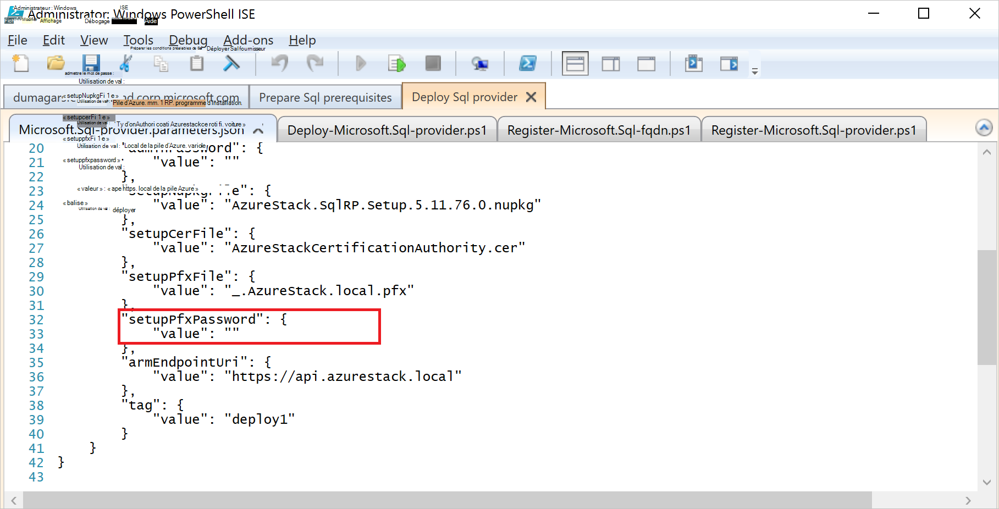

2. Cliquez sur **Enregistrer** pour enregistrer le fichier de paramètres.

### Déployez le fournisseur de ressources

1. Cliquez sur l’onglet **déploiement-Microsoft.sql-provider.PS1** et exécutez le script.
2. Dans Azure Active Directory lorsque vous y êtes invité, tapez le nom de votre client.
3. Dans la fenêtre contextuelle, soumettre vos informations d’identification de pile d’Azure service admin.

Le déploiement complet peut prendre entre 25 et 55 minutes sur certains validation des conceptions pile Azure fortement sollicités. Les étapes de la plus longues est l’extension de la Configuration souhaitée de l’état (DSC) et l’exécution de PowerShell, qui est l’étape finale. Chacun peut prendre 10 à 25 minutes.

### Mise à jour du DNS local

1. Cliquez sur l’onglet **historique-Microsoft.SQL-fqdn.ps1** et exécutez le script.
2. Lorsque vous y êtes invité pour Azure des ID de clients Active Directory, entrez votre nom de domaine complet du locataire Azure Active Directory : par exemple, **microsoftazurestack.onmicrosoft.com**.

### Enregistrer le fournisseur de ressources RP de SQL##

1. Cliquez sur l’onglet **historique-Microsoft.SQL-provider.ps1** et exécutez le script.

2. À l’invite d’informations d’identification, utilisez les valeurs suivantes pour le nom d’utilisateur et le mot de passe :

   - **sqlRpUsername**
   - **sqlRpPassw0rd**

   > [AZURE.IMPORTANT] Ce sont les valeurs *littérales* dont vous avez besoin de taper à l’invite d’informations d’identification. Il ne s’agit pas d’espaces réservés. * *Faire *pas* type ** les citer que vous avez enregistré dans le fichier de paramètres avant de déployer l’ordinateur virtuel.

## Vérifier le déploiement à l’aide du portail de pile Azure

1. Se déconnecter de la ClientVM et reconnectez-vous en tant que **AzureStack\AzureStackUser**.

2. Sur le bureau, cliquez sur **Portail POC de pile Azure** et vous connecter au portail en tant que l’administrateur du service.

3. Vérifiez que le déploiement a réussi. Cliquez sur **Parcourir** &gt; **Groupes de ressources** &gt; cliquez sur le groupe de ressources que vous avez utilisé (valeur par défaut est **SQLRP**), puis assurez-vous que la partie de l’éducation de la lame (moitié supérieure) lit le **déploiement a réussi**.

      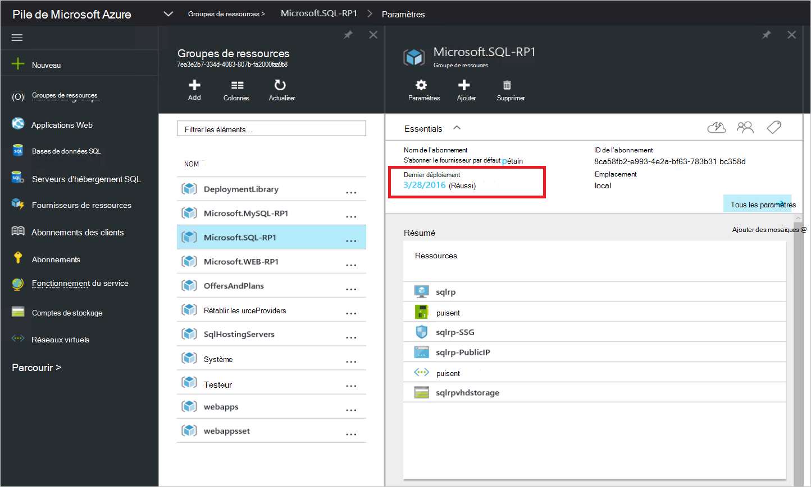

4. Vérifiez que l’inscription a réussi. Cliquez sur **Parcourir** &gt; **les fournisseurs de ressources**et puis recherchez **SQL Local**:

      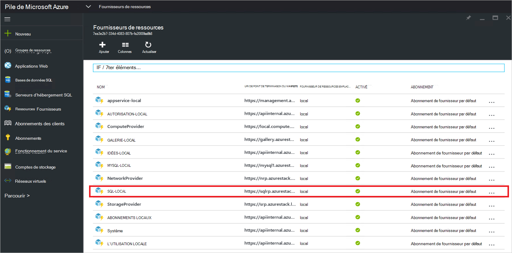

## Fournir une capacité à votre fournisseur de ressources SQL en le connectant à un serveur SQL d’hébergement

1. Se connecter au portail Azure pile POC en tant qu’un administrateur de service

2. Cliquez sur **fournisseurs de ressources** &gt; **locales SQL** &gt; **accéder à la gestion des ressources de fournisseur** &gt; **serveurs** &gt; **Ajouter**.

    La lame de **Serveurs d’hébergement SQL** est où vous pouvez vous connecter au fournisseur de ressources SQL Server à des instances de SQL Server réelles qui servent de back-end du fournisseur de ressources.

    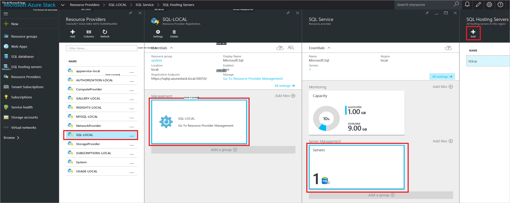

3. Remplir la forme avec les détails de connexion de votre instance de SQL Server. Par défaut, un SQL Server préconfiguré appelé « SQLRP » avec le nom d’utilisateur « sa » de l’administrateur et le mot de passe que vous avez appelé dans le paramètre « adminpassword » dans les paramètres de que JSON est en cours d’exécution sur l’ordinateur virtuel.

## Créer votre première base de données SQL pour tester votre déploiement

1. Se connecter au portail Azure pile POC en tant qu’administrateur du service.

2. Cliquez sur **Parcourir** &gt; **les bases de données SQL** &gt; **Ajouter**
  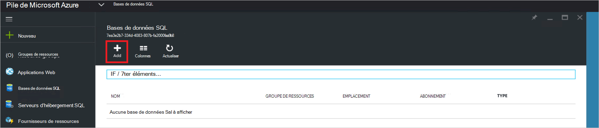

3. Remplissez le formulaire avec les détails de la base de données, y compris un **Nom de serveur**, la **Connexion d’Admin Server**et le **mot de passe** pour un nouveau *serveur virtuel* dans le **Nouveau serveur** lame.

    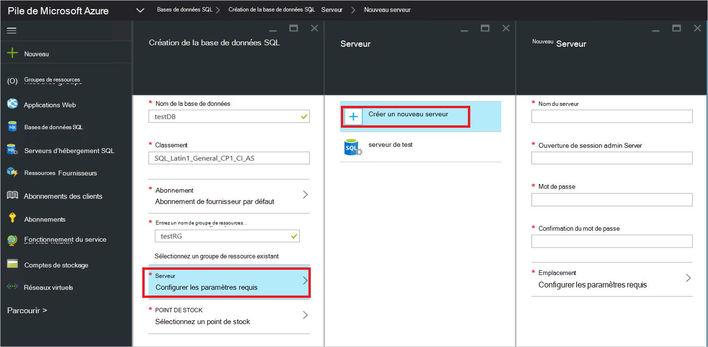

    Le serveur virtuel est une construction artificielle. Il ne correspond pas à la SQL Server lui-même mais à la place de manifestes par le nom d’utilisateur à l’intérieur de la chaîne de connexion, le fournisseur de ressources génère à la fin de ce processus. **Remarque le mot de passe que vous entrez séparément pour le serveur virtuel**. Le portail affiche jamais le mot de passe.

4. Vous êtes invité à choisir un niveau de tarification pour votre base de données.

    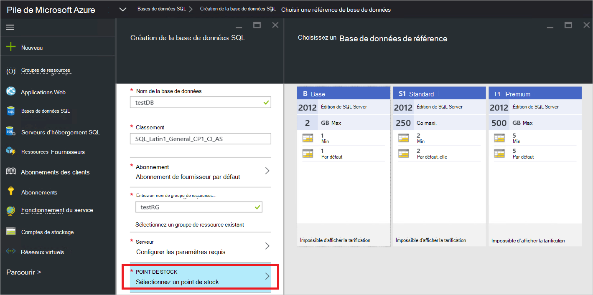

    Niveaux n’est pas implémentées dans cette version, mais leur consommation est suivie par le Gestionnaire de ressources Azure comme un moyen de présenter la différenciation, que vous pouvez créer dans l’application des quotas etc..

5. Envoyer le formulaire et attendre que le déploiement terminer.

6. De la lame qui en résulte, notez que le champ de la « Chaîne de connexion ». Vous pouvez utiliser cette chaîne dans toutes les applications nécessitant un accès SQL Server (par exemple, une application web) dans la pile d’Azure.

    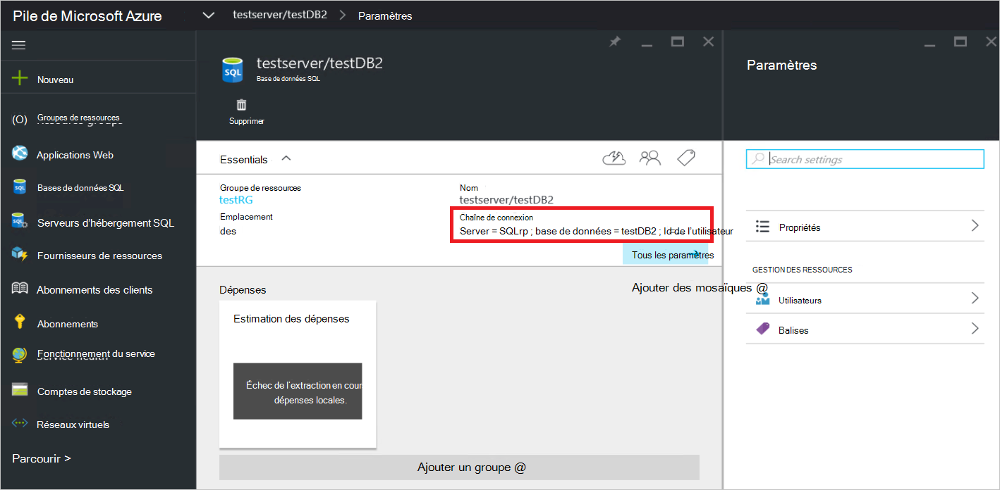

## Étapes suivantes

Essayez d’autres [services de PaaS](azure-stack-tools-paas-services.md) tels que le [fournisseur de ressources de serveur MySQL](azure-stack-mysql-rp-deploy-short.md) et le [fournisseur de ressources d’applications Web](azure-stack-webapps-deploy.md).
