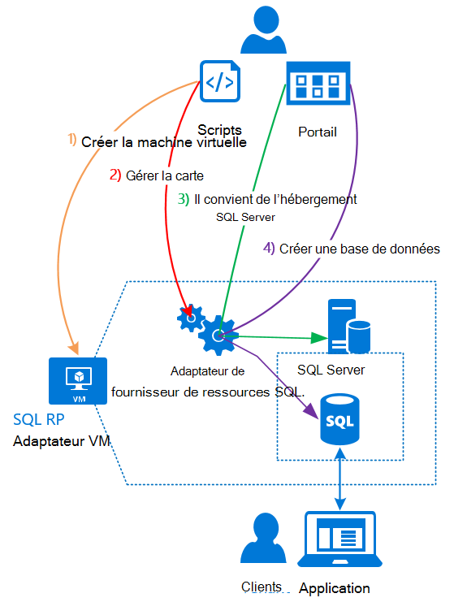

<properties
    pageTitle="À l’aide de bases de données SQL sur la pile d’Azure | Microsoft Azure"
    description="Découvrez comment vous pouvez déployer des bases de données SQL en tant que service sur la pile d’Azure et les étapes à suivre pour déployer la carte de fournisseur de ressources de SQL Server."
    services="azure-stack"
    documentationCenter=""
    authors="Dumagar"
    manager="byronr"
    editor=""/>

<tags
    ms.service="multiple"
    ms.workload="na"
    ms.tgt_pltfrm="na"
    ms.devlang="na"
    ms.topic="article"
    ms.date="09/26/2016"
    ms.author="dumagar"/>

# Utiliser les bases de données SQL Azure pile

> [AZURE.NOTE] Les informations suivantes ne s’applique qu’aux déploiements de TP1 de pile Azure.

Pour exposer des bases de données SQL en tant que service de pile d’Azure, utilisez l’adaptateur de fournisseur de ressources de SQL Server. Après avoir installé le fournisseur de ressources, vous et vos utilisateurs peuvent créer des bases de données pour les applications natives du nuage, site Web qui reposent sur SQL et charges de travail qui sont basés sur SQL sans avoir à configurer une machine virtuelle (VM) qui héberge SQL Server chaque fois.

Étant donné que le fournisseur de ressources n’a pas toutes les fonctionnalités de base de données de SQL Azure au cours de la preuve de concept (PoC), cet article commence par une vue d’ensemble de l’architecture de fournisseur de ressources. Vous obtenez une vue d’ensemble rapide de la procédure pour configurer le fournisseur de ressources, avec des liens vers les étapes plus détaillées de [déployer la carte de fournisseur de ressources de base de données SQL sur Azure pile VT](azure-stack-sql-rp-deploy-long.md).

## Architecture de carte de fournisseur de ressources de SQL Server
Le fournisseur de ressources n’offre pas la base de données des fonctions de gestion de base de données de SQL Azure. Par exemple, pools d’élastique de la base de données et la possibilité de composer haut et le bas des performances de la base de données à la volée ne sont pas disponibles. Toutefois, le fournisseur de ressources prend en charge le même créer, lecture, mise à jour et les opérations de suppression (CRUD) qui existe dans la base de données de SQL Azure.

Le fournisseur de ressources est constitué de trois composants :

- **Adaptateur de fournisseur de ressources SQL de la machine virtuelle**, qui englobe le processus de fournisseur de ressources et les serveurs qui hébergent SQL Server.
- **Le fournisseur de ressources lui-même**, qui traite les demandes de mise en service et expose des ressources de base de données.
- **Les serveurs qui hébergent SQL Server**, qui offrent une capacité de bases de données.

Le schéma conceptuel suivant montre ces composants et les étapes que vous faites défiler lorsque vous déployez le fournisseur de ressources, configurez un serveur qui héberge SQL Server et puis créez une base de données.

## Étapes à suivre pour déployer le fournisseur de ressources
Suivez ces étapes si vous êtes déjà familiarisé avec la pile d’Azure. Si vous souhaitez plus d’informations, suivez les liens de chaque section ou cliquez directement sur [l’adaptateur de fournisseur de ressources de base de données SQL sur Azure pile POC de déployer](azure-stack-sql-rp-deploy-long.md).

1.  Assurez-vous que vous avez terminé toutes les [configurer les étapes avant de déployer](azure-stack-sql-rp-deploy-long.md#set-up-steps-before-you-deploy) le fournisseur de ressources :

  - .NET framework 3.5 est déjà défini dans l’image de base Windows Server. (Si vous avez téléchargé les bits de la pile d’Azure après le 23 février 2016, vous pouvez ignorer cette étape.)
  - [Une version de PowerShell Azure qui est compatible avec la pile d’Azure est installée](http://aka.ms/azStackPsh).
  - Dans paramètres de sécurité Internet Explorer sur le ClientVM, [Internet Explorer, sécurité renforcée est désactivée et les cookies sont activés](azure-stack-sql-rp-deploy-long.md#Turn-off-IE-enhanced-security-and-enable-cookies).

2. [Téléchargez le fichier de fichiers binaires SQL Server RP](http://aka.ms/massqlrprfrsh) et l’extraire vers le ClientVM dans votre test de pile Azure.

3. [Exécuter des scripts et bootstrap.cmd](azure-stack-sql-rp-deploy-long.md#Bootstrap-the-resource-provider-deployment-PowerShell-and-Prepare-for-deployment).

    Un ensemble de scripts est regroupé par deux principaux onglets sont ouverts dans l’environnement de script intégré PowerShell (ISE). Exécuter tous les scripts chargés dans l’ordre, de gauche à droite dans chaque onglet.

    1. Exécuter des scripts dans l’onglet de **préparation** à partir de la gauche vers la droite pour :

        - Créer un certificat générique pour sécuriser les communications entre le fournisseur de ressources et le Gestionnaire de ressources Azure.
        - Télécharger les certificats et les autres artefacts à un compte de stockage pour pile d’Azure.
        - Publication des packages de la galerie afin que vous pouvez déployer SQL et les ressources par le biais de la galerie.

        > [AZURE.IMPORTANT] Si un des scripts se bloque sans raison apparente après avoir soumis votre locataire Azure Active Directory, vos paramètres de sécurité empêche peut-être une DLL qui est requis pour le déploiement à exécuter. Pour résoudre ce problème, recherchez les Microsoft.AzureStack.Deployment.Telemetry.Dll dans votre dossier de fournisseur de ressources dessus et cliquez sur **Propriétés**, puis vérifiez les **Débloquer** dans l’onglet **Général** .

    1. Exécuter des scripts dans l’onglet de **déployer** à partir de la gauche vers la droite pour :

        - [Déployer un ordinateur virtuel](azure-stack-sql-rp-deploy-long.md#Deploy-the-SQL-Server-Resource-Provider-VM) qui héberge votre fournisseur de ressources et de SQL Server. Ce script fait référence à un fichier de paramètres JSON, vous devez mettre à jour avec des valeurs avant d’exécuter le script.
        - [Enregistrer un enregistrement DNS local](azure-stack-sql-rp-deploy-long.md#Update-the-local-DNS) qui correspond à votre fournisseur de ressources machine virtuelle.
        - [Inscription de votre fournisseur de ressources](azure-stack-sql-rp-deploy-long.md#Register-the-SQL-RP-Resource-Provider) avec le Gestionnaire de ressources local Azure.

        > [AZURE.IMPORTANT] Tous les scripts supposent que l’image du système d’exploitation remplit les conditions préalables (.NET 3.5 est installé, JavaScript et des cookies sur le ClientVM et une version compatible de PowerShell Azure installé). Si vous obtenez des erreurs lorsque vous exécutez les scripts, vérifiez que vous les conditions préalables remplies.

6. [Se connecter à un serveur qui héberge SQL Server, le fournisseur de ressources](#Provide-capacity-to-your-SQL-Resource-Provider-by-connecting-it-to-a-hosting-SQL-server) dans le portail de pile d’Azure. Cliquez sur **Parcourir** &gt; **les fournisseurs de ressources** &gt; **SQLRP** &gt; **accéder à la gestion des ressources de fournisseur** &gt; **serveurs** &gt; **Ajouter**.

    Utilisez « sa » pour le nom d’utilisateur et le mot de passe que vous avez utilisé lorsque vous avez déployé l’ordinateur virtuel du fournisseur de ressources.

7. [Test de votre nouveau fournisseur de ressources de SQL Server](/azure-stack-sql-rp-deploy-long.md#create-your-first-sql-database-to-test-your-deployment), déployer une base de données SQL dans le portail de pile d’Azure. Cliquez sur **créer un** &gt; **Custom** &gt; **base de données de SQL Server**.

Il doit obtenir de votre fournisseur de ressources SQL Server des et en cours d’exécution dans environ 45 minutes (selon votre matériel).
