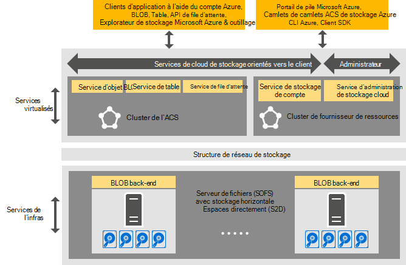

<properties
    pageTitle="Introduction au stockage Azure cohérentes | Microsoft Azure"
    description="En savoir plus sur le stockage Azure-cohérent"
    services="azure-stack"
    documentationCenter=""
    authors="AniAnirudh"
    manager="darmour"
    editor=""/>

<tags
    ms.service="azure-stack"
    ms.workload="na"
    ms.tgt_pltfrm="na"
    ms.devlang="na"
    ms.topic="get-started-article"
    ms.date="09/26/2016"
    ms.author="anirudha"/>

# Introduction au stockage Azure-cohérent
Stockage Azure-cohérente est un ensemble de services de cloud de Microsoft Azure pile stockage. Le stockage Azure cohérentes fournit des blob, table, file d’attente et des fonctionnalités de gestion de compte avec une sémantique cohérente-Azure. Il fournit également des fonctionnalités pour aider un administrateur de nuage à gérer les services de stockage. Cet article présente le stockage Azure cohérentes et explique comment les services en nuage stockage dans Azure pile probablement idéal pour compléter les riches [fonctionnalités de stockage définis par le logiciel dans Windows Server 2016](https://blogs.technet.microsoft.com/windowsserver/2016/04/14/ten-reasons-youll-love-windows-server-2016-5-software-defined-storage/).

Le stockage Azure cohérentes offre plusieurs catégories de fonctionnalités :

- **Objets BLOB**: page BLOB, bloquer les objets BLOB et ajouter des objets BLOB avec   [blob Azure cohérentes](https://msdn.microsoft.com/library/azure/dd179355.aspx#Anchor_1) 
   comportement

- **Tables**: les entités, les partitions et les autres propriétés de la table avec la   [table Azure cohérentes](https://msdn.microsoft.com/library/azure/dd179355.aspx#Anchor_3) 
   comportement

- **Files d’attente**: permanentes et fiables des messages et des files d’attente avec la   [file d’attente Azure cohérentes](https://msdn.microsoft.com/library/azure/dd179355.aspx#Anchor_2) 
   comportement

- **Comptes**: gestion des ressources de stockage compte avec   [compte Azure cohérentes](https://azure.microsoft.com/documentation/articles/storage-create-storage-account/) 
   comportement pour les comptes généraux de stockage mis en service par l’intermédiaire du [modèle de déploiement d’Azure le Gestionnaire de ressources](https://azure.microsoft.com/documentation/articles/resource-manager-deployment-model/)

- **Administration**: gestion des services de stockage interne de stockage orientés clients et cohérente à l’échelle Azure (abordées dans d’autres articles)

## Architecture de stockage Azure-cohérent

La figure 1. Stockage Azure cohérents : affichage de solutions

## Stockage Azure cohérentes virtualisé de clusters et les services

Dans l’architecture de stockage Azure cohérentes, tous les clients ou les services de stockage accessible à l’administrateur sont virtualisées. Autrement dit, ils s’exécutent dans service hautement disponible, gérés par un fournisseur de que machines virtuelles basées sur la fonctionnalité de [Hyper-V](https://technet.microsoft.com/library/dn765471.aspx) dans [Windows Server 2016](http://www.microsoft.com/server-cloud/products/windows-server-2016/).
Bien que les ordinateurs virtuels hautement disponibles basés sur la technologie de [Cluster de basculement Windows Server](https://technet.microsoft.com/library/dn765474.aspx) , les services de stockage virtualisée Azure cohérentes eux-mêmes sont des services de cluster invité, hautement disponibles basées sur la [technologie d’Azure Fabric de Service](http://azure.microsoft.com/campaigns/service-fabric/).

Stockage Azure cohérentes emploie deux clusters de tissu de Service dans un déploiement d’Azure pile.
Le service de fournisseur de ressources de stockage est déployé sur un cluster de Service Fabric (« cluster RP ») qui est également partagé par d’autres services de fournisseur de ressources de base. Le reste du stockage virtualisé des services de chemin de données--notamment le Blob, Table et file d’attente--les services sont hébergés sur un second cluster Service Fabric (« cluster stockage Azure cohérent »).

## Service d’objet BLOB et de stockage définis par le logiciel

Le Blob de fin de service précédent, d’autre part, s’exécute directement sur les nœuds de cluster de [Serveur de fichiers évolutif](https://technet.microsoft.com/library/hh831349.aspx) . Dans l’architecture de solution de pile d’Azure, le serveur de fichiers évolutif est basé sur les [Espaces de stockage Direct](https://technet.microsoft.com/library/mt126109.aspx)-cluster de basculement de base, de type shared-nothing. La figure 1 présente les principaux services de composant de stockage Azure cohérentes et leur modèle de déploiement distribué. Comme vous le voir dans le diagramme, stockage Azure cohérentes participe avec les fonctions existantes de stockage définis par le logiciel dans Windows Server 2016. Aucun matériel spécial est requis pour le stockage Azure cohérents au-delà de ces exigences de plate-forme Windows Server.

## Batterie de stockage

Ferme de stockage est l’ensemble de l’infrastructure de stockage, des ressources et services back-end qui offrent ensemble côté client et côté administrateur des services de stockage Azure-cohérente dans un déploiement d’Azure pile. En particulier, la batterie de serveurs de stockage comprend les éléments suivants :

- Matériel de stockage (par exemple, les nœuds de serveur de fichiers évolutif, disques)

- Ressources de fabric de stockage (par exemple, les partages SMB)

- Services de Fabric de Service liés au stockage (par exemple, point de terminaison service d’objet Blob sur le cluster de stockage Azure cohérents)

- Services liés au stockage qui s’exécutent sur les nœuds de serveur de fichiers évolutif (par exemple, le service de Blob)

## Scénarios d’utilisation de stockage IaaS et PaaS

BLOB de page stockage Azure cohérentes, comme dans Azure, fournit les disques virtuels de toute infrastructure en tant qu’une activité de service (IaaS) scénarios :

- Créer un ordinateur virtuel à l’aide du disque du système d’exploitation personnalisé dans un blob de page

- Créer un ordinateur virtuel à l’aide de l’image du système d’exploitation personnalisée dans un blob de page

- Créer un ordinateur virtuel à l’aide d’une image d’Azure Marketplace dans un objet blob de nouvelle page

- Créer un ordinateur virtuel à l’aide d’une disquette vierge dans un objet blob de nouvelle page

De même, pour la plate-forme sous la forme d’un scénario de service (PaaS), BLOB de bloc de stockage Azure cohérentes, ajouter des objets BLOB, les files d’attente, et tables fonctionnent comme ils le font dans Azure.

## Rôles d’utilisateur

Le stockage Azure-cohérente est un outil précieux pour les deux rôles d’utilisateur :

- Propriétaires d’applications, y compris les développeurs et informatiques de l’entreprise. Ils n’ont plus à maintenir ou à déployer les deux versions d’une application et de scripts qui accomplissent la même tâche dans un cloud public et un nuage hébergé/privée dans un centre de données. Stockage cohérentes Azure fournit des services de stockage via l’API REST, SDK, applet de commande et pile d’Azure portal.

- Fournisseurs de services, y compris les entreprises informatiques, déploiement et gérer les services de cloud de stockage partagé, basée sur Microsoft Azure pile.

## Étapes suivantes

- [Stockage azure cohérents : différences et considérations] (azure-pile-acs-différences-tp2.md)
