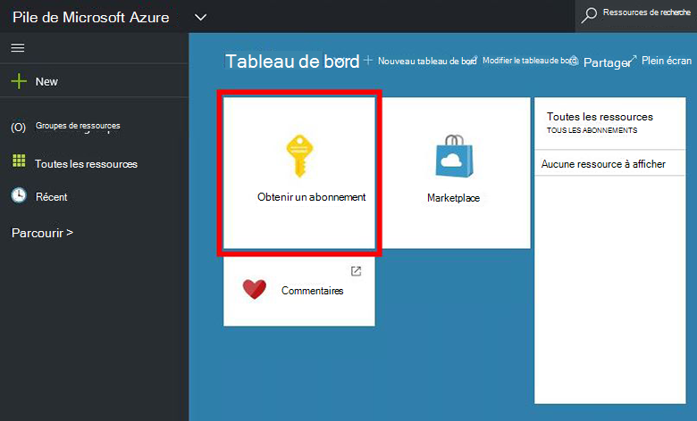
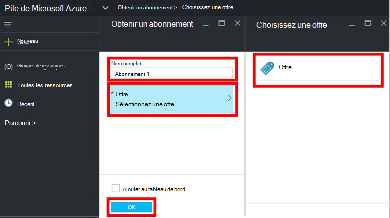
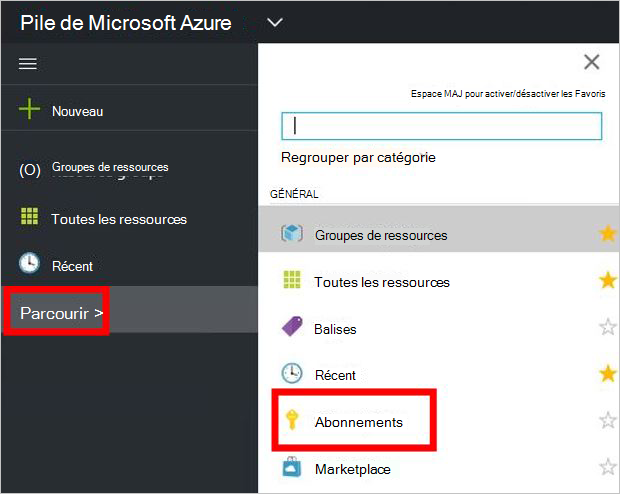

<properties
    pageTitle="S’abonner à l’offre et puis mettre en service un ordinateur virtuel dans la pile d’Azure (clients) | Microsoft Azure"
    description="Comme un client, comment s’abonner à l’offre et puis mettre en service un ordinateur virtuel dans la pile d’Azure."
    services="azure-stack"
    documentationCenter=""
    authors="ErikjeMS"
    manager="byronr"
    editor=""/>

<tags
    ms.service="azure-stack"
    ms.workload="na"
    ms.tgt_pltfrm="na"
    ms.devlang="na"
    ms.topic="get-started-article"
    ms.date="09/26/2016"
    ms.author="erikje"/>

# S’abonner à l’offre

Maintenant que vous avez [créé une offre](azure-stack-create-offer.md), testez que votre locataires peuvent créer un abonnement.

1.  Sur l’ordinateur de démonstration de pile Azure, connectez-vous au `https://portal.azurestack.local` comme [un client](azure-stack-connect-azure-stack.md#log-in-as-a-tenant) , puis cliquez sur **obtenir un abonnement**.

    

2.  Dans le champ **Nom complet** , tapez un nom pour votre abonnement et cliquez sur **offre**, cliquez sur une des offres de la lame de **Choisir une offre** , puis cliquez sur **créer**.

    

4.  Pour afficher l’abonnement que vous avez créé, cliquez sur **Parcourir**, cliquez sur **abonnements**, puis cliquez sur votre nouvel abonnement.  

    

Une fois que vous vous abonnez à une offre, actualiser le portail pour voir les services qui font partie de l’abonnement.

## Étapes suivantes

[Fourniture d’une machine virtuelle](azure-stack-provision-vm.md)
