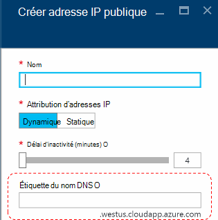
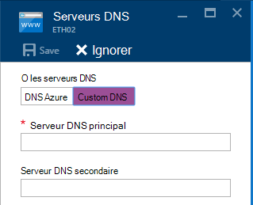
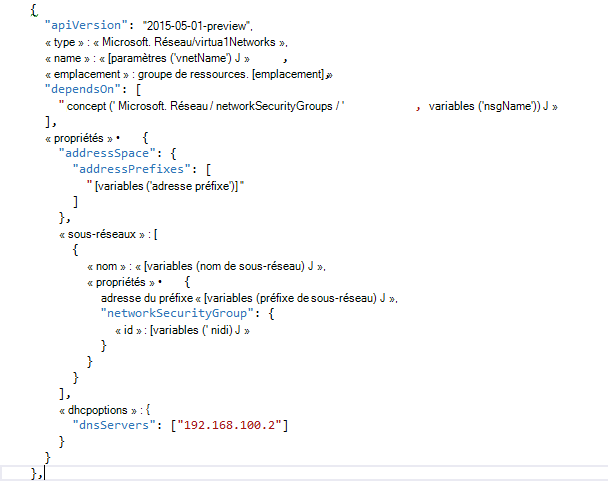

<properties
    pageTitle="Présentation de DNS dans le protocole TP2 pile Azure | Microsoft Azure"
    description="Présentation des nouvelles fonctionnalités et fonctions dans Azure pile TP2"
    services="azure-stack"
    documentationCenter=""
    authors="ScottNapolitan"
    manager="darmour"
    editor=""/>

<tags
    ms.service="azure-stack"
    ms.workload="na"
    ms.tgt_pltfrm="na"
    ms.devlang="na"
    ms.topic="get-started-article"
    ms.date="09/26/2016"
    ms.author="scottnap"/>

# Introduction les IDN pour pile d’Azure
================================

les IDN sont une nouvelle fonctionnalité de Technology Preview 2 pour pile Azure qui vous permet de résoudre les noms DNS externes (par exemple, http://www.bing.com).
Il vous permet également d’enregistrer des noms de réseau virtuel interne. En procédant ainsi, vous pouvez résoudre des ordinateurs virtuels sur le même réseau virtuel par nom plutôt que par adresse IP, sans avoir à fournir des entrées de serveur DNS personnalisées.

C’est quelque chose qui a toujours été là dans Azure, mais il est désormais disponible dans Windows Server 2016 et pile d’Azure, trop.

Que fait les IDN ?
------------------

Avec les IDN dans la pile d’Azure, vous obtenez les fonctionnalités suivantes, sans avoir à spécifier des entrées personnalisées de serveur DNS.

-   Partagé des services de résolution de noms DNS pour les charges de travail client.

-   Service DNS faisant autorité pour la résolution de noms et d’enregistrement DNS dans le réseau virtuel du client.

-   Service DNS récursives pour la résolution des noms Internet à partir de clients d’ordinateurs virtuels. Locataires n’avez plus besoin de spécifier des entrées personnalisées de DNS pour résoudre les noms Internet (par exemple, www.bing.com).

Vous pouvez toujours mettre votre propre DNS et utiliser des serveurs DNS personnalisées si vous le souhaitez. Mais maintenant, si vous souhaitez simplement être en mesure de résoudre des noms DNS Internet et être en mesure de se connecter à d’autres ordinateurs virtuels sur le même réseau virtuel, vous n’avez pas besoin de préciser, et qu’il fonctionnera.

Ce que ne fait pas les IDN
---------------------

Quelles sont les IDN ne vous autorisent pas à faire est de créer un enregistrement DNS pour un nom qui peut être résolu à partir de l’extérieur du réseau virtuel.

Dans Azure, vous avez la possibilité de spécifier un nom DNS qui peut être associé à une adresse IP publique. Vous pouvez choisir l’étiquette (préfixe), mais Azure choisit le suffixe, est basé sur la région dans lequel vous créez l’adresse IP publique.

Dans l’image ci-dessus, Azure créera un enregistrement « A » dans le système DNS pour le nom DNS spécifié dans la zone **westus.cloudapp.azure.com**. Le préfixe et le suffixe ensemble composent un domaine nom complet (FQDN) qui peut être résolu à partir de n’importe où sur l’Internet public.

Dans le protocole TP2, Azure pile prend uniquement en charge les IDN pour l’enregistrement de nom interne, afin qu’il ne peut pas effectuer les opérations suivantes.

-   Créer un enregistrement DNS dans une zone DNS existante est hébergé (par exemple, azurestack.local).

-   Créer une zone DNS (par exemple, Contoso.com).

-   Créer un enregistrement de votre propre zone DNS personnalisée.

-   Prend en charge l’achat de noms de domaine.

Modifications dans le système DNS à partir de la pile Azure TP1
-----------------------------------

Dans la version Technology Preview 1 (TP1) de la pile d’Azure, que vous deviez fournir des serveurs DNS personnalisés si vous souhaitez être en mesure de résoudre des hôtes par nom plutôt que par adresse IP. Cela signifie que si vous créez un réseau virtuel ou un ordinateur virtuel, que vous deviez fournir au moins une entrée de serveur DNS. Pour l’environnement POC de TP1, cela signifiait que la saisie de l’adresse IP du serveur DNS de Fabric VT, à savoir 192.168.200.2.

Si vous avez créé une machine virtuelle via le portail, vous deviez sélectionner **Personnalisée DNS** dans le réseau virtuel ou les paramètres de la carte ethernet.

Dans le protocole TP2, vous pouvez sélectionner DNS d’Azure et n’avez pas besoin de spécifier des entrées personnalisées de serveur DNS.

Si vous avez créé un ordinateur virtuel via un modèle avec votre propre image, vous devez ajouter la propriété **DHCPOptions** et le serveur DNS afin d’obtenir le DNS nom résolution fonctionne. L’image suivante montre à quoi cela ressemblait.

Dans le protocole TP2, vous n’avez plus besoin apporter ces modifications à vos modèles de machine virtuelle pour permettre à vos ordinateurs virtuels résoudre les noms Internet. Il doivent fonctionner directement.