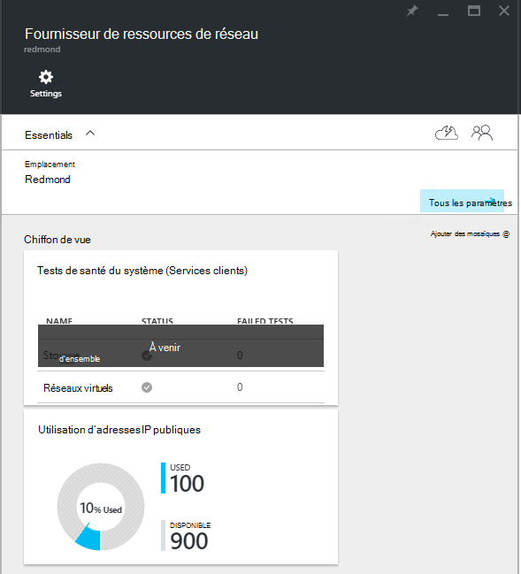
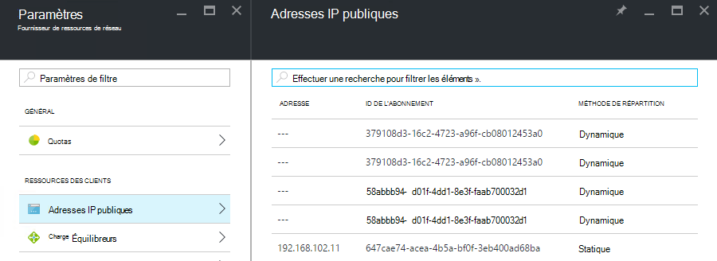

<properties
    pageTitle="Affichage consommation d’adresse IP publique dans le protocole TP2 | Microsoft Azure"
    description="Les administrateurs peuvent afficher la consommation d’adresses IP publiques dans une région"
    services="azure-stack"
    documentationCenter=""
    authors="ScottNapolitan"
    manager="darmour"
    editor=""/>

<tags
    ms.service="azure-stack"
    ms.workload="na"
    ms.tgt_pltfrm="na"
    ms.devlang="na"
    ms.topic="get-started-article"
    ms.date="09/26/2016"
    ms.author="scottnap"/>

# Afficher la consommation d’adresse IP publique dans le protocole TP2 pile Azure

En tant qu’un administrateur de service, vous pouvez afficher le nombre d’adresses IP publiques qui ont été allouées aux locataires, le nombre d’adresses IP publiques qui sont toujours disponibles pour l’allocation et le pourcentage d’adresses IP publiques qui ont été affectées à cet emplacement.

La mosaïque de **l’Utilisation d’adresses IP publiques** indique le nombre total d’adresses IP publiques qui ont été consommés dans tous les pools d’adresses IP publiques sur le fabric, si elles ont été utilisées pour client instances IaaS VM, services d’infrastructure de fabric ou ressources d’adresses IP publiques qui ont été explicitement créés par les locataires.

L’objectif de cette mosaïque est de donner aux administrateurs la pile d’Azure une idée du nombre total d’adresses IP publiques qui ont été consommés dans cet emplacement. Cela permet aux administrateurs de déterminer si elles sont en cours d’exécution faibles sur cette ressource.

Sur la lame de **paramètres** , l’élément de menu **Des adresses IP publiques** sous **ressources de clients** répertorie uniquement les adresses IP publiques qui ont été *explicitement créé par les locataires*. En tant que tel, le nombre **utilisé** (s) des adresses IP publiques sur l' **Utilisation d’adresses IP publiques** mosaïque est toujours différent de (supérieur à) le numéro de la mosaïque **d’Adresses IP publiques** sous **ressources de clients**.

## Permet d’afficher les informations d’utilisation adresse IP publiques

Pour afficher le nombre total d’adresses IP publiques qui ont été consommés dans la région :

1.  Dans le portail de la pile d’Azure, cliquez sur **Parcourir**et sélectionnez **Les fournisseurs de ressources**.

2.  Dans la liste des **Fournisseurs de ressources**, sélectionnez **Administrateur de fournisseur de ressources réseau**.

3.  Vous pouvez aussi cliquer sur **Parcourir | Emplacements** et sélectionnez l’emplacement que vous souhaitez afficher dans la liste. Puis, dans la fenêtre de **Fournisseurs de ressources** , sélectionnez **Administrateur de fournisseur de ressources réseau**.

4.  La lame de lancement de **Fournisseur de ressources de réseau** affiche la mosaïque de **l’Utilisation d’adresses IP publiques** dans la section **vue d’ensemble** .

Gardez à l’esprit que le nombre **utilisé** représente le numéro de l’adresse IP publique des adresses à partir de l’adresse IP publique de tous les pools dans cet emplacement sont affectés d’adresses. Le nombre **disponible** représente le numéro de l’adresse IP publique des adresses à partir de l’adresse IP publique de tous les adresses qui n’ont pas été affectés et est toujours disponibles. L’adresse le **% utilisé** nombre représente le nombre d’adresses utilisées ou affectées sous forme de pourcentage du nombre total d’IP public adresses IP publiques de tous les pools dans cet emplacement.

## Afficher les adresses IP publiques qui ont été créés par les abonnements des clients

Pour afficher une liste d’adresses IP publiques qui ont été explicitement créés par les abonnements des clients d’une région spécifique, atteindre la lame de **paramètres** de l' **Administrateur de fournisseur de ressources réseau**et sélectionnez **Les adresses IP publiques**.

Vous remarquerez peut-être que certaines adresses IP publiques qui ont été alloués dynamiquement apparaissent dans la liste mais ne disposent pas d’une adresse associée encore. C’est parce que la ressource d’adresse a encore été créée dans le fournisseur de ressources réseau, mais pas dans le contrôleur réseau.

Le contrôleur de réseau n’affecte pas une adresse à cette ressource jusqu'à ce qu’il est effectivement lié à une interface, une carte d’interface réseau (NIC), un équilibreur de charge ou une passerelle de réseau virtuel. Lorsque l’adresse IP publique est lié à une interface, le contrôleur réseau alloue une adresse IP, et il s’affiche dans le champ **adresse** .

## Afficher la public d’informations récapitulative table des adresses IP

Il existe un certain nombre de différents cas dans lesquels les adresses IP publiques sont affectés et qui déterminent si l’adresse s’affiche dans une liste ou d’une autre.

| **Cas d’affectation d’adresse IP publique** | **Apparaît dans le résumé de l’utilisation** | **S’affiche dans la liste d’adresses IP publique locataire** |
| ------------------------------------- | ----------------------------| ---------------------------------------------- |
| Adresse IP publique dynamique non encore affecté à un équilibreur de charge ou de la carte réseau (temporaire) | N° | Oui |
| Adresse IP publique et dynamique affectée à un équilibreur de charge ou de la carte réseau. | Oui | Oui |
| Adresse IP publique et statique attribuée à un équilibreur de charge ou de la carte réseau cliente. | Oui | Oui |
| Adresse IP publique et statique assignée à un point de terminaison du service infrastructure fabric. | Oui | N° |
| Adresse IP publique est implicitement créé pour les instances de IaaS VM et utilisées pour les sortant NAT sur le réseau virtuel. Ils sont créés en tâche de fond chaque fois qu’un client crée une instance de l’ordinateur virtuel afin que les ordinateurs virtuels peuvent envoyer des informations sur Internet. | Oui | N° |
