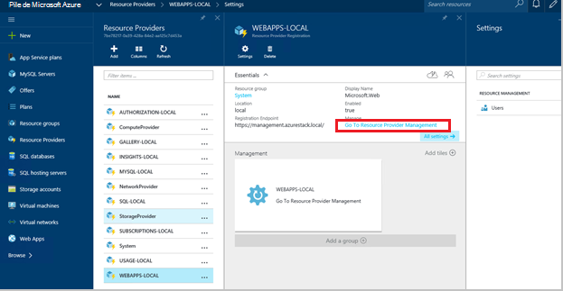
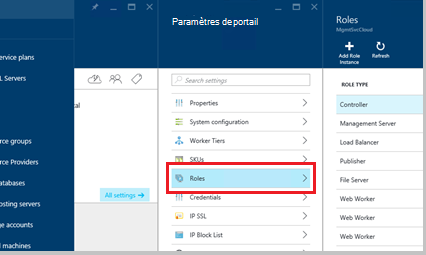
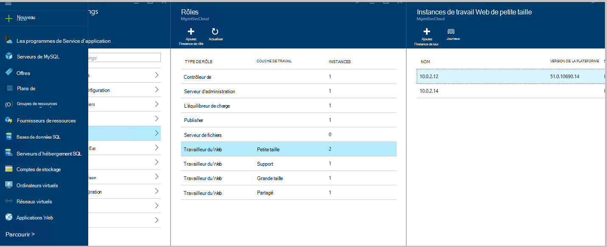
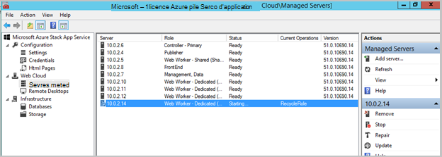
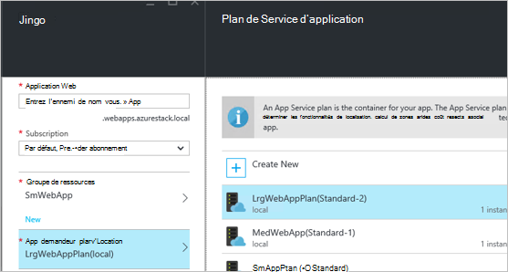
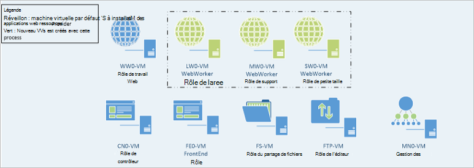

<properties
    pageTitle="Les applications Web ajouter d’autres Web rôles Worker | Microsoft Azure"
    description="Conseils détaillés sur la mise à l’échelle d’Azure pile Web App"
    services="azure-stack"
    documentationCenter=""
    authors="kathm"
    manager="slinehan"
    editor=""/>

<tags
    ms.service="azure-stack"
    ms.workload="app-service"
    ms.tgt_pltfrm="na"
    ms.devlang="na"
    ms.topic="article"
    ms.date="09/26/2016"
    ms.author="kathm"/>

#   <a name="web-apps-adding-more-web-worker-roles"></a>Web applications : Ajout de plusieurs rôles de travail web

> [AZURE.NOTE] Les informations suivantes ne s’applique qu’aux déploiements de TP1 de pile Azure.

Ce document fournit des instructions sur la façon de mettre à l’échelle des rôles de travail web Web Apps. Il contient les étapes de la création de rôles de travail web supplémentaires pour prendre en charge les offres d’applications web de toute taille.

Pile Azure prend en charge les déploiements d’application web libre et partagé. Pour ajouter d’autres types, vous devez ajouter d’autres rôles de travail web.

Si vous n’êtes pas sûr de ce qui a été déployé avec l’installation d’applications Web par défaut, vous pouvez consulter des informations supplémentaires [ici](azure-stack-webapps-overview.md).

Les étapes suivantes sont nécessaires pour les rôles de travail échelle web :

1.  [Créer un ordinateur virtuel](#step-1-create-a-new-vm-to-support-the-new-instance-size)

2.  [Configurer l’ordinateur virtuel](#step-2-configure-the-virtual-machine)

3.  [Configurer le rôle de collaborateur du web sur le portail de pile d’Azure](#step-3-configure-the-web-worker-role-in-the-azure-stack-portal)

4.  [Configurer les plans de service d’application](#step-4-configure-app-service-plans)

##<a name="step-1-create-a-new-vm-to-support-the-new-instance-size"></a>Étape 1 : Création d’une nouvelle machine virtuelle pour prendre en charge de la nouvelle taille d’instance

Créer un ordinateur virtuel, comme décrit dans [cet article](azure-stack-provision-vm.md), garantissant que les sélections suivantes sont effectuées :

 - Nom d’utilisateur et le mot de passe : fournir le même nom d’utilisateur et le mot de passe fourni lors de l’installation d’applications Web.

 - Abonnement : Utilisez l’abonnement de fournisseur par défaut.

 - Groupe de ressources : choisissez **Local AppService**.

> [AZURE.NOTE]Stocker les ordinateurs virtuels pour les rôles de travail dans le même groupe de ressources que les applications Web application est déployée à. (Cela est recommandé pour cette version).

##<a name="step-2-configure-the-virtual-machine"></a>Étape 2 : Configuration de la Machine virtuelle

Une fois le déploiement terminé, la configuration suivante est requise pour le rôle de travail web de prendre en charge :

1.  Ouvrez le Gestionnaire de serveur sur la machine hôte, puis cliquez sur **Outils** &gt; **Le gestionnaire HyperV**.

2.  Se connecter à l’aide du protocole RDP (Remote Desktop) pour le nouvel ordinateur virtuel que vous avez créé à l’étape 1. Le nom du serveur se trouve dans le volet Résumé lors de chaque machine virtuelle est activée.

3.  Ouvrez PowerShell en cliquant sur le bouton **Démarrer** , PowerShell en tapant. Bouton droit **PowerShell.exe**et sélectionnez **Exécuter en tant qu’administrateur** pour ouvrir PowerShell en mode administrateur.

4.  Copiez-collez chaque des commandes suivantes (une à la fois) dans la fenêtre PowerShell, puis appuyez sur entrer :

    ```netsh advfirewall firewall set rule group="File and Printer Sharing" new enable=Yes```
    ```netsh advfirewall firewall set rule group="Windows Management Instrumentation (WMI)" new enable=yes```
    ```reg add HKLM\\SOFTWARE\\Microsoft\\Windows\\CurrentVersion\\Policies\\system /v LocalAccountTokenFilterPolicy /t REG\_DWORD /d 1 /f```

5.  Redémarrez l’ordinateur virtuel.

> [AZURE.NOTE]Remarque : Il s’agit des exigences minimales pour les applications Web. Ils sont les paramètres par défaut de l’image Windows 2012 R2 inclus dans la pile d’Azure. Les instructions ont été fournies pour une référence future et pour ceux qui utilisent une autre image.

##<a name="step-3-configure-the-web-worker-role-in-the-azure-stack-portal"></a>Étape 3 : Configurer le rôle de collaborateur du web sur le portail de pile d’Azure

1.  Ouvrez le portail en tant que l’administrateur de service sur **ClientVM**.

2.  Accédez à des **fournisseurs de ressources** &gt; **Locales de WEBAPP**.

    
 
3.  Cliquez sur **Gestion des ressources de fournisseur**.

4.  Cliquez sur **rôles**.

    
 
5.  Cliquez sur **Ajouter une Instance de rôle**.

6.  Cliquez sur la **couche** que vous souhaitez déployer la nouvelle instance (petite, moyenne, grande ou partagé).

    
 
7.  Configurer les éléments suivants :
 - Nom_serveur : Fournir l’adresse IP du serveur que vous avez créé précédemment (dans la section 1).
 - Type de rôle : Travail de Web.
 - Couche de travail : Correspondances de niveau taille sélectionnée.

8. Cliquez sur **OK.**

9. Se connecter à la machine virtuelle de la CN0 et ouvrir la console **MMC de gestion de Cloud Web**.

10. Accédez au **Web nuage** &gt; **serveurs gérés**.

11. Cliquez sur le nom du serveur que vous venez de déployer. Passez en revue la colonne État et attendre avant de passer à l’étape suivante jusqu'à ce que l’état est « Prêt ».

    

##<a name="step-4-configure-app-service-plans"></a>Étape 4 : Configurer les plans de service d’application

> [AZURE.NOTE]Dans la version actuelle de Web Apps, les plans de service d’application doivent être stockés dans les groupes de ressources distincts. Créer un groupe de ressources pour chaque taille de web app et placez les plans de l’application dans leurs groupes de ressources approprié.

1.  Connectez-vous au portail sur la ClientVM.

2.  Naviguez jusqu’au **Nouveau** &gt; **Web et Mobile**.

3.  Sélectionnez l’application web que vous souhaitez déployer.

4.  Fournir des informations sur l’application web, puis sélectionnez **AppService Plan / emplacement**.

-   Cliquez sur **Créer nouveau**.

-   Créer votre plan, sélectionnez le niveau de tarification correspondant pour le plan.

> [AZURE.NOTE]Vous pouvez créer plusieurs plans sur cette blade. Avant de déployer, cependant, assurez-vous que vous avez sélectionné le programme approprié.

Vous trouverez ci-dessous un exemple de plusieurs plans disponibles :    

##<a name="final-web-app-service-vm-configuration"></a>Configuration de machine virtuelle finale du service Web App

L’image ci-dessous fournit une vue de l’environnement, une fois que vous avez mis à l’échelle les rôles de travail web. Les éléments verts représentent les nouvelles additions du rôle.
    
