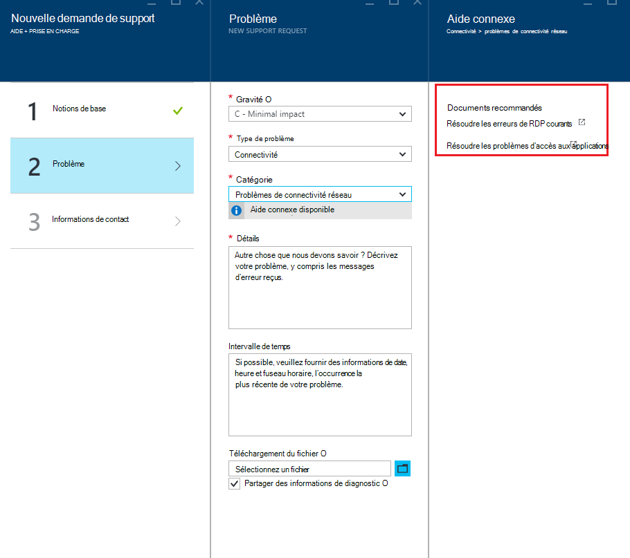

<properties
     pageTitle="Comment faire pour créer une demande de prise en charge Azure | Microsoft Azure"
     description="Comment faire pour créer une demande de prise en charge Azure."
     services="Azure Supportability"
     documentationCenter=""
     authors="ganganarayanan"
     manager="scotthit"
     editor=""/>

<tags
     ms.service="azure-supportability"
     ms.workload="na"
     ms.tgt_pltfrm="na"
     ms.devlang="na"
     ms.topic="article"
     ms.date="10/25/2016"
     ms.author="gangan"/>

# Comment faire pour créer une demande de prise en charge Azure

## Résumé
Les clients Azure peuvent créer et gérer les demandes de prise en charge dans le portail Azure, [https://portal.azure.com](https://portal.azure.com).
>[AZURE.NOTE] Le portail Azure pour l’Allemagne est [https://portal.microsoftazure.de](https://portal.microsoftazure.de) et celui du portail d’administration d’Azure est [https://portal.azure.us](https://portal.azure.us).

En fonction des commentaires des clients, nous avons mis à jour l’expérience de demande de prise en charge de se concentrer sur trois objectifs principaux :

- **Et rationalisée**: réduire les clics et les lames pour simplifier le processus de soumission d’une demande de support.
- **Intégré**: lorsque vous effectuez un dépannage un problème avec une ressource d’Azure, il doit être facile à ouvrir une demande de prise en charge pour cette ressource sans changer de contexte.
- **Efficacité**: collecter les informations clées de votre ingénieur de support devra résoudre votre problème de manière efficace.

## Mise en route
Vous pouvez créer une demande de support à partir du menu de navigation supérieur ou directement à partir d’une lame de ressource.

**Dans la barre de navigation supérieure**

**À partir d’une lame de ressource**

## Notions de base
La première étape du processus de demande de support recueille des informations sur votre problème et votre plan de prise en charge.

Prenons un exemple : vous êtes confrontés à des difficultés techniques avec votre machine virtuelle et que vous suspectez un problème de connectivité réseau.
Sélectionnez le service (« ordinateur virtuel exécutant Windows ») et la ressource (le nom de votre machine virtuelle) à la première étape de l’Assistant démarre le processus d’obtention d’aide pour ce problème.

>[AZURE.NOTE] Azure fournit une assistance illimitée pour la gestion des abonnements (choses telles que la facturation, les ajustements de quota et les transferts de comptes). Pour le support technique, vous avez besoin d’un plan de prise en charge. [En savoir plus sur les programmes de support technique](https://azure.microsoft.com/support/plans).

## Problème
La deuxième étape de l’Assistant collecte des détails supplémentaires sur le problème. Fournissant des informations précises dans cette étape permet d’acheminer votre cas à l’ingénieur de support meilleur pour le problème et pour commencer à diagnostiquer le problème dès que possible.

Poursuivre avec l’exemple de connexion d’ordinateur virtuel ci-dessus, à remplir ce formulaire pour indiquer un problème de connectivité réseau, et vous fournit plus de détails sur le problème, notamment le temps approximatif que lorsque vous avez rencontré le problème.

## Aide connexe
Pour certains problèmes, nous proposons des liens d’aide connexe pour résoudre le problème. Si les documents recommandés ne résout pas le problème, vous pouvez continuer à travers le processus pour créer une demande de prise en charge.

## Informations de contact
La dernière étape de l’Assistant confirme vos informations de contact pour savoir comment vous joindre.

Selon la gravité du problème, vous pouvez être invité à indiquer si vous souhaitez que nous vous contacter pendant les heures de bureau ou si vous préférez une réponse 24 x 7, ce qui signifie que nous pouvons vous contacter à tout moment.

## Gérer les demandes de prise en charge
Après avoir créé la demande de prise en charge, vous pouvez afficher les détails dans la page **Gérer les demandes de prise en charge** .

**Dans la barre de navigation supérieure**

Dans la page **Gérer les demandes de support** , vous pouvez afficher toutes les demandes de prise en charge et leur état.

Sélectionnez la demande de prise en charge pour afficher les détails, y compris la gravité et la durée prévue, qu'il faudra pour un ingénieur de support répondre.

Si vous souhaitez modifier la gravité de la demande, cliquez sur la mosaïque de **l’impact sur l’activité** . Dans l’exemple précédent, la demande est actuellement la valeur c de gravité.

Cliquez sur la mosaïque affiche la liste des niveaux de gravité que vous pouvez affecter à une demande de prise en charge ouverte.

>[AZURE.NOTE] Le niveau de gravité maximale dépend de votre plan de prise en charge. [En savoir plus sur les programmes de support technique](https://azure.microsoft.com/support/plans).

## Commentaires
Nous sommes toujours ouverts aux commentaires et suggestions ! Veuillez nous envoyer vos [suggestions](https://feedback.azure.com/forums/266794-support-feedback). En outre, vous pouvez engager avec nous via [Twitter](https://twitter.com/azuresupport) ou les [forums MSDN](https://social.msdn.microsoft.com/Forums/azure).

## Pour en savoir plus
[Forum aux questions sur la prise en charge Azure](https://azure.microsoft.com/support/faq)
