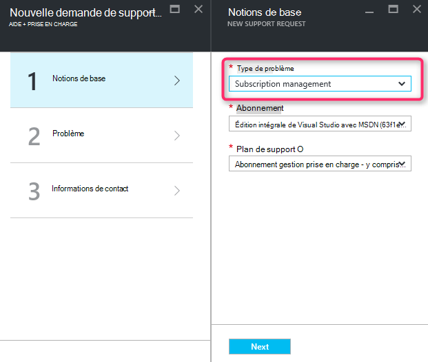
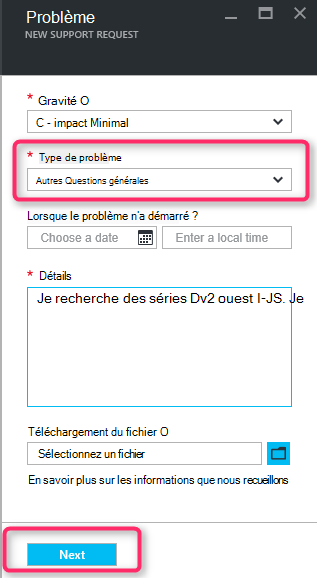
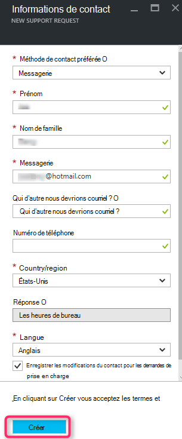

<properties
     pageTitle="Série SKU indisponible | Microsoft Azure"
     description="Certaines séries SKU ne sont pas disponibles pour l’abonnement sélectionné pour cette zone."
     services="Azure Supportability"
     documentationCenter=""
     authors="ganganarayanan"
     manager="scotthit"
     editor=""/>

<tags
     ms.service="azure-supportability"
     ms.workload="na"
     ms.tgt_pltfrm="na"
     ms.devlang="na"
     ms.topic="article"
     ms.date="08/12/2016"
     ms.author="gangan"/>

# Série de référence non disponible

Dans certaines régions, certains points de stock ne sont pas automatiquement disponibles sur les nouveaux abonnements.  Cela peut se produire lorsque refuse de référence [SKU plus puissants est introduits dans une région](https://azure.microsoft.com/updates/announcing-new-dv2-series-virtual-machine-size/) et la popularité de l’héritage.
Le message «*certains SKU série ne est pas disponibles pour l’abonnement sélectionné pour cette zone*» s’affiche lors de la création d’une demande de support pour augmenter le quota de base de calcul.

Vous pouvez consulter la disponibilité de référence sur la page [des services Azure par région](https://azure.microsoft.com/regions/#services) . 

Pour demander l’accès à un point de stock qui a été restreint à partir de votre abonnement, créez une demande de prise en charge de « Gestion de l’abonnement ».

- Dans la page des notions de base, sélectionnez le type de problème en tant que « Gestion de l’abonnement » et cliquez sur « Suivant ».

- Sur la page du problème, sélectionnez le type de problème en tant que « Autres questions générales » et entrez la région exacte et vous ne voyez pas de référence.
Cela permet d’accélérer le processus de prise en charge.

- Sur la page d’informations de Contact, entrez vos coordonnées et cliquez sur « Créer ».

## Commentaires
Nous sommes toujours ouverts aux commentaires et suggestions ! Envoyez-nous vos [suggestions](https://feedback.azure.com/forums/266794-support-feedback). En outre, vous pouvez engager avec nous via [Twitter](https://twitter.com/azuresupport) ou les [forums MSDN](https://social.msdn.microsoft.com/Forums/azure).

## Pour en savoir plus
[Forum aux questions sur la prise en charge Azure](https://azure.microsoft.com/support/faq)
