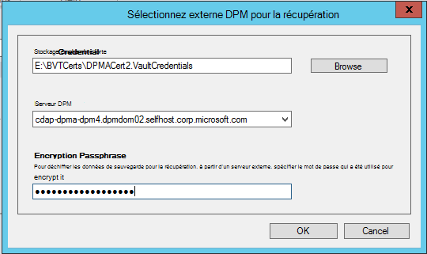

<properties
    pageTitle="Récupération de données à partir d’un autre serveur DPM dans le coffre-fort de sauvegarde | Microsoft Azure"
    description="Récupérer les données que vous avez protégé un coffre-fort Azure sauvegarde à partir de n’importe quel serveur DPM enregistré pour ce coffre-fort."
    services="backup"
    documentationCenter=""
    authors="nkolli1"
    manager="shreeshd"
    editor=""/>

<tags
    ms.service="backup"
    ms.workload="storage-backup-recovery"
    ms.tgt_pltfrm="na"
    ms.devlang="na"
    ms.topic="article"
    ms.date="08/08/2016"
    ms.author="giridham;jimpark;trinadhk;markgal"/>

# Récupération de données à partir d’un autre serveur DPM dans le coffre-fort de sauvegarde
Vous pouvez maintenant récupérer les données que vous avez protégé un coffre-fort Azure sauvegarde à partir de n’importe quel serveur DPM enregistré pour ce coffre-fort. Suivez donc est totalement intégré à la console d’administration DPM et est similaire aux autres flux de travail de récupération.

Pour récupérer des données à partir d’un autre serveur DPM dans le coffre-fort de sauvegarde, vous devez [Exclusion UR7 de System Center Data Protection Manager](https://support.microsoft.com/en-us/kb/3065246) et l' [agent de sauvegarde Azure plus récente](http://aka.ms/azurebackup_agent).

## Récupérer des données à partir d’un autre serveur DPM
Pour restaurer des données à partir d’un autre serveur DPM :

1. Sous l’onglet **récupération** de la console d’administration DPM, cliquez sur **« Ajouter externe DPM »** (en haut à gauche de l’écran).

    

2. Télécharger les nouvelles **informations d’identification de la chambre forte** de la chambre forte associée avec le **serveur DPM** , dans lequel les données sont restaurées, cliquez sur le serveur DPM à partir de la liste des serveurs DPM enregistrés avec la sauvegarde coffre-fort et fournir le **mot de passe de chiffrement** associé avec le serveur DPM sont en cours de récupération dont les données.

    

    >[AZURE.NOTE] Uniquement les serveurs DPM associés le coffre-fort d’enregistrement même peuvent récupérer des données de l’autre.

    Une fois que le serveur DPM externe est ajouté avec succès, vous pouvez parcourir les données de serveur externe de DPM et local serveur DPM à partir de l’onglet **récupération** .

3. Parcourir la liste des serveurs de production protégé par le serveur DPM externe disponibles et sélectionnez la source de données appropriée.

    

4. Sélectionnez **le mois et l’année** à partir des **points de récupération** liste déroulante, sélectionnez la **date de reprise** pour lorsque le point de récupération a été créé et sélectionnez le **temps de récupération**.

    Une liste de fichiers et de dossiers s’affiche dans le volet inférieur, qui peut être parcouru et restauré à n’importe quel emplacement.

    

5. Cliquez avec le bouton droit sur l’élément approprié et cliquez sur **récupérer**.

    

6. Passez en revue la **restauration de sélection**. Vérifiez les données et heure de la copie de sauvegarde en cours de restauration, ainsi que la source à partir duquel la copie de sauvegarde a été créée. Si la sélection est incorrecte, cliquez sur **Annuler** pour revenir à l’onglet récupération pour sélectionner le point de restauration approprié. Si la sélection est correcte, cliquez sur **suivant**.

    

7. Sélectionnez **récupérer à un autre emplacement**. **Accédez** à l’emplacement correct pour la récupération.

    

8. Choisissez l’option liée à **créer une copie**, les **Ignorer**ou les **Remplacer**.
    - **Créer une copie** va créer une copie du fichier en cas de collision de nom.
    - **Ignorer** ignore la reprise en cas de collision de nom.
    - **Remplacer** va remplacer la copie existante à l’emplacement spécifié dans le cas d’une collision de nom.

    Choisissez l’option appropriée pour **restaurer la sécurité**. Vous pouvez appliquer les paramètres de sécurité de l’ordinateur de destination dans laquelle les données sont restaurées ou les paramètres de sécurité qui étaient applicables au produit à la fois que le point de récupération a été créé.

    Déterminez si une **Notification** est envoyée une fois la restauration terminée avec succès.

    

9. L’écran de **Résumé** répertorie les options choisies pour l’instant. Une fois que vous cliquez sur **« Restaurer »**, les données seront récupérées à l’emplacement approprié sur site.

    

    >[AZURE.NOTE] La tâche de récupération peut être surveillée dans l’onglet **analyse** du serveur DPM.

    

10. Vous pouvez cliquer sur **Effacer DPM externe** sous l’onglet **récupération** du serveur DPM pour supprimer la vue du serveur DPM externe.

    

## Dépannage des Messages d’erreur
|N° |  Message d’erreur | Étapes de dépannage |
| :-------------: |:-------------| :-----|
|1.|        Ce serveur n’est pas enregistré dans le coffre-fort spécifié par les informations d’identification de la chambre forte.|  **Cause :** Cette erreur se produit lorsque le fichier d’informations d’identification de coffre-fort sélectionné n’appartient pas à la sauvegarde coffre-fort associé au serveur DPM sur lequel la récupération est tentée.   **Résolution :** Téléchargez le fichier d’informations d’identification de coffre-fort à partir de la sauvegarde coffre-fort dans lequel le serveur DPM est inscrite.|
|2.|        Les données récupérables ne seront pas disponibles ou le serveur sélectionné n’est pas un serveur DPM.|   **Cause :** Il n’y qu'aucuns autres serveurs DPM avec Exclusion UR7 de DPM 2012 R2 n’inscrit dans le coffre-fort de sauvegarde, ou les serveurs DPM, à l’exclusion de UR7 DPM 2012 R2 n’ont pas encore téléchargé les métadonnées, ou le serveur sélectionné n’est pas un serveur DPM (également appelé Windows Server ou Client Windows).   **Résolution :** S’il existe des autres serveurs DPM inscrits dans le coffre-fort de sauvegarde, assurer l’exclusion de UR7 SCDPM 2012 R2 et Azure de dernière sauvegarde l’agent sont installés.  S’il existe des autres serveurs DPM inscrits dans le coffre-fort de sauvegarde avec Exclusion UR7 de DPM 2012 R2, attendre un jour après l’installation de l’exclusion de UR7 pour démarrer le processus de récupération. La tâche nocturne pour télécharger les métadonnées de toutes les sauvegardes précédemment protégés vers le cloud. Les données seront disponibles pour la restauration.|
|3.|        Aucun autre serveur DPM n’est enregistré pour ce coffre-fort.|   **Cause :** Il n’y a aucun autres serveurs DPM avec Exclusion UR7 de DPM 2012 R2 ou version ultérieure qui sont enregistrés dans un coffre-fort à partir de laquelle la récupération est effectuée. **Résolution :** S’il existe des autres serveurs DPM inscrits dans le coffre-fort de sauvegarde, assurer l’exclusion de UR7 SCDPM 2012 R2 et Azure de dernière sauvegarde l’agent sont installés. S’il existe des autres serveurs DPM inscrits dans le coffre-fort de sauvegarde avec Exclusion UR7 de DPM 2012 R2, attendre un jour après l’installation de l’exclusion de UR7 pour démarrer le processus de récupération. La tâche nocturne pour télécharger les métadonnées de toutes les sauvegardes précédemment protégés vers le cloud. Les données seront disponibles pour la restauration.|
|4.|        Le cryptage de mot de passe fourni ne correspond pas au mot de passe associé au serveur suivant :**<server name>**|  **Cause :** Le cryptage de mot de passe utilisé dans le processus de cryptage des données à partir des données du serveur DPM sont en cours de restauration ne correspond pas à la phrase de passe de cryptage fourni. L’agent ne peut pas décrypter les données. Par conséquent, la restauration échoue. **Résolution :** Fournissez la phrase secrète de même chiffrement exact associée au serveur DPM dont les données sont restaurées.|

## Questions fréquemment posées :
1. **Pourquoi ne puis-je pas ajouter un serveur DPM externe à partir d’un autre serveur DPM après avoir installé l’exclusion UR7 et dernière Azure l’agent Backup ?**

    A) pour les serveurs DPM existants avec des sources de données protégées (en utilisant une mise à jour cumulative antérieure à la mise à jour de correctif cumulatif 7) vers le nuage, vous devez attendre au moins un jour après l’installation de l’exclusion UR7 et dernière Azure sauvegarde l’agent pour démarrer le *serveur ajouter de DPM externe*. Il est nécessaire de télécharger les métadonnées des groupes de protection DPM sur Azure. Cela se produit la première fois par le biais de nuit.

2. **Quelle est la version minimale de l’agent de sauvegarde d’Azure nécessaire ?**

    A) la version minimale de l’agent de sauvegarde Azure pour activer cette fonctionnalité est 2.0.8719.0.  Version de l’agent de sauvegarde Azure peut être vérifiée en accédant au panneau **>** tous les éléments **>** programmes et fonctionnalités **>** Agent de Services de récupération de Microsoft Azure. Si la version est inférieure à 2.0.8719.0, téléchargez [dernier agent de sauvegarde d’Azure](https://go.microsoft.com/fwLink/?LinkID=288905) et installer.

    

## Étapes suivantes :
• [Forum aux questions de sauvegarde azure](backup-azure-backup-faq.md)
