<properties
    pageTitle="Restaurer des ordinateurs virtuels à partir de la sauvegarde à l’aide du portail Azure | Microsoft Azure"
    description="Restauration d’une machine virtuelle Azure à partir d’un point de récupération à l’aide du portail Azure"
    services="backup"
    documentationCenter=""
    authors="markgalioto"
    manager="cfreeman"
    editor=""
    keywords="restaurer la sauvegarde ; Comment faire pour restaurer ; point de récupération ;"/>

<tags
    ms.service="backup"
    ms.workload="storage-backup-recovery"
    ms.tgt_pltfrm="na"
    ms.devlang="na"
    ms.topic="article"
    ms.date="08/10/2016"
    ms.author="trinadhk; jimpark;"/>

# Azure portal permet de restaurer des machines virtuelles

> [AZURE.SELECTOR]
- [Restaurer des ordinateurs virtuels dans le portail de classique](backup-azure-restore-vms.md)
- [Restaurer des ordinateurs virtuels dans Azure portal](backup-azure-arm-restore-vms.md)

Protégez vos données en prenant des instantanés de vos données à des intervalles définis. Ces instantanés sont appelés des points de récupération, et ils sont stockés dans les coffres-forts des services de récupération. Si ou lorsqu’il est nécessaire de réparer ou de reconstruire une machine virtuelle, vous pouvez restaurer l’ordinateur virtuel à partir d’un des points de récupération enregistrés. Lorsque vous restaurez un point de récupération, vous renvoyer ou restaurer l’ordinateur virtuel à l’état lorsque le point de récupération a été pris. Cet article explique comment restaurer un ordinateur virtuel.

> [AZURE.NOTE] Azure dispose de deux modèles de déploiement pour la création et l’utilisation des ressources : [le Gestionnaire de ressources et classique](../resource-manager-deployment-model.md). Cet article fournit les informations et les procédures de restauration d’ordinateurs virtuels déployés à l’aide du modèle de gestionnaire de ressources.

## Restaurer un point de récupération

1. Connectez-vous au [portail Azure](http://portal.azure.com/)

2. Dans le menu Azure, cliquez sur **Parcourir** , puis dans la liste des services, tapez **Services de récupération**. La liste des services s’adapte à ce que vous tapez. Lorsque vous consultez les **Services de récupération des coffres-forts**, sélectionnez-le.

    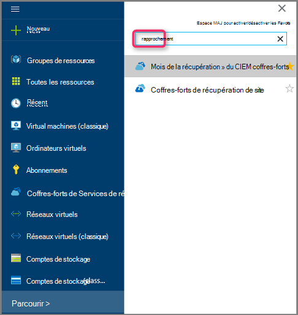

    La liste des coffres-forts dans l’abonnement s’affiche.

    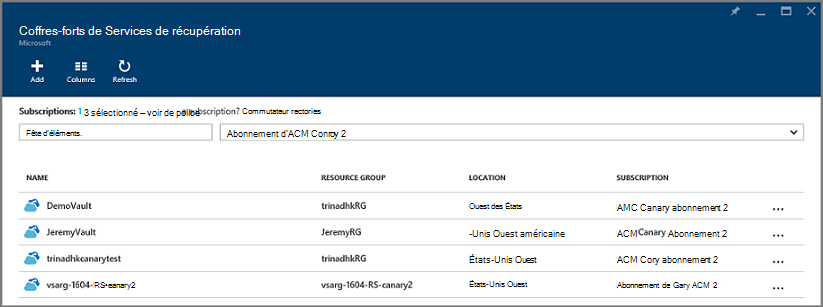

3. Dans la liste, sélectionnez le coffre-fort associé à la machine virtuelle que vous souhaitez restaurer. Lorsque vous cliquez sur le coffre, son tableau de bord s’ouvre.

    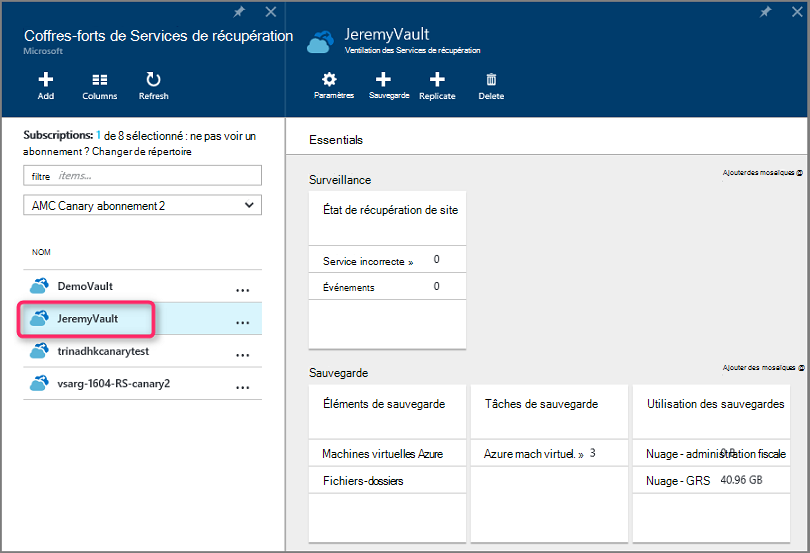

4. Maintenant que vous êtes dans le tableau de bord de coffre-fort. Sur les **Éléments de sauvegarde** en mosaïque, cliquez sur **ordinateurs virtuels Azure** pour afficher les ordinateurs virtuels associés à la chambre forte.

    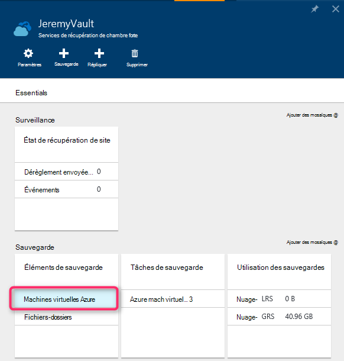

    La blade **d’Éléments de sauvegarde** s’ouvre et affiche la liste des machines virtuelles Azure.

    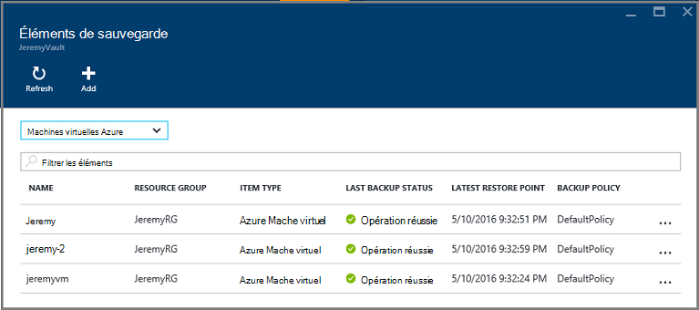

5. Dans la liste, sélectionnez une machine virtuelle pour ouvrir le tableau de bord. Le tableau de bord de machine virtuelle s’ouvre à la zone de surveillance, qui contient de la mosaïque de points de restauration.

    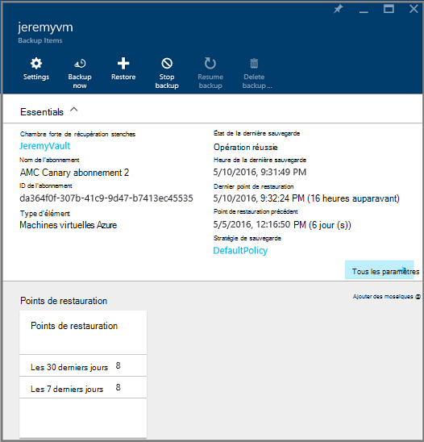

6. Dans le menu Tableau de bord de la machine virtuelle, cliquez sur **restaurer**

    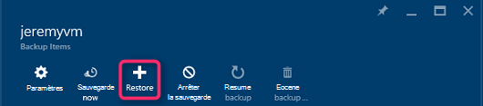

    La lame de restauration s’ouvre.

    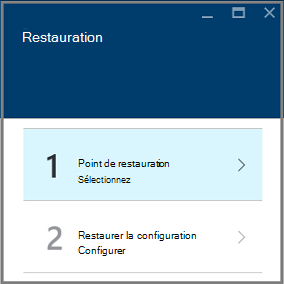

7. Sur la lame de **restauration** , cliquez sur le **point de restauration** pour ouvrir la lame **Sélectionnez Restaurer un point** .

    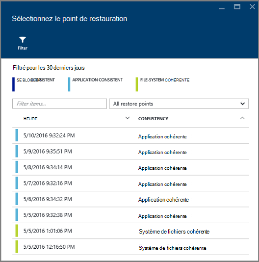

    Par défaut, la boîte de dialogue affiche tous les points de restauration depuis les 30 derniers jours. Utilisez le **filtre** pour modifier la plage de temps des points de restauration s’affiche. Par défaut, de la cohérence de tous les points de restauration sont affichés. Modifier le filtre de **restaurer tous les points** pour sélectionner une cohérence spécifique de points de restauration. Pour plus d’informations sur chaque type de restauration, reportez-vous à l’explication de [la cohérence des données](./backup-azure-vms-introduction.md#data-consistency).  
    - Le choix de **la cohérence du point de restauration** à partir de cette liste :
        - Blocage des points de restauration cohérents,
        - Points de restauration cohérentes d’application,
        - Les points de restauration cohérente de système de fichiers
        - Tous les points de restauration.  

8. Choisissez un point de restauration, puis cliquez sur **OK**.

    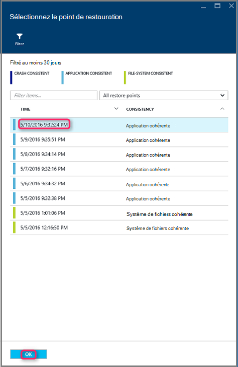

    La lame de **restauration** indique le point de restauration est défini.

    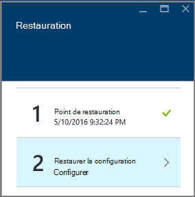

9. Sur la lame de **restaurer** , **restaurer la configuration** s’ouvre automatiquement une fois que la valeur de point de restauration.

    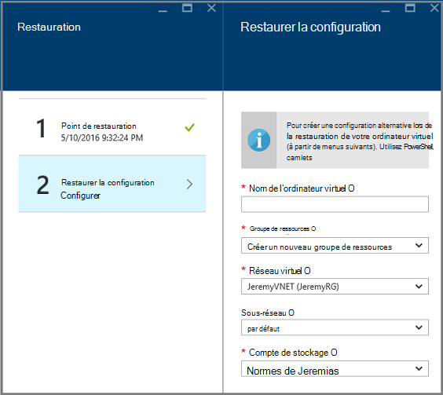

## Choix d’une configuration de restauration de machine virtuelle

Maintenant que vous avez sélectionné le point de restauration, choisissez une configuration pour votre ordinateur virtuel de la restauration. Vos choix de configuration de la machine virtuelle restaurée est à utiliser : Azure portal ou PowerShell.

> [AZURE.NOTE] Portail fournit une option de création rapide de machine virtuelle restaurée. Si vous souhaitez personnaliser la configuration de la machine virtuelle de la machine virtuelle de restauré tel qu’il sera, utiliser PowerShell pour restaurer des disques de secours et les joindre au choix de la configuration de la machine virtuelle. Reportez-vous à la section [restauration d’un ordinateur virtuel avec des configurations de réseau spécial](#restoring-vms-with-special-network-configurations).

1. Si vous n’êtes pas déjà, passez à la lame de **restauration** . Garantir un **point de restauration** a été sélectionnée et cliquez sur **restaurer la configuration** pour ouvrir la **configuration de la récupération** de lame.

    

2. Sur la lame de **restaurer la configuration** , entrez ou sélectionnez des valeurs pour chacun des champs suivants :
    - **Nom de la machine virtuelle** - Indiquez un nom pour la machine virtuelle. Le nom doit être unique pour le groupe de ressources (pour un ordinateur virtuel déployé de gestionnaire de ressources) ou le service en nuage (pour une machine virtuelle classique). Vous ne pouvez pas remplacer la machine virtuelle si elle existe déjà dans l’abonnement.
    - **Groupe de ressources** - utiliser un groupe de ressources existant ou créez-en un nouveau. Si vous restaurez une machine virtuelle classique, utilisez ce champ pour spécifier le nom d’un nouveau service en nuage. Si vous créez un nouveau service de groupe/nuage de ressource, le nom doit être unique. En général, le nom de service cloud est associé à une URL accessible au public - par exemple : [cloudservice]. cloudapp.net. Si vous essayez d’utiliser un nom pour le service de groupe/nuage de ressources de cloud qui a déjà été utilisé, Azure affecte le service/nuage du groupe de ressources du même nom que l’ordinateur virtuel. Azure affiche les services des groupes/nuage de ressources et machines virtuelles non associées à des groupes d’affinité. Pour plus d’informations, consultez [comment migrer à partir de groupes d’affinité pour un réseau virtuel (VNet)](../virtual-network/virtual-networks-migrate-to-regional-vnet.md).
    - **Réseau virtuel** , sélectionnez le réseau virtuel (VNET) lors de la création de la machine virtuelle. Le champ fournit tous les VNETs associés à l’abonnement. Groupe de ressources de la machine virtuelle s’affiche entre parenthèses.
    - **Sous-réseau** - si le VNET a des sous-réseaux, le premier sous-réseau est sélectionné par défaut. S’il existe des sous-réseaux supplémentaires, sélectionnez le sous-réseau souhaité.
    - **Compte de stockage** - ce menu répertorie les comptes de stockage dans le même emplacement que le coffre-fort de Services de récupération. Lorsque vous choisissez un compte de stockage, sélectionnez un compte qui partage le même emplacement que le coffre-fort de Services de récupération. Les comptes de stockage redondants sont ne sont pas pris en charge. S’il n’y a aucun compte de stockage avec le même emplacement que le coffre-fort de Services de restauration, vous devez en créer un avant de démarrer l’opération de restauration. Type de réplication du stockage compte est indiqué entre parenthèses.

    > [AZURE.NOTE] Si vous restaurez une VM déployés par le Gestionnaire de ressources, vous devez identifier un réseau virtuel (VNET). Un réseau virtuel (VNET) est facultatif pour une machine virtuelle classique.

3. Sur la lame de **restaurer la configuration** , cliquez sur **OK** pour terminer la configuration de la restauration.

4. Sur la lame de **restauration** , cliquez sur **restaurer** pour déclencher l’opération de restauration.

    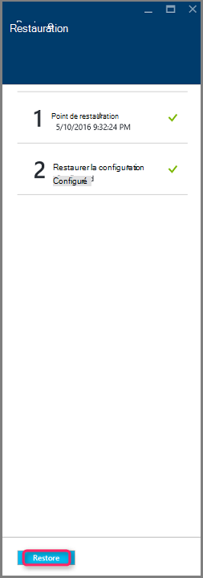

## Effectuer le suivi de l’opération de restauration

Une fois que vous déclencher l’opération de restauration, le service de sauvegarde crée une tâche pour le suivi de l’opération de restauration. Le service de sauvegarde crée également et affiche temporairement la notification dans la zone de notification de portail. Si vous ne voyez pas la notification, vous pouvez toujours cliquer sur l’icône pour afficher les notifications de Notifications.

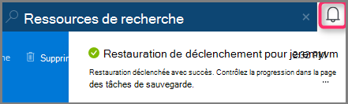

Permet d’afficher l’opération pendant le traitement, ou pour afficher lorsqu’il a terminé, ouvrez la liste de tâches de sauvegarde.

1. Dans le menu Azure, cliquez sur **Parcourir** , puis dans la liste des services, tapez **Services de récupération**. La liste des services s’adapte à ce que vous tapez. Lorsque vous consultez les **Services de récupération des coffres-forts**, sélectionnez-le.

    

    La liste des coffres-forts dans l’abonnement s’affiche.

    

2. Dans la liste, sélectionnez le coffre-fort associé à la machine virtuelle que vous avez restauré. Lorsque vous cliquez sur le coffre, son tableau de bord s’ouvre.

3. Dans le tableau de bord de chambre forte sur les **Travaux de sauvegarde** en mosaïque, cliquez sur **ordinateurs virtuels Azure** pour afficher les tâches associées à la chambre forte.

    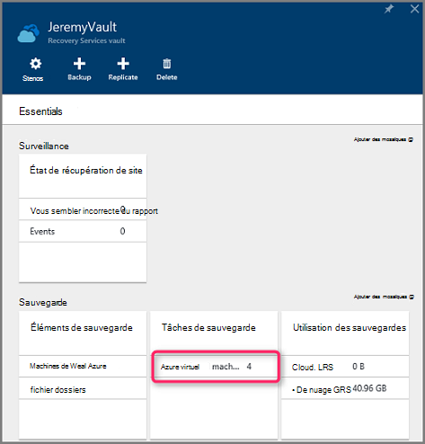

    La lame de **Travaux de sauvegarde** s’ouvre et affiche la liste des tâches.

    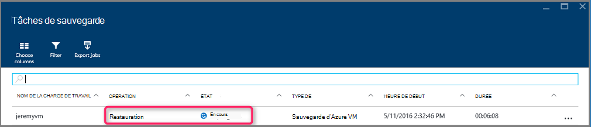

## Restauration d’ordinateurs virtuels avec des configurations de réseau spécial
Il est possible de sauvegarder et de restaurer des ordinateurs virtuels avec les configurations réseau particulières suivantes. Toutefois, ces configurations nécessitent une attention particulière lors de passer par le processus de restauration.

- Machines virtuelles sous un équilibreur de charge (interne et externe)
- Ordinateurs virtuels avec plusieurs IPs réservés
- Ordinateurs virtuels avec plusieurs cartes réseau

>[AZURE.IMPORTANT] Lors de la création de la configuration réseau spéciale pour les machines virtuelles, vous devez utiliser PowerShell pour créer des ordinateurs virtuels à partir des disquettes de restauration.

Pour entièrement recréer les ordinateurs virtuels après la restauration sur le disque, procédez comme suit :

1. Restaurer les disques d’un coffre de services de récupération à l’aide de [PowerShell](../backup-azure-vms-automation.md#restore-an-azure-vm)

2. Créer la configuration de la machine virtuelle requise pour l’équilibrage de la charge / IP réservée plusieurs NIC/multiples à l’aide des applets de commande PowerShell et utilisez pour créer la machine virtuelle de souhaitée de configuration.
    - Créer la machine virtuelle dans un service cloud avec un [équilibreur de charge interne](https://azure.microsoft.com/documentation/articles/load-balancer-internal-getstarted/)
    - Créer l’ordinateur virtuel pour vous connecter à [Internet face équilibreur de charge] (https://azure.microsoft.com/en-us/documentation/articles/load-balancer-internet-getstarted/)
    - Créer un ordinateur virtuel avec [plusieurs cartes réseau](https://azure.microsoft.com/documentation/articles/virtual-networks-multiple-nics/)
    - Créer un ordinateur virtuel avec [plusieurs IPs réservés](https://azure.microsoft.com/documentation/articles/virtual-networks-reserved-public-ip/)

## Étapes suivantes
Maintenant que vous pouvez restaurer vos ordinateurs virtuels, consultez l’article résolution des problèmes pour plus d’informations sur les erreurs communs avec des ordinateurs virtuels. En outre, consultez l’article sur la gestion des tâches avec vos ordinateurs virtuels.

- [Résolution des erreurs](backup-azure-vms-troubleshoot.md#restore)
- [Gérer des ordinateurs virtuels](backup-azure-manage-vms.md)
