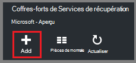
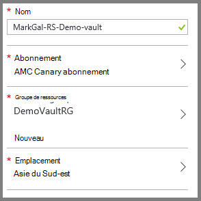
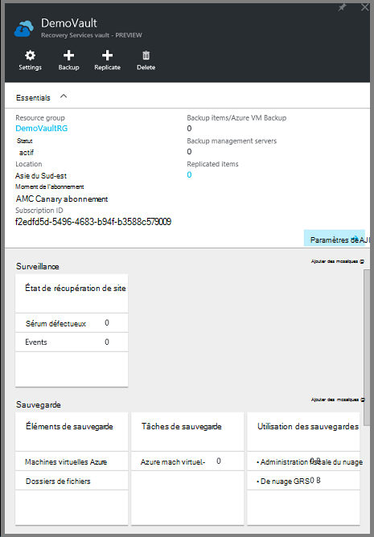
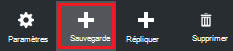
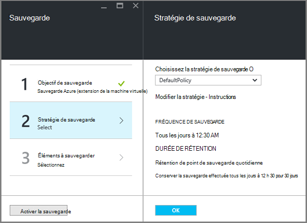
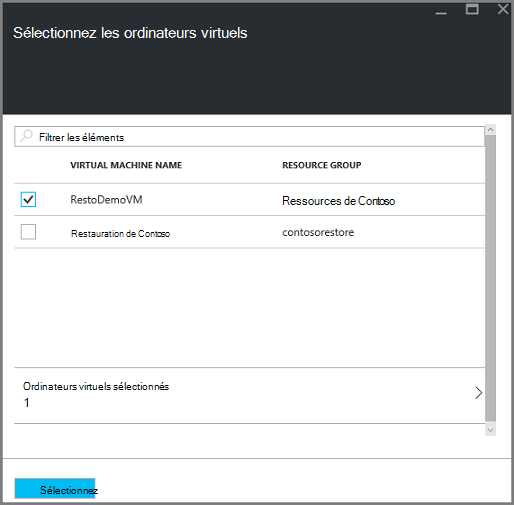
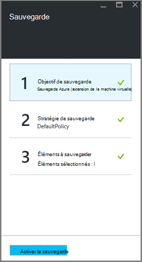

<properties
    pageTitle="Préparation de votre environnement de sauvegarde déployées par le Gestionnaire de ressources des machines virtuelles | Microsoft Azure"
    description="Assurez-vous que votre environnement est prêt pour la sauvegarde des machines virtuelles dans Azure"
    services="backup"
    documentationCenter=""
    authors="markgalioto"
    manager="cfreeman"
    editor=""
    keywords="sauvegardes ; procédure de sauvegarde ;"/>

<tags
    ms.service="backup"
    ms.workload="storage-backup-recovery"
    ms.tgt_pltfrm="na"
    ms.devlang="na"
    ms.topic="article"
    ms.date="08/21/2016"
    ms.author="trinadhk; jimpark; markgal;"/>


# <a name="prepare-your-environment-to-back-up-resource-manager-deployed-virtual-machines"></a>Préparez votre environnement de sauvegarde déployées par le Gestionnaire de ressources des machines virtuelles

> [AZURE.SELECTOR]
- [Modèle de gestionnaire de ressources](backup-azure-arm-vms-prepare.md)
- [Modèle classique](backup-azure-vms-prepare.md)

Cet article fournit les étapes pour préparer votre environnement à sauvegarder une machine déployés par le Gestionnaire de ressources de virtuelle (VM). La procédure décrite dans les procédures utilise le portail Azure.  

Le service de sauvegarde d’Azure comprend deux types de coffres-forts (sauvegarder les coffres-forts et les coffres-forts des services de restauration) pour protéger vos ordinateurs virtuels. Un coffre-fort de sauvegarde protège les ordinateurs virtuels déployés à l’aide du modèle de déploiement standard. Un coffre-fort de services de récupération protège **à la fois déployées classique ou déployés par le Gestionnaire de ressources de machines virtuelles** . Vous devez utiliser un coffre-fort de Services de récupération pour protéger un ordinateur virtuel de déployés par le Gestionnaire de ressources.

>[AZURE.NOTE] Azure dispose de deux modèles de déploiement pour la création et l’utilisation des ressources : [le Gestionnaire de ressources et classique](../resource-manager-deployment-model.md). Pour plus d’informations sur l’utilisation d’un modèle de déploiement standard ordinateurs virtuels, consultez la section [préparer votre environnement à sauvegarder des ordinateurs virtuels Azure](backup-azure-vms-prepare.md) .

Avant de pouvoir protéger ou sauvegarder une machine déployés par le Gestionnaire de ressources de virtuelle (VM), assurez-vous que ces composants requis existent :

- Créer un coffre-fort de services de récupération (ou identifier un coffre-fort de services de récupération existant) *dans le même emplacement que votre machine virtuelle*.
- Sélectionnez un scénario, définir la stratégie de sauvegarde et de définir les éléments à protéger.
- Vérifiez l’installation de l’Agent de l’ordinateur virtuel sur l’ordinateur virtuel.
- Vérifiez la connectivité réseau

Si vous connaissez que ces conditions existent déjà dans votre environnement puis passez à [sauvegarder votre article de machines virtuelles](backup-azure-vms.md). Si vous avez besoin configurer ou vérifier une de ces conditions préalables, cet article vous guide dans les étapes de préparation de cette condition requise.


## <a name="limitations-when-backing-up-and-restoring-a-vm"></a>Limitations lors de la sauvegarde et la restauration d’une machine virtuelle

Avant de préparer votre environnement, veuillez noter les limitations.

- La sauvegarde des machines virtuelles avec plus de 16 disques de données n’est pas pris en charge.
- La sauvegarde des machines virtuelles avec une adresse IP réservée et aucun point de terminaison défini n’est pas pris en charge.
- Sauvegarde des machines virtuelles de Linux avec l’extension de Docker n’est pas pris en charge. 
- Les données de sauvegarde n’incluent pas les lecteurs de réseau monté attachés à la machine virtuelle. 
- Remplacement d’un ordinateur virtuel existant lors de la restauration n’est pas pris en charge. Si vous essayez de restaurer l’ordinateur virtuel lorsqu’il existe de la machine virtuelle, l’opération de restauration échoue.
- Région entre sauvegarde et restauration n’est pas pris en charge.
- Vous pouvez sauvegarder des ordinateurs virtuels dans toutes les zones publiques d’Azure (voir [liste de contrôle](https://azure.microsoft.com/regions/#services) des régions pris en charge). Si la zone que vous recherchez est non pris en charge aujourd'hui, il apparaîtra pas dans la liste déroulante lors de la création du coffre-fort.
- Vous pouvez sauvegarder des machines virtuelles uniquement pour les versions du système d’exploitation select :
  - **Linux**: sauvegarde Azure prend en charge [une liste de distribution qui est visé par Azure](../virtual-machines/virtual-machines-linux-endorsed-distros.md) , à l’exception du noyau du système d’exploitation Linux.  Autres distributions de mettre-Your-propriétaire-Linux peuvent également fonctionner tant que l’agent de l’ordinateur virtuel est disponible sur l’ordinateur virtuel et prend en charge les pour Python existe.
  - **Windows Server**: les Versions antérieures à Windows Server 2008 R2 ne sont pas pris en charge.
- Restauration d’un contrôleur de domaine VM (DC) qui fait partie d’une configuration multi-DC est pris en charge uniquement par le biais de PowerShell. Plus d’informations sur la [restauration d’un contrôleur de domaine multi-DC](backup-azure-restore-vms.md#restoring-domain-controller-vms).
- Restauration d’ordinateurs virtuels ayant les configurations de réseau spécial suivant est pris en charge uniquement par le biais de PowerShell. Ordinateurs virtuels créés à l’aide du flux de travail de restauration dans l’interface utilisateur ne disposera pas de ces configurations réseau une fois l’opération de restauration terminée. Pour plus d’informations, voir [Restauration de machines virtuelles avec des configurations de réseau particulier](backup-azure-restore-vms.md#restoring-vms-with-special-netwrok-configurations).
  - Machines virtuelles sous configuration de l’équilibrage de la charge (interne et externe)
  - Machines virtuelles avec plusieurs adresses IP réservées
  - Machines virtuelles avec plusieurs cartes réseau

## <a name="create-a-recovery-services-vault-for-a-vm"></a>Créer un coffre-fort de services de récupération pour un ordinateur virtuel

Un coffre-fort de services de récupération est une entité qui stocke les sauvegardes et les points de récupération qui ont été créées au fil du temps. Le coffre-fort de services de récupération contient également les stratégies de sauvegarde associés avec les ordinateurs virtuels protégés.

Pour créer un coffre-fort de services de récupération :

1. Connectez-vous au [portail Azure](https://portal.azure.com/).

2. Dans le menu Hub, cliquez sur **Parcourir** , puis dans la liste des ressources, tapez **Les Services de récupération**. Comme vous commencez à taper, la liste de filtre en fonction de votre entrée. Cliquez sur **Services de récupération de coffre-fort**.

     <br/>

    La liste des Services de récupération des coffres-forts s’affiche.

3. Dans le menu des **Services de récupération des coffres-forts** , cliquez sur **Ajouter**.

    

    La lame de coffre-fort de Services de restauration s’ouvre, vous invitant à fournir un **nom**, un **abonnement**, un **groupe de ressources**et un **emplacement**.

    

4. Pour **nom**, entrez un nom convivial pour identifier le coffre-fort. Le nom doit être unique pour l’abonnement Azure. Tapez un nom qui contient entre 2 et 50 caractères. Il doit commencer par une lettre et peut contenir uniquement des lettres, des chiffres et des traits d’union.

5. Cliquez sur l' **abonnement** pour visualiser la liste des abonnements disponibles. Si vous n’êtes pas sûr de l’abonnement à utiliser, utilisez la valeur par défaut (ou suggéré) abonnement. Il y aura plusieurs choix uniquement si votre organisation compte est associé à plusieurs abonnements Azure.

6. Cliquez sur le **groupe de ressources** pour afficher la liste des groupes de ressources disponibles, ou cliquez sur **Nouveau** pour créer un nouveau groupe de ressources. Pour plus d’informations sur les groupes de ressources, consultez [vue d’ensemble du Gestionnaire de ressources Azure](../azure-resource-manager/resource-group-overview.md)

7. Cliquez sur l' **emplacement** pour sélectionner la zone géographique pour la chambre forte. Le coffre-fort **doit** être dans la même région que les ordinateurs virtuels que vous souhaitez protéger.

    >[AZURE.IMPORTANT] Si vous ne connaissez pas l’emplacement dans lequel se trouve votre ordinateur virtuel, fermez la boîte de dialogue de création de coffre-fort et accédez à la liste des ordinateurs virtuels dans le portail. Si vous avez des ordinateurs virtuels dans plusieurs régions, vous devrez créer un coffre-fort de Services de récupération de chaque région. Créer le coffre-fort dans le premier emplacement avant de passer à l’emplacement suivant. Il est inutile de spécifier les comptes de stockage pour stocker les données de sauvegarde--le coffre-fort de Services de récupération et le service de sauvegarde Azure gèrent cette option automatiquement.

8. Cliquez sur **créer**. Elle peut prendre du temps pour la chambre forte de Services de récupération doit être créé. Surveiller les notifications d’état dans l’angle supérieur droit du portail. Une fois votre coffre-fort est créé, il apparaît dans la liste des Services de récupération des coffres-forts.

    

    Maintenant que vous avez créé votre coffre-fort, découvrez comment définir la réplication du stockage.

## <a name="set-storage-replication"></a>Définir la réplication du stockage

L’option de réplication de stockage vous permet de choisir entre le stockage redondant geo et stockage redondant localement. Par défaut, votre coffre-fort a stockage redondant geo. Conservez l’option définie vers le stockage redondant geo si c’est votre sauvegarde principale. Choisissez le stockage redondant localement si vous souhaitez une option économique qui n’est pas tout à fait aussi durable. En savoir plus sur [géo-redondants](../storage/storage-redundancy.md#geo-redundant-storage) et des options de stockage [redondants localement](../storage/storage-redundancy.md#locally-redundant-storage) dans la [vue d’ensemble de la réplication de stockage Azure](../storage/storage-redundancy.md).

Pour modifier le paramètre de réplication du stockage :

1. Sélectionnez votre coffre-fort pour ouvrir le tableau de bord en chambre forte et la lame de paramètres. Si la lame de **paramètres** ne s’ouvre pas, cliquez sur **tous les paramètres** dans le tableau de bord de coffre-fort.

2. Sur la lame de **paramètres** , cliquez sur **l’Infrastructure de sauvegarde** > de**Configuration de sauvegarde** pour ouvrir la lame de la **Configuration de la sauvegarde** . Sur la lame de la **Configuration de la sauvegarde** , choisissez l’option de réplication de stockage pour Password vault.

    

    Après avoir choisi l’option de stockage pour Password vault, vous êtes prêt à associer de la machine virtuelle à la chambre forte. Pour commencer l’association, vous devez découvrir et enregistrer les ordinateurs virtuels Azure.


## <a name="select-a-backup-goal-set-policy-and-define-items-to-protect"></a>Sélectionnez un objectif de sauvegarde, de définir la stratégie et de définir les éléments à protéger

Avant d’enregistrer un ordinateur virtuel à un coffre-fort, exécuter le processus de découverte pour vous assurer que les nouveaux ordinateurs virtuels qui ont été ajoutés à l’abonnement sont identifiés. Les traitement des requêtes Azure pour obtenir la liste des ordinateurs virtuels de l’abonnement, ainsi que des informations supplémentaires telles que le nom de service de cloud et de la région. Dans le portail Azure, scénario fait référence à ce que vous allez placer dans le coffre-fort de services de récupération. La stratégie est la planification de la fréquence et à quel moment les points de récupération sont prises. La stratégie inclut également la durée de rétention pour les points de récupération.

1. Si vous avez déjà un coffre-fort est ouvert aux Services de récupération, passez à l’étape 2. Si vous n’avez pas un Services de récupération de chambre forte ouvert, mais dans le portail Azure, dans le menu de concentrateur, cliquez sur **Parcourir**.

  - Dans la liste des ressources, tapez **Les Services de récupération**.
  - Comme vous commencez à taper, la liste de filtre en fonction de votre entrée. Lorsque vous consultez les **Services de récupération des coffres-forts**, cliquez dessus.

     <br/>

    La liste des Services de récupération des coffres-forts s’affiche.
  - Dans la liste des Services de récupération des coffres-forts, sélectionner un coffre-fort.

    Le tableau de bord de coffre-fort sélectionné s’ouvre.

    

2. Dans le menu Tableau de bord de coffre-fort, cliquez sur **sauvegarde** pour ouvrir la lame de sauvegarde.

    

    L’ouverture de la lame, le service de sauvegarde recherche les nouveaux ordinateurs virtuels dans l’abonnement.

    

3. Sur la lame de sauvegarde, cliquez sur l' **objectif de sauvegarde** pour ouvrir la lame de l’objectif de la sauvegarde.

    

4. Sur la blade d’objectif de sauvegarde, définir **où votre charge de travail s’exécute** sur Azure et **que voulez-vous sauvegarder** sur l’ordinateur virtuel, puis cliquez sur **OK**.

    La lame de l’objectif de sauvegarde se ferme et la lame de stratégie de sauvegarde s’ouvre.

    

5. Sur la lame de stratégie de sauvegarde, sélectionnez la stratégie de sauvegarde que vous souhaitez appliquer à la chambre forte et cliquez sur **OK**.

    

    Les détails de la stratégie par défaut sont répertoriés dans les détails. Si vous souhaitez créer une nouvelle stratégie, sélectionnez **Créer un nouveau** dans le menu déroulant. Le menu déroulant fournit également une option permettant de basculer de l’heure lorsque l’instantané est pris, à 7 h. Pour obtenir des instructions sur la définition d’une stratégie de sauvegarde, consultez [définition d’une stratégie de sauvegarde](backup-azure-vms-first-look-arm.md#defining-a-backup-policy). Une fois que vous cliquez sur **OK**, la stratégie de sauvegarde est associée à la chambre forte.

    Choisissez ensuite les ordinateurs virtuels à associer à la chambre forte.

6. Choisissez les ordinateurs virtuels à associer à la stratégie spécifiée et cliquez sur **Sélectionner**.

    

    Si vous ne voyez pas l’ordinateur virtuel souhaité, vérifiez qu’il existe dans le même emplacement Azure comme le coffre-fort de Services de récupération.

7. Maintenant que vous avez défini tous les paramètres pour le coffre-fort, la lame de sauvegarde, cliquez sur **Activer la sauvegarde** en bas de la page. La stratégie est déployée pour le coffre-fort et les ordinateurs virtuels.

    

La phase suivante de préparation est l’installation de l’Agent de la machine virtuelle ou assurant l’Agent de l’ordinateur virtuel n’est installé.


## <a name="install-the-vm-agent-on-the-virtual-machine"></a>Installer l’Agent de l’ordinateur virtuel sur l’ordinateur virtuel

L’Agent de la machine virtuelle Azure doit être installé sur l’ordinateur virtuel Azure pour l’extension de la sauvegarde à utiliser. Si votre ordinateur virtuel a été créé à partir de la galerie d’Azure, puis l’Agent de la machine virtuelle est déjà présent sur l’ordinateur virtuel. Ces informations sont fournies pour les situations où vous êtes *pas* à l’aide d’un ordinateur virtuel créé à partir de la galerie Azure - par exemple que vous avez migré une machine virtuelle à partir d’un centre de données sur site. Dans ce cas, l’Agent de la machine virtuelle doit être installé afin de protéger l’ordinateur virtuel.

Obtenir des informations sur [l’Agent de la machine virtuelle](https://go.microsoft.com/fwLink/?LinkID=390493&clcid=0x409) et de [l’installation de l’Agent de la machine virtuelle](../virtual-machines/virtual-machines-windows-classic-manage-extensions.md).

Si vous rencontrez des problèmes de la sauvegarde de la machine virtuelle d’Azure, vérifiez que l’Agent de la machine virtuelle Azure est correctement installé sur l’ordinateur virtuel (voir le tableau ci-dessous). Si vous avez créé un ordinateur virtuel personnalisé, [Assurez-vous que la case à cocher **installer l’Agent de la machine virtuelle** est sélectionnée](../virtual-machines/virtual-machines-windows-classic-agents-and-extensions.md) avant de l’ordinateur virtuel est en service.

Le tableau suivant fournit des informations supplémentaires sur la machine virtuelle l’Agent pour Windows et des ordinateurs virtuels de Linux.

| **Opération** | **Windows** | **Linux** |
| --- | --- | --- |
| Installation de l’Agent de la machine virtuelle | <li>Téléchargez et installez l' [agent MSI](http://go.microsoft.com/fwlink/?LinkID=394789&clcid=0x409). Vous aurez besoin des privilèges d’administrateur pour terminer l’installation. <li>[Mise à jour de la propriété de la machine virtuelle](http://blogs.msdn.com/b/mast/archive/2014/04/08/install-the-vm-agent-on-an-existing-azure-vm.aspx) pour indiquer que l’agent est installé. | <li> Installez dernier [agent de Linux](https://github.com/Azure/WALinuxAgent) à partir de GitHub. Vous aurez besoin des privilèges d’administrateur pour terminer l’installation. <li> [Mise à jour de la propriété de la machine virtuelle](http://blogs.msdn.com/b/mast/archive/2014/04/08/install-the-vm-agent-on-an-existing-azure-vm.aspx) pour indiquer que l’agent est installé. |
| Mise à jour de l’Agent de la machine virtuelle | Mise à jour de l’Agent de la machine virtuelle est aussi simple que de réinstaller les [binaires de l’Agent de la machine virtuelle](http://go.microsoft.com/fwlink/?LinkID=394789&clcid=0x409). <br>Assurez-vous qu’aucune opération de sauvegarde n’est en cours d’exécution alors que l’agent de l’ordinateur virtuel est en cours de mise à jour. | Suivez les instructions sur la [mise à jour de l’Agent de la machine virtuelle Linux ](../virtual-machines-linux-update-agent.md). <br>Assurez-vous qu’aucune opération de sauvegarde n’est en cours d’exécution alors que l’Agent de l’ordinateur virtuel est en cours de mise à jour. |
| Validation de l’installation de l’Agent de la machine virtuelle | <li>Naviguez jusqu’au dossier *C:\WindowsAzure\Packages* de l’ordinateur virtuel d’Azure. <li>Vous devriez trouver le fichier WaAppAgent.exe.<li> Cliquez droit sur le fichier, cliquez sur **Propriétés**et puis sélectionnez l’onglet **Détails** . Le champ Version du produit doit être 2.6.1198.718 ou version ultérieure. | N/A |


### <a name="backup-extension"></a>Extension de la sauvegarde

Une fois que l’Agent de l’ordinateur virtuel est installé sur l’ordinateur virtuel, le service de sauvegarde Azure installe l’extension de sauvegarde à l’Agent de la machine virtuelle. Le service de sauvegarde Azure en toute transparence mises à niveau et correctifs de l’extension de sauvegarde.

L’extension de sauvegarde est installée par le service de sauvegarde de l’ordinateur virtuel est en cours d’exécution ou non. Une machine virtuelle en cours d’exécution fournit le plus grand risque d’obtenir un point de reprise cohérents au niveau de l’application. Toutefois, le service de sauvegarde d’Azure continue à sauvegarder l’ordinateur virtuel même si elle est désactivée et que l’extension n’a pas pu être installée. Il s’agit en tant que machine virtuelle d’en mode hors connexion. Dans ce cas, le point de récupération seront *sur incident cohérent*.


## <a name="network-connectivity"></a>Connectivité réseau

Pour gérer les snapshots de machines virtuelles, l’extension de sauvegarde a besoin de connectivité vers des adresses IP publiques Azure. Sans la connectivité Internet, délai d’expiration des requêtes HTTP de la machine virtuelle et l’opération de sauvegarde échoue. Si votre déploiement comporte des restrictions d’accès (via un groupe de sécurité réseau (NSG), par exemple), puis choisissez l’une de ces options pour fournir un chemin clair pour le trafic de sauvegarde :

- [Liste d’autorisation de l’adresse IP du centre de données Azure plages](http://www.microsoft.com/en-us/download/details.aspx?id=41653) - voir l’article pour obtenir des instructions sur comment à la liste d’autorisation les adresses IP.
- Déployez un serveur de proxy HTTP pour le routage du trafic.

Lors du choix de l’option à utiliser, les compromis sont entre la facilité de gestion, un contrôle granulaire et le coût.

|Option|Avantages|Inconvénients|
|------|----------|-------------|
|Plages de Whitelist IP| Aucun coût supplémentaire.<br><br>Pour l’ouverture des accès dans un NSG, utilisez l’applet de commande <i>Set-AzureNetworkSecurityRule</i> . | Complexes à gérer que les impactés plages IP changent avec le temps.<br><br>Fournit l’accès à l’ensemble d’Azure et pas seulement le stockage.|
|Serveur proxy HTTP| Contrôle granulaire sur les URL de stockage autorisé dans le proxy.<br>Point unique d’Internet l’accès aux ordinateurs virtuels.<br>Pas d’objet pour les modifications d’adresses IP d’Azure.| Frais supplémentaires pour l’exécution d’une machine virtuelle avec le logiciel proxy.|

### <a name="whitelist-the-azure-datacenter-ip-ranges"></a>Liste d’autorisation du centre de données Azure les plages IP

À la liste d’autorisation les plages IP de centre de données Azure, consultez le [site Web Azure](http://www.microsoft.com/en-us/download/details.aspx?id=41653) pour plus d’informations sur les plages IP et les instructions.

### <a name="using-an-http-proxy-for-vm-backups"></a>À l’aide d’un proxy HTTP pour les sauvegardes de machines virtuelles
Lorsque vous sauvegardez un ordinateur virtuel, l’extension de sauvegarde sur l’ordinateur virtuel envoie les commandes de gestion de capture instantanée sur le stockage Azure à l’aide d’une API de HTTPS. Acheminer le trafic de sauvegarde d’extension via le serveur proxy HTTP, car il est le seul composant configuré pour l’accès à l’Internet public.

>[AZURE.NOTE] Il n’y a aucune recommandation concernant le logiciel proxy qui doit être utilisé. Assurez-vous que vous sélectionnez un serveur proxy qui est compatible avec les étapes de configuration ci-dessous.

L’image de l’exemple ci-dessous illustre les étapes de trois configuration nécessaire d’utiliser un proxy HTTP :

- Machine virtuelle d’application achemine tout le trafic HTTP pour l’Internet public par le biais de Proxy VM.
- Serveur proxy VM autorise le trafic entrant à partir d’ordinateurs virtuels dans le réseau virtuel.
- Le groupe de sécurité réseau (NSG) nommé verrouillage SP a besoin d’un sécurité règle Autoriser trafic Internet sortant à partir de la machine virtuelle de Proxy.


Pour utiliser un proxy HTTP pour communiquer avec l’Internet public, procédez comme suit :

#### <a name="step-1-configure-outgoing-network-connections"></a>Étape 1. Configurer les connexions réseau sortantes

###### <a name="for-windows-machines"></a>Pour les machines Windows
Cela va configurer configuration du serveur proxy pour le compte système Local.

1. Téléchargement de [PsExec](https://technet.microsoft.com/sysinternals/bb897553)
2. Exécutez la commande suivante à partir de l’invite de commandes avec élévation de privilèges,

     ```
     psexec -i -s "c:\Program Files\Internet Explorer\iexplore.exe"
     ```
     Fenêtre internet explorer s’ouvre.
3. Accédez à outils -> Options Internet -> connexions -> Paramètres du réseau local.
4. Vérifiez les paramètres de proxy pour le compte système. Définissez le Proxy IP et le port.
5. Fermez Internet Explorer.

Cela définit une configuration de proxy à l’échelle de l’ordinateur et sera utilisé pour le trafic HTTP/HTTPS sortant.

Si vous avez configuré un serveur proxy sur un compte d’utilisateur en cours (pas un compte système Local), utilisez le script suivant pour les appliquer à SYSTEMACCOUNT :

```
   $obj = Get-ItemProperty -Path Registry::”HKEY_CURRENT_USER\Software\Microsoft\Windows\CurrentVersion\Internet Settings\Connections"
   Set-ItemProperty -Path Registry::”HKEY_USERS\S-1-5-18\Software\Microsoft\Windows\CurrentVersion\Internet Settings\Connections" -Name DefaultConnectionSettings -Value $obj.DefaultConnectionSettings
   Set-ItemProperty -Path Registry::”HKEY_USERS\S-1-5-18\Software\Microsoft\Windows\CurrentVersion\Internet Settings\Connections" -Name SavedLegacySettings -Value $obj.SavedLegacySettings
   $obj = Get-ItemProperty -Path Registry::”HKEY_CURRENT_USER\Software\Microsoft\Windows\CurrentVersion\Internet Settings"
   Set-ItemProperty -Path Registry::”HKEY_USERS\S-1-5-18\Software\Microsoft\Windows\CurrentVersion\Internet Settings" -Name ProxyEnable -Value $obj.ProxyEnable
   Set-ItemProperty -Path Registry::”HKEY_USERS\S-1-5-18\Software\Microsoft\Windows\CurrentVersion\Internet Settings" -Name Proxyserver -Value $obj.Proxyserver
```

>[AZURE.NOTE] Si vous observez « (407) authentification Proxy requise » dans le journal du serveur proxy, vérifiez que l’authentification est configurée correctement.

######<a name="for-linux-machines"></a>Pour les ordinateurs Linux

Ajoutez la ligne suivante à la ```/etc/environment``` fichier :

```
http_proxy=http://<proxy IP>:<proxy port>
```

Ajoutez les lignes suivantes à la ```/etc/waagent.conf``` fichier :

```
HttpProxy.Host=<proxy IP>
HttpProxy.Port=<proxy port>
```

#### <a name="step-2-allow-incoming-connections-on-the-proxy-server"></a>Étape 2. Autoriser les connexions entrantes sur le serveur proxy :

1. Sur le serveur proxy, ouvrez le pare-feu Windows. Le moyen le plus simple pour accéder à du pare-feu est de rechercher pour le pare-feu Windows avec sécurité avancée.

    

2. Dans la boîte de dialogue Pare-feu Windows, cliquez sur **Règles de trafic entrant** , puis cliquez sur **Nouvelle règle...**.

    

3. Dans l' **Assistant Nouvelle règle de trafic entrant**, sélectionnez l’option **personnalisée** pour le **Type de règle** , puis cliquez sur **suivant**.
4. Sur la page pour sélectionner le **programme**, choisissez **Tous les programmes** , puis cliquez sur **suivant**.

5. Dans la page **protocole et Ports** , entrez les informations suivantes et cliquez sur **suivant**:

    

    - pour le *type de protocole* , sélectionnez *TCP*
    - pour le *port Local* , sélectionnez *Des Ports spécifiques*, dans le champ ci-dessous, spécifiez la ```<Proxy Port>``` qui a été configuré.
    - pour le *port distant* , sélectionnez *Tous les Ports*

    Pour le reste de l’Assistant, cliquez sur jusqu'à la fin et donnez un nom à cette règle.

#### <a name="step-3-add-an-exception-rule-to-the-nsg"></a>Étape 3. Ajouter une règle d’exception à la NSG :

Dans une invite de commandes PowerShell d’Azure, entrez la commande suivante :

La commande suivante ajoute une exception à la NSG. Cette exception autorise le trafic TCP à partir de n’importe quel port 10.0.0.5 à n’importe quelle adresse Internet sur le port 80 (HTTP) ou 443 (HTTPS). Si vous avez besoin d’un port spécifique de l’Internet public, veillez à ajouter ce port pour le ```-DestinationPortRange``` ainsi.

```
Get-AzureNetworkSecurityGroup -Name "NSG-lockdown" |
Set-AzureNetworkSecurityRule -Name "allow-proxy " -Action Allow -Protocol TCP -Type Outbound -Priority 200 -SourceAddressPrefix "10.0.0.5/32" -SourcePortRange "*" -DestinationAddressPrefix Internet -DestinationPortRange "80-443"
```


*Ces étapes utilisent des noms spécifiques et des valeurs pour cet exemple. Utilisez les noms et valeurs à votre déploiement lors de la saisie, ou couper et coller des informations dans votre code.*


Maintenant que vous savez que vous possédez une connexion réseau, vous êtes prêt à sauvegarder votre machine virtuelle. Reportez-vous à la section [sauvegarder des ordinateurs virtuels de déployés par le Gestionnaire de ressources](backup-azure-arm-vms.md).

## <a name="questions"></a>Questions ?
Si vous avez des questions, ou s’il existe une fonctionnalité que vous souhaitez voir inclus, [nous envoyer vos commentaires](http://aka.ms/azurebackup_feedback).

## <a name="next-steps"></a>Étapes suivantes
Maintenant que vous avez préparé votre environnement de sauvegarde de votre machine virtuelle, l’étape logique suivante est de créer une sauvegarde. L’article de la planification fournit des informations détaillées sur la sauvegarde des machines virtuelles.

- [Sauvegarder des ordinateurs virtuels](backup-azure-vms.md)
- [Planifier votre infrastructure de sauvegarde de machine virtuelle](backup-azure-vms-introduction.md)
- [Gérer les sauvegardes de machines virtuelles](backup-azure-manage-vms.md)
