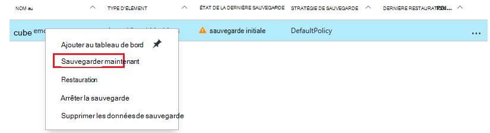
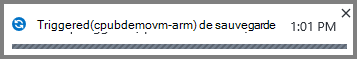
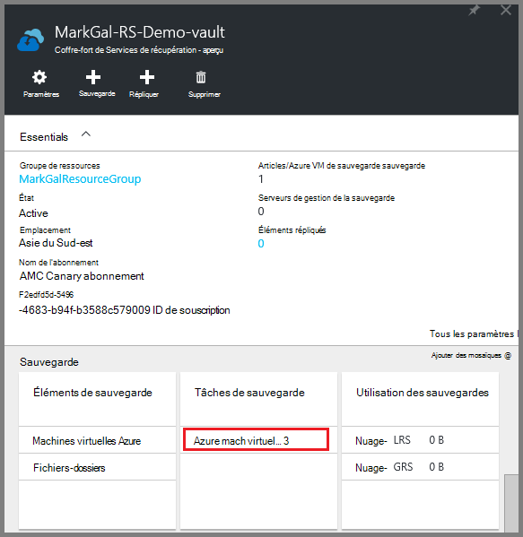

<properties
    pageTitle="Sauvegarder des ordinateurs virtuels d’Azure dans un coffre-fort de Services de récupération des | Microsoft Azure"
    description="Découvrir, enregistrer et sauvegarder des machines virtuelles Azure dans un coffre-fort de services de récupération avec ces procédures de sauvegarde Azure virtual machine."
    services="backup"
    documentationCenter=""
    authors="markgalioto"
    manager="cfreeman"
    editor=""
    keywords="sauvegarde des machines virtuelles ; sauvegarder la machine virtuelle ; sauvegarde et reprise après sinistre ; sauvegarde de machine virtuelle de bras"/>

<tags
    ms.service="backup"
    ms.workload="storage-backup-recovery"
    ms.tgt_pltfrm="na"
    ms.devlang="na"
    ms.topic="article"
    ms.date="07/29/2016"
    ms.author="trinadhk; jimpark; markgal;"/>

# Sauvegarder Azure VM vers un coffre-fort de Services de récupération

> [AZURE.SELECTOR]
- [Sauvegarder des ordinateurs virtuels en coffre-fort des Services de récupération](backup-azure-arm-vms.md)
- [Sauvegarder des ordinateurs virtuels dans le coffre-fort de la sauvegarde](backup-azure-vms.md)

Cet article fournit la procédure de sauvegarde Azure VM (déployés par le Gestionnaire de ressources et déployé classique) à un coffre-fort de Services de récupération. La majorité du travail de sauvegarde d’ordinateurs virtuels sont placées dans la préparation. Avant de sauvegarder ou de protéger un ordinateur virtuel, vous devez effectuer la [Configuration requise](backup-azure-arm-vms-prepare.md) pour préparer votre environnement pour la protection de vos ordinateurs virtuels. Une fois que vous avez terminé la configuration requise, vous pouvez lancer la prendre des instantanés de votre ordinateur virtuel de l’opération de sauvegarde.

>[AZURE.NOTE] Azure dispose de deux modèles de déploiement pour la création et l’utilisation des ressources : [le Gestionnaire de ressources et classique](../resource-manager-deployment-model.md). Vous pouvez protéger déployés par le Gestionnaire de ressources les ordinateurs virtuels et des ordinateurs virtuels classique avec les Services de récupération des coffres-forts. Pour plus d’informations sur l’utilisation d’un modèle de déploiement standard VMs, consultez [sauvegarder des machines virtuelles Azure](backup-azure-vms.md) .

Pour plus d’informations, consultez les articles sur la [planification de votre infrastructure de sauvegarde de machine virtuelle dans Azure](backup-azure-vms-introduction.md) et [d’Azure virtual machines](https://azure.microsoft.com/documentation/services/virtual-machines/).

## Déclenchement de la tâche de sauvegarde

La stratégie associée à la chambre forte de Services de restauration, de sauvegarde définit la fréquence et à quel moment l’opération de sauvegarde s’exécute. Par défaut, la première sauvegarde planifiée est la sauvegarde initiale. Jusqu'à ce que la sauvegarde initiale se produit, le dernier état de sauvegarde sur la lame de **Travaux de sauvegarde** s’affiche sous forme **d’Avertissement (en attente de sauvegarde initiale)**.

À moins que votre sauvegarde initiale est dû commencer très prochainement, il est recommandé d’exécuter **Sauvegarder maintenant**. La procédure suivante commence à partir du tableau de bord de coffre-fort. Cette procédure est utilisé pour l’exécution de la tâche de sauvegarde initiale après avoir effectué toutes les conditions préalables. Si la tâche de sauvegarde initiale a déjà été exécutée, cette procédure n’est pas disponible. La stratégie de sauvegarde associée détermine la prochaine tâche de sauvegarde.  

Pour exécuter la tâche de sauvegarde initiale :

1. Dans le tableau de bord coffre-fort dans la fenêtre **sauvegarde** , cliquez sur **ordinateurs virtuels Azure**.  
    

    La blade **d’Éléments de sauvegarde** s’ouvre.

2. Sur la blade **d’Éléments de sauvegarde** , avec le bouton droit de la chambre forte que vous souhaitez sauvegarder, puis cliquez sur **Sauvegarder maintenant**.

    

    L’opération de sauvegarde est déclenchée.  

    

3. Pour que votre sauvegarde initiale est terminée, sur le tableau de bord coffre-fort dans la fenêtre des **Tâches de sauvegarde** , cliquez sur **les machines virtuelles Azure**.

    

    La lame de travaux de sauvegarde s’ouvre.

4. Dans la blade de **travaux de sauvegarde** , vous pouvez visualiser l’état de toutes les tâches.

    

    >[AZURE.NOTE] Dans le cadre de l’opération de sauvegarde, le service de sauvegarde Azure émet une commande pour l’extension de sauvegarde dans chaque machine virtuelle pour vider toutes les écritures et prendre un instantané cohérent.

    Lorsque la sauvegarde est terminée, le statut est *terminé*.

## Résolution des erreurs
Si vous rencontrez des problèmes pendant la sauvegarde votre machine virtuelle, consultez l' [article de résolution des problèmes de mémoire virtuelle](backup-azure-vms-troubleshoot.md) de l’aide.

## Étapes suivantes

Maintenant que vous avez protégé votre machine virtuelle, consultez les articles suivants pour les tâches de gestion supplémentaire, vous pouvez faire avec vos ordinateurs virtuels et comment restaurer des ordinateurs virtuels.

- [Gérer et analyser vos machines virtuelles](backup-azure-manage-vms.md)
- [Restaurer des machines virtuelles](backup-azure-arm-restore-vms.md)
