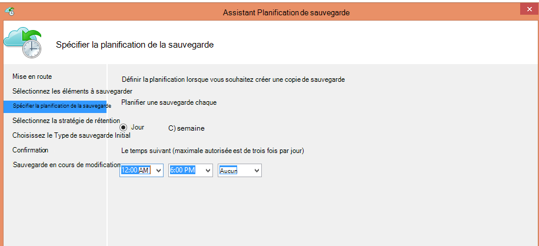
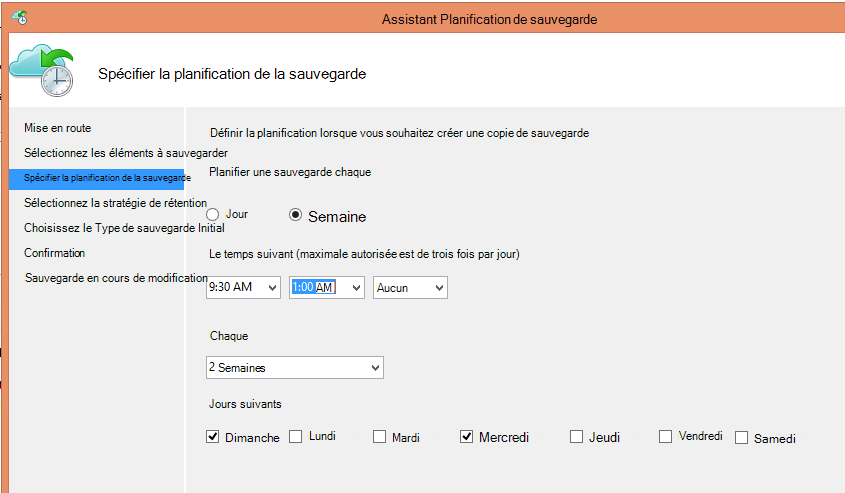
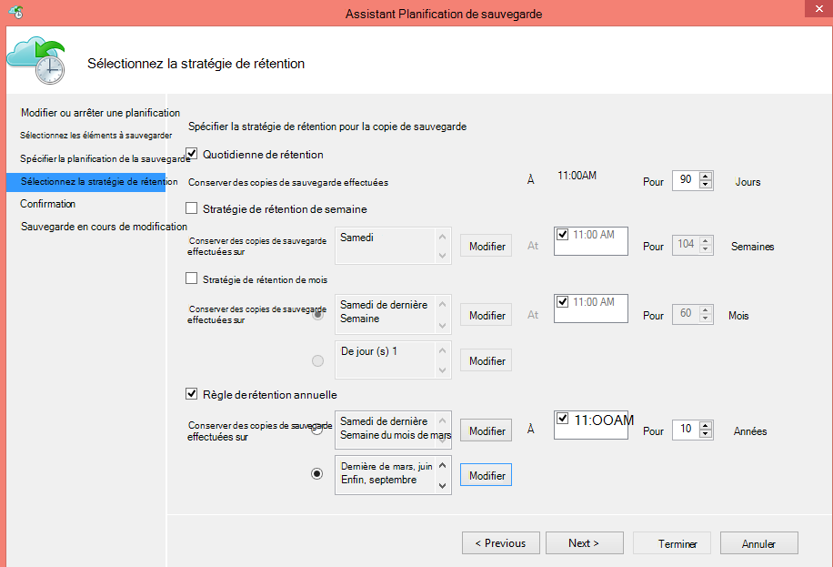
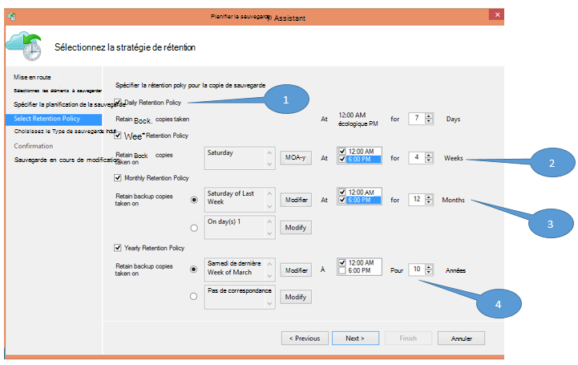
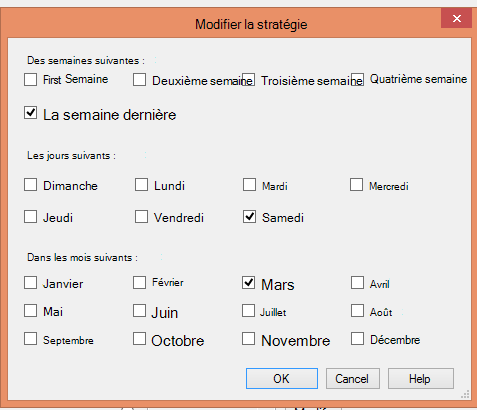

<properties
   pageTitle="Sauvegarde d’Azure permet de remplacer votre infrastructure sur bandes | Microsoft Azure"
   description="Découvrez comment sauvegarde Azure fournit une sémantique de type bande qui permet de sauvegarder et de restaurer des données dans Azure"
   services="backup"
   documentationCenter=""
   authors="trinadhk"
   manager="vijayts"
   editor=""/>
<tags
   ms.service="backup"
   ms.devlang="na"
   ms.topic="article"
   ms.tgt_pltfrm="na"
   ms.workload="storage-backup-recovery"
   ms.date="09/27/2016"
   ms.author="jimpark;trinadhk;markgal"/>

# Sauvegarde d’Azure permet de remplacer votre infrastructure sur bande

Les clients de sauvegarde et de System Center Data Protection Manager Azure peuvent :

- Sauvegarder les données dans les tableaux qui mieux répondre aux besoins d’organisation.
- Conserver les données de sauvegarde pour des périodes plus longues
- Assurez-vous d’Azure a besoin d’une partie de leur conservation à long terme (au lieu de bande).

Cet article explique comment les clients peuvent permettre des règles de conservation et de sauvegarde. Les clients qui utilisent des bandes pour adresser leur long-terme rétention doivent disposent désormais d’une alternative puissante et viable avec la disponibilité de cette fonctionnalité. La fonctionnalité est activée dans la dernière version de la sauvegarde d’Azure (disponible [ici](http://aka.ms/azurebackup_agent)). Les clients System Center DPM doivent mettre à jour, au moins, DPM 2012 R2 UR5 avant d’utiliser DPM avec le service de sauvegarde d’Azure.

## Quelle est la planification de la sauvegarde ?
La planification de sauvegarde indique la fréquence de l’opération de sauvegarde. Par exemple, les paramètres dans l’écran suivante indiquent que les sauvegardes sont effectuées tous les jours à 18 h 00 et à minuit.

Les clients peuvent également planifier une sauvegarde hebdomadaire. Par exemple, les paramètres dans l’écran suivante indiquent que les sauvegardes sont effectuées chaque dimanche autre & le mercredi à 9 h 30 et 1 h 00.

## Quelle est la stratégie de rétention ?
La stratégie de rétention spécifie la durée pour laquelle la sauvegarde doit être stockée. Plutôt que de simplement spécifier une stratégie « plat » pour tous les points de sauvegarde, les clients peuvent indiquer les règles de rétention différentes selon la date de la sauvegarde est effectuée. Par exemple, le point de sauvegarde effectuée tous les jours, qui se sert d’un point de restauration, est conservé pendant 90 jours. Le point de sauvegarde pris à la fin de chaque trimestre à des fins d’audit est conservé pendant une durée plus longue.

Le nombre total de points de rétention « » spécifié dans cette stratégie est 90 (points quotidiens) + 40 (une pour chaque trimestre depuis 10 ans) = 130.

## Exemple : regroupement des deux

1. **Journalier rétention**: les sauvegardes effectuées tous les jours sont stockés pendant sept jours.
2. **Stratégie de rétention hebdomadaire**: les sauvegardes effectuées tous les jours à minuit et 6 h samedi sont conservés pour les quatre dernières semaines
3. **Stratégie de rétention mensuel**: les sauvegardes effectuées à minuit et 18 h 00 le dernier samedi de chaque mois sont conservés pour les 12 derniers mois
4. **Règle de rétention annuelle**: prises à minuit le dernier samedi de mars, toutes les sauvegardes sont conservées pendant 10 ans

Le nombre total de « points de rétention » (à partir de laquelle un client peut restaurer les données de points) dans le diagramme précédent est calculée comme suit :

- deux points par jour pour sept jours = 14 points de récupération
- deux points par semaine pour les quatre semaines = 8 points de récupération
- deux points par mois pendant 12 mois = 24 points de récupération
- un point par an et par récupération de 10 ans = 10 points

Le nombre total de points de récupération est 56.

> [AZURE.NOTE] Sauvegarde Azure ne possède pas une restriction sur le nombre de points de récupération.

## Configuration avancée
En cliquant sur **Modifier** dans l’écran précédent, les clients ont davantage de flexibilité dans la spécification des planifications de rétention.

## Étapes suivantes
Pour plus d’informations sur la sauvegarde d’Azure, voir :

- [Introduction à la sauvegarde Azure](backup-introduction-to-azure-backup.md)
- [Essayez de sauvegarde Azure](backup-try-azure-backup-in-10-mins.md)
