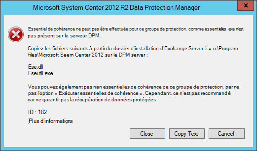

<properties
    pageTitle="Sauvegarder un serveur de sauvegarde Azure avec System Center 2012 R2 DPM | Microsoft Azure"
    description="Découvrez comment sauvegarder un serveur Exchange à la sauvegarde d’Azure à l’aide de System Center 2012 R2 DPM"
    services="backup"
    documentationCenter=""
    authors="MaanasSaran"
    manager="NKolli1"
    editor=""/>

<tags
    ms.service="backup"
    ms.workload="storage-backup-recovery"
    ms.tgt_pltfrm="na"
    ms.devlang="na"
    ms.topic="article"
    ms.date="08/15/2016"
    ms.author="anuragm;jimpark;delhan;trinadhk;markgal"/>

# Sauvegarder un serveur Exchange à la sauvegarde d’Azure avec System Center 2012 R2 DPM
Cet article explique comment configurer un serveur de System Center 2012 R2 Data Protection Manager (DPM) pour sauvegarder un serveur Microsoft Exchange pour la sauvegarde d’Azure.  

## Mises à jour
Pour enregistrer correctement le serveur DPM avec sauvegarde d’Azure, vous devez installer le dernier correctif cumulatif de mise à jour pour System Center 2012 R2 DPM et la dernière version de l’Agent de sauvegarde Azure. Obtenir le dernier correctif cumulatif de mise à jour à partir du [Catalogue de Microsoft](http://catalog.update.microsoft.com/v7/site/Search.aspx?q=System%20Center%202012%20R2%20Data%20protection%20manager).

>[AZURE.NOTE] Pour les exemples de cet article, la version 2.0.8719.0 de l’Agent de sauvegarde Azure est installée et mise à jour de correctif cumulatif 6 est installé sur System Center 2012 R2 DPM.

## Conditions préalables
Avant de continuer, assurez-vous que toutes les [conditions requises](backup-azure-dpm-introduction.md#prerequisites) pour l’utilisation de Microsoft Azure sauvegarde pour protéger les charges de travail ont été respectées. Ces conditions préalables sont les suivantes :

- Un coffre-fort de sauvegarde sur le site Azure a été créé.
- Informations d’identification de l’agent et le stockage en chambre forte ont été téléchargées sur le serveur DPM.
- L’agent est installé sur le serveur DPM.
- Les informations d’identification de la chambre forte ont été utilisées pour inscrire le serveur DPM.
- Si vous protégez Exchange 2016, mettez à niveau vers DPM 2012 R2 UR9 ou version ultérieure

## Agent de protection DPM  
Pour installer l’agent de protection DPM sur le serveur Exchange, procédez comme suit :

1. Assurez-vous que les pare-feux sont configurés correctement. Reportez-vous à la section [configurer les exceptions de pare-feu pour l’agent](https://technet.microsoft.com/library/Hh758204.aspx).

2. Installer l’agent sur le serveur Exchange, en cliquant sur **Gestion > Agents > installer** dans la Console Administrateur DPM. Pour obtenir la procédure détaillée, reportez-vous à la section [installation de l’agent de protection DPM](https://technet.microsoft.com/library/hh758186.aspx?f=255&MSPPError=-2147217396) .

## Créer un groupe de protection pour le serveur Exchange

1. Dans la Console Administrateur DPM, cliquez sur **Protection**, puis cliquez sur **Nouveau** dans le ruban pour ouvrir l’Assistant **Créer un nouveau groupe de Protection** .

2. Sur l’écran de **Bienvenue** de l’Assistant, cliquez sur **suivant**.

3. Sur l’écran **Sélectionner le type de groupe de protection** , sélectionnez **serveurs** et cliquez sur **suivant**.

4. Sélectionnez la base de données du serveur Exchange que vous souhaitez protéger, puis cliquez sur **suivant**.

    >[AZURE.NOTE] Si vous protégez Exchange 2013, vérifiez les [conditions préalables d’Exchange 2013](https://technet.microsoft.com/library/dn751029.aspx).

    Dans l’exemple suivant, la base de données Exchange 2010 est sélectionné.

    

5. Sélectionnez la méthode de protection des données.

    Nommez le groupe de protection et sélectionnez les deux options suivantes :

    - Je souhaite une protection à court terme à l’aide du disque.
    - Je souhaite une protection en ligne.

6. Cliquez sur **suivant**.

7. Sélectionnez l’option **Exécution d’Eseutil pour vérifier l’intégrité des données** si vous souhaitez vérifier l’intégrité des bases de données Exchange Server.

    Après avoir sélectionné cette option, la sauvegarde cohérence sera exécuté sur le serveur DPM pour éviter le trafic d’e/s qui est généré en exécutant la commande **eseutil** sur le serveur Exchange.

    >[AZURE.NOTE]Pour utiliser cette option, vous devez copier les fichiers Ese.dll et Eseutil.exe dans le répertoire C:\Program Files\Microsoft System Center 2012 R2\DPM\DPM\bin sur le serveur DPM. Dans le cas contraire, l’erreur suivante est déclenchée :  
    

8. Cliquez sur **suivant**.

9. Sélectionnez la base de données pour la **Copie de sauvegarde**, puis cliquez sur **suivant**.

    >[AZURE.NOTE] Si vous ne sélectionnez pas de « Sauvegarde » au moins une copie DAG d’une base de données, les journaux ne seront pas tronqués.

10. Configurer les objectifs pour la **sauvegarde à court terme**, puis cliquez sur **suivant**.

11. Vérifiez l’espace disque disponible, puis cliquez sur **suivant**.

12. Sélectionnez l’heure à laquelle le serveur DPM crée la réplication initiale et puis cliquez sur **suivant**.

13. Sélectionnez les options de vérification de cohérence, puis cliquez sur **suivant**.

14. Choisissez la base de données que vous souhaitez sauvegarder sur Azure, puis cliquez sur **suivant**. Par exemple :

    

15. Définir la planification de la **Sauvegarde d’Azure**, puis cliquez sur **suivant**. Par exemple :

    

    >[AZURE.NOTE] Notez les points de restauration en ligne sont basées sur express complète des points de récupération. Par conséquent, vous devez planifier le point de récupération en ligne après l’heure spécifiée pour l’express complète des points de récupération.

16. Configurer la stratégie de rétention pour la **Sauvegarde d’Azure**, puis cliquez sur **suivant**.

17. Choisissez une option de réplication en ligne et cliquez sur **suivant**.

    Si vous avez une base de données volumineuse, il peut prendre beaucoup de temps pour la sauvegarde initiale doit être créé sur le réseau. Pour éviter ce problème, vous pouvez créer une sauvegarde en mode hors connexion.  

    

18. Confirmez les paramètres, puis cliquez sur **Créer un groupe**.

19. Cliquez sur **Fermer**.

## Restaurer la base de données Exchange

1. Pour restaurer une base de données Exchange, cliquez sur **restauration** dans la Console Administrateur DPM.

2. Localisez la base de données Exchange que vous souhaitez récupérer.

3. Sélectionnez un point de restauration en ligne à partir de la liste déroulante de *temps de récupération* .

4. Cliquez sur **récupérer** pour démarrer l' **Assistant Récupération**.

Pour les points de restauration en ligne, il existe cinq types de récupération :

- **Récupérer à l’emplacement d’Exchange Server d’origine :** Les données seront récupérées sur le serveur Exchange d’origine.
- **Récupérer vers une autre base de données sur un Exchange Server :** Les données seront récupérées à une autre base de données sur un autre serveur Exchange.
- **Restauration d’une base de données de récupération :** Les données sont récupérées d’une base de données de récupération Exchange (RDB).
- **Copier dans un dossier réseau :** Les données seront récupérées dans un dossier réseau.
- **Copie sur bande :** Si vous avez une bibliothèque de bandes ou un lecteur de bande autonome connecté et configuré sur le serveur DPM, le point de récupération est copié sur une bande libre.

    

## Étapes suivantes

- [Forum aux questions de sauvegarde Azure](backup-azure-backup-faq.md)
