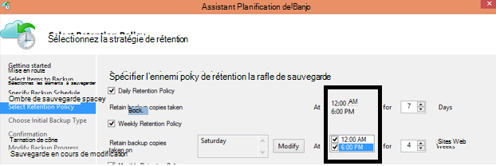

<properties
   pageTitle="Forum aux questions de sauvegarde Azure | Microsoft Azure"
   description="Réponses aux questions fréquemment posées sur le service de sauvegarde, l’agent de sauvegarde, sauvegarde et la conservation, la restauration, de sécurité et autres questions courantes sur la sauvegarde et de reprise après sinistre."
   services="backup"
   documentationCenter=""
   authors="markgalioto"
   manager="jwhit"
   editor=""
   keywords="sauvegarde et reprise après sinistre ; service de sauvegarde"/>

<tags
   ms.service="backup"
   ms.workload="storage-backup-recovery"
     ms.tgt_pltfrm="na"
     ms.devlang="na"
     ms.topic="get-started-article"
     ms.date="10/21/2016"
     ms.author="trinadhk; giridham; arunak; markgal; jimpark;"/>

# <a name="azure-backup-service--faq"></a>Service de sauvegarde Azure-FAQ


Cet article est une liste de questions fréquemment posées (et les réponses correspondantes) sur le service de sauvegarde d’Azure. Notre communauté répond rapidement, et les cas où une question souvent, nous l’ajouterons à cet article. Généralement, les réponses aux questions référence ou informations de support. Vous pouvez poser des questions relatives à la sauvegarde d’Azure dans la section Disqus de cet article ou un article. Vous pouvez également publier des questions sur le service de sauvegarde d’Azure dans le [forum de discussion](https://social.msdn.microsoft.com/forums/azure/home?forum=windowsazureonlinebackup).


## <a name="what-is-the-list-of-supported-operating-systems-from-which-i-can-back-up-to-azure-using-azure-backup-br"></a>Quelle est la liste des systèmes d’exploitation à partir duquel puis-je sauvegarder vers Azure à l’aide de la sauvegarde d’Azure ? <br/>
Sauvegarde Azure prend en charge la liste suivante de systèmes d’exploitation pour le fichier-dossier sauvegarde, application à l’aide du serveur de sauvegarde Azure et SCDPM.

| Système d'exploitation        | Plate-forme           | POINT DE STOCK  |
| :------------- |-------------| :-----|
| Windows 8 et dernières SPs      | 64 bits | Entreprise, Pro |
| Windows 7 et dernières SPs      | 64 bits | Édition intégrale, entreprise, Professionnel, Édition familiale Premium, Édition Familiale Basique, Starter |
| 8.1 de Windows et les dernières SPs | 64 bits      |    Entreprise, Pro |
| Windows 10      | 64 bits | Entreprise, Pro, accueil |
|Windows Server 2012 R2 et dernières SPs| 64 bits| Base de la norme, le centre de données,|
|Windows Server 2012 et dernières SPs|    64 bits| Centre de données, Foundation, Standard|
|Windows Storage Server 2012 R2 et dernières SPs  |64 bits|    Standard, groupe de travail|
|Stockage de Windows Server 2012 et dernières SPs |64 bits |Standard, groupe de travail
|Windows Server 2012 R2 et dernières SPs  |64 bits|    Essentiel|
|Windows Server 2008 R2 SP1 |64 bits|    Standard, Enterprise, Datacenter, Foundation|
|Windows Server 2008 SP2    |64 bits|    Standard, Enterprise, Datacenter, Foundation|

Pour la sauvegarde d’Azure VM,

- **Linux**: sauvegarde Azure prend en charge [une liste de distribution qui est visé par Azure](../virtual-machines/virtual-machines-linux-endorsed-distros.md) , à l’exception du noyau du système d’exploitation Linux.  Autres distributions de mettre-Your-propriétaire-Linux peuvent également fonctionner tant que l’agent de l’ordinateur virtuel est disponible sur l’ordinateur virtuel et prend en charge les pour Python existe.
- **Windows Server**: les Versions antérieures à Windows Server 2008 R2 ne sont pas pris en charge.

## <a name="where-can-i-download-the-latest-azure-backup-agent-br"></a>Où puis-je télécharger le dernier agent Azure sauvegarde ? <br/>
Vous pouvez télécharger le dernier agent de sauvegarde de Windows Server, System Center DPM ou client Windows, à partir [d’ici](http://aka.ms/azurebackup_agent). Si vous souhaitez sauvegarder une machine virtuelle, utilisez l’Agent de la machine virtuelle (qui installe automatiquement l’extension correcte). L’Agent de la machine virtuelle est déjà présent sur les ordinateurs virtuels créés à partir de la galerie d’Azure.

## <a name="which-version-of-scdpm-server-is-supported-br"></a>Quelle version de SCDPM server est pris en charge ? <br/>
Nous vous conseillons d’installer l’agent de sauvegarde d’Azure [plus récente](http://aka.ms/azurebackup_agent) sur le dernier correctif cumulatif de mise à jour de SCDPM (UR11 à août 2016)

## <a name="when-configuring-the-azure-backup-agent-i-am-prompted-to-enter-the-vault-credentials-do-vault-credentials-expire"></a>Lorsque vous configurez l’agent de sauvegarde d’Azure, je suis invité à entrer les informations d’identification de la chambre forte. Informations d’identification de la chambre forte expirent-ils ?
Oui, les informations d’identification de coffre-fort expirent après 48 heures. Si le fichier n’expire, connectez-vous au portail Azure et télécharger les fichiers d’informations d’identification de chambre forte du coffre.

## <a name="is-there-any-limit-on-the-number-of-vaults-that-can-be-created-in-each-azure-subscription-br"></a>Y a-t-il une limite au nombre des coffres-forts qui peuvent être créés dans chaque abonnement Azure ? <br/>
Oui. À partir de septembre 2016, vous pouvez créer 25 coffres-forts sauvegarde par abonnement. Vous pouvez créer jusqu'à 25 coffres-forts de Services de récupération par chaque région pris en charge de sauvegarde Azure par abonnement. Si vous avez besoin de plus de coffres-forts, puis créez un nouvel abonnement.

## <a name="are-there-any-limits-on-the-number-of-serversmachines-that-can-be-registered-against-each-vault-br"></a>Y a-t-il des limites sur le nombre de serveurs/machines qui peuvent être inscrits sur chaque coffre-fort ? <br/>
Oui, vous pouvez enregistrer jusqu'à 50 ordinateurs par coffre-fort. Pour les machines virtuelles de Azure IaaS, la limite est de 200 VM par coffre-fort. Si vous avez besoin d’enregistrer plus de machines, créer un coffre-fort.

## <a name="how-do-i-register-my-server-to-another-datacenterbr"></a>Comment enregistrer mon serveur vers un autre centre de données ?<br/>
Les données de sauvegarde sont envoyées au centre de données de la chambre forte à laquelle il est enregistré. Pour modifier le centre de données le plus simple est de désinstaller l’agent et réinstallez l’agent et enregistrer dans un nouveau coffre-fort qui appartient au centre de données de votre choix.

## <a name="what-happens-if-i-rename-a-windows-server-that-is-backing-up-data-to-azurebr"></a>Que se passe-t-il si renommer un serveur Windows qui sauvegarde les données vers Azure ?<br/>
Lorsque vous renommez un serveur, toutes les sauvegardes actuellement configurés sont arrêtés.
Vous devez enregistrer le nouveau nom du serveur avec le coffre-fort de la sauvegarde. Lorsque vous créez un nouvel enregistrement, la première opération de sauvegarde est une sauvegarde complète et pas d’une sauvegarde incrémentielle. Si vous devez récupérer des données qui a été précédemment sauvegardées dans le coffre-fort avec l’ancien nom de serveur, vous pouvez récupérer ces données à l’aide de l’option [**d’un autre serveur**](backup-azure-restore-windows-server.md#recover-to-an-alternate-machine) dans l’Assistant de **Récupération des données** .

## <a name="what-types-of-drives-can-i-backup-files-and-folders-from-br"></a>Quels types de disques puis-je sauvegarder les fichiers et les dossiers ? <br/>
Le jeu de disques/volumes suivant ne peut pas obtenir la sauvegarde :

- Support amovible : Le lecteur doit se présenter comme fixe à utiliser une source de l’élément de sauvegarde.
- Les Volumes en lecture seule : le volume doit être accessible en écriture pour le volume shadow copy service (VSS) de la fonction.
- Les Volumes en mode hors connexion : Le volume doit être en ligne pour VSS de la fonction.
- Partage réseau : le volume doit être local sur le serveur à sauvegarder à l’aide de la sauvegarde en ligne.
- BitLocker protégé des volumes : le volume doit être déverrouillé avant d’effectuer la sauvegarde.
- Identification du système de fichiers : NTFS est le seul système de fichiers pris en charge pour cette version du service de sauvegarde en ligne.

## <a name="what-file-and-folder-types-can-i-back-up-from-my-serverbr"></a>Quels types de fichiers et de dossiers puis-je sauvegarder à partir de mon serveur ?<br/>
Les types suivants sont pris en charge :

- Crypté
- Compressé
- Incomplet
- Compressé + creux
- Liens en dur : Pas la prise en charge, ignoré
- Au Point d’analyse : Pas de prise en charge, ignoré
- Crypté + compressé : Non pris en charge, ignoré
- Crypté + Sparse : Non pris en charge, ignoré
- Flux compressé : Pas de prise en charge, ignoré
- Flux de données clairsemée : Est pas pris en charge, ignoré

## <a name="whats-the-minimum-size-requirement-for-the-cache-folder-br"></a>Quelle est la taille minimale requise pour le dossier du cache ? <br/>
La taille du dossier du cache détermine la quantité de données que vous sauvegardez. Le dossier du cache doit être de 5 % de l’espace requis pour le stockage de données.

## <a name="if-my-organization-has-one-vault-how-can-i-isolate-one-servers-data-from-another-server-when-restoring-databr"></a>Si mon organisation a un coffre-fort, comment puis-je j’isoler les données d’un serveur à partir d’un autre serveur lors de la restauration des données ?<br/>
Tous les serveurs qui sont enregistrés dans le coffre-fort même peuvent récupérer les données sauvegardées par d’autres serveurs *qui utilisent le même mot de passe*. Si vous disposez de serveurs dont les données de sauvegarde que vous souhaitez isoler d’autres serveurs de votre organisation, utilisez un mot de passe désigné pour ces serveurs. Par exemple, les serveurs de ressources humaines peuvent utiliser une phrase de passe cryptage, comptabilité serveurs un autre et les serveurs de stockage à un tiers.

## <a name="can-i-migrate-my-backup-data-or-vault-between-subscriptions-br"></a>Puis-je « migrer » mes données de sauvegarde ou de la chambre forte entre les abonnements ? <br/>
N° Le coffre-fort est créé à un niveau d’abonnement et ne peut pas être réaffecté à un autre abonnement dès sa création.

## <a name="does-the-azure-backup-agent-work-on-a-server-that-uses-windows-server-2012-deduplication-br"></a>L’Agent de sauvegarde Azure fonctionne sur un serveur qui utilise Windows Server 2012 déduplication ? <br/>
Oui. Le service agent convertit la déduplication des données aux données normales lorsqu’il prépare l’opération de sauvegarde. Puis optimise les données pour la sauvegarde, crypte les données et envoie les données cryptées au service de sauvegarde en ligne.

## <a name="if-i-cancel-a-backup-job-once-it-has-started-is-the-transferred-backup-data-deleted-br"></a>Si j’annule une opération de sauvegarde une fois qu’il a démarré, sont supprimées les données de sauvegarde transférées ? <br/>
N° Le coffre-fort de sauvegarde stocke les données de sauvegarde qui avaient été transférées jusqu’au moment de l’annulation. Sauvegarde Azure utilise un mécanisme de point de contrôle pour ajouter occasionnellement des points de contrôle pour les données de sauvegarde lors de la sauvegarde. Dans la mesure où il existe des points de contrôle dans les données de sauvegarde, le processus de sauvegarde suivant peut valider l’intégrité des fichiers. La sauvegarde suivante déclenchée est incrémentielle sur les données qui avaient été sauvegardées précédemment. Une sauvegarde incrémentielle fournit une meilleure utilisation de la bande passante, afin que vous n’avez pas besoin de transférer les mêmes données à plusieurs reprises.

En cas de sauvegarde de Azure VM, une fois que la tâche est annulée, les données transférées sont ignorées et nouvelle sauvegarde transfère les données incrémentielles à partir de la tâche de sauvegarde précédemment réussi.

## <a name="why-am-i-seeing-the-warning-azure-backups-have-not-been-configured-for-this-server-even-though-i-had-scheduled-regular-backups-previously-br"></a>Pourquoi affiche-t-il l’avertissement « Sauvegardes Azure n'ont pas été configurées pour ce serveur » même si j’avais des sauvegardes régulières précédemment ? <br/>
Cet avertissement se produit lorsque les paramètres de planification de sauvegarde stockés sur le serveur local ne sont pas le même que les paramètres stockés dans le coffre-fort de sauvegarde. Lorsque le serveur ou les paramètres ont été restaurés à un état correct connu et les programmes de sauvegarde peuvent perdre de synchronisation. Si vous recevez cet avertissement, [Reconfigurez la stratégie de sauvegarde](backup-azure-manage-windows-server.md) , puis **Exécuter sauvegarder maintenant** pour resynchroniser le serveur local avec Azure.

## <a name="what-firewall-rules-should-be-configured-for-azure-backup-br"></a>Le pare-feu, les règles doivent être configurées pour la sauvegarde de Azure ? <br/>
Pour une protection transparente des données sur site-à Azure et la charge de travail à-Azure, il est recommandé d’autoriser votre pare-feu afin de communiquer avec les URL suivantes :

- www.msftncsi.com
- \*. Microsoft.com
- \*. WindowsAzure.com
- \*. microsoftonline.com
- \*. windows.net

##<a name="can-i-install-the-azure-backup-agent-on-an-azure-vm-already-backed-by-the-azure-backup-service-using-the-vm-extension-br"></a>Puis-je installer l’agent de sauvegarde d’Azure sur un Azure VM déjà sauvegardé par le service de sauvegarde d’Azure à l’aide de l’extension de la machine virtuelle ? <br/>
Absolument. Sauvegarde Azure fournit une sauvegarde au niveau de la machine virtuelle pour Azure VM à l’aide de l’extension de la machine virtuelle. Vous pouvez installer l’agent de sauvegarde d’Azure sur un système d’exploitation de Windows invité pour protéger les fichiers et les dossiers sur ce système d’exploitation invité.

## <a name="can-i-install-the-azure-backup-agent-on-an-azure-vm-to-back-up-files-and-folders-present-on-temporary-storage-provided-by-the-azure-vm-br"></a>Puis-je installer l’agent de sauvegarde d’Azure sur une machine virtuelle d’Azure pour sauvegarder des fichiers et des dossiers présents sur stockage temporaire fourni par la machine virtuelle d’Azure ? <br/>
Vous pouvez installer l’agent de sauvegarde d’Azure sur système d’exploitation invité Windows et sauvegarder des fichiers et des dossiers vers le stockage temporaire. Toutefois, veuillez noter que les sauvegardes échouent une fois que les données du stockage temporaire sont supprimées. En outre, si les données du stockage temporaire a été supprimées, vous pouvez uniquement restaurer pour le stockage non volatile.

## <a name="i-have-installed-azure-backup-agent-to-protect-my-files-and-folders-can-i-now-install-scdpm-to-work-with-azure-backup-agent-to-protect-on-premises-applicationvm-workloads-to-azure-br"></a>J’ai installé l’agent de sauvegarde d’Azure pour protéger les fichiers et les dossiers. Puis-je maintenant installer SCDPM pour fonctionner avec l’agent de sauvegarde d’Azure pour protéger les charges de travail sur site application/VM vers Azure ? <br/>
Pour utiliser la sauvegarde d’Azure avec SCDPM, il est conseillé d’installer SCDPM tout d’abord et uniquement pour installer l’agent de sauvegarde d’Azure. Cela garantit une intégration transparente de l’agent de sauvegarde d’Azure avec SCDPM et permet de protéger des fichiers/dossiers, des charges de travail et des ordinateurs virtuels vers Azure, directement à partir de la console de gestion de SCDPM. L’installation de SCDPM après l’installation de sauvegarde de Azure agent mentionnées ci-dessus à des fins n'est pas recommandé ou pris en charge.

## <a name="what-is-the-length-of-file-path-that-can-be-specified-as-part-of-azure-backup-policy-using-azure-backup-agent-br"></a>Quelle est la longueur du chemin d’accès qui peuvent être spécifiées dans le cadre de la stratégie de sauvegarde d’Azure à l’aide de l’agent de sauvegarde d’Azure ? <br/>  
Agent de sauvegarde Azure s’appuie sur le système NTFS. La [spécification de longueur de chemin d’accès est limitée par les API Windows](https://msdn.microsoft.com/library/aa365247.aspx#fully_qualified_vs._relative_paths). En cas de sauvegarde des fichiers dont la longueur de chemin d’accès du fichier supérieur à celui spécifié par l’API Windows, les clients peuvent choisir de sauvegarder le dossier parent ou le disque des fichiers de sauvegarde.  

## <a name="what-characters-are-allowed-in-file-path-of-azure-backup-policy-using-azure-backup-agent-br"></a>Quels caractères sont autorisés dans le chemin d’accès du fichier de stratégie de sauvegarde d’Azure à l’aide de l’agent de sauvegarde d’Azure ? <br>  
 Agent de sauvegarde Azure s’appuie sur le système NTFS. Il permet à [NTFS de caractères pris en charge](https://msdn.microsoft.com/library/aa365247.aspx#naming_conventions) dans le cadre de la spécification de fichier.  

## <a name="can-i-use-azure-backup-server-to-create-a-bare-metal-recovery-bmr-backup-for-a-physical-server-br"></a>Puis-je utiliser le serveur de sauvegarde Azure pour créer une sauvegarde de la récupération du métal sur matériel vierge (BMR) pour un serveur physique ? <br/>
Oui.

## <a name="can-i-configure-the-backup-service-to-send-mail-if-a-backup-job-fails-br"></a>Configurer le service de sauvegarde pour envoyer des messages en cas d’échec d’une opération de sauvegarde ? <br/>
Oui, le service de sauvegarde a plusieurs alertes basé sur des événements qui peuvent être utilisés avec un script PowerShell. Pour une description complète, consultez [notifications d’alerte](backup-azure-manage-vms.md#alert-notifications)

## <a name="is-there-a-limit-on-the-size-of-each-data-source-being-backed-up-br"></a>Y a-t-il une limite sur la taille de chaque source de données à sauvegarder ? <br/>
Au niveau de la chambre forte est aucune limite sur la quantité de données que vous pouvez sauvegarder, sauvegarde Azure impose une restriction (pour des raisons pratiques, ces limites sont très élevés) de la taille maximale de la source de données. Depuis août 2015, la source de données de taille maximale pour les systèmes d’exploitation pris en charge est la suivante :

|S.No | Système d'exploitation |  Taille maximale de la source de données |
| :-------------: |:-------------| :-----|
|1| Windows Server 2012 ou supérieur| 54400 GO|
|2| Windows 8 ou une version ultérieure| 54400 GO|
|3| Windows Server 2008, Windows Server 2008 R2 | 1 700 GO|
|4| Windows 7 | 1 700 GO|

Le tableau suivant explique la détermination de la taille de chaque source de données.

|   Source de données  |   Détails |
| :-------------: |:-------------|
|Volume |La quantité de données sauvegardées à partir d’un volume unique d’un ordinateur serveur ou client|
|Ordinateur virtuel Hyper-V | Somme des données de tous les disques durs virtuels de la machine virtuelle en cours de sauvegarde|
|Base de données de Microsoft SQL Server | Taille de taille de base de données SQL unique en cours de sauvegarde |
|Microsoft SharePoint |Somme des bases de données de configuration et de contenu au sein d’une batterie de serveurs SharePoint en cours de sauvegarde|
|Microsoft Exchange |Somme de toutes les bases de données Exchange sur un serveur Exchange en cours de sauvegarde|
|État de la restauration sur matériel vierge/système |Chaque copie individuelle de l’état de restauration sur matériel vierge ou un système de l’ordinateur en cours de sauvegarde|

## <a name="are-there-limits-on-the-number-of-times-a-backup-job-can-be-scheduled-per-daybr"></a>Y a-t-il des limites sur le nombre de fois où qu'une opération de sauvegarde peut être planifiée par jour ?<br/>
Oui, vous pouvez exécuter les tâches de sauvegarde de Windows Server ou client Windows jusqu'à trois fois / jour. Vous pouvez exécuter des tâches de sauvegarde sur System Center DPM deux fois par jour. Vous pouvez exécuter une opération de sauvegarde pour les machines virtuelles de IaaS une fois par jour.

## <a name="is-there-a-difference-between-the-scheduling-policy-for-dpm-and-windows-server-ie-on-windows-server-without-dpm-br"></a>Y a-t-il une différence entre la stratégie de planification pour DPM et serveur de Windows (par exemple, sur Windows Server sans DPM) ? <br/>
Oui. À l’aide de DPM, vous pouvez spécifier des planifications quotidiennes, hebdomadaires, mensuelles et annuelles. Windows Server (sans DPM) vous permet de spécifier uniquement les planifications quotidiennes et hebdomadaires.

## <a name="is-there-a-difference-between-the-retention-policy-for-dpm-and-windows-serverclient-ie-on-windows-server-without-dpmbr"></a>Y a-t-il une différence entre la stratégie de rétention pour DPM et client/serveur Windows (par exemple, sur Windows Server sans DPM) ?<br/>
Aucune, les deux DPM et client Windows Server ont quotidienne, hebdomadaire, mensuel et annuel de rétention.

## <a name="can-i-configure-my-retention-policies-selectively--ie-configure-weekly-and-daily-but-not-yearly-and-monthlybr"></a>Puis-je configurer mon rétention stratégies – par exemple, configurent de manière sélective hebdomadaire et quotidien mais pas annuel et mensuel ?<br/>
Oui, la structure de rétention Azure sauvegarde vous permet d’avoir une flexibilité totale dans la définition de la stratégie de rétention en fonction de vos besoins.

## <a name="can-i-schedule-a-backup-at-6pm-and-specify-retention-policies-at-a-different-timebr"></a>Puis-je « planifier une sauvegarde », à 18 h 00 et spécifiez « stratégies de rétention » à un autre moment ?<br/>
N° Stratégies de rétention peuvent être appliqués uniquement sur les points de sauvegarde. Dans l’image suivante, la stratégie de rétention est spécifiée pour les sauvegardes effectuées à 12 : 00 et 18 h 00. <br/>


<br/>

## <a name="is-an-incremental-copy-transferred-for-the-retention-policies-scheduled-br"></a>Une copie incrémentielle est transférée pour les stratégies de rétention prévues ? <br/>
Non, la copie incrémentielle est envoyée en fonction de l’heure, mentionné dans la page Planification de sauvegarde. Les points qui peuvent être conservés sont déterminées en fonction de la stratégie de rétention.

## <a name="if-a-backup-is-retained-for-a-long-duration-does-it-take-more-time-to-recover-an-older-data-point-br"></a>Si une sauvegarde est conservée pour une longue durée, il prend plus de temps pour récupérer un point de données plus anciens ? <br/>
 Non, le délai de récupération le plus ancien ou plus récent point est la même. Chaque point de récupération se comporte comme un point plein.

## <a name="if-each-recovery-point-is-like-a-full-point-does-it-impact-the-total-billable-backup-storagebr"></a>Si chaque point de récupération est comme un point plein, est son impact sur le stockage de sauvegarde total facturable ?<br/>
Produits de point de rétention à long terme typiques stockent les données de sauvegarde en tant que points complets. Les points complets sont stockage *inefficace* , mais sont plus faciles et plus rapides à restaurer. Les copies incrémentielles sont stockage *efficace* mais vous obliger à restaurer une chaîne de données, ce qui influe sur le temps de récupération. Architecture de stockage de sauvegarde Windows Azure vous offre le meilleur des deux mondes en stockant les données pour des restaurations rapides optimale encourir les coûts de stockage faible. Cette approche de stockage de données permet de s’assurer que la bande passante entrant et sortant est utilisé de manière efficace. La quantité de stockage de données et le temps nécessaire pour récupérer les données, est réduit au minimum. Pour en savoir plus sur comment enregistrer des [sauvegardes incrémentielles](https://azure.microsoft.com/blog/microsoft-azure-backup-save-on-long-term-storage/) sont efficaces.

## <a name="is-there-a-limit-on-the-number-of-recovery-points-that-can-be-createdbr"></a>Y a-t-il une limite sur le nombre de points de récupération qui peuvent être créés ?<br/>
N° Nous avons éliminé les limites sur les points de récupération. Vous pouvez créer autant de points de récupération que vous le souhaitez.

## <a name="why-is-the-amount-of-data-transferred-in-backup-not-equal-to-the-amount-of-data-i-backed-upbr"></a>Pourquoi la quantité de données est transférée dans la sauvegarde n’est pas égal à la quantité de données que j’ai sauvegardé ?<br/>
 Toutes les données sont sauvegardées à partir de l’Agent de sauvegarde Azure ou SCDPM ou serveur de sauvegarde Azure, est compressé et crypté avant d’être transféré. Une fois la compression et du cryptage est appliqué, les données contenues dans le coffre-fort de sauvegarde sont inférieure à 30-40 %.

## <a name="is-there-a-way-to-adjust-the-amount-of-bandwidth-used-by-the-backup-servicebr"></a>Existe-t-il un moyen pour ajuster la quantité de bande passante utilisée par le service de sauvegarde ?<br/>
 Oui, utiliser l’option **Modifier les propriétés** de l’Agent de sauvegarde pour régler la bande passante. Ajuster la quantité de bande passante et les temps lorsque vous utilisez cette bande passante. Pour plus d’informations, consultez [Limitation de réseau](../backup-configure-vault.md#enable-network-throttling).

## <a name="my-internet-bandwidth-is-limited-for-the-amount-of-data-i-need-to-back-up-is-there-a-way-i-can-move-data-to-a-certain-location-with-a-large-network-pipe-and-push-that-data-into-azure-br"></a>Mon la bande passante internet est limitée pour la quantité de données que j’ai besoin de sauvegarder. Y a-t-il un moyen que je peux passer des données à un emplacement donné avec un réseau de grande taille de tuyau et distribuer ces données dans Azure ? <br/>
Vous pouvez sauvegarder vos données dans Azure via le processus de sauvegarde en ligne standard, ou vous pouvez utiliser le service Azure importation/exportation pour transférer des données BLOB de stockage dans Azure. Il n’existe pas de moyens supplémentaires de l’obtention de la date de sauvegarde dans le stockage Azure. Pour plus d’informations sur la façon d’utiliser le service de l’importation/exportation d’Azure avec sauvegarde d’Azure, consultez l’article de [flux de travail de sauvegarde en mode hors connexion](backup-azure-backup-import-export.md) .

## <a name="how-many-recoveries-can-i-perform-on-the-data-that-is-backed-up-to-azurebr"></a>Combien de restaurations puis-je effectuer sur les données sauvegardées vers Azure ?<br/>
Il n’y a aucune limite sur le nombre de restaurations à partir de la sauvegarde d’Azure.

## <a name="do-i-have-to-pay-for-the-egress-traffic-from-azure-data-center-during-recoveriesbr"></a>Dois-je payer pour le trafic sortant à partir du centre de données Azure pendant des restaurations ?<br/>
 N° Les restaurations sont gratuites, et vous ne sont pas facturés pour le trafic sortant.

## <a name="is-the-data-sent-to-azure-encrypted-br"></a>Les données sont envoyées vers Azure crypté ? <br/>
Oui. Les données sont cryptées sur l’ordinateur du serveur/client/SCDPM sur site à l’aide de AES256 et les données sont envoyées via une connexion HTTPS sécurisée.

## <a name="is-the-backup-data-on-azure-encrypted-as-wellbr"></a>Les données de sauvegarde n’est sur Azure également crypté ?<br/>
 Oui. Les données envoyées vers Azure restent cryptées (au repos). Microsoft ne décrypte pas les données de sauvegarde à tout moment. Pour la sauvegarde d’Azure VM, Azure sauvegarde s’appuie sur le cryptage de la machine virtuelle par exemple, si votre ordinateur virtuel est chiffré à l’aide du cryptage de disque Azure ou une autre technologie de cryptage, sauvegarde Azure utilise le chiffrement pour sécuriser vos données.

## <a name="what-is-the-minimum-length-of-encryption-key-used-to-encrypt-backup-data-br"></a>Quelle est la longueur minimale de la clé de chiffrement utilisée pour chiffrer les données de sauvegarde ? <br/>
 La clé de chiffrement doit être d’au moins 16 caractères.

## <a name="what-happens-if-i-misplace-the-encryption-key-can-i-recover-the-data-or-can-microsoft-recover-the-data-br"></a>Que se passe-t-il si j’ai égaré la clé de cryptage ? Récupérer les données (ou) Microsoft peut récupérer les données ? <br/>
La clé utilisée pour chiffrer les données de sauvegarde est présente uniquement dans les locaux du client. Microsoft ne conserve pas une copie dans Azure et n’a pas accès à la clé. Si le client égare la clé, Microsoft ne peut pas récupérer les données de sauvegarde.

## <a name="how-do-i-change-the-cache-location-specified-for-the-azure-backup-agentbr"></a>Comment pour modifier l’emplacement du cache spécifiée pour l’agent de sauvegarde d’Azure ?<br/>
 Parcourez séquentiellement la liste ci-dessous pour modifier l’emplacement du cache.
- Arrêter le moteur de sauvegarde en exécutant la commande suivante dans une invite de commandes avec élévation de privilèges :

  ```PS C:\> Net stop obengine```

- Ne déplacez pas les fichiers. Au lieu de cela, copiez le dossier d’espace de cache sur un autre lecteur avec suffisamment d’espace. L’espace du cache d’origine peut être supprimé après avoir confirmé que les sauvegardes fonctionnent avec le nouvel espace de cache.

- Mettre à jour les entrées de Registre suivantes avec le chemin d’accès vers le nouveau dossier d’espace de cache.<br/>

|Chemin d’accès du Registre | Clé de Registre | Valeur |
| ------ | ------- | ------|
| `HKEY_LOCAL_MACHINE\SOFTWARE\Microsoft\Windows Azure Backup\Config` | ScratchLocation | *Nouvel emplacement de dossier cache* |
| `HKEY_LOCAL_MACHINE\SOFTWARE\Microsoft\Windows Azure Backup\Config\CloudBackupProvider` | ScratchLocation | *Nouvel emplacement de dossier cache* |

- Redémarrez le moteur de sauvegarde en exécutant la commande suivante dans une invite de commandes avec élévation de privilèges :

  ```PS C:\> Net start obengine```

  Une fois la création de la sauvegarde effectuée dans le nouvel emplacement du cache, vous pouvez supprimer le dossier du cache d’origine.

## <a name="where-can-i-put-the-cache-folder-for-the-azure-backup-agent-to-work-as-expectedbr"></a>Où puis-je placer le dossier de cache pour l’Agent de sauvegarde Azure à fonctionner comme prévu ?<br/>
Les emplacements suivants pour le dossier de cache ne sont pas recommandés :

- Réseau de partage ou un support amovible : le dossier de cache doit être local sur le serveur qui doit la sauvegarde à l’aide de la sauvegarde en ligne. Les emplacements de réseau ou de supports amovibles comme les lecteurs USB ne sont pas pris en charge.
- Volumes hors ligne : Le dossier de cache doit être en ligne pour la sauvegarde attendue à l’aide de l’Agent de sauvegarde Azure.

## <a name="are-there-any-attributes-of-the-cache-folder-that-are-not-supportedbr"></a>Y a-t-il des attributs du dossier du cache qui ne sont pas pris en charge ?<br/>
 Les attributs suivants ou leurs combinaisons ne sont pas pris en charge pour le dossier de cache :

- Crypté
- Déduplication
- Compressé
- Incomplet
- Point d’analyse

Il est recommandé que le dossier cache, ni les métadonnées VHD a les attributs au-dessus de fonctionnement prévu de l’agent de sauvegarde d’Azure.
