<properties
   pageTitle="Azure sauvegarde - sauvegarde en mode hors connexion ou l’amorçage initial à l’aide du service Azure importation/exportation | Microsoft Azure"
   description="Découvrez comment Azure sauvegarde vous permet d’envoyer des données sur le réseau en utilisant le service d’importation/exportation d’Azure. Cet article explique l’amorçage en mode hors connexion des données de sauvegarde initiales en utilisant le service Azure importer exporter."
   services="backup"
   documentationCenter=""
   authors="saurabhsensharma"
   manager="shivamg"
   editor=""/>
<tags
   ms.service="backup"
   ms.devlang="na"
   ms.topic="article"
   ms.tgt_pltfrm="na"
   ms.workload="storage-backup-recovery"
   ms.date="08/16/2016"
   ms.author="jimpark;saurabhsensharma;nkolli;trinadhk"/>

# Flux de travail de sauvegarde en mode hors connexion dans Azure sauvegarde
Sauvegarde Azure a plusieurs avantages intégrés enregistrement des coûts de réseau et de stockage pendant les sauvegardes intégrales initiales de données sur Azure. En général, les sauvegardes complètes initiales transfèrent de grandes quantités de données et nécessitent plus de bande passante par rapport aux sauvegardes ultérieures que transférer uniquement les deltas/incrémentielles. Sauvegarde Azure compresse les sauvegardes initiales. Par le biais du processus d’amorçage en mode hors connexion, sauvegarde Azure permet de disques pour télécharger l’initiales sauvegarde les données compressées en mode hors connexion vers Azure.  

Le processus d’amorçage d’en mode hors connexion de sauvegarde d’Azure est étroitement intégré avec le [service d’importation/exportation d’Azure](../storage/storage-import-export-service.md) qui vous permet de transférer des données vers Azure en utilisant des disques. Si vous avez des téraoctets (To) de données de sauvegarde initiales qui doivent être transférées sur un réseau à latence élevée et à faible bande passante, vous pouvez utiliser le flux de travail en mode hors connexion amorçage à expédier de la première copie de sauvegarde sur un ou plusieurs disques durs sur un centre de données Azure. Cet article fournit une vue d’ensemble des étapes que terminer ce flux de travail.

## Vue d’ensemble

Avec la capacité de sauvegarde d’Azure et d’Azure importation/exportation-l’amorçage en mode hors connexion, il est simple de télécharger les données hors connexion vers Azure en utilisant des disques. Au lieu de transférer la copie initiale complète sur le réseau, les données de sauvegarde sont écrites vers un *emplacement intermédiaire*. Après la fin de la copie à l’emplacement intermédiaire à l’aide de l’outil d’importation/exportation d’Azure, ces données sont écrites dans un ou plusieurs disques SATA, en fonction de la quantité de données. Ces lecteurs sont finalement livrées au centre de données Azure le plus proche.

La [mise à jour d’août 2016 d’Azure sauvegarde (et versions ultérieures)](http://go.microsoft.com/fwlink/?LinkID=229525) comprend l' *outil de préparation du disque Azure*, nommé AzureOfflineBackupDiskPrep, qui :

   - Vous aide à préparer vos lecteurs Azure importation à l’aide de l’outil d’importation/exportation d’Azure.
   - Crée automatiquement une tâche d’importation de Azure pour le service d’importation/exportation d’Azure dans [Azure portal classique](https://manage.windowsazure.com) au lieu de créer manuellement avec les anciennes versions de sauvegarde d’Azure.

Après le téléchargement des données de sauvegarde vers Azure, copie d’Azure sauvegarde les données de sauvegarde dans le coffre-fort de sauvegarde et les sauvegardes incrémentielles sont planifiées.

  > [AZURE.NOTE] Pour utiliser l’outil de préparation de disque Azure, assurez-vous que vous avez installé la mise à jour août 2016 de sauvegarde d’Azure (ou version ultérieure) et effectuerez toutes les étapes du flux de travail avec lui. Si vous utilisez une ancienne version de la sauvegarde d’Azure, vous pouvez préparer le disque SATA à l’aide de l’outil d’importation/exportation d’Azure comme expliqué en détail dans les sections suivantes de cet article.

## Conditions préalables

- [Familiarisez-vous avec le flux de travail d’importation/exportation d’Azure](../storage/storage-import-export-service.md).
- Avant de lancer le flux de travail, vérifiez les points suivants :
    - Un coffre-fort Azure sauvegarde a été créé.
    - Informations d’identification de la chambre forte ont été téléchargées.
    - L’agent de sauvegarde d’Azure a été installé sur Windows Server et Windows client ou serveur de System Center Data Protection Manager, et que l’ordinateur est enregistré avec le coffre-fort de la sauvegarde d’Azure.
- [Télécharger les paramètres Azure publier des fichiers](https://manage.windowsazure.com/publishsettings) sur l’ordinateur à partir de laquelle vous prévoyez de sauvegarder vos données.
- Préparer un emplacement intermédiaire, qui peut être un partage réseau ou un disque supplémentaire sur l’ordinateur. L’emplacement de transit est le stockage temporaire et est utilisé temporairement au cours de ce flux de travail. Assurez-vous que l’emplacement intermédiaire dispose de suffisamment d’espace disque pour stocker votre copie initiale. Par exemple, si vous tentez de sauvegarder un serveur de fichiers de 500 Go, assurez-vous que la zone de transit est au moins de 500 Go. (Un montant inférieur est utilisé en raison de la compression).
- Assurez-vous que vous utilisez un lecteur pris en charge. Disques durs SATA II/III de 3,5 pouces seulement sont pris en charge pour une utilisation avec le service d’importation/exportation. Plus de 8 To de disques durs ne sont pas pris en charge. Vous pouvez attacher un disque SATA II/III en externe à la plupart des ordinateurs à l’aide d’une carte SATA II/III USB. Consultez la documentation d’Azure importation/exportation pour le dernier jeu de disques que le service prend en charge.
- Activer BitLocker sur l’ordinateur sur lequel le writer de lecteur SATA est connecté.
- [Téléchargez l’outil d’importation/exportation d’Azure](http://go.microsoft.com/fwlink/?LinkID=301900&clcid=0x409) à l’ordinateur auquel le SATA lecteur enregistreur est connecté. Cette étape n’est pas requise si vous avez téléchargé et installé la mise à jour août 2016 de sauvegarde d’Azure (ou version ultérieure).

## Flux de travail
Les informations contenues dans cette section vous permet de terminer le workflow de sauvegarde hors connexion afin que vos données peuvent être remies à un centre de données Azure et téléchargées vers le stockage Azure. Si vous avez des questions sur le service de l’importation ou de tous les aspects du processus, reportez-vous à la documentation de [vue d’ensemble du service d’importation](../storage/storage-import-export-service.md) mentionnée précédemment.

### Lancer la sauvegarde en mode hors connexion

1. Lorsque vous planifiez une sauvegarde, vous voyez l’écran suivant (dans Windows Server, client Windows ou System Center Data Protection Manager).

    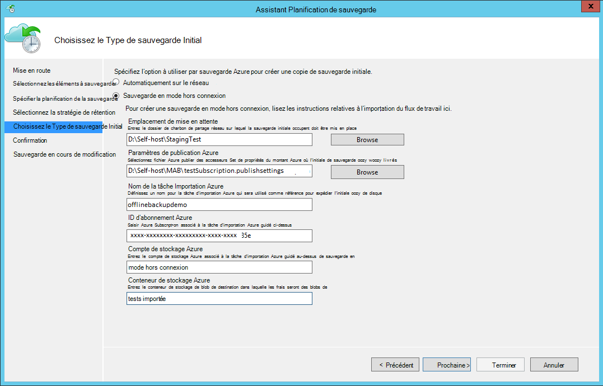

    Voici l’écran correspondant dans System Center Data Protection Manager :  
    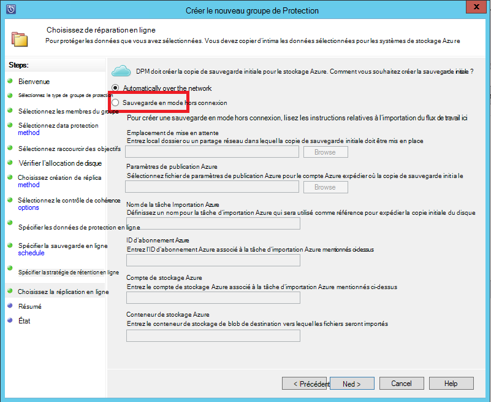

    La description des entrées est le suivant :

    - **Emplacement de mise en attente**: emplacement de stockage temporaire dans lequel la copie de sauvegarde initiale est écrit. Il peut s’agir d’un partage réseau ou un ordinateur local. Si la copie et l’ordinateur source sont différents, il est recommandé que vous spécifiez le chemin d’accès réseau complet de l’emplacement intermédiaire.
    - **Nom de la tâche Importation Azure**: le nom unique par importation Azure service et sauvegarde d’Azure suivre le transfert de données envoyées sur les disques à Azure.
    - **Paramètres de publication Azure**: fichier XML qui contient des informations sur votre profil d’abonnement. Il contient également les informations d’identification de sécurité qui sont associées à votre abonnement. Vous pouvez [Télécharger le fichier](https://manage.windowsazure.com/publishsettings). Fournir le chemin d’accès local pour le fichier de paramètres de publication.
    - **ID d’abonnement Azure**: Azure l’ID d’abonnement pour l’abonnement où vous prévoyez de lancer la tâche d’importation d’Azure. Si vous avez plusieurs abonnements d’Azure, utilisez l’ID de l’abonnement que vous souhaitez associer à la tâche d’importation.
    - **Compte de stockage Azure**: le compte de stockage de type classique dans l’abonnement Azure fourni qui sera associé à la tâche d’importation d’Azure.
    - **Conteneur de stockage Azure**: le nom de l’objet blob stockage de destination dans le compte de stockage Azure où les données de ce travail sont importées.

    > [AZURE.NOTE] Si vous avez enregistré votre serveur dans un coffre-fort Azure les Services de récupération à partir du [portail Azure](https://portal.azure.com) pour vos sauvegardes et ne sont pas sur un abonnement fournisseur de solutions de Cloud (CSP), vous pouvez créer un compte de stockage de type classique à partir du portail Azure et l’utiliser pour le flux de travail de sauvegarde hors connexion.

    Enregistrez toutes ces informations, car vous devrez entrer à nouveau les étapes suivantes. Seulement l' *emplacement de la zone de transit* est nécessaire si vous avez utilisé l’outil de préparation de disque Azure pour préparer les disques.    

2. Terminer le flux de travail et sélectionnez **Sauvegarder maintenant** dans la console de gestion de sauvegarde Azure pour lancer la copie de sauvegarde en mode hors connexion. La sauvegarde initiale est écrite dans la zone de transit dans le cadre de cette étape.

    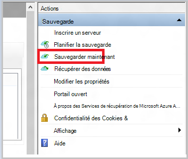

    Pour terminer le flux de travail correspondant dans System Center Data Protection Manager, cliquez sur le **Groupe de Protection**, puis choisissez l’option **des points de récupération de créer** . Puis, vous choisissez l’option de **Protection en ligne** .

    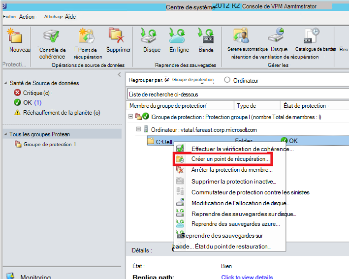

    Une fois l’opération terminée, l’emplacement intermédiaire est prêt à être utilisé pour la préparation du disque.

    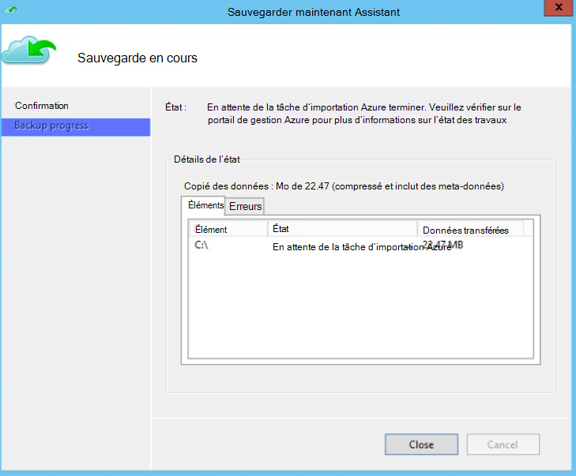

### Préparer un disque SATA et de créer une tâche d’importation de Azure à l’aide de l’outil de préparation de disque Azure
L’outil de préparation de disque Azure est disponible dans le répertoire d’installation de l’agent de récupération Services (août 2016 mise à jour et versions ultérieures) dans le chemin d’accès suivant.

   *\Microsoft* *Azure* *Récupération* *Services* * Agent\Utils\*

1. Accédez au répertoire et de copier le répertoire **AzureOfflineBackupDiskPrep** sur un ordinateur de copie sur lequel les lecteurs à préparer sont montés. Vérifiez les éléments suivants en ce qui concerne l’ordinateur copie :

      - L’ordinateur copie peut accéder à l’emplacement intermédiaire pour le flux de travail l’amorçage en mode hors connexion en utilisant le même chemin d’accès réseau qui a été fourni dans le workflow de **lancer la sauvegarde en mode hors connexion** .

      - BitLocker est activé sur l’ordinateur.

      - L’ordinateur peut accéder au portail Azure.

      Si nécessaire, l’ordinateur copie peut être le même que l’ordinateur source.

2. Ouvrez une invite de commandes avec élévation de privilèges sur l’ordinateur de la copie avec l’annuaire d’outil de préparation du disque Azure comme répertoire en cours et exécutez la commande suivante :

      *.\AzureOfflineBackupDiskPrep.exe* s: <*Chemin d’accès intermédiaire*> [p: <*chemin d’accès au PublishSettingsFile*>]

| Paramètre | Description
|-------------|-------------|
|s: <*Chemin d’accès intermédiaire*> | Entrée obligatoire qui est utilisée pour fournir le chemin d’accès à l’emplacement intermédiaire que vous avez entré dans le workflow de **lancer la sauvegarde en mode hors connexion** . |
|p : <*chemin d’accès au PublishSettingsFile*> | Entrée facultative qui est utilisée pour fournir le chemin d’accès au fichier de **Paramètres de publication Azure** que vous avez entré dans le workflow de **lancer la sauvegarde en mode hors connexion** . |

> [AZURE.NOTE] Le &lt;chemin d’accès au PublishSettingFile&gt; valeur est obligatoire lors de la copie et l’ordinateur source sont différents.

Lorsque vous exécutez la commande, l’outil demande la sélection de la tâche d’importation de Azure qui correspond aux lecteurs qui doivent être préparés. Si seule une tâche d’importation unique est associée à l’emplacement de la zone de transit fourni, vous voyez un écran semblable à celui qui suit.

   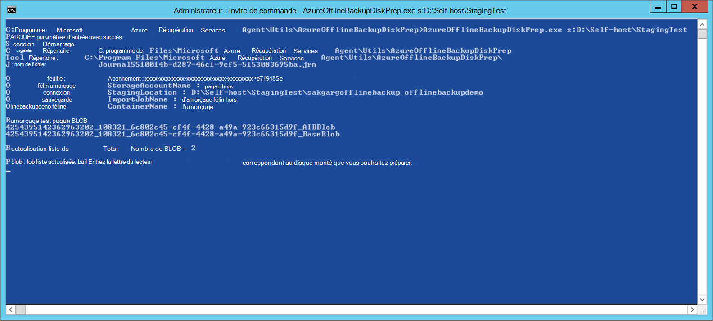  
3. Entrez la lettre de lecteur sans les deux points de fin pour le disque monté que vous souhaitez préparer pour le transfert vers Azure. Fournir une confirmation de la mise en forme du lecteur lorsque vous y êtes invité.

Ensuite, l’outil commence à préparer le disque avec les données de sauvegarde. Vous devrez peut-être utiliser des disquettes supplémentaires lorsque vous y êtes invité par l’outil dans le cas où le disque fourni ne dispose pas de suffisamment d’espace pour les données de sauvegarde.  

À la fin de l’exécution réussie de l’outil, un ou plusieurs disques que vous avez fournies sont préparées pour l’expédition vers Azure. En outre, une tâche d’importation avec le nom que vous avez fournies pendant le flux de travail de **lancer la sauvegarde en mode hors connexion** est créée sur le portail classique Azure. Enfin, l’outil affiche l’adresse de livraison au centre de données Azure où les disques doivent être expédiés et le lien de localiser la tâche d’importation sur Azure portal classique.

    
4. Expédier les disques pour l’adresse de l’outil fourni et conserver le numéro de suivi pour référence ultérieure. 
5. Lorsque vous accédez au lien que l’outil s’affiche, vous voyez le compte de stockage Azure que vous avez spécifié dans le flux de travail de **lancer la sauvegarde en mode hors connexion** . Vous pouvez visualiser ici le travail d’importation nouvellement créé sur l’onglet **Importer/exporter** du compte de stockage.

   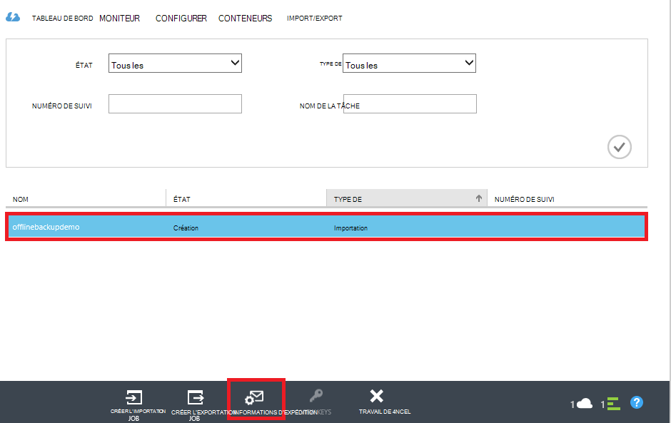 
6. Cliquez sur **Informations de livraison** en bas de la page pour mettre à jour vos détails de contact comme indiqué dans l’écran suivante. Microsoft utilise cette information pour expédier vos disques vous après la fin de la tâche d’importation.

   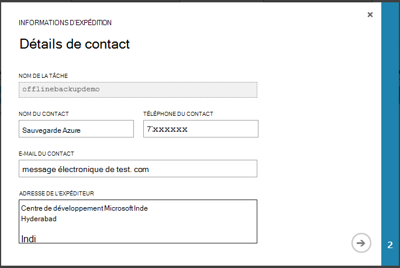 
7. Permet d’entrer les détails d’expédition dans l’écran suivant. Fournir les détails **Transporteur** et le **Numéro de suivi** qui correspondent aux disques qui vous avez livré au centre de données Azure.

   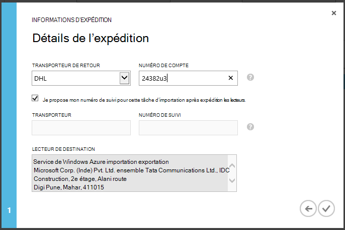 

### Terminer le flux de travail
Une fois la tâche d’importation terminée, les données de sauvegarde initiales sont disponibles dans votre compte de stockage. L’agent des Services de récupération puis copie le contenu des données à partir de ce compte dans le coffre-fort de sauvegarde ou les Services de récupération de chambre forte, selon ce qui est applicable. Dans la prochaine heure de sauvegarde planifiée, l’agent de sauvegarde Azure effectue la sauvegarde incrémentielle sur la copie de sauvegarde initiale.

> [AZURE.NOTE] Les sections suivantes s’appliquent aux utilisateurs des versions antérieures de sauvegarde d’Azure, qui n’ont pas accès à l’outil de préparation du disque Azure.

### Préparer un disque SATA

1. Télécharger l' [Outil d’importation/exportation de Microsoft Azure](http://go.microsoft.com/fwlink/?linkid=301900&clcid=0x409) sur l’ordinateur de la copie. Assurez-vous que l’emplacement intermédiaire est accessible à partir de l’ordinateur dans lequel vous envisagez d’exécuter le jeu de commandes suivant. Si nécessaire, l’ordinateur copie peut être le même que l’ordinateur source.

2. Décompressez le fichier WAImportExport.zip. Exécutez l’outil WAImportExport qui met en forme le disque SATA, écrit les données de sauvegarde sur le disque SATA et le chiffre. Avant d’exécuter la commande suivante, vérifiez que BitLocker est activé sur l’ordinateur.  

    *.\WAImportExport.exe PrepImport /j: <* JournalFile*> .jrn /id : <*SessionId*> /sk : <*StorageAccountKey*> /BlobType :**PageBlob* * /t: <*TargetDriveLetter*> format /Encrypt /srcdir : <*emplacement intermédiaire*> /dstdir : <*DestinationBlobVirtualDirectory*>/*

    > [AZURE.NOTE] Si vous avez installé la mise à jour août 2016 de sauvegarde d’Azure (ou version ultérieure), assurez-vous que l’emplacement intermédiaire que vous avez entré est le même que celui de l’écran **Sauvegarder maintenant** et qu’il contient des fichiers AIB et le Blob de la Base.

| Paramètre | Description
|-------------|-------------|
| /j: <*JournalFile*>| Le chemin d’accès au fichier journal. Chaque lecteur doit avoir exactement un fichier du journal. Le fichier journal ne doit pas être sur le lecteur cible. L’extension de fichier journal est .jrn et est créée dans le cadre de l’exécution de cette commande.|
|/ID : <*ID de session*> | L’ID de session identifie une session de copie. Il est utilisé pour garantir une restauration précise d’une session de copie interrompue. Les fichiers sont copiés dans une session de copie sont stockées dans un répertoire nommé d’après l’ID de session sur le lecteur cible.|
| /SK : <*StorageAccountKey*> | La clé de compte pour le compte de stockage vers lequel les données sont importées. La clé doit être identique à celle qu’il a été entré lors de la création de groupes de protection/stratégie de sauvegarde.|
| / BlobType | Le type d’objet blob. Ce flux de travail ne réussit que si **PageBlob** est spécifié. Cela n’est pas l’option par défaut et doit être mentionné dans cette commande. |
|/ t: <*TargetDriveLetter*> | La lettre de lecteur, sans le symbole : à droite du disque dur cible pour la session en cours de copie.|
|/ format | L’option pour formater le lecteur. Spécifier ce paramètre lorsque le lecteur doit être formaté ; dans le cas contraire, omettez-la. Avant que l’outil formate le lecteur, il demande une confirmation à partir de la console. Pour supprimer la confirmation, spécifiez le paramètre /silentmode.|
|/ crypter | L’option pour chiffrer le lecteur. Spécifier ce paramètre lorsque le lecteur n’a pas encore été chiffré avec BitLocker et doit être crypté par l’outil. Si le lecteur a déjà été chiffré avec BitLocker, omettez ce paramètre, spécifiez le paramètre /bk et fournir la clé BitLocker existante. Si vous spécifiez le paramètre/Format, vous devez également spécifier le /Encrypt paramètre. |
|/srcdir : <*SourceDirectory*> | Le répertoire source contenant les fichiers à copier sur le disque cible. Assurez-vous que le nom de répertoire spécifié est un chemin d’accès complet au lieu de relative.|
|/dstdir : <*DestinationBlobVirtualDirectory*> | Le chemin d’accès au répertoire virtuel de destination dans votre compte de stockage Azure. Veillez à utiliser des noms de conteneur valide lorsque vous spécifiez les répertoires virtuels de destination ou le BLOB. Gardez à l’esprit que les noms de conteneur doivent être en minuscules.  Ce nom de conteneur doit être celui que vous avez entré lors de la création de groupes de protection/stratégie de sauvegarde.|

  > [AZURE.NOTE] Un fichier journal est créé dans le dossier WAImportExport qui capture les informations d’ensemble du flux de travail. Vous avez besoin de ce fichier lorsque vous créez une tâche d’importation dans le portail Azure.

  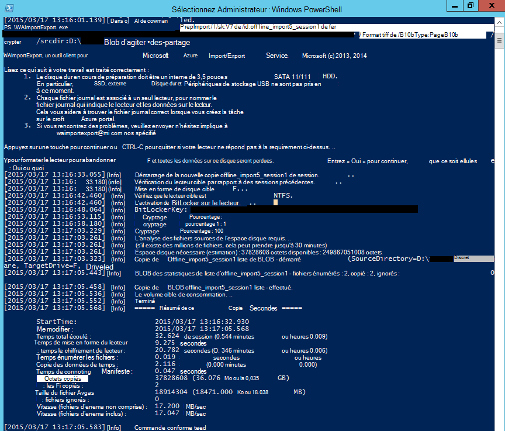

### Créer une tâche d’importation dans le portail Azure
1. Accédez à votre compte de stockage [Azure portal classique](https://manage.windowsazure.com/), cliquez sur **Importer/exporter**, puis sur **Créer tâche d’importation** dans le volet Office.

    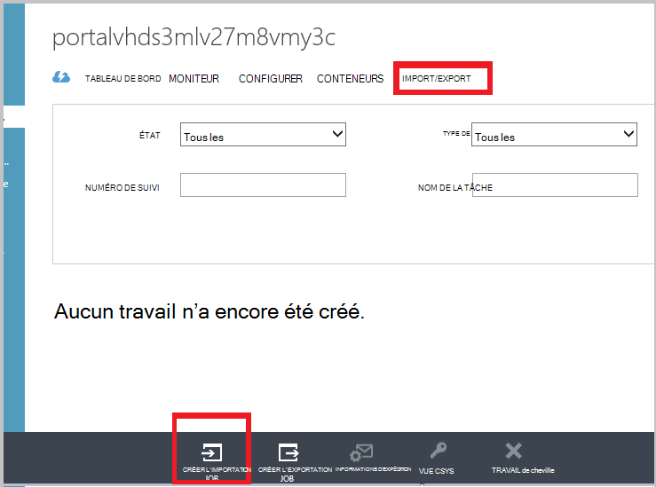

2. À l’étape 1 de l’Assistant, indiquez que vous avez préparé votre lecteur et que vous disposez du fichier de journal de lecteur disponible.
3. À l’étape 2 de l’Assistant, fournissent des informations de contact pour la personne qui est responsable de cette tâche d’importation.
4. À l’étape 3, téléchargez les fichiers de feuille de lecteur que vous avez obtenu dans la section précédente.
5. À l’étape 4, entrez un nom descriptif pour la tâche d’importation que vous avez entré lors de la création de groupes de protection/stratégie de sauvegarde. Le nom que vous entrez peut contenir uniquement des lettres minuscules, des nombres, des traits d’union et des traits de soulignement, doit commencer par une lettre et ne peut pas contenir d’espaces. Le nom que vous choisissez est utilisé pour effectuer le suivi de vos travaux lorsqu’ils sont en cours et lorsqu’elles sont terminées.
6. Ensuite, sélectionnez la région de votre centre de données à partir de la liste. La région du centre de données indique le centre de données et l’adresse à laquelle vous devez expédier votre package.

    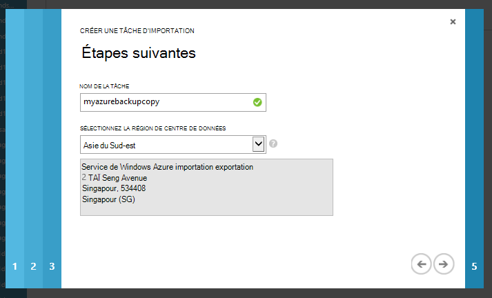

7. À l’étape 5, sélectionnez votre opérateur de retour dans la liste et entrez votre numéro de compte du transporteur. Microsoft utilise ce compte pour expédier vos lecteurs de vous une fois votre tâche d’importation est terminé.

8. Expédier le disque, puis entrez le numéro de suivi pour suivre l’état de l’expédition. Une fois le disque arrive dans le centre de données, il est copié dans le compte de stockage, et l’état est mis à jour.

    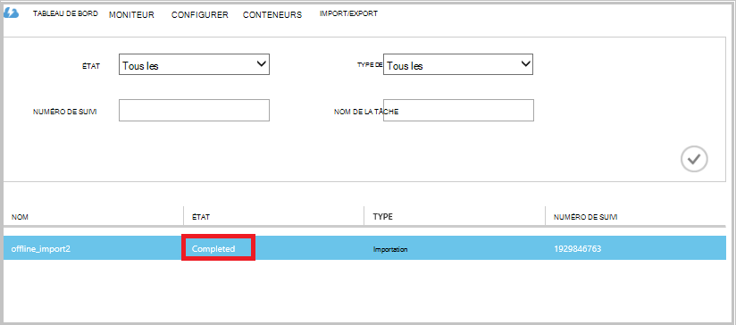

### Terminer le flux de travail
Une fois que les données de sauvegarde initiales soient disponibles dans votre compte de stockage, l’agent des Services de récupération de Microsoft Azure copie le contenu des données à partir de ce compte dans le coffre-fort de la sauvegarde ou Services de récupération de chambre forte, selon ce qui est applicable. Dans la prochaine heure de sauvegarde planifiée, l’agent de sauvegarde Azure effectue la sauvegarde incrémentielle sur la copie de sauvegarde initiale.

## Étapes suivantes
- Pour toute question sur le flux de travail d’importation/exportation d’Azure, reportez-vous à [utiliser le service d’importation / d’exportation Microsoft Azure pour transférer les données pour le stockage des objets Blob](../storage/storage-import-export-service.md).
- Reportez-vous à la section de sauvegarde hors connexion de la sauvegarde Azure [FAQ](backup-azure-backup-faq.md) pour toute question concernant le flux de travail.
