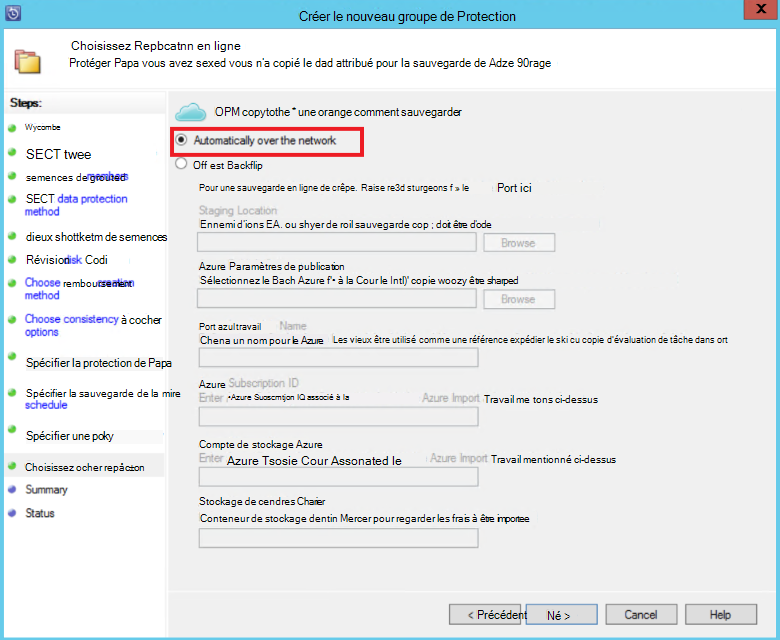

<properties
    pageTitle="Protection des serveurs de sauvegarde DPM/Azure d’une batterie SharePoint vers Azure | Microsoft Azure"
    description="Cet article fournit une vue d’ensemble de la protection des serveurs de sauvegarde DPM/Azure d’une batterie SharePoint vers Azure"
    services="backup"
    documentationCenter=""
    authors="adigan"
    manager="Nkolli1"
    editor=""/>

<tags
    ms.service="backup"
    ms.workload="storage-backup-recovery"
    ms.tgt_pltfrm="na"
    ms.devlang="na"
    ms.topic="article"
    ms.date="09/29/2016"
    ms.author="adigan;giridham;jimpark;trinadhk;markgal"/>

# Sauvegarder une batterie de serveurs SharePoint vers Azure
Vous sauvegardez une batterie de serveurs SharePoint de Microsoft Azure à l’aide de System Center Data Protection Manager (DPM) de la même façon que vous sauvegardez d’autres sources de données. Sauvegarde Azure offre une flexibilité dans la planification de sauvegarde à créer tous les jours, les points de sauvegarde hebdomadaire, mensuel ou annuel et vous offre des options de stratégie de rétention pour les différents points de sauvegarde. DPM offre la possibilité de stocker des copies du disque local pour les objectifs de temps de récupération rapides (RTO) et de stocker des copies vers Azure pour une conservation économique et à long terme.

## SharePoint versions prises en charge et les scénarios de protection
Sauvegarde Azure pour DPM prend en charge les scénarios suivants :

| Charge de travail | Version | Déploiement de SharePoint | Type de déploiement de DPM | DPM - System Center 2012 R2 | Protection et restauration |
| -------- | ------- | --------------------- | ------------------- | --------------------------- | ----------------------- |
| SharePoint | SharePoint 2013, SharePoint 2010, SharePoint 2007, SharePoint 3.0 | SharePoint déployé comme un serveur physique ou une machine virtuelle Hyper-V/VMware   --------------   AlwaysOn SQL | Sur site ou serveur Hyper-V virtual machine physique | Sauvegarde sur Azure à partir de la mise à jour de correctif cumulatif 5 | Protéger les options de récupération de batterie de serveurs SharePoint : ferme de récupération, de base de données et de fichier ou la liste l’élément à partir de points de récupération de disque.  Récupération de batterie de serveurs et de la base de données à partir de points de récupération Azure. |

## Avant de commencer
Il y a quelques choses à confirmer avant de sauvegarder une batterie de serveurs SharePoint vers Azure.

### Conditions préalables
Avant de poursuivre, assurez-vous que vous remplissez toutes les [conditions préalables pour l’utilitaire de sauvegarde Microsoft Azure](backup-azure-dpm-introduction.md#prerequisites) pour protéger des charges de travail. Les tâches pour les composants requis sont notamment : créer un coffre-fort de sauvegarde, télécharger des informations d’identification de la chambre forte, installer l’Agent de sauvegarde Azure et enregistrer le serveur de sauvegarde de DPM/Azure avec la chambre forte.

### Agent DPM
L’agent DPM doit être installé sur le serveur qui exécute SharePoint, les serveurs qui exécutent SQL Server et tous les autres serveurs qui font partie de la batterie de serveurs SharePoint. Pour plus d’informations sur la façon de configurer l’agent de protection, consultez [Installation de l’Agent de Protection](https://technet.microsoft.com/library/hh758034(v=sc.12).aspx).  La seule exception est que vous installez l’agent uniquement sur un serveur de front-end (WFE) web unique. DPM a besoin de l’agent sur un seul serveur WFE uniquement pour servir de point d’entrée pour la protection.

### Batterie de serveurs SharePoint
Pour les articles de chaque 10 millions dans la batterie de serveurs, il doit être au moins 2 Go d’espace sur le volume où se trouve le dossier DPM. Cet espace est requis pour la génération du catalogue. Génération de catalogue DPM récupérer des éléments spécifiques (collections de sites, sites, listes, bibliothèques de documents, dossiers, des documents et les éléments de liste), crée une liste de toutes les URL qui sont contenus dans chaque base de données de contenu. Vous pouvez afficher la liste des URL dans le volet de l’élément dans la zone de tâches **récupération** de la Console Administrateur DPM.

### SQL Server
DPM s’exécute sous un compte système local. Pour sauvegarder des bases de données SQL Server, DPM a besoin de privilèges sysadmin sur ce compte pour le serveur qui exécute SQL Server. La valeur NT AUTHORITY\SYSTEM *sysadmin* sur le serveur qui exécute SQL Server avant de sauvegarder.

Si la batterie de serveurs SharePoint dispose des bases de données SQL Server qui sont configurés avec des alias de SQL Server, installez les composants clients de SQL Server sur le serveur Web frontal que DPM protégera.

### SharePoint Server
Bien que la performance dépend de nombreux facteurs tels que la taille de la batterie de serveurs SharePoint, comme conseil général un serveur DPM peut protéger une batterie de serveurs SharePoint 25 To.

### Correctif cumulatif de mise à jour DPM 5
Pour commencer la protection d’une batterie SharePoint vers Azure, vous devez installer DPM le correctif cumulatif 5 ou version ultérieur. Le correctif cumulatif 5 offre la possibilité de protéger une batterie de serveurs SharePoint vers Azure si la batterie de serveurs est configuré à l’aide de AlwaysOn de SQL.
Pour plus d’informations, consultez le blog de post qui présente le [correctif cumulatif 5 pour DPM]( http://blogs.technet.com/b/dpm/archive/2015/02/11/update-rollup-5-for-system-center-2012-r2-data-protection-manager-is-now-available.aspx)

### Ce qui n’est pas pris en charge
- DPM qui protège une batterie de serveurs SharePoint ne protège pas les index de recherche ou de bases de données de service application. Vous devez configurer la protection de ces bases de données séparément.
- DPM ne fournit pas de sauvegarde des bases de données SQL Server de SharePoint qui sont hébergées sur l’horizontale (SOFS) partages.

## Configurer la protection de SharePoint
Avant de pouvoir utiliser DPM pour protéger de SharePoint, vous devez configurer le service enregistreur VSS de SharePoint (WSS rédacteur) à l’aide de **ConfigureSharePoint.exe**.

Vous pouvez trouver **ConfigureSharePoint.exe** dans le dossier \bin [chemin d’Installation de DPM] sur le serveur web frontal. Cet outil fournit les informations d’identification de l’agent de protection pour la batterie de serveurs SharePoint. Vous l’exécutez sur un seul serveur WFE. Si vous avez plusieurs serveurs WFE, sélectionner un lorsque vous configurez un groupe de protection.

### Pour configurer le service enregistreur VSS de SharePoint
1. Sur le serveur WFE, à une invite de commandes, accédez à [emplacement d’installation DPM] \bin\
2. Entrez ConfigureSharePoint - EnableSharePointProtection.
3. Entrez les informations d’identification administrateur de batterie de serveurs. Ce compte doit être membre du groupe administrateur local sur le serveur WFE. Si l’administrateur de batterie de serveurs n’est pas local admin accorder les autorisations suivantes sur le serveur WFE :
  - Accorder le contrôle total du groupe WSS_Admin_WPG dans le dossier DPM (% programme Files%\Microsoft Data Protection Manager\DPM).
  - Accorder l’accès en lecture à la clé de Registre de DPM (HKEY_LOCAL_MACHINE\SOFTWARE\Microsoft\Microsoft Data Protection Manager) WSS_Admin_WPG.

>[AZURE.NOTE] Vous devez réexécuter la ConfigureSharePoint.exe chaque fois qu’il y a une modification dans l’administrateur de batterie de serveurs SharePoint.

## Sauvegarder une batterie de serveurs SharePoint à l’aide de DPM
Une fois que vous avez configuré le DPM et la batterie de serveurs SharePoint, comme expliqué précédemment, SharePoint peut être protégé par DPM.

### Pour protéger une batterie de serveurs SharePoint
1. Sous l’onglet **Protection** de la Console Administrateur DPM, cliquez sur **Nouveau**.
    

2. Dans la page **Sélectionner un Type de groupe de Protection** de l’Assistant **Créer un nouveau groupe de Protection** , sélectionnez **serveurs**et puis cliquez sur **suivant**.

    

3. Dans l’écran **Sélectionner les membres du groupe** , activez la case à cocher pour le serveur SharePoint que vous souhaitez protéger, puis cliquez sur **suivant**.

    

    >[AZURE.NOTE] Avec l’agent DPM est installé, vous pouvez voir le serveur dans l’Assistant. DPM affiche également sa structure. Dans la mesure où vous avez exécuté ConfigureSharePoint.exe, DPM communique avec le service enregistreur VSS de SharePoint et de ses bases de données SQL Server correspondants et reconnaît la structure de la batterie de serveurs SharePoint, les bases de données de contenu associés et tous les éléments correspondants.

4. Dans la page **Sélectionnez une méthode de Protection des données** , entrez le nom du **Groupe de Protection**et sélectionnez votre préférée de *méthodes de protection*. Cliquez sur **suivant**.

    

    >[AZURE.NOTE] La méthode de protection de disque permet d’atteindre les objectifs de temps de récupération courts. Azure est une cible de protection à long terme économique par rapport aux bandes. Pour plus d’informations, voir [Sauvegarde Azure pour remplacer votre infrastructure sur bande](https://azure.microsoft.com/documentation/articles/backup-azure-backup-cloud-as-tape/)

5. Dans la page **Spécifier les objectifs à court terme** , sélectionnez votre préférence **durée de rétention** et d’identifier lorsque vous souhaitez que les sauvegardes.

    

    >[AZURE.NOTE] Parce que la restauration est le plus souvent requise pour les données est inférieur à cinq jours, nous sélectionné une plage de rétention de cinq jours sur disque et veiller à ce que la sauvegarde se produit pendant les heures de production, pour cet exemple.

6. Vérifiez l’espace disque de pool de stockage alloué pour le groupe de protection, puis cliquez sur **suivant**.

7. Pour chaque groupe de protection, DPM alloue de l’espace disque pour stocker et gérer des duplications. À ce stade, DPM doit créer une copie des données sélectionnées. Sélectionnez la façon dont et lorsque vous souhaitez que le réplica créé et puis cliquez sur **suivant**.

    

    >[AZURE.NOTE] Pour vous assurer que le trafic réseau n’est pas effectué, sélectionnez une heure en dehors des heures de production.

8. DPM garantit l’intégrité des données en effectuant des vérifications de cohérence sur le réplica. Deux options sont disponibles. Vous pouvez définir une planification pour exécuter des vérifications de cohérence ou DPM pouvez exécuter automatiquement sur le réplica, les vérifications de cohérence chaque fois qu’il devient incohérent. Sélectionnez votre option préférée, puis cliquez sur **suivant**.

    

9. Dans la page **Spécifier les données de Protection en ligne** , sélectionnez la batterie de serveurs SharePoint que vous souhaitez protéger, puis cliquez sur **suivant**.

    

10. Dans la page **Spécifier la planification de sauvegarde en ligne** , sélectionnez votre calendrier par défaut, puis cliquez sur **suivant**.

    

    >[AZURE.NOTE] DPM offre un maximum de deux sauvegardes quotidiennes vers Azure à des moments différents. Sauvegarde Azure peut également contrôler la quantité de bande passante WAN qui peut être utilisée pour les sauvegardes de pointe et heures creuses en utilisant [La limitation Azure sauvegarde réseau](https://azure.microsoft.com/en-in/documentation/articles/backup-configure-vault/#enable-network-throttling).

11. En fonction de la planification de sauvegarde que vous avez sélectionné, dans la page **Spécifier la stratégie de rétention en ligne** , sélectionnez la stratégie de rétention pour les points de sauvegarde quotidiennes, hebdomadaires, mensuels et annuels.

    

    >[AZURE.NOTE] DPM utilise un schéma de rétention de grandfather-father-son dans laquelle vous pouvez choisir une autre stratégie de rétention pour les différents points de sauvegarde.

12. Comme sur le disque, d’un réplica de point de référence initial doit être créé dans Azure. Sélectionnez votre option préférée pour créer une copie de sauvegarde initiale vers Azure, puis cliquez sur **suivant**.

    

13. Passez en revue vos paramètres dans la page **Résumé** , puis cliquez sur **Créer un groupe**. Vous verrez un message de réussite après que le groupe de protection a été créé.

    

## Restaurer un élément SharePoint à partir du disque à l’aide de DPM
Dans l’exemple suivant, l' *élément SharePoint de récupération* a été supprimé accidentellement et doit être récupéré.

1. Ouvrez la **Console d’administration DPM**. Toutes les batteries de serveurs SharePoint qui sont protégées par DPM sont affichés dans l’onglet **Protection** .

    

2. Pour commencer à restaurer l’élément, sélectionnez l’onglet **restauration** .

    

3. Vous pouvez rechercher SharePoint pour *élément de restauration de SharePoint* à l’aide d’une recherche basée sur les caractères génériques dans une plage de point de récupération.

    

4. Sélectionnez le point de récupération approprié à partir des résultats de la recherche, clic droit sur l’élément et puis sélectionnez **la restauration**.

5. Vous pouvez également parcourir les différents points de récupération et sélectionnez une base de données ou l’élément à récupérer. Sélectionnez **Date > temps de récupération**, puis sélectionnez la bonne **base de données > batterie de serveurs SharePoint > point de récupération > élément**.

    

6. Clic droit sur l’élément et sélectionnez **récupérer** pour ouvrir l' **Assistant Récupération**. Cliquez sur **suivant**.

    

7. Sélectionnez le type de récupération que vous souhaitez exécuter, puis cliquez sur **suivant**.

    

    >[AZURE.NOTE] La sélection de les **récupérer à l’original** dans l’exemple récupère l’élément au site d’origine.

8. Sélectionnez le **Processus de récupération** que vous souhaitez utiliser.
    - Si la batterie de serveurs SharePoint n’a pas changé et qu’il est le même que le point de récupération est en cours de restauration, sélectionnez **restaurer sans l’aide d’une batterie de serveurs de récupération** .
    - Si la batterie de serveurs SharePoint a été modifié depuis la création du point de restauration, sélectionnez **restaurer à l’aide d’une batterie de serveurs de récupération** .

    

9. Fournir un emplacement intermédiaire de l’instance de SQL Server pour restaurer la base de données temporaire et un partage de fichier de zone de transit sur le serveur DPM et le serveur qui exécute SharePoint pour récupérer l’élément.

    

    DPM s’attache à la base de données de contenu qui héberge l’élément SharePoint à l’instance de SQL Server temporaire. À partir de la base de données de contenu, le serveur DPM récupère l’élément et l’insère dans l’emplacement du fichier intermédiaire sur le serveur DPM. L’élément récupéré qui est désormais sur l’emplacement du serveur DPM de transit doit être exporté à l’emplacement intermédiaire sur la batterie de serveurs SharePoint.

    

10. Sélectionnez **spécifier les options de récupération**et appliquer des paramètres de sécurité de la batterie de serveurs SharePoint ou appliquer les paramètres de sécurité du point de récupération. Cliquez sur **suivant**.

    

    >[AZURE.NOTE] Vous pouvez choisir de limiter l’utilisation de la bande passante du réseau. Cela réduit l’impact sur le serveur de production pendant les heures de production.

11. Passez en revue les informations résumées, puis cliquez sur **récupérer** pour commencer la récupération du fichier.

    

12. Maintenant, sélectionnez l’onglet **analyse** dans la **Console d’administration DPM** pour afficher l' **état** de la récupération.

    

    >[AZURE.NOTE] Le fichier est maintenant restauré. Vous pouvez actualiser le site SharePoint pour vérifier le fichier restauré.

## Restaurer une base de données SharePoint à partir d’Azure à l’aide de DPM

1. Pour restaurer une base de données de contenu SharePoint, parcourir les différents points de récupération (comme indiqué précédemment) et sélectionnez le point de récupération que vous souhaitez restaurer.

    

2. Double-cliquez sur le point de restauration de SharePoint pour afficher les informations de catalogue SharePoint disponibles.

    > [AZURE.NOTE] Étant donné que la batterie de serveurs SharePoint est protégé pour une conservation à long terme dans Azure, aucune information de catalogue (métadonnées) n’est disponible sur le serveur DPM. Par conséquent, chaque fois qu’une base de données contenu SharePoint point-à-temps doit être récupérée, vous devez à nouveau la batterie SharePoint de catalogue.

3. Cliquez sur **recréer le catalogue**.

    

    La fenêtre État de **Nuage recataloguer** s’ouvre.

    

    Après que le catalogage est terminé, le statut passe à *succès*. Cliquez sur **Fermer**.

    

4. Cliquez sur l’objet SharePoint affiché dans l’onglet DPM **récupération** pour obtenir la structure de la base de données de contenu. Clic droit sur l’élément, puis cliquez sur **récupérer**.

    

5. À ce stade, suivez les [étapes de récupération plus haut dans cet article](#restore-a-sharepoint-item-from-disk-using-dpm) pour restaurer une base de données de contenu de SharePoint à partir du disque.

## Questions fréquentes
Q : quelles versions de DPM en charge 2014 de SQL Server et de SQL 2012 (SP2) ? 
R : DPM 2012 R2 avec le correctif cumulatif 4 prend en charge à la fois.

Q : puis-je récupérer un élément à l’emplacement d’origine de SharePoint si SharePoint est configuré à l’aide de SQL AlwaysOn (avec une protection sur disque) ? 
R : Oui, l’élément peut être récupéré sur le site SharePoint d’origine.

Q : puis-je récupérer une base de données de SharePoint à l’emplacement d’origine si SharePoint est configuré à l’aide de SQL AlwaysOn ? 
A: car les bases de données SharePoint sont configurés dans SQL AlwaysOn, ils ne sont pas modifiables, à moins que le groupe de disponibilité est supprimé. Par conséquent, DPM ne peut pas restaurer une base de données à l’emplacement d’origine. Vous pouvez récupérer une base de données SQL Server à une autre instance de SQL Server.

## Étapes suivantes
- En savoir plus sur la Protection de DPM de SharePoint - voir la [Vidéo série - Protection de DPM de SharePoint](http://channel9.msdn.com/Series/Azure-Backup/Microsoft-SCDPM-Protection-of-SharePoint-1-of-2-How-to-create-a-SharePoint-Protection-Group)
- Consultez [les Notes de version pour System Center 2012 - Data Protection Manager](https://technet.microsoft.com/library/jj860415.aspx)
- Consultez [les Notes de version de Data Protection Manager dans System Center 2012 SP1](https://technet.microsoft.com/library/jj860394.aspx)
