<properties
    pageTitle="Sauvegarde Azure pour les charges de travail de SQL Server à l’aide de DPM | Microsoft Azure"
    description="Introduction à la sauvegarde des bases de données SQL Server en utilisant le service de sauvegarde d’Azure"
    services="backup"
    documentationCenter=""
    authors="adigan"
    manager="Nkolli1"
    editor=""/>

<tags
    ms.service="backup"
    ms.workload="storage-backup-recovery"
    ms.tgt_pltfrm="na"
    ms.devlang="na"
    ms.topic="article"
    ms.date="09/27/2016"
    ms.author="adigan;giridham; jimpark;markgal;trinadhk"/>

# Sauvegarde Azure pour les charges de travail de SQL Server à l’aide de DPM

Cet article vous guide dans les étapes de configuration pour la sauvegarde des bases de données SQL Server à l’aide de la sauvegarde d’Azure.

Pour sauvegarder des bases de données SQL Server sur Azure, vous avez besoin d’un compte Azure. Si vous n’avez pas un compte, vous pouvez créer un compte d’essai gratuit de seulement quelques minutes. Pour plus d’informations, reportez-vous à la section [D’essai Azure](https://azure.microsoft.com/pricing/free-trial/).

La gestion de la sauvegarde de base de données de SQL Server sur Azure et d’Azure la reprise implique trois étapes :

1. Créer une stratégie de sauvegarde pour protéger les bases de données SQL Server vers Azure.
2. Créer des copies de sauvegarde à la demande pour Azure.
3. Récupérer la base de données Azure.

## Avant de commencer
Avant de commencer, assurez-vous que toutes les [conditions requises](../backup-azure-dpm-introduction.md#prerequisites) pour l’utilisation de Microsoft Azure sauvegarde pour protéger les charges de travail ont été respectées. Les conditions préalables traitent des tâches telles que : création d’un coffre-fort de sauvegarde, télécharger des informations d’identification de la chambre forte, l’installation de l’Agent de sauvegarde Azure et enregistrement du serveur avec la chambre forte.

## Créer une stratégie de sauvegarde pour protéger les bases de données SQL Server vers Azure

1. Sur le serveur DPM, cliquez sur l’espace de travail de **Protection** .

2. Dans le ruban, cliquez sur **Nouveau** pour créer un nouveau groupe de protection.

    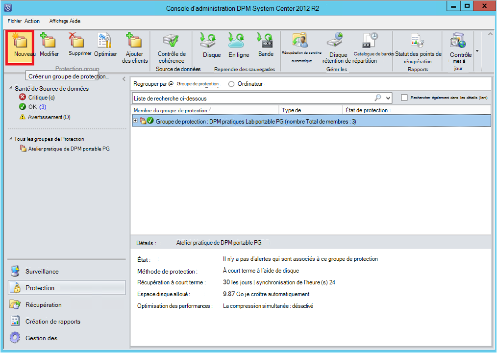

3. DPM affiche l’écran de démarrage avec le Guide sur la création d’un **Groupe de Protection**. Cliquez sur **suivant**.

4. Sélectionner les **serveurs**.

    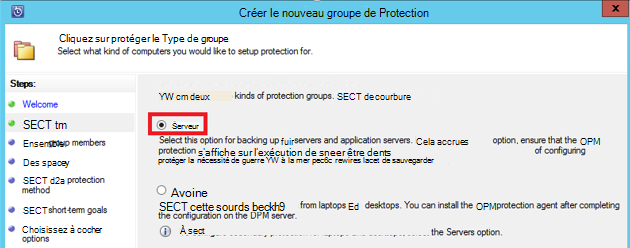

5. Développez l’ordinateur SQL Server où se trouvent les bases de données à sauvegarder. DPM affiche diverses sources de données peuvent être sauvegardées à partir de ce serveur. Développez **Tous les partages de SQL** et sélectionnez les bases de données (dans ce cas nous sélectionné ReportServer$ MSDPM2012 et ReportServer$ MSDPM2012TempDB) à sauvegarder. Cliquez sur **suivant**.

    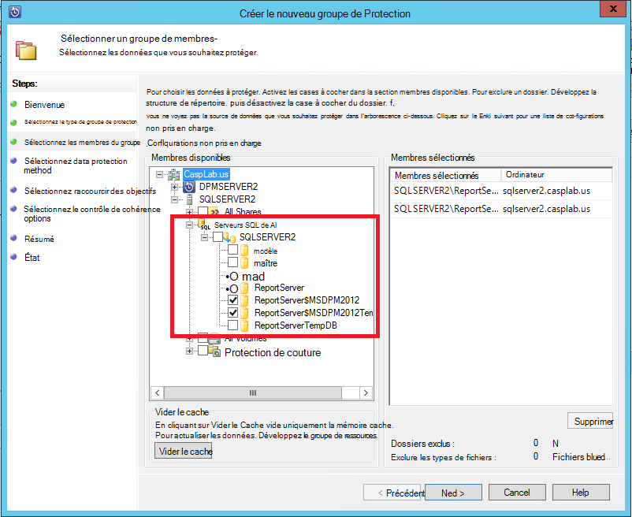

6. Fournissez un nom pour le groupe de protection et sélectionnez la case à cocher **je souhaite une Protection en ligne** .

    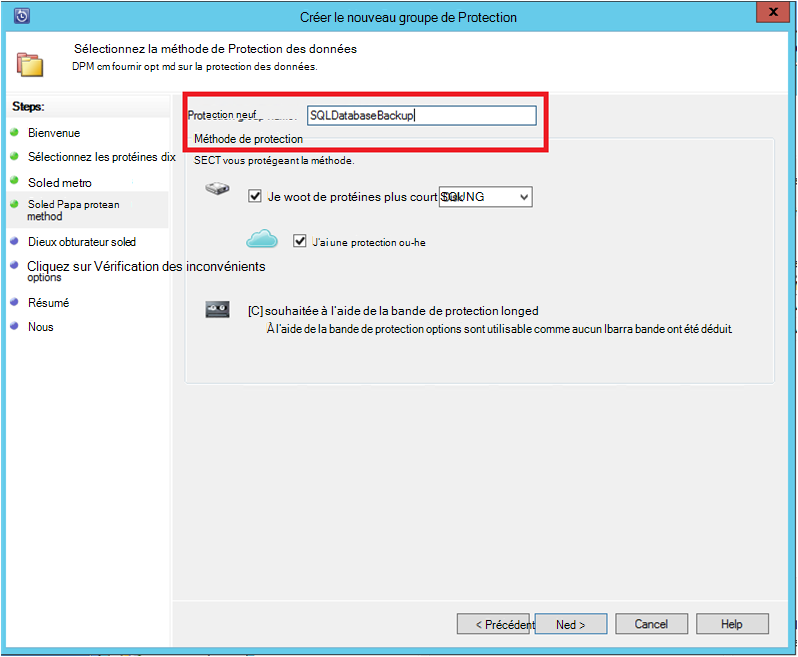

7. Dans l’écran **Spécifier les objectifs à court terme** , inclure les entrées nécessaires pour créer des points de sauvegarde sur disque.

    Nous voyons ici que la **durée de rétention** est définie sur *5 jours*, **la fréquence de synchronisation** est définie sur une fois toutes les *15 minutes* qui est la fréquence à laquelle la sauvegarde est effectuée. **Express la sauvegarde complète** est définie à *8 h 00*.

    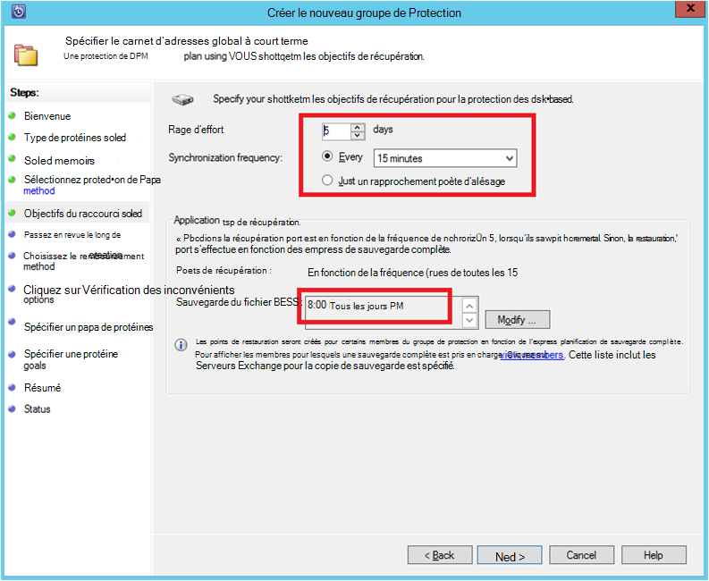

    >[AZURE.NOTE] À 8 h 00 (en fonction de l’entrée de l’écran), un point de sauvegarde est créé chaque jour par le transfert de données qui a été modifiées à partir du point de sauvegarde de 8:00 heures du jour précédent. Ce processus est appelé **Express une sauvegarde complète**. Lors de la synchronisation des journaux de transaction toutes les 15 minutes, s’il est nécessaire pour récupérer la base de données à 9 h 00 – le point est créé en relisant les journaux à partir de la dernière express point de sauvegarde complète (20 h 00 dans le cas présent).

8. Cliquez sur **suivant**

    DPM affiche l’espace de stockage total disponible et de l’utilisation de l’espace disque potentielles.

    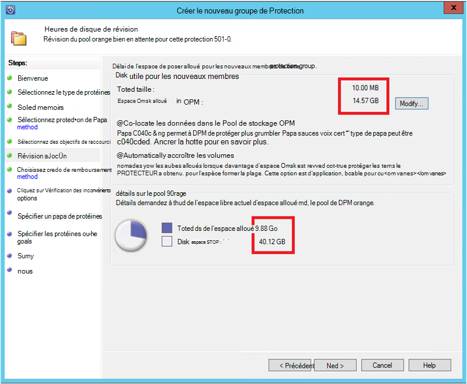

    Par défaut, DPM crée un volume par la source de données (base de données de SQL Server) qui est utilisé pour la copie de sauvegarde initiale. Avec cette approche, le Gestionnaire de disque logique (LDM) limite la protection DPM à des sources de données de 300 (bases de données SQL Server). Pour contourner cette limitation, sélectionnez le **cohabiter les données dans le Pool de stockage DPM**, option. Si vous utilisez cette option, DPM utilise un volume unique pour plusieurs sources de données, ce qui permet à DPM de protéger jusqu'à 2000 bases de données SQL.

    Si l’option de **croissance automatique des volumes** est sélectionnée, DPM peut représenter le volume de sauvegarde accru à mesure que les données de production augmentent. Si l’option de **croissance automatique des volumes** n’est pas sélectionnée, DPM limite le stockage de sauvegarde utilisé pour les sources de données dans le groupe de protection.

9. Les administrateurs disposent de l’option de transfert de cette sauvegarde initiale manuellement (hors réseau) pour éviter la congestion de la bande passante ou sur le réseau. Ils peuvent également configurer l’heure à laquelle le transfert initial peut se produire. Cliquez sur **suivant**.

    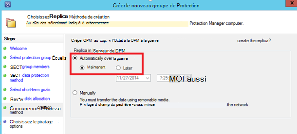

    La copie de sauvegarde initiale nécessite le transfert de la source de données (base de données de SQL Server) à partir du serveur de production (ordinateur SQL Server) vers le serveur DPM. Ces données peuvent être volumineux et transfert de données sur le réseau risque de dépasser la bande passante. Pour cette raison, les administrateurs peuvent choisir de transférer la sauvegarde initiale : **manuellement** (à l’aide de supports amovibles) pour éviter la congestion de la bande passante, ou **automatiquement via le réseau** (à une heure spécifiée).

    Une fois la sauvegarde initiale complète, le reste des sauvegardes sont des sauvegardes incrémentielles sur la copie de sauvegarde initiale. Sauvegardes incrémentielles ont tendance à être petit et sont aisément transférées sur le réseau.

10. Choisissez si vous souhaitez que la vérification de cohérence pour exécuter et cliquez sur **suivant**.

    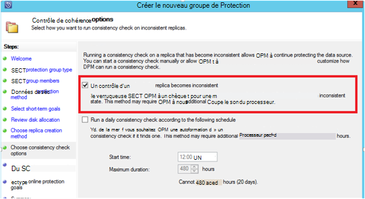

    DPM peut effectuer une cohérence à cocher pour vérifier l’intégrité du point de sauvegarde. Il calcule le checksum du fichier de sauvegarde sur le serveur de production (ordinateur SQL Server dans ce scénario) et les données de sauvegarde de ce fichier à DPM. En cas de conflit, il est supposé que le fichier de sauvegarde à DPM est endommagé. DPM corrige les données sauvegardées en envoyant les blocs correspondant à l’incohérence dans des totaux. Comme la vérification de cohérence est une opération nécessitant des performances élevées, les administrateurs ont la possibilité de planifier la vérification de cohérence ou de l’exécuter automatiquement.

11. Pour spécifier une protection en ligne pour les sources de données, sélectionnez les bases de données à protéger sur Azure et cliquez sur **suivant**.

    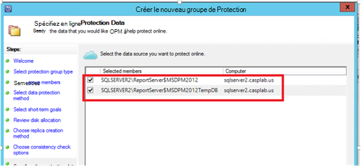

12. Les administrateurs peuvent choisir des plannings de sauvegarde et les règles de conservation adaptées à leurs stratégies de l’organisation.

    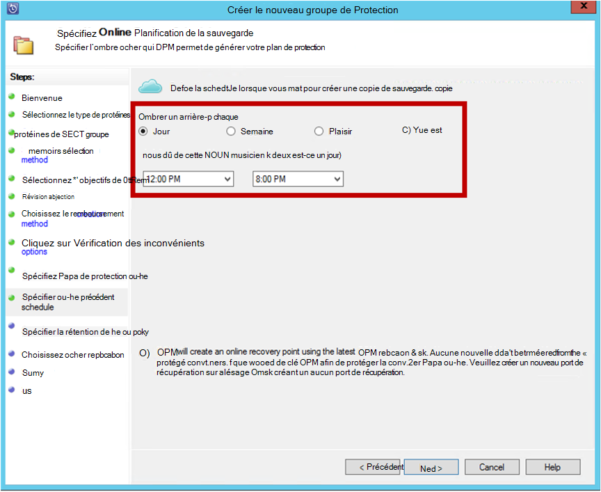

    Dans cet exemple, les sauvegardes sont effectuées une fois par jour à 12 h 00 et 20 h 00 (partie inférieure de l’écran)

    >[AZURE.NOTE] Il est recommandé de disposer de quelques points de récupération à court terme sur disque, pour une restauration rapide. Ces points de restauration sont utilisés pour « reprise ». Azure constitue un emplacement hors site bonne avec SLA plus élevés et garantie de disponibilité.

    **Meilleures pratiques**: Assurez-vous que les sauvegardes d’Azure sont prévues après l’exécution de sauvegardes de disque à l’aide de DPM. Ainsi, la dernière sauvegarde de disque à copier vers Azure.

13. Cliquez sur la planification de stratégies de rétention. Les détails sur le fonctionne de la stratégie de rétention sont fournies à la [Sauvegarde Azure pour remplacer votre article d’infrastructure de bandes](backup-azure-backup-cloud-as-tape.md).

    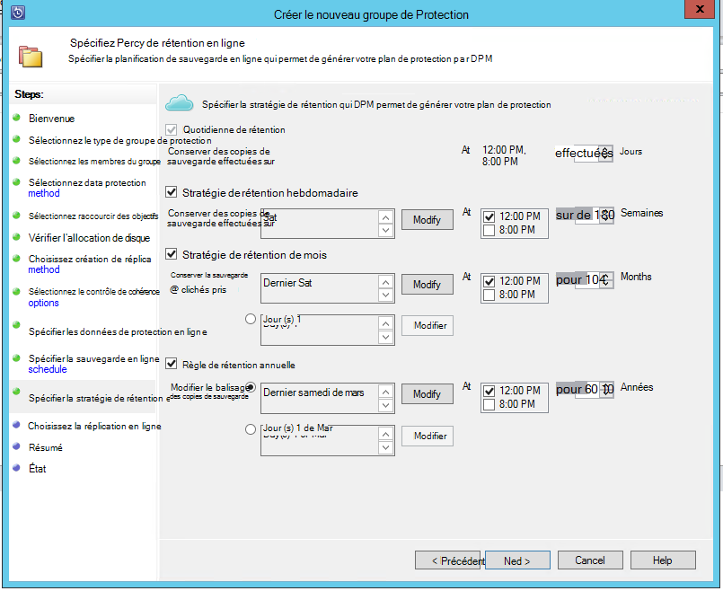

    Dans cet exemple :

    - Les sauvegardes effectuées une fois par jour à 12 h 00 et 20 h 00 (partie inférieure de l’écran) et sont conservés pendant 180 jours.
    - La sauvegarde le samedi à 12 h 00. est conservé pendant 104 semaines
    - La sauvegarde du dernier samedi à 12 h 00. est conservé pendant 60 mois
    - La sauvegarde du dernier samedi de mars à 12 h 00 est conservée pendant 10 ans

14. Cliquez sur **suivant** et sélectionnez l’option appropriée pour le transfert de la copie de sauvegarde initiale vers Azure. Vous pouvez choisir **automatiquement sur le réseau** ou **Sauvegarde en mode hors connexion**.

    - **Automatiquement sur le réseau** transfère les données de sauvegarde vers Azure selon le planning choisi pour la sauvegarde.
    - Fonctionnement de la **Sauvegarde en mode hors connexion** est expliquée au [flux de travail de sauvegarde en mode hors connexion dans Azure sauvegarde](backup-azure-backup-import-export.md).

    Choisir le mécanisme de transfert appropriée pour envoyer la copie de sauvegarde initiale vers Azure et cliquez sur **suivant**.

15. Une fois que vous passez en revue les détails de stratégie dans l’écran **Résumé** , cliquez sur le bouton **créer un groupe** à la fin du flux. Vous pouvez cliquez sur le bouton **Fermer** et surveiller la progression de la tâche dans l’espace de travail de surveillance.

    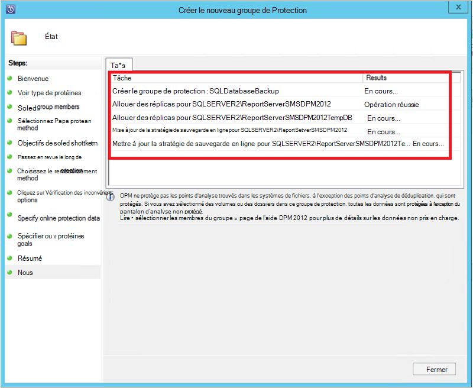

## Sauvegarde d’une base de données SQL Server
Bien que les étapes précédentes de créer une stratégie de sauvegarde, un « point de récupération » est créé uniquement lors de la première sauvegarde se produit. Au lieu d’attendre que le planificateur s’active, le déclencheur de la création d’une récupération suit point de manuellement.

1. Attendez que l’état de groupe de protection indique **OK** pour la base de données avant de créer le point de récupération.

    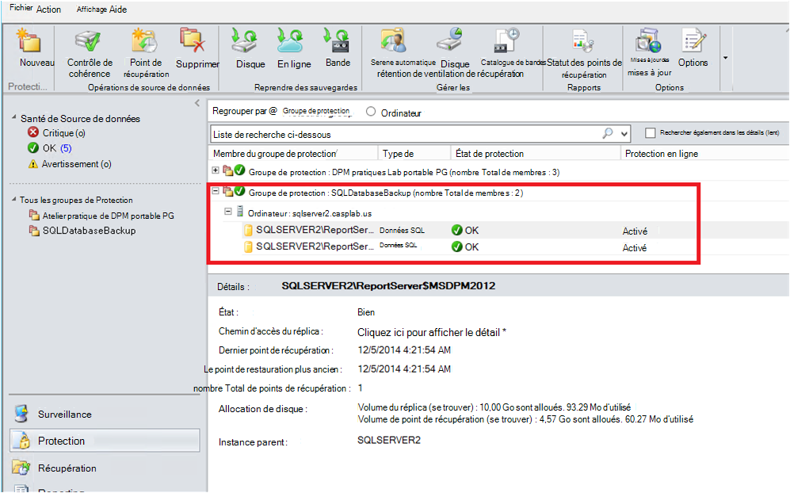

2. Avec le bouton droit sur la base de données et sélectionnez **Créer un Point de récupération**.

    

3. Choisissez la **Protection en ligne** dans le menu déroulant et cliquez sur **OK**. Lance la création d’un point de récupération dans Azure.

    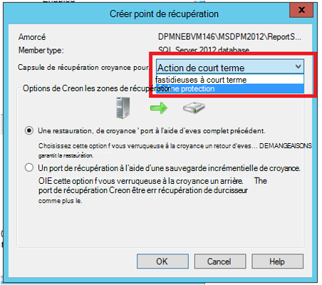

4. Vous pouvez afficher la progression de la tâche dans l’espace de travail de **surveillance** où vous trouverez un en cours travail similaire à celui illustré dans la figure suivante.

    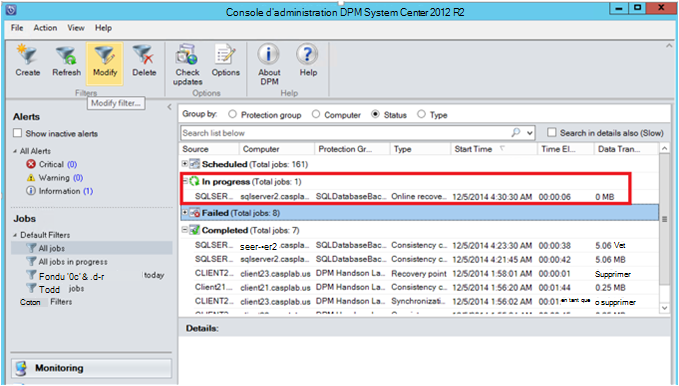

## Restaurer une base de données SQL Server à partir d’Azure
Les étapes suivantes sont nécessaires pour récupérer une entité protégée (base de données de SQL Server) Azure.

1. Ouvrez la Console de gestion du serveur DPM. Accédez à l’espace de travail de **récupération** où vous pouvez consulter les serveurs sauvegardés par DPM. Parcourir la base de données requise (dans ce cas $MSDPM2012 de ReportServer). Sélectionnez une heure de **restauration à partir de** qui se termine par **en ligne**.

    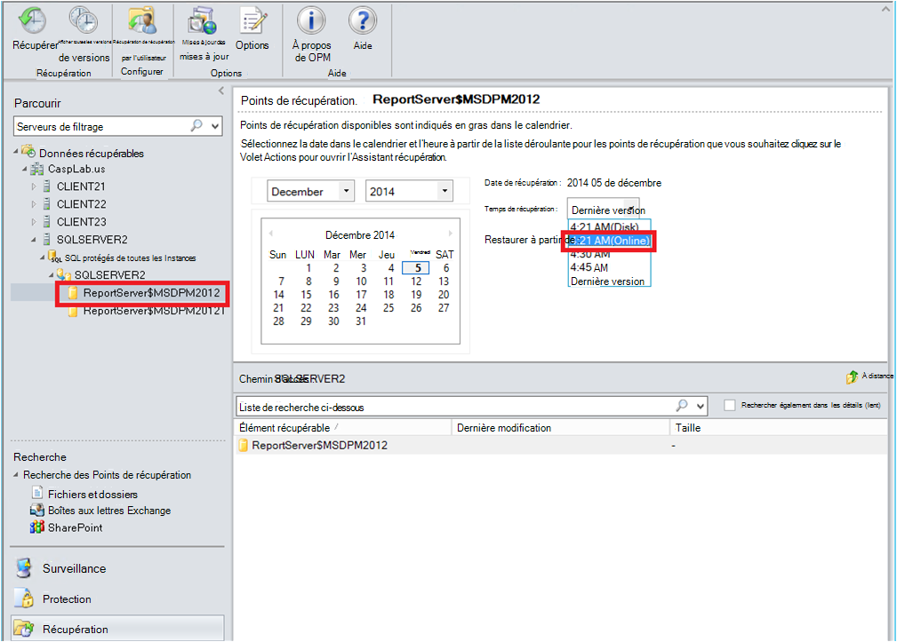

2. Cliquez sur le nom de la base de données, cliquez sur **récupérer**.

    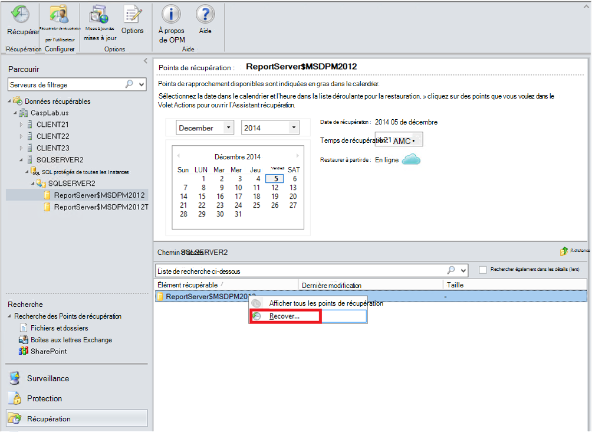

3. DPM affiche les détails du point de récupération. Cliquez sur **suivant**. Pour remplacer la base de données, sélectionnez le type de récupération **récupérer à l’instance d’origine de SQL Server**. Cliquez sur **suivant**.

    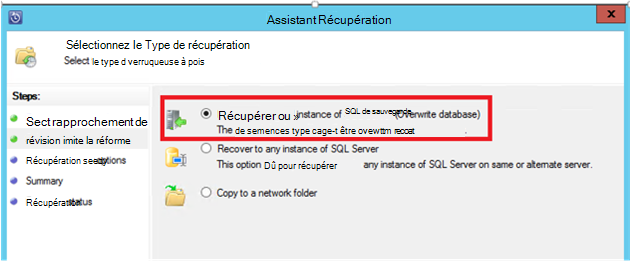

    Dans cet exemple, DPM permet la récupération de la base de données à une autre instance de SQL Server ou dans un dossier de réseau autonome.

4. Dans l’écran **options de spécifier de récupération** , vous pouvez sélectionner les options de récupération, telles que la limitation de bande passante réseau pour limiter la bande passante utilisée lors de la récupération. Cliquez sur **suivant**.

5. Dans l’écran **Résumé** , vous voyez toutes les configurations de récupération fournies jusqu'à présent. Cliquez sur **récupérer**.

    L’état de récupération indique la base de données en cours de récupération. Vous pouvez cliquer sur **Fermer** pour fermer l’Assistant et afficher la progression dans l’espace de travail de **surveillance** .

    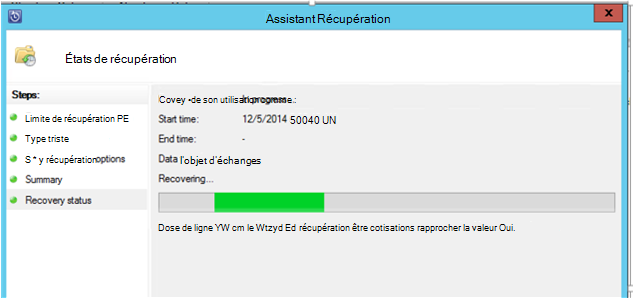

    Une fois la restauration terminée, la base de données restaurée est application cohérente.

### Étapes suivantes :

• [Forum aux questions de sauvegarde azure](backup-azure-backup-faq.md)
