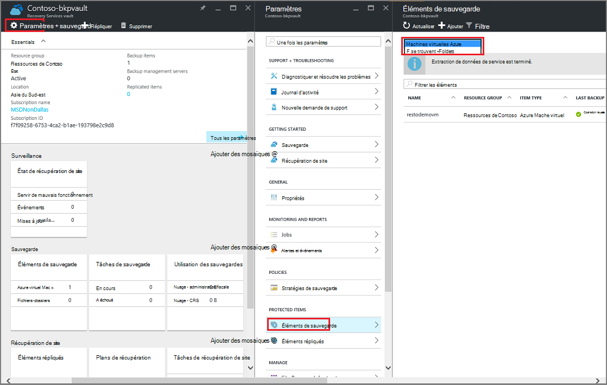

<properties
   pageTitle="Supprimer un coffre-fort Azure sauvegarde | Microsoft Azure"
   description="Comment supprimer un coffre-fort de sauvegarde d’Azure. Pour déterminer pourquoi vous ne pouvez pas supprimer un coffre-fort de sauvegarde. "
   services="service-name"
   documentationCenter="dev-center-name"
   authors="markgalioto"
   manager="cfreeman"
   editor=""/>

<tags
   ms.service="backup"
   ms.devlang="na"
   ms.topic="article"
   ms.tgt_pltfrm="na"
   ms.workload="storage-backup-recovery"
   ms.date="08/29/2016"
   ms.author="markgal;trinadhk"/>

# Supprimer un coffre-fort Azure sauvegarde

Le service de sauvegarde d’Azure comprend deux types de coffres-forts - le coffre-fort de la sauvegarde et la chambre forte de Services de récupération. Le coffre-fort de sauvegarde reçue en premier. Puis le coffre-fort de Services de récupération arrivée de prendre en charge les déploiements de gestionnaire de ressources de développé. Étant donné les capacités étendues et les dépendances d’informations qui doivent être stockés dans le coffre-fort, la suppression d’un coffre-fort de Services de récupération peut sembler plus difficile qu’il doit être.

|**Type de déploiement**|**Portail**|**Nom du coffre-fort**|
|--------------|----------|---------|
|Classique|Classique|Chambre forte de sauvegarde|
|Gestionnaire de ressources|Azure|Services de récupération de chambre forte|

> [AZURE.NOTE] Coffres-forts de sauvegarde ne peut pas protéger les solutions déployées par le Gestionnaire de ressources. Toutefois, vous pouvez utiliser un coffre-fort de Services de récupération pour protéger les ordinateurs virtuels et les serveurs déployés de variation.  

Dans cet article, nous utilisons le terme, coffre-fort, pour faire référence au formulaire générique du coffre-fort de sauvegarde ou de coffre-fort de Services de récupération. Nous utilisons le nom formel, coffre-fort de sauvegarde ou les Services de récupération coffre-fort, lorsqu’il est nécessaire de distinguer entre les coffres-forts.

## Suppression d’un coffre-fort de Services de récupération

Un coffre-fort de Services de récupération est de supprimer en une seule étape - *fourni que le coffre-fort ne contient aucune ressource*. Avant de pouvoir supprimer un coffre-fort de Services de restauration, vous devez supprimer ou supprimer toutes les ressources dans la chambre forte. Si vous essayez de supprimer un coffre-fort qui contient des ressources, vous obtenez une erreur comme l’image suivante.

  

Jusqu'à ce que vous avez désactivé les ressources à partir du coffre-fort, cliquer sur **Réessayer** génère la même erreur. Si vous êtes bloqué dans ce message d’erreur, cliquez sur **Annuler** et suivez les étapes ci-dessous pour supprimer les ressources dans le coffre-fort de Services de récupération.

### La suppression des éléments à partir d’une chambre forte protection d’un ordinateur virtuel

Si vous avez déjà ouvert le coffre-fort de Services de récupération, passez à la deuxième étape.

1.  Ouvrir le portail Azure et du tableau de bord, ouvrez le coffre-fort que vous souhaitez supprimer.

    Si vous n’avez pas le coffre-fort de Services de récupération épinglé au tableau de bord, dans le menu de concentrateur, cliquez sur **Plus de Services** et dans la liste des ressources, tapez **Les Services de récupération**. Comme vous commencez à taper, les filtres de la liste en fonction de votre entrée. Cliquez sur **Services de récupération des coffres-forts**.

      

    La liste des Services de récupération des coffres-forts s’affiche. Dans la liste, sélectionnez le coffre-fort que vous souhaitez supprimer.

    

2. Dans la vue de la chambre forte, observez le volet **Essentials** . Pour supprimer un coffre-fort, il ne peut pas être tous les éléments protégés. Si vous voyez un nombre différent de zéro, sous **Éléments de sauvegarde** ou **les serveurs de gestion de sauvegarde**, vous devez supprimer ces éléments avant de pouvoir supprimer le coffre-fort.

    

    Les ordinateurs virtuels et les fichiers/dossiers sont considérés comme des éléments de sauvegarde et sont répertoriées dans la zone **Éléments de sauvegarde** du volet Essentials. Un serveur DPM est répertorié dans la zone **Serveur de gestion de sauvegarde** du volet Essentials. **Les éléments répliqués** se rapportent au service de récupération de Site Azure.

3. Pour supprimer les éléments protégés de la chambre forte, trouver les éléments dans la chambre forte. Dans le tableau de bord de coffre-fort cliquez sur **paramètres**, puis cliquez sur **les éléments de sauvegarde** pour ouvrir cette blade.

    

    La blade **d’Éléments de sauvegarde** a des listes distinctes, en fonction du Type d’élément : ordinateurs virtuels Azure ou fichiers-dossiers (voir image). La liste Type d’élément par défaut est ordinateurs virtuels Azure. Pour afficher la liste des éléments de dossiers de fichiers dans la chambre forte, sélectionnez **Fichier-dossiers** dans le menu déroulant.

4. Avant de supprimer un élément à partir de la chambre forte protection d’un ordinateur virtuel, vous devez arrêter le travail de sauvegarde de l’élément et supprimer les données de point de récupération. Pour chaque élément dans le coffre-fort, procédez comme suit :

    une barre d’outils. Sur la blade **d’Éléments de sauvegarde** , cliquez sur l’élément et dans le menu contextuel, sélectionnez **Arrêter la sauvegarde**.

    

    La blade d’arrêter la sauvegarde s’ouvre.

    b. Sur la blade **d’Arrêter la sauvegarde** , dans le menu **Choisir une option** , sélectionnez l’option **Supprimer les données de sauvegarde** > tapez le nom de l’élément > et cliquez sur **Arrêter la sauvegarde**.

      Tapez le nom de l’élément à vérifier que vous souhaitez supprimer. Le bouton **Arrêter la sauvegarde** n’activera pas jusqu'à ce que vous vérifiez l’élément à arrêter. Si vous ne voyez pas la boîte de dialogue permettant de taper le nom de l’élément de sauvegarde, vous avez choisi l’option **Conserver les données de sauvegarde** .

    

      Éventuellement, vous pouvez fournir une raison pourquoi vous supprimez les données et ajoutez des commentaires. Une fois que vous cliquez sur **Arrêter la sauvegarde**, permettent de supprimer le travail à effectuer avant de tenter de supprimer le coffre-fort. Pour vérifier que le travail est terminé, vérifiez les Messages d’Azure .  
   Une fois la tâche terminée, vous recevrez un message indiquant le processus de sauvegarde a été arrêté et les données de sauvegarde a été supprimées pour cet élément.

    c. Après la suppression d’un élément dans la liste, dans le menu **Éléments de sauvegarde** , cliquez sur **Actualiser** pour afficher les éléments restants dans la chambre forte.

      

      Lorsqu’il n’y a aucun élément dans la liste, faites défiler le volet **Essentials** dans la lame de coffre-fort de sauvegarde. Il ne doit pas y avoir tous **les éléments de sauvegarde**, **serveurs de gestion de sauvegarde**ou **répliqué les éléments** répertoriés. Si les éléments restent dans le coffre-fort, retournez à l’étape 3 ci-dessus et choisir une liste de type d’élément différent.  

5. Lorsqu’il n’y a pas d’autres éléments dans la barre d’outils de coffre-fort, cliquez sur **Supprimer**.

    

6. Lorsque vous êtes invité à vérifier que vous souhaitez supprimer le coffre-fort, cliquez sur **Oui**.

    Le coffre-fort est supprimé et le portail renvoie au menu **Nouveau** service.

## Que se passe-t-il si j’a arrêté le processus de sauvegarde mais conserver les données ?

Si vous avez arrêté le processus de sauvegarde mais accidentellement *conservées* les données, vous devez supprimer les données de sauvegarde avant de supprimer le coffre-fort. Pour supprimer les données de sauvegarde :

1. Sur la blade **d’Éléments de sauvegarde** , cliquez sur l’élément et dans le menu contextuel, cliquez sur **Supprimer les données de sauvegarde**.

    

    La lame de **Supprimer les données de sauvegarde** s’ouvre.

2. Sur la lame de **Supprimer les données de sauvegarde** , tapez le nom de l’élément, puis cliquez sur **Supprimer**.

    

    Une fois que vous avez supprimé des données, passez à l’étape 4c, ci-dessus et poursuivre le processus.

## Supprimer un coffre-fort permettant de protéger un serveur DPM

Avant de pouvoir supprimer un coffre-fort permettant de protéger un serveur DPM, vous devez effacer tous les points de restauration qui ont été créés et puis d’annuler l’inscription du serveur à partir de la chambre forte.

Pour supprimer les données associées à un groupe de protection :

1. Dans la Console Administrateur DPM, cliquez sur **Protection**, sélectionnez un groupe de protection, sélectionnez le membre de groupe de Protection et dans le ruban, cliquez sur **Supprimer**. Vous devez sélectionner les membres pour le bouton **Supprimer** s’affiche dans le ruban. Dans l’exemple, le membre est **dummyvm9**. S’il existe plusieurs membres du groupe de protection, maintenez la touche Ctrl enfoncée pour sélectionner plusieurs membres.

    

    La boîte de dialogue **Arrêter la Protection** s’ouvre.

2. Dans la boîte de dialogue **Arrêter la Protection** , sélectionnez **Supprimer les données protégées**et cliquez sur **Désactiver la Protection**.

    

    Vous ne souhaitez pas conserver les données protégées, car vous devrez effacer le coffre-fort pour pouvoir les pour supprimer. Selon le nombre de récupération points et la quantité de données dans le groupe de protection, elle peut prendre de quelques secondes à quelques minutes pour supprimer les données. La boîte de dialogue **Arrêter la Protection** indique l’état une fois la tâche terminée.

    

3. Continuez ce processus pour tous les membres de tous les groupes de protection.

    Vous devez supprimer les données protégées toutes les et les groupes de protection.

4. Après la suppression de tous les membres du groupe de protection, basculez vers le portail Azure. Ouvrir le tableau de bord en chambre forte et vous assurer qu’aucun **Des éléments de sauvegarde**, **les serveurs de gestion de sauvegarde**ou **répliqué éléments**. Dans la barre d’outils de coffre-fort, cliquez sur **Supprimer**.

    

    S’il existe des serveurs de gestion de sauvegarde enregistrées dans le coffre-fort, vous ne pourrez pas supprimer le coffre-fort, même si aucune donnée dans la chambre forte. Si vous pensiez que vous aviez supprimé les serveurs de gestion de sauvegarde associés à la chambre forte, mais il existe encore des serveurs affichés dans le volet **d’Essentials** , consultez [Rechercher les serveurs de gestion de sauvegarde enregistrées dans la chambre forte](backup-azure-delete-vault.md#find-the-backup-management-servers-registered-to-the-vault).

5. Lorsque vous êtes invité à vérifier que vous souhaitez supprimer le coffre-fort, cliquez sur **Oui**.

    Le coffre-fort est supprimé et le portail renvoie au menu **Nouveau** service.

## Supprimer un coffre-fort permettant de protéger un serveur de Production

Avant de pouvoir supprimer un coffre-fort permettant de protéger un serveur de Production, vous devez supprimer ou annuler l’enregistrement du serveur à partir de la chambre forte.

Pour supprimer le serveur de Production associé à la chambre forte :

1. Dans le portail Azure, ouvrez le tableau de bord de coffre-fort et cliquez sur **paramètres** > **Infrastructure de sauvegarde** > **Serveurs de Production**.

    

    La lame de **Serveurs de Production** s’ouvre et répertorie tous les serveurs de Production dans la chambre forte.

    

2. Sur la lame de **Serveurs de Production** , avec le bouton droit sur le serveur, puis cliquez sur **Supprimer**.

    

    La lame de **suppression** s’ouvre.

    

3. Sur la lame **Supprimer** , vérifiez le nom du serveur à supprimer, puis cliquez sur **Supprimer**. Vous devez correctement entrer le nom du serveur pour activer le bouton **Supprimer** .

    Une fois le coffre-fort a été supprimé, vous recevrez un message indiquant que le coffre-fort a été supprimé. Après la suppression de tous les serveurs dans la chambre forte, faites défiler la liste vers le volet Essentials dans le tableau de bord de coffre-fort.

4. Dans le tableau de bord en chambre forte, assurez-vous qu’aucun **Des éléments de sauvegarde**, **les serveurs de gestion de sauvegarde**, ou **éléments de répliqué**. Dans la barre d’outils de coffre-fort, cliquez sur **Supprimer**.

5. Lorsque vous êtes invité à vérifier que vous souhaitez supprimer le coffre-fort, cliquez sur **Oui**.

    Le coffre-fort est supprimé et le portail renvoie au menu **Nouveau** service.

## Supprimer un coffre-fort de sauvegarde

Suivez les instructions ci-dessous sont pour la suppression d’un coffre-fort de sauvegarde dans le portail classique. Un coffre-fort de sauvegarde et le coffre-fort de Services de récupération sont les mêmes : avant de supprimer le coffre-fort, supprimer les éléments et les données conservées.

1. Ouvrez le portail classique.

2. Dans la liste des coffres-forts de sauvegarde, sélectionnez le coffre-fort que vous souhaitez supprimer.

    

    Le tableau de bord de coffre-fort s’ouvre. Examinez le nombre de serveurs de Windows et/ou Azure machines virtuelles associées à la chambre forte. Observez également le stockage total consommé dans Azure. Vous devez arrêter les opérations de sauvegarde et de supprimer les données existantes avant de supprimer le coffre-fort.

3. Cliquez sur l’onglet **Protection** , puis cliquez sur **Désactiver la Protection**

    

    La boîte de dialogue **Arrêter la protection de « votre chambre forte »** s’affiche.

4. Dans la boîte de dialogue **Arrêter la protection de « votre chambre forte »** , cochez la **Supprimer les données de sauvegarde associé** et cliquez sur .  
   Si vous le souhaitez, vous pouvez choisir une raison pour l’arrêt de la protection et fournir un commentaire.

    

    Après la suppression d’éléments dans la chambre forte, le coffre-fort est vide.

    

5. Dans la liste des onglets, cliquez sur **Les éléments enregistrés**. Pour chaque article est enregistré dans la chambre forte, sélectionnez l’élément et cliquez sur **désinscrire**.

    

6. Dans la liste des onglets, cliquez sur le **tableau de bord** pour ouvrir cet onglet. Vérifier aucun des serveurs enregistrés ou l’Azure ordinateurs virtuels protégés dans le nuage. Vérifiez également, qu'aucune donnée dans le stockage. Cliquez sur **Supprimer** pour supprimer le coffre-fort.

    

    L’écran de confirmation de suppression de sauvegarde coffre-fort s’ouvre. Sélectionnez une option, pourquoi vous souhaitez supprimer le coffre-fort, puis cliquez sur .  

    

    Le coffre-fort est supprimé, et vous retournez au tableau de bord de portail classiques.

### Rechercher les serveurs de gestion de la sauvegarde enregistrées dans le coffre-fort

Si vous avez plusieurs serveurs enregistrés à un coffre-fort, il peut être difficile à vous en souvenir. Pour voir les serveurs enregistrés dans la chambre forte et supprimez-les :

1. Ouvrez le tableau de bord de coffre-fort.

2. Dans le volet **Essentials** , cliquez sur **paramètres** pour ouvrir cette blade.

    

3. Sur la **lame de paramètres**, cliquez sur **l’Infrastructure de sauvegarde**.

4. Sur la lame de **l’Infrastructure de sauvegarde** , cliquez sur **Serveurs de gestion de sauvegarde**. La lame de serveurs de gestion de sauvegarde s’ouvre.

    

5. Pour supprimer un serveur dans la liste, cliquez sur le nom du serveur et puis cliquez sur **Supprimer**.
    La lame de **suppression** s’ouvre.

6. Sur la lame **Supprimer** , indiquez le nom du serveur. S’il s’agit d’un nom long, vous pouvez copier et coller à partir de la liste des serveurs de gestion de sauvegarde. Puis cliquez sur **Supprimer**.  
