<properties
    pageTitle="Présentation de la sauvegarde de DPM d’Azure | Microsoft Azure"
    description="Introduction à la sauvegarde des serveurs DPM en utilisant le service de sauvegarde d’Azure"
    services="backup"
    documentationCenter=""
    authors="Nkolli1"
    manager="shreeshd"
    editor=""
    keywords="System Center Data Protection Manager, Gestionnaire de protection des données, sauvegarde de dpm"/>

<tags
    ms.service="backup"
    ms.workload="storage-backup-recovery"
    ms.tgt_pltfrm="na"
    ms.devlang="na"
    ms.topic="article"
    ms.date="08/08/2016"
    ms.author="trinadhk;giridham;jimpark;markgal;adigan"/>

# Préparation de la sauvegarde des charges de travail vers Azure avec DPM

> [AZURE.SELECTOR]
- [Serveur de sauvegarde Azure](backup-azure-microsoft-azure-backup.md)
- [SCDPM](backup-azure-dpm-introduction.md)
- [Serveur de sauvegarde Azure (classique)](backup-azure-microsoft-azure-backup-classic.md)
- [SCDPM (classique)](backup-azure-dpm-introduction-classic.md)

Cet article fournit une introduction à l’utilisation de Microsoft Azure sauvegarde pour protéger vos serveurs de System Center Data Protection Manager (DPM) et les charges de travail. En le lisant, vous serez en mesure de :

- Fonctionne de la sauvegarde du serveur DPM d’Azure
- Les conditions requises pour obtenir une meilleure expérience de sauvegarde
- Les erreurs classiques rencontrées et comment y faire face
- Scénarios pris en charge

> [AZURE.NOTE] Azure dispose de deux modèles de déploiement pour la création et l’utilisation des ressources : [le Gestionnaire de ressources et classique](../resource-manager-deployment-model.md). Cet article fournit les informations et les procédures de restauration d’ordinateurs virtuels déployés à l’aide du modèle de gestionnaire de ressources.

System Center DPM sauvegarde les données de fichiers et d’applications. Données sauvegardées pour DPM peuvent être stockées sur bande, sur disque, ou sauvegardées vers Azure avec Microsoft Azure Backup. DPM interagit avec Azure sauvegarde comme suit :

- **DPM est déployé comme un ordinateur physique de virtual server ou sur site** , DPM si est déployé comme un serveur physique ou une machine virtuelle de Hyper-V sur site vous pouvez sauvegarder des données à un coffre-fort de Services de récupération en plus de disques et les bandes sauvegarde.
- **DPM déployé comme une machine virtuelle Azure** : de System Center 2012 des R2 avec mise à jour 3, DPM peut être déployé comme une machine virtuelle Azure. Si DPM est déployé comme une machine virtuelle Azure, que vous pouvez sauvegarder les données sur disques Azure attaché à la machine virtuelle de DPM Azure, ou vous pouvez décharger le stockage de données à sauvegarder jusqu'à un coffre-fort de Services de récupération.

## Pourquoi la sauvegarde de DPM sur Azure ?

Les avantages de l’utilisation d’Azure sauvegarde pour sauvegarder les serveurs DPM sont les suivantes :

- Pour le déploiement de DPM sur site, vous pouvez utiliser Azure comme alternative au déploiement à long terme sur bande.
- Pour les déploiements DPM dans Azure, Azure sauvegarde vous permet de déléguer le stockage à partir du disque d’Azure, ce qui vous permet d’évoluer en stockant les données plus anciennes dans le coffre-fort de Services de récupération et de nouvelles données sur le disque.

## Conditions préalables
Préparer la sauvegarde Azure pour sauvegarder les données DPM comme suit :

1. **Créer un coffre-fort de Services de récupération** — créer un coffre-fort dans Azure portal.
2. **Informations d’identification du coffre-fort de téléchargement** , télécharger les informations d’identification que vous utilisez pour inscrire le serveur DPM dans les Services de récupération coffre-fort.
3. **Installation de l’Agent de sauvegarde Azure** — à partir d’une sauvegarde Azure, installer l’agent sur chaque serveur DPM.
4. **Inscrire le serveur** — inscrire le serveur DPM dans les Services de récupération coffre-fort.

### 1. Créez un coffre-fort de services de récupération
Pour créer un coffre-fort de services de récupération :

1. Connectez-vous au [portail Azure](https://portal.azure.com/).

2. Dans le menu Hub, cliquez sur **Parcourir** , puis dans la liste des ressources, tapez **Les Services de récupération**. Comme vous commencez à taper, la liste de filtre en fonction de votre entrée. Cliquez sur **Services de récupération de coffre-fort**.

    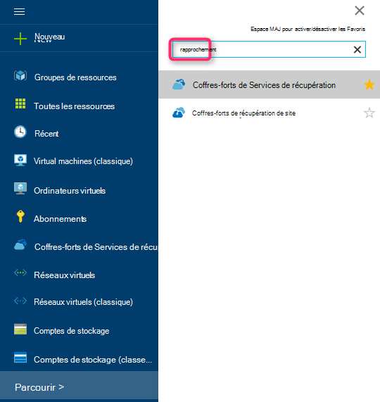

    La liste des Services de récupération des coffres-forts s’affiche.

3. Dans le menu des **Services de récupération des coffres-forts** , cliquez sur **Ajouter**.

    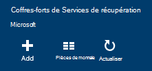

    La lame de coffre-fort de Services de restauration s’ouvre, vous invitant à fournir un **nom**, un **abonnement**, un **groupe de ressources**et un **emplacement**.

    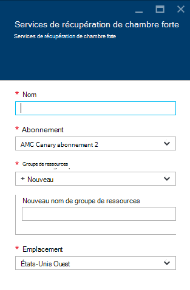

4. Pour **nom**, entrez un nom convivial pour identifier le coffre-fort. Le nom doit être unique pour l’abonnement Azure. Tapez un nom qui contient entre 2 et 50 caractères. Il doit commencer par une lettre et peut contenir uniquement des lettres, des chiffres et des traits d’union.

5. Cliquez sur l' **abonnement** pour visualiser la liste des abonnements disponibles. Si vous n’êtes pas sûr de l’abonnement à utiliser, utilisez la valeur par défaut (ou suggéré) abonnement. Il y aura plusieurs choix uniquement si votre organisation compte est associé à plusieurs abonnements Azure.

6. Cliquez sur le **groupe de ressources** pour afficher la liste des groupes de ressources disponibles, ou cliquez sur **Nouveau** pour créer un nouveau groupe de ressources. Pour plus d’informations sur les groupes de ressources, consultez [vue d’ensemble du Gestionnaire de ressources Azure](../azure-resource-manager/resource-group-overview.md)

7. Cliquez sur l' **emplacement** pour sélectionner la zone géographique pour la chambre forte.

8. Cliquez sur **créer**. Elle peut prendre du temps pour la chambre forte de Services de récupération doit être créé. Surveiller les notifications d’état dans l’angle supérieur droit du portail.
Une fois votre coffre-fort est créé, il s’ouvre dans le portail.

### Définir la réplication du stockage

L’option de réplication de stockage vous permet de choisir entre le stockage redondant geo et stockage redondant localement. Par défaut, votre coffre-fort a stockage redondant geo. Conservez l’option définie vers le stockage redondant geo si c’est votre sauvegarde principale. Choisissez le stockage redondant localement si vous souhaitez une option économique qui n’est pas tout à fait aussi durable. En savoir plus sur [géo-redondants](../storage/storage-redundancy.md#geo-redundant-storage) et des options de stockage [redondants localement](../storage/storage-redundancy.md#locally-redundant-storage) dans la [vue d’ensemble de la réplication de stockage Azure](../storage/storage-redundancy.md).

Pour modifier le paramètre de réplication du stockage :

1. Sélectionnez votre coffre-fort pour ouvrir le tableau de bord en chambre forte et la lame de paramètres. Si la lame de **paramètres** ne s’ouvre pas, cliquez sur **tous les paramètres** dans le tableau de bord de coffre-fort.

2. Sur la lame de **paramètres** , cliquez sur **l’Infrastructure de sauvegarde** > de**Configuration de sauvegarde** pour ouvrir la lame de la **Configuration de la sauvegarde** . Sur la lame de la **Configuration de la sauvegarde** , choisissez l’option de réplication de stockage pour Password vault.

    

    Après avoir choisi l’option de stockage pour Password vault, vous êtes prêt à associer de la machine virtuelle à la chambre forte. Pour commencer l’association, vous devez découvrir et enregistrer les ordinateurs virtuels Azure.

### 2. Téléchargez les informations d’identification de la chambre forte

Le fichier d’informations d’identification de coffre-fort est un certificat généré par le portail pour chaque sauvegarde coffre-fort. Le portail transmet ensuite la clé publique pour Access Control Service (ACS). La clé privée du certificat est rendue disponible pour l’utilisateur dans le cadre du flux de travail qui est donné comme une entrée dans le workflow de machine d’inscription. Il authentifie l’ordinateur pour envoyer des données de sauvegarde à un coffre-fort identifié dans le service de sauvegarde d’Azure.

Les informations d’identification de la chambre forte sont utilisée uniquement pendant le processus d’inscription. Il est responsable de l’utilisateur pour vous assurer que le fichier d’informations d’identification de coffre-fort n’est pas compromis. S’il se trouve entre les mains d’un utilisateur non fiable, le fichier d’informations d’identification de coffre-fort utilisable pour enregistrer d’autres machines par rapport à la chambre forte même. Toutefois, comme les données de sauvegarde sont cryptées à l’aide d’un mot de passe qui appartient au client, les données de sauvegarde existantes ne sont pas compromises. Pour atténuer ce problème, les informations d’identification de la chambre forte sont configurées pour expirer dans 48hrs. Vous pouvez télécharger les informations d’identification de coffre-fort un services de restauration à n’importe quel nombre de fois – mais seulement le dernier fichier de d’informations d’identification de coffre-fort est applicable pendant le processus d’inscription.

Le fichier d’informations d’identification de chambre forte est transférée via un canal sécurisé à partir du portail Azure. Le service de sauvegarde d’Azure ne connaît la clé privée du certificat et la clé privée n’est pas conservée dans le portail ou le service. Utilisez les étapes suivantes pour télécharger le fichier d’informations d’identification de coffre-fort pour un ordinateur local.

1. Connectez-vous au [portail Azure](https://portal.azure.com/).

2. Ouvrir vault de Services de récupération auquel l’ordinateur pour lequel vous souhaitez enregistrer DPM.

3. Lame de paramètres s’ouvre par défaut. Si elle est fermée, cliquez sur **paramètres** , sur tableau de bord de coffre-fort pour ouvrir la lame de paramètres. De lames de paramètres, cliquez sur **Propriétés**.

    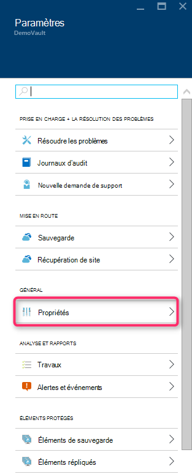

4. Sur la page de propriétés, cliquez sur **Télécharger** sous les **Informations d’identification de la sauvegarde**. Le portail génère le fichier d’informations d’identification de coffre-fort, qui est rendu disponible pour téléchargement.

    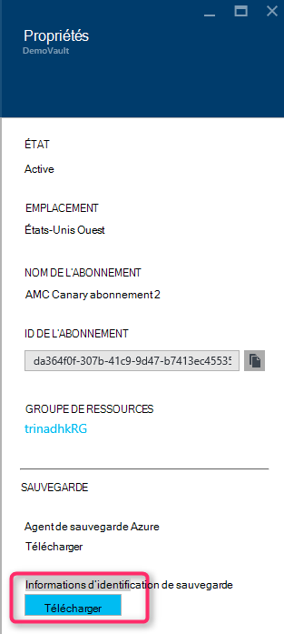

Le portail génère une information d’identification de coffre-fort à l’aide d’une combinaison du nom de coffre-fort et de la date actuelle. Cliquez sur **Enregistrer** pour télécharger les informations d’identification de la chambre forte au dossier de téléchargements d’un compte local, ou sélectionnez Enregistrer sous dans le menu Enregistrer spécifier un emplacement pour les informations d’identification de la chambre forte. Il occupe une minute pour le fichier à générer.

### Remarque
- Vérifiez que le fichier d’informations d’identification de coffre-fort est enregistré dans un emplacement accessible à partir de votre ordinateur. S’il est stocké dans un partage de fichier/SMB, vérifiez les autorisations d’accès.
- Le fichier d’informations d’identification de coffre-fort est utilisé uniquement pendant le processus d’inscription.
- Le fichier d’informations d’identification de coffre-fort expire après 48hrs et peut être téléchargé à partir du portail.

### 3. Installez l’Agent de sauvegarde

Après avoir créé le coffre-fort de la sauvegarde d’Azure, un agent doit être installé sur chacun de vos ordinateurs de Windows (Windows Server, client Windows, System Center Data Protection Manager server ou serveur de sauvegarde Azure) qui permet de sauvegarder des données et applications Azure.

1. Ouvrir vault de Services de récupération auquel l’ordinateur pour lequel vous souhaitez enregistrer DPM.

2. Lame de paramètres s’ouvre par défaut. Si elle est fermée, cliquez sur **paramètres** pour ouvrir la lame de paramètres. De lames de paramètres, cliquez sur **Propriétés**.

    

3. Dans la page Paramètres, cliquez sur **Télécharger** sous **L’Agent de sauvegarde Azure**.

    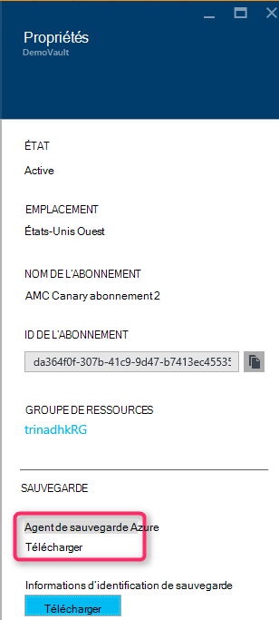

   Une fois que l’agent est téléchargé, double-cliquez sur MARSAgentInstaller.exe pour lancer l’installation de l’agent de sauvegarde d’Azure. Choisissez le dossier d’installation et le dossier de travail requise pour l’agent. L’emplacement du cache spécifié doit avoir un espace libre qui est au moins 5 % des données de sauvegarde.

4.  Si vous utilisez un serveur proxy pour se connecter à internet, procédez comme suit : dans l’écran **configuration du serveur Proxy** , entrez les détails du serveur proxy. Si vous utilisez un proxy authentifié, entrez les détails de nom et de mot de passe de l’utilisateur dans cet écran.

5.  L’agent de sauvegarde d’Azure installe.NET Framework 4.5 et Windows PowerShell (s’il est disponible) pour terminer l’installation.

6.  Une fois l’agent installé, **Fermer** la fenêtre.

    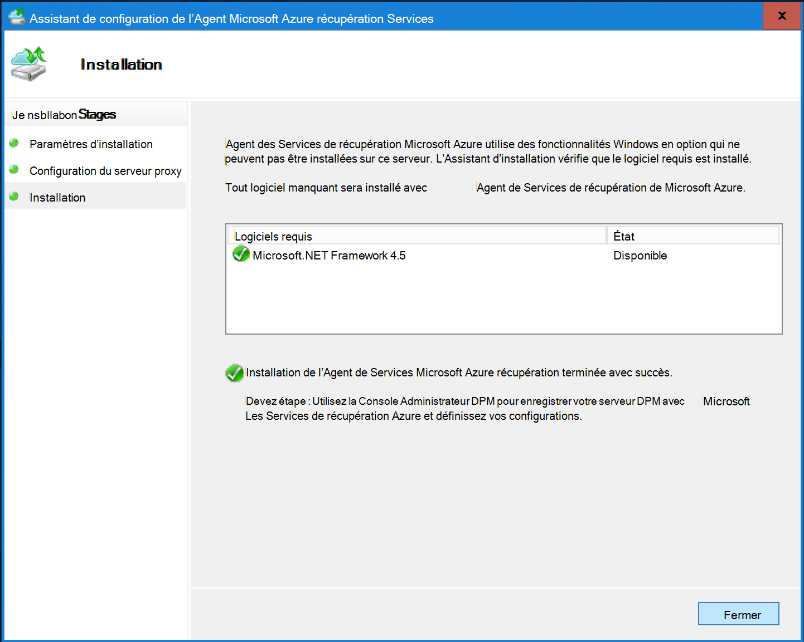

7. Pour **inscrire le serveur DPM** dans le coffre-fort, dans l’onglet **administration** , cliquez sur **en ligne**. Ensuite, sélectionnez **Enregistrer**. L’Assistant Inscription d’un programme d’installation s’ouvre.

8. Si vous utilisez un serveur proxy pour se connecter à internet, procédez comme suit : dans l’écran **configuration du serveur Proxy** , entrez les détails du serveur proxy. Si vous utilisez un proxy authentifié, entrez les détails de nom et de mot de passe de l’utilisateur dans cet écran.

    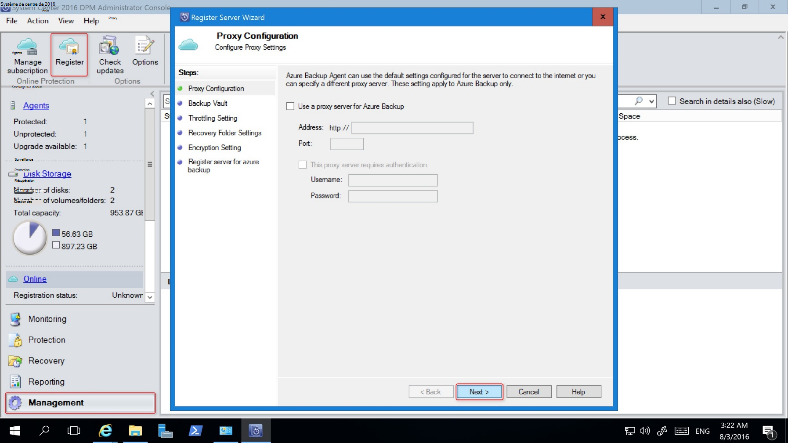

9. Dans l’écran d’informations d’identification de coffre-fort, recherchez et sélectionnez le fichier d’informations d’identification de coffre-fort qui a été préalablement téléchargé.

    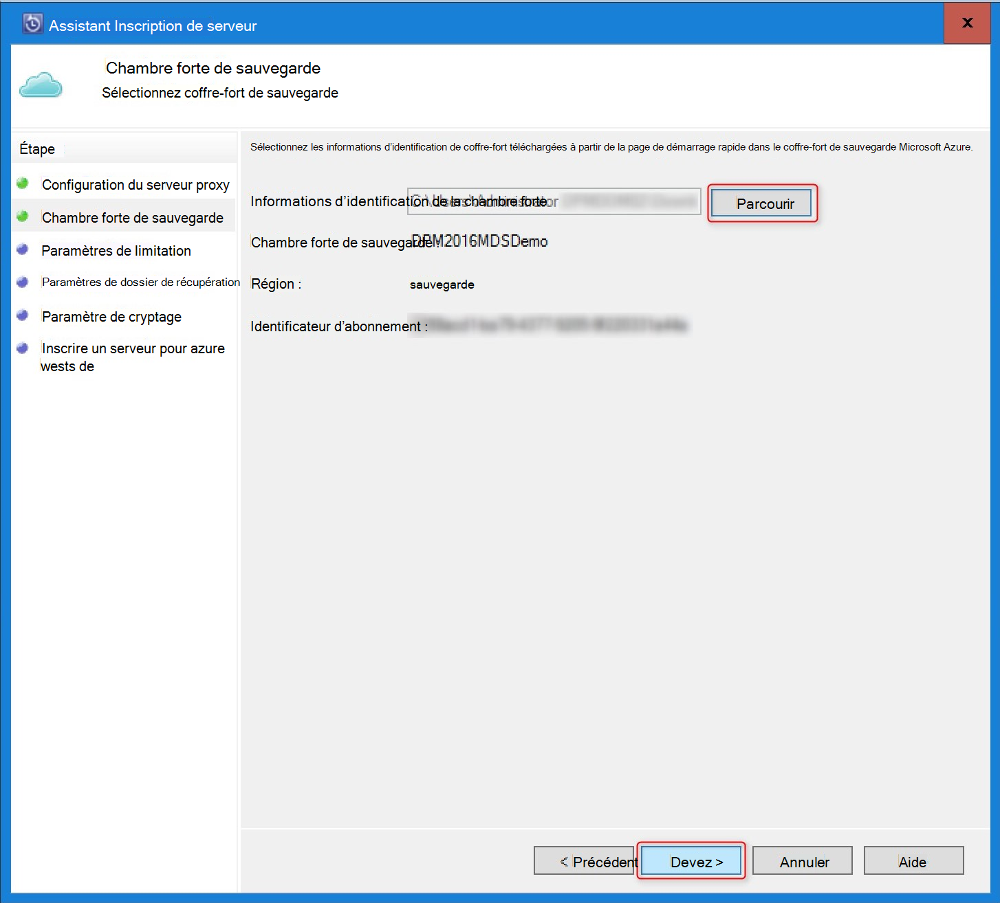

    Le fichier d’informations d’identification de coffre-fort est uniquement valide pour 48 heures (après l’avoir téléchargée à partir du portail). Si vous rencontrez une erreur dans cet écran (par exemple, « coffre-fort références de fichier fourni a expiré »), la connexion au portail Azure et téléchargement de fichiers à nouveau les informations d’identification de la chambre forte.

    Assurez-vous que le fichier d’informations d’identification de coffre-fort est disponible dans un emplacement accessible par l’application d’installation. Si vous rencontrez des erreurs connexes d’accès, copiez le fichier d’informations d’identification de coffre-fort dans un emplacement temporaire sur cet ordinateur et recommencez l’opération.

    Si vous rencontrez une erreur d’informations d’identification de coffre-fort non valide (par exemple, « vault non valide les informations d’identification fournies ») le fichier est endommagé ou n'est pas avoir les informations d’identification plus récentes associé au service de récupération. Réessayez l’opération après avoir téléchargé un nouveau fichier d’informations d’identification de coffre-fort à partir du portail. Cette erreur se produite généralement si l’utilisateur clique sur l’option **informations d’identification du coffre-fort de télécharger** dans le portail d’Azure, en succession rapide. Dans ce cas, uniquement le deuxième fichier de d’informations d’identification de coffre-fort est valide.

10. Pour contrôler l’utilisation de la bande passante réseau pendant le travail et les heures non travaillées, dans l’écran **Paramètres de limitation** , vous pouvez définir les limites de l’utilisation de la bande passante et définissent le travail et non liés au travail heures.

    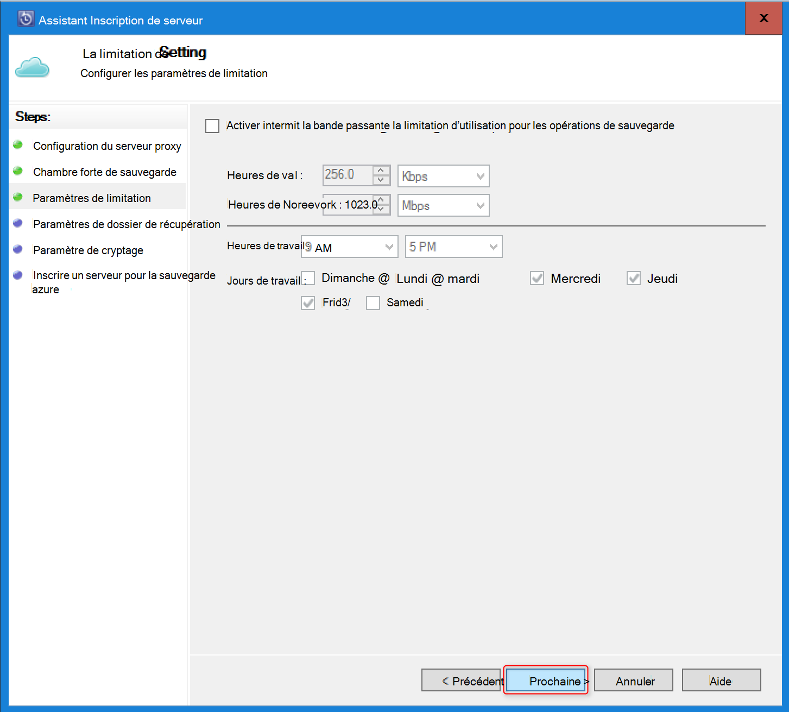

11. Dans l’écran **Paramètre du dossier de restauration** , recherchez le dossier où les fichiers téléchargés à partir d’Azure aura lieu temporairement.

    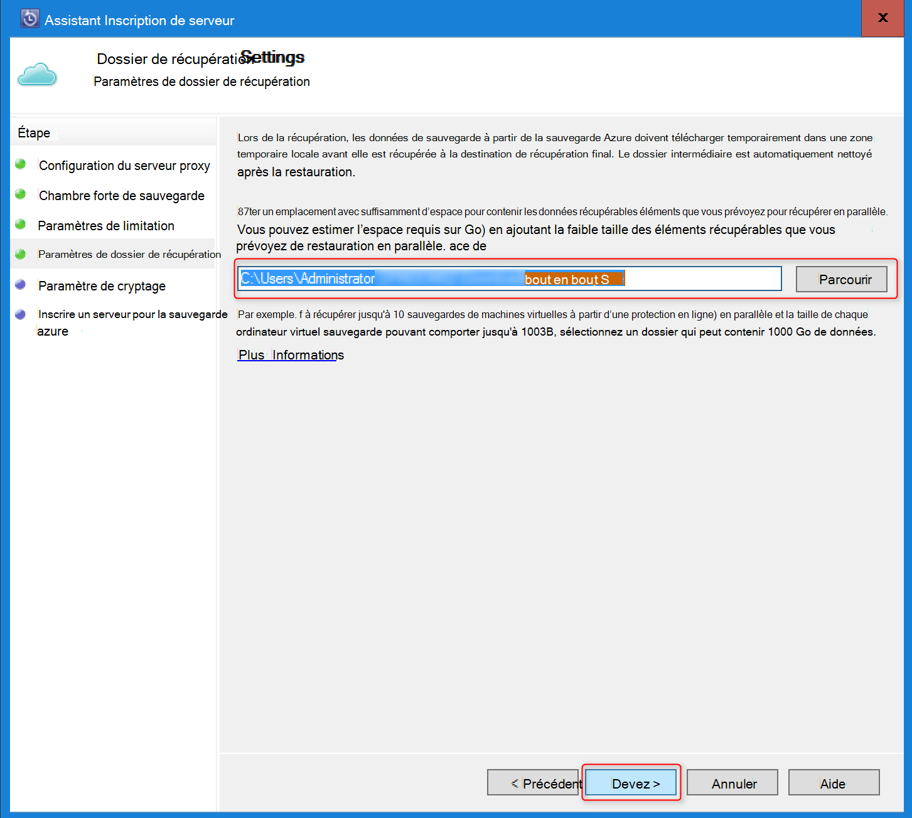

12. Dans l’écran **paramètres de cryptage** , vous pouvez générer un mot de passe ou fournir un mot de passe (minimum de 16 caractères). N’oubliez pas d’enregistrer le mot de passe dans un endroit sûr.

    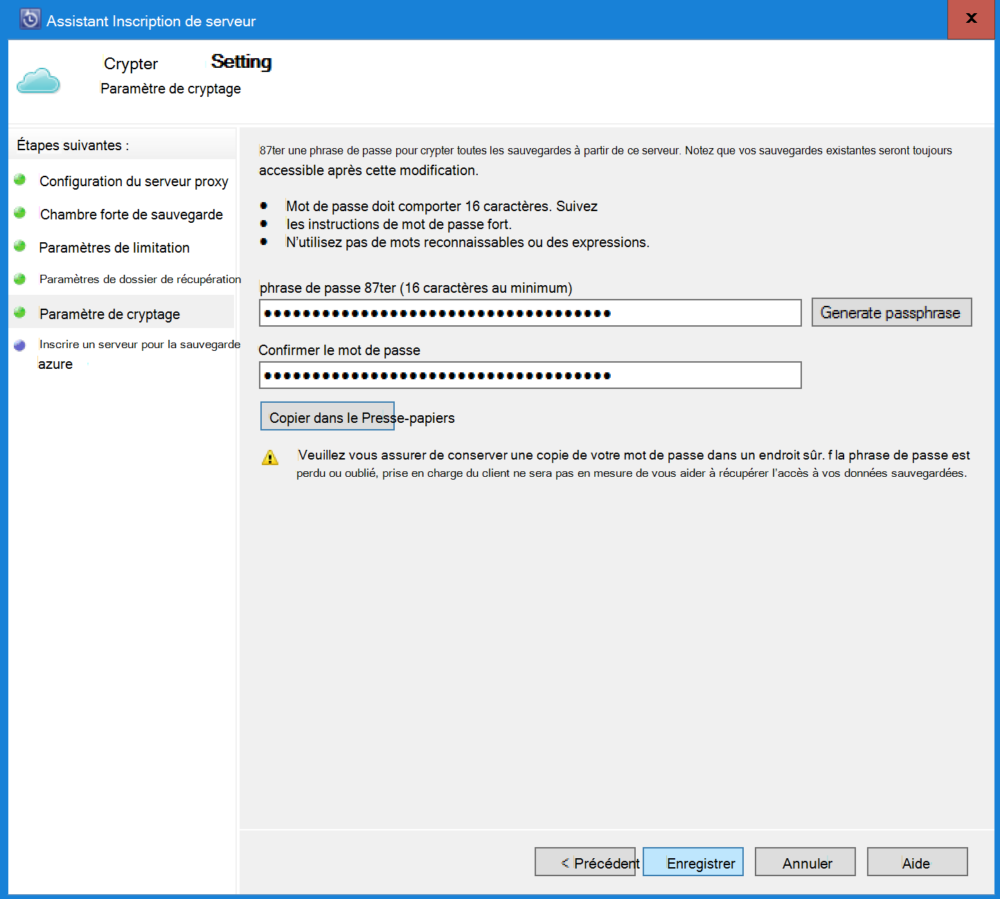

    > [AZURE.WARNING] Si le mot de passe est perdu ou oublié ; Microsoft ne peut aider à récupérer les données de sauvegarde. L’utilisateur possède le mot de passe de cryptage et Microsoft n’a pas de visibilité sur le mot de passe utilisé par l’utilisateur final. Enregistrez le fichier dans un emplacement sécurisé car il est requis au cours d’une opération de récupération.

13. Une fois que vous cliquez sur le bouton **Enregistrer** , l’ordinateur a été enregistré dans la chambre forte et vous êtes maintenant prêt à commencer la sauvegarde Microsoft Azure.

14. Lors de l’utilisation de Data Protection Manager, vous pouvez modifier les paramètres spécifiés pendant le processus d’inscription en cliquant sur l’option de **configuration** en sélectionnant **en ligne** sous l’onglet de **gestion** .

## Configurations requises (et les restrictions)

- DPM peut fonctionner comme un serveur physique ou une machine virtuelle de Hyper-V installé sur System Center 2012 SP1 ou de System Center 2012 R2. Il peut également s’exécuter comme une machine virtuelle Azure exécutant au moins sur System Center 2012 R2 avec correctif cumulatif 3 pour DPM 2012 R2 ou une machine virtuelle de Windows dans les environnements VMWare en cours d’exécution au moins sur System Center 2012 R2 avec correctif cumulatif 5.
- Si vous utilisez DPM avec System Center 2012 SP1 vous installez revenir à la version mise à jour 2 pour System Center Data Protection Manager SP1. Ceci est nécessaire avant de pouvoir installer l’Agent de sauvegarde Azure.
- Le serveur DPM doit comporter de Windows PowerShell et .net Framework 4.5 est installé.
- DPM peut sauvegarder de la plupart des charges de travail à la sauvegarde d’Azure. Pour une liste complète de ce qui est pris en charge voir la sauvegarde Azure prend en charge les éléments ci-dessous.
- Impossible de récupérer les données stockées dans Azure sauvegarde avec l’option « Copier sur bande ».
- Vous aurez besoin d’un compte Azure avec la fonction de sauvegarde de Azure activée. Si vous n’avez pas un compte, vous pouvez créer un compte d’essai gratuit dans quelques minutes. Lire sur la [tarification de la sauvegarde d’Azure](https://azure.microsoft.com/pricing/details/backup/).
- À l’aide de la sauvegarde d’Azure requiert l’Agent de sauvegarde Azure doit être installé sur les serveurs que vous souhaitez sauvegarder. Chaque serveur doit disposer d’au moins 5 % de la taille des données qui sont sauvegardées, disponible en tant que stockage local. Par exemple, la sauvegarde de 100 Go de données nécessite un minimum de 5 Go d’espace libre dans l’emplacement de montage.
- Données seront stockées dans le stockage Azure coffre-fort. Il n’y a aucune limite à la quantité de données que vous pouvez sauvegarder une sauvegarde Azure chambre forte, mais la taille d’une source de données (par exemple un ordinateur virtuel ou base de données) ne doit pas dépasser 54400 go.

Ces types de fichiers sont pris en charge pour sauvegarder sur Azure :

- Crypté (sauvegardes complètes uniquement)
- Compressé (prise en charge des sauvegardes incrémentielles)
- Sparse (prise en charge des sauvegardes incrémentielles)
- Compressés et éparpillés (considérées comme Sparse)

Et Voici non pris en charge :

- Serveurs sur les systèmes de fichiers respectant la casse ne sont pas pris en charge.
- Liens en dur (ignoré)
- Points (ignoré) d’analyse
- Cryptés et compressés (ignoré)
- Chiffrés et éparpillés (ignorée)
- Flux compressé
- Flux de données fragmentée

>[AZURE.NOTE] À partir de dans System Center 2012 DPM avec SP1, vous pouvez sauvegarder des charges de travail protégés par DPM pour Azure à l’aide de la sauvegarde de Microsoft Azure.
