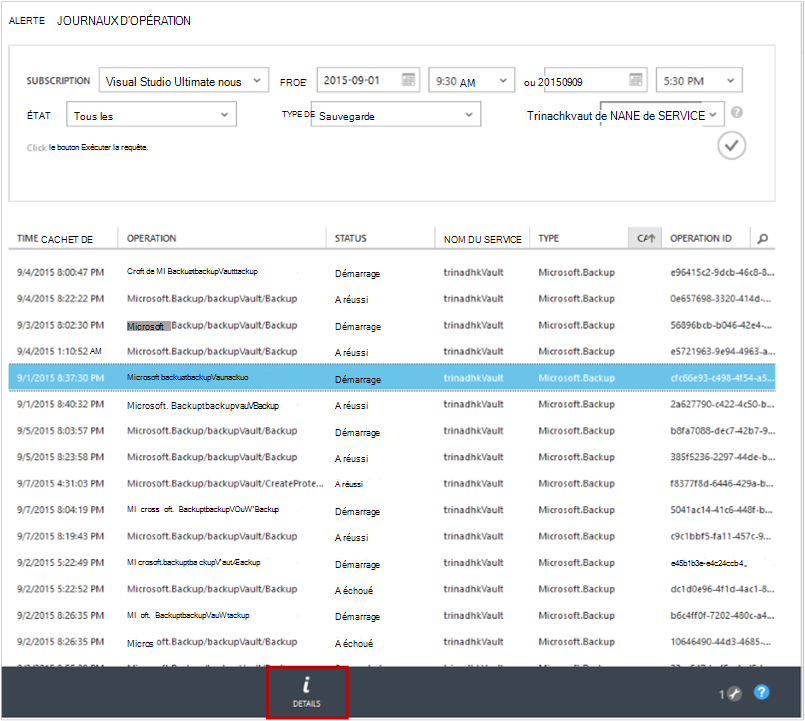

<properties
    pageTitle="Gérer et surveiller les sauvegardes Azure virtual machine | Microsoft Azure"
    description="Apprenez à gérer et surveiller un Azure VM des sauvegardes"
    services="backup"
    documentationCenter=""
    authors="trinadhk"
    manager="shreeshd"
    editor=""/>

<tags
    ms.service="backup"
    ms.workload="storage-backup-recovery"
    ms.tgt_pltfrm="na"
    ms.devlang="na"
    ms.topic="article"
    ms.date="08/31/2016"
    ms.author="trinadhk; jimpark; markgal;"/>

# <a name="manage-and-monitor-azure-virtual-machine-backups"></a>Gérer et surveiller les sauvegardes Azure VM

> [AZURE.SELECTOR]
- [Gérer les sauvegardes d’Azure VM](backup-azure-manage-vms.md)
- [Gérer les sauvegardes par les VM classique](backup-azure-manage-vms-classic.md)

Cet article fournit des informations à propos de la gestion commune et les tâches de surveillance pour les machines virtuelles de classique-modèle protégés dans Azure.  

>[AZURE.NOTE] Azure dispose de deux modèles de déploiement pour la création et l’utilisation des ressources : [le Gestionnaire de ressources et classique](../resource-manager-deployment-model.md). Pour plus d’informations sur l’utilisation d’un modèle de déploiement standard ordinateurs virtuels, consultez la section [préparer votre environnement à sauvegarder des ordinateurs virtuels Azure](backup-azure-vms-prepare.md) .

## <a name="manage-protected-virtual-machines"></a>Gérer des ordinateurs virtuels protégés

Pour gérer des ordinateurs virtuels protégés :

1. Pour afficher et gérer les paramètres de sauvegarde pour un ordinateur virtuel, cliquez sur l’onglet **Protection** .

2. Cliquez sur le nom d’un élément protégé, voir l’onglet **Détails de la sauvegarde** , qui présente des informations sur la dernière sauvegarde.

    

3. Pour afficher et gérer la stratégie de sauvegarde des paramètres pour un ordinateur virtuel, cliquez sur l’onglet **stratégies** .

    

    L’onglet **Stratégies de sauvegarde** affiche la stratégie existante. Vous pouvez modifier selon vos besoins. Si vous avez besoin créer une nouvelle stratégie cliquez sur **créer** dans la page de **stratégies** . Notez que si vous voulez supprimer une stratégie il ne devrait pas avoir toutes les machines virtuelles associées.

    

4. Vous pouvez obtenir plus d’informations sur l’état ou les actions pour un ordinateur virtuel dans la page **tâches** . Cliquez sur une tâche dans la liste pour obtenir plus de détails, ou filtrer les tâches pour une machine virtuelle spécifique.

    

## <a name="on-demand-backup-of-a-virtual-machine"></a>Sauvegarde à la demande d’une machine virtuelle
Vous pouvez prendre une demande de sauvegarde d’une machine virtuelle une fois qu’il est configuré pour la protection. Si la sauvegarde initiale est en attente pour la machine virtuelle, à la demande de sauvegarde crée une copie complète de la machine virtuelle dans Azure coffre-fort de sauvegarde. Si la première sauvegarde est terminée, à la demande sauvegarde uniquement envoyer les modifications à partir d’une sauvegarde précédente sauvegarde Azure chambre forte par exemple, il est toujours incrémentielle.

>[AZURE.NOTE] Durée de rétention d’une sauvegarde à la demande est définie sur la valeur de rétention spécifiée pour la rétention de tous les jours dans une stratégie de sauvegarde correspondant à la machine virtuelle.  

Pour prendre une demande de sauvegarde d’un ordinateur virtuel :

1. Accédez à la page **Protégée des éléments** et sélectionnez **Azure Virtual Machine** en tant que **Type** (le cas échéant) cliquez sur le bouton **Sélectionner** .

    

2. Sélectionnez l’ordinateur virtuel sur lequel vous souhaitez effectuer une demande de sauvegarde, puis cliquez sur **Sauvegarder maintenant** en bas de la page.

    

    Ceci créera une sauvegarde sur l’ordinateur virtuel sélectionné. Durée de rétention de point de récupération créé via ce travail sera identique à celui spécifié dans la stratégie associée à l’ordinateur virtuel.

    

    >[AZURE.NOTE] Pour afficher la stratégie associée à un ordinateur virtuel, explorez en ordinateur virtuel dans la page **Éléments de protection** et accédez à l’onglet Stratégie de sauvegarde.

3. Une fois la tâche créée, vous pouvez cliquer sur le bouton **Afficher la tâche** dans la barre de toast pour voir la tâche correspondante dans la page tâches.

    

4. Après l’exécution réussie de la tâche, un point de récupération est créé que vous pouvez utiliser pour restaurer l’ordinateur virtuel. Ce sera aussi incrémenter la valeur de colonne de point de récupération par 1 dans la page **Éléments de protection** .

## <a name="stop-protecting-virtual-machines"></a>Arrêter la protection de machines virtuelles
Vous pouvez choisir d’arrêter les futures sauvegardes d’un ordinateur virtuel avec les options suivantes :

- Conserver les données de sauvegarde associées avec la machine virtuelle dans la chambre forte Azure sauvegarde
- Supprimer les données de sauvegarde associées avec la machine virtuelle

Si vous avez choisi de conserver les données de sauvegarde associées avec la machine virtuelle, vous pouvez utiliser les données de sauvegarde pour restaurer l’ordinateur virtuel. Pour connaître les prix de ces machines virtuelles, cliquez [ici](https://azure.microsoft.com/pricing/details/backup/).

Arrêter la protection d’un ordinateur virtuel :

1. Accédez à la page **Protégée des éléments** et sélectionnez **Azure VM** comme type de filtre (le cas échéant) et cliquez sur le bouton **Sélectionner** .

    

2. Sélectionnez l’ordinateur virtuel, puis cliquez sur **Désactiver la Protection** en bas de la page.

    

3. Par défaut, sauvegarde Azure ne supprime pas les données de sauvegarde associées à la machine virtuelle.

    

    Si vous souhaitez supprimer les données de sauvegarde, activez la case à cocher.

    

    Veuillez sélectionner un motif de l’arrêt de la sauvegarde. Cette étape est facultative, fournir une raison permettent de sauvegarde Azure pour travailler sur l’évaluation et de hiérarchiser les scénarios de client.

4. Cliquez sur le bouton **Soumettre** pour soumettre la tâche **d’Arrêter la protection** . Cliquez sur **Afficher la tâche** pour afficher la tâche dans la page de **tâches** correspondante.

    

    Si vous n’avez pas sélectionné **Supprimer les données de sauvegarde associé à** l’option lors de l’Assistant **d’Arrêter la Protection** , l’achèvement des tâches de publication, l’état de protection change à **Protection d’arrêt**. Les données restent avec Azure sauvegarde jusqu'à ce qu’elle soit explicitement supprimée. Vous pouvez toujours supprimer les données en sélectionnant l’ordinateur virtuel dans la page **Protégée des éléments** , puis en cliquant sur **Supprimer**.

    

    Si vous avez sélectionné l’option **Supprimer les données de sauvegarde associées** , l’ordinateur virtuel ne sera pas partie de la page **Protégée des éléments** .

## <a name="re-protect-virtual-machine"></a>Protéger de nouveau les machines virtuelles
Si vous n’avez pas sélectionné l’option **Supprimer les données de sauvegarde associer** de **Désactiver la Protection**, vous pouvez protéger de nouveau l’ordinateur virtuel en suivant les étapes similaires pour la sauvegarde des machines virtuelles enregistrées. Une fois protégé, cet ordinateur virtuel aura les données de sauvegarde conservées avant la protection contre les arrêts et les points de restauration créés après protéger de nouveau.

Après protéger de nouveau, l’état de protection de l’ordinateur virtuel est remplacé par **protégé** s’il y a des points de récupération avant de **Désactiver la Protection**.

  

>[AZURE.NOTE] Lors de la ré-protection de l’ordinateur virtuel, vous pouvez choisir une autre stratégie que la stratégie avec laquelle machine virtuelle a été initialement protégé.

## <a name="unregister-virtual-machines"></a>Annuler l’inscription de machines virtuelles

Si vous souhaitez supprimer la machine virtuelle à partir de la chambre forte de sauvegarde :

1. Cliquez sur le bouton **Annuler l’enregistrement** du bas de la page.

    

    Une notification de toast apparaîtra au bas de l’écran de demande de confirmation. Cliquez sur **Oui** pour continuer.

    

## <a name="delete-backup-data"></a>Supprimer les données de sauvegarde
Vous pouvez supprimer les données de sauvegarde associées à une machine virtuelle, soit :

- Au cours de la tâche de Protection de fin
- Après une protection d’arrêter le travail est effectué sur une machine virtuelle

Pour supprimer les données de sauvegarde sur un ordinateur virtuel, qui se trouve dans l’état de *La Protection d’arrêt* valider l’exécution réussie d’un travail **d’Arrêter la sauvegarde** :

1. Accédez à la page **Protégée des éléments** et sélectionnez **Azure Virtual Machine** en tant que *type* cliquez sur le bouton **Sélectionner** .

    

2. Sélectionnez l’ordinateur virtuel. La machine virtuelle est à l’état de **La Protection d’arrêt** .

    

3. Cliquez sur le bouton **Supprimer** en bas de la page.

    

4. Dans l’Assistant **suppression des données de sauvegarde** , sélectionnez un motif pour la suppression des données de sauvegarde (hautement recommandées) et cliquez sur **Envoyer**.

    

5. Cette opération crée une tâche pour supprimer les données de sauvegarde de l’ordinateur virtuel sélectionné. Cliquez sur **Afficher la tâche** pour afficher la tâche correspondante dans la page tâches.

    

    Une fois la tâche terminée, l’entrée correspondant à l’ordinateur virtuel sera retirée **les éléments Protected** page.

## <a name="dashboard"></a>Tableau de bord
Sur la page de **tableau de bord** , vous pouvez consulter les informations sur les machines virtuelles Azure, leur stockage et les tâches associées au cours des 24 dernières heures. Vous pouvez afficher le statut de la sauvegarde et les éventuelles erreurs de sauvegarde associés.


>[AZURE.NOTE] Les valeurs dans le tableau de bord sont actualisés toutes les 24 heures.

## <a name="auditing-operations"></a>L’audit des opérations
Sauvegarde Azure fournit l’analyse des « opération journaux » des opérations de sauvegarde déclenchée par le client, ce qui vous permet de voir exactement les opérations de gestion ont été effectuées sur le coffre-fort de sauvegarde. Journaux des opérations permettent l’analyse post-mortem très et d’audit de la prise en charge pour les opérations de sauvegarde.

Les opérations suivantes sont enregistrées dans les journaux de l’opération :

- Enregistrer
- Annuler l’inscription
- Configurer la protection
- Sauvegarde (à la fois planifiées et la sauvegarde à la demande par l’intermédiaire de BackupNow)
- Restauration
- Arrêter la protection
- Supprimer les données de sauvegarde
- Ajouter une stratégie
- Supprimer la stratégie
- Stratégie de mise à jour
- Annuler le travail

Pour afficher les journaux d’opération correspondant à un coffre-fort de sauvegarde :

1. Accédez aux **services de gestion** dans Azure portal, puis cliquez sur l’onglet **Journaux** .

    

2. Dans les filtres, sélectionnez **sauvegarde** comme *Type* et spécifiez le nom de la sauvegarde coffre-fort dans le *nom du service* et cliquez sur **Envoyer**.

    

3. Dans les journaux des opérations, sélectionnez n’importe quelle opération et cliquez sur **Détails** pour afficher les détails correspondant à une opération.

    

    L' **Assistant de détails** contient des informations sur l’opération déclenchée, tâche, Id de ressource sur lequel cette opération est déclenchée et heure de début de l’opération.

    

## <a name="alert-notifications"></a>Notifications d’alerte
Vous pouvez obtenir des notifications d’alerte personnalisées pour les tâches dans le portail. Cela est réalisé en définissant des règles d’alerte PowerShell basé sur les événements de journaux des opérations. Nous vous recommandons d’utiliser *PowerShell version version 1.3.0 ou supérieur*.

Pour définir une notification personnalisée d’alerte pour les échecs de sauvegarde, un exemple de commande doit ressembler à :

```
PS C:\> $actionEmail = New-AzureRmAlertRuleEmail -CustomEmail contoso@microsoft.com
PS C:\> Add-AzureRmLogAlertRule -Name backupFailedAlert -Location "East US" -ResourceGroup RecoveryServices-DP2RCXUGWS3MLJF4LKPI3A3OMJ2DI4SRJK6HIJH22HFIHZVVELRQ-East-US -OperationName Microsoft.Backup/backupVault/Backup -Status Failed -TargetResourceId /subscriptions/86eeac34-eth9a-4de3-84db-7a27d121967e/resourceGroups/RecoveryServices-DP2RCXUGWS3MLJF4LKPI3A3OMJ2DI4SRJK6HIJH22HFIHZVVELRQ-East-US/providers/microsoft.backupbvtd2/BackupVault/trinadhVault -Actions $actionEmail
```

**ResourceId**: vous pouvez obtenir cette information de popup de journaux des opérations comme ci-dessus dans la section. ResourceURI des services Web dans la fenêtre de détails d’une opération sont le ResourceId à fournir pour cette applet de commande.

**OperationName**: il s’agit du format « Microsoft.Backup/backupvault/<EventName>"où EventName est un Registre, suppression de l’inscription, ConfigureProtection, sauvegarde, restauration, StopProtection, DeleteBackupData, CreateProtectionPolicy, DeleteProtectionPolicy, UpdateProtectionPolicy

**Statut**: prise en charge de valeurs sont-démarré, ayant réussi et échoué.

**ResourceGroup**: ResourceGroup de la ressource à laquelle l’opération est déclenchée. Vous pouvez obtenir auprès de valeur ResourceId. Valeur comprise entre les champs */resourceGroups/* et */providers/* dans la valeur ResourceId est la valeur pour ResourceGroup.

**Nom**: nom de la règle d’alerte.

**CustomEmail**: spécifiez l’adresse e-mail personnalisé auquel vous souhaitez envoyer des notifications d’alerte

**SendToServiceOwners**: cette option envoie des notifications d’alerte à tous les administrateurs et les administrateurs de collègues de l’abonnement. Il peut être utilisé dans l’applet de commande **New-AzureRmAlertRuleEmail**

### <a name="limitations-on-alerts"></a>Limitations sur les alertes
Alertes basées sur les événements sont soumis aux limitations suivantes :

1. Des alertes sont déclenchées sur tous les ordinateurs virtuels dans le coffre-fort de sauvegarde. Vous ne pouvez pas personnaliser pour recevoir des alertes pour un ensemble spécifique d’ordinateurs virtuels dans un coffre-fort de sauvegarde.
2. Cette fonctionnalité est en mode Aperçu. [Pour en savoir plus](../monitoring-and-diagnostics/insights-powershell-samples.md#create-alert-rules)
3. Vous recevrez des alertes à partir de "alerts-noreply@mail.windowsazure.com". Actuellement, vous ne pouvez pas modifier l’expéditeur de l’e-mail.

## <a name="next-steps"></a>Étapes suivantes

- [Restaurer les ordinateurs virtuels Azure](backup-azure-restore-vms.md)
