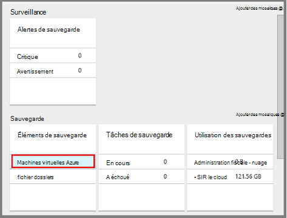

<properties
    pageTitle="Gérer les sauvegardes déployés par le Gestionnaire de ressources des machines virtuelles | Microsoft Azure"
    description="Apprenez à gérer et à surveiller les sauvegardes déployés par le Gestionnaire de ressources des machines virtuelles"
    services="backup"
    documentationCenter=""
    authors="trinadhk"
    manager="shreeshd"
    editor=""/>

<tags
    ms.service="backup"
    ms.workload="storage-backup-recovery"
    ms.tgt_pltfrm="na"
    ms.devlang="na"
    ms.topic="article"
    ms.date="08/11/2016"
    ms.author="jimpark; markgal; trinadhk"/>

# Gérer les sauvegardes d’Azure VM

> [AZURE.SELECTOR]
- [Gérer les sauvegardes d’Azure VM](backup-azure-manage-vms.md)
- [Gérer les sauvegardes par les VM classique](backup-azure-manage-vms-classic.md)

Cet article fournit des conseils sur la gestion des sauvegardes de machines virtuelles et explique les informations de sauvegarde alertes disponibles dans le tableau de bord de portail. Les instructions de cet article s’applique à l’utilisation d’ordinateurs virtuels avec les Services de récupération des coffres-forts. Cet article ne couvre pas la création de machines virtuelles, ni il explique comment protéger les machines virtuelles. Pour une introduction sur la protection déployés par le Gestionnaire de ressources Azure pour ordinateurs virtuels dans Azure avec un coffre-fort de Services de récupération, consultez [tout d’abord rechercher : sauvegarder des ordinateurs virtuels dans un coffre-fort de Services de récupération des](backup-azure-vms-first-look-arm.md).

## Gérer des coffres-forts et des machines virtuelles protégées

Dans le portail d’Azure, le tableau de bord de coffre-fort de Services de récupération fournit l’accès aux informations sur le stockage en chambre forte, y compris :

- l’instantané de sauvegarde la plus récente, qui est également le point de restauration plus récent < br\>
- la stratégie de sauvegarde < br\>
- la taille de tous les clichés instantanés de sauvegarde totale < br\>
- nombre d’ordinateurs virtuels qui sont protégées par le coffre-fort < br\>

De nombreuses tâches de gestion avec une sauvegarde des machines virtuelles commencent à l’ouverture de la chambre forte dans le tableau de bord. Toutefois, car des coffres-forts peuvent être utilisées pour protéger plusieurs éléments (ou plusieurs ordinateurs virtuels) pour afficher des détails sur une machine virtuelle spécifique, ouvrez le tableau de bord d’élément de coffre-fort. La procédure suivante vous montre comment ouvrir le *tableau de bord de coffre-fort* et poursuivez le *tableau de bord élément coffre-fort*. Il n’y a « conseils » dans les deux procédures qui désignent comment ajouter le coffre-fort et la chambre forte d’élément au tableau de bord Azure en utilisant le code confidentiel pour la commande de tableau de bord. Fixer au tableau de bord est un moyen de créer un raccourci vers l’élément ou la chambre forte. Vous pouvez également exécuter les commandes courantes à partir du raccourci.

>[AZURE.TIP] Si vous avez plusieurs tableaux de bord et ouvrir des lames, utiliser le curseur bleu foncé et au bas de la fenêtre pour le tableau de bord Azure en arrière de la diapositive.

### Ouvrir un coffre-fort de Services de récupération dans le tableau de bord :

1. Connectez-vous au [portail Azure](https://portal.azure.com/).

2. Dans le menu Hub, cliquez sur **Parcourir** , puis dans la liste des ressources, tapez **Les Services de récupération**. Comme vous commencez à taper, les filtres de la liste en fonction de votre entrée. Cliquez sur **Services de récupération de coffre-fort**.

      

    La liste des Services de récupération des coffres-forts sont affichés.

      

    >[AZURE.TIP] Si vous épinglez un coffre-fort pour le tableau de bord d’Azure, ce coffre-fort est immédiatement accessible lorsque vous ouvrez le portail Azure. Pour épingler un coffre-fort au tableau de bord, dans la liste de la chambre forte, avec le bouton droit de la chambre forte et sélectionnez **Ajouter au tableau de bord**.

3. Dans la liste des coffres-forts, sélectionnez le coffre-fort pour ouvrir son tableau de bord. Lorsque vous sélectionnez le coffre-fort, le tableau de bord en chambre forte et la lame de **paramètres** s’ouvre. Dans l’image suivante, le tableau de bord de **Contoso-vault** est mis en surbrillance.

    

### Ouvrir un élément de coffre-fort commandes

Dans la procédure précédente, vous avez ouvert le tableau de bord de coffre-fort. Pour ouvrir le tableau de bord élément coffre-fort :

1. Dans le tableau de bord coffre-fort dans la fenêtre **Des éléments de sauvegarde** , cliquez sur **ordinateurs virtuels Azure**.

    

    La blade **d’Éléments de sauvegarde** répertorie la dernière tâche de sauvegarde pour chaque élément. Dans cet exemple, il est une machine virtuelle, demovm-markgal, protégée par ce coffre-fort.  

    

    >[AZURE.TIP] Pour faciliter l’accès, vous pouvez ajouter un élément de coffre-fort pour le tableau de bord d’Azure. Pour épingler un élément de coffre-fort, dans la liste d’éléments de stockage en chambre forte, clic droit sur l’élément et sélectionnez **Ajouter au tableau de bord**.

2. De la lame **d’Éléments de sauvegarde** , cliquez sur l’élément pour ouvrir le tableau de bord élément coffre-fort.

    

    Le tableau de bord élément vault et ses **paramètres** de lame ouvert.

    

    À partir de la chambre forte élément du tableau de bord, vous pouvez accomplir de nombreuses tâches de gestion des clés, tels que :

    - modifier les stratégies ou en créer une nouvelle stratégie de sauvegarde < br\>
    - afficher les points de restauration et de voir leur état de cohérence < br\>
    - sauvegarde à la demande d’une machine virtuelle < br\>
    - arrêter la protection de machines virtuelles < br\>
    - reprendre la protection d’un ordinateur virtuel < br\>
    - supprimer les données de sauvegarde (de point de récupération) < br\>
    - [restauration d’une sauvegarde (ou un point de récupération)](./backup-azure-arm-restore-vms.md#restore-a-recovery-point) < br\>

Pour les procédures suivantes, le point de départ est le tableau de bord élément coffre-fort.

## Gérer les stratégies de sauvegarde

1. Du tableau de [bord d’élément de coffre-fort](backup-azure-manage-vms.md#open-a-vault-item-dashboard), cliquez sur **Tous les paramètres** pour ouvrir la lame de **paramètres** .

    

2. Sur la lame de **paramètres** , cliquez sur **stratégie de sauvegarde** pour ouvrir cette blade.

    Sur la lame, les détails de plage de rétention et la fréquence de sauvegarde sont affichés.

    

3. Dans le menu de la **stratégie de sauvegarde choisir** :
    - Pour modifier des stratégies, sélectionnez une stratégie différente, puis cliquez sur **Enregistrer**. La nouvelle stratégie est immédiatement appliquée à la chambre forte. < br\>
    - Pour créer une stratégie, sélectionnez **Créer un nouveau**.

    

    Pour obtenir des instructions sur la création d’une stratégie de sauvegarde, consultez [définition d’une stratégie de sauvegarde](backup-azure-manage-vms.md#defining-a-backup-policy).

[AZURE.INCLUDE [backup-create-backup-policy-for-vm](../../includes/backup-create-backup-policy-for-vm.md)]

## Sauvegarde à la demande d’une machine virtuelle
Vous pouvez prendre une demande de sauvegarde d’une machine virtuelle une fois qu’il est configuré pour la protection. Si la sauvegarde initiale est en attente, à la demande de sauvegarde crée une copie complète de la machine virtuelle dans le coffre-fort de Services de récupération. Si la sauvegarde initiale est terminée, une sauvegarde à la demande envoyer seulement les modifications à partir de l’instantané précédent, dans la chambre forte de Services de récupération. Autrement dit, les sauvegardes suivantes sont toujours incrémentielles.

>[AZURE.NOTE] La durée de rétention pour une sauvegarde à la demande est la valeur de rétention spécifiée pour le point de sauvegarde quotidien dans la stratégie. Si aucun point de sauvegarde quotidienne n’est sélectionné, le point de sauvegarde hebdomadaire est utilisé.

Pour déclencher une sauvegarde à la demande d’une machine virtuelle :

- Du tableau de [bord d’élément de coffre-fort](backup-azure-manage-vms.md#open-a-vault-item-dashboard), cliquez sur **Sauvegarder maintenant**.

    

    Le portail permet de s’assurer que vous souhaitez démarrer une opération de sauvegarde à la demande. Cliquez sur **Oui** pour démarrer l’opération de sauvegarde.

    

    L’opération de sauvegarde crée un point de récupération. La durée de rétention du point de récupération est le même que la durée de rétention spécifiée dans la stratégie associée à l’ordinateur virtuel. Pour suivre la progression du projet, dans le tableau de bord de coffre-fort, cliquez sur la mosaïque de **Travaux de sauvegarde** .  

## Arrêter la protection de machines virtuelles
Si vous choisissez d’arrêter la protection d’un ordinateur virtuel, vous êtes invité si vous souhaitez conserver les points de récupération. Il existe deux méthodes pour arrêter la protection de machines virtuelles :
- arrêter toutes les futures tâches de sauvegarde et de supprimer tous les points de récupération, ou
- arrêter toutes les futures tâches de sauvegarde, mais laissez les points de récupération  

Il existe un coût associé en laissant les points de récupération dans le stockage. Toutefois, l’avantage de laisser les points de récupération est que vous pouvez restaurer l’ordinateur virtuel ultérieurement, si vous le souhaitez. Pour plus d’informations sur le coût de laisser les points de récupération, consultez les [informations de tarification](https://azure.microsoft.com/pricing/details/backup/). Si vous choisissez de supprimer tous les points de récupération, vous ne pouvez pas restaurer l’ordinateur virtuel.

Arrêter la protection d’un ordinateur virtuel :

1. Du tableau de [bord d’élément de coffre-fort](backup-azure-manage-vms.md#open-a-vault-item-dashboard), cliquez sur **Arrêter la sauvegarde**.

    

    La blade d’arrêter la sauvegarde s’ouvre.

    

2. Sur la blade **d’Arrêter la sauvegarde** , vous pouvez choisir de conserver ou de supprimer les données de sauvegarde. La zone d’informations fournit des détails à propos de votre choix.

    

3. Si vous avez choisi de conserver les données de sauvegarde, passez à l’étape 4. Si vous avez choisi de supprimer les données de sauvegarde, confirmez que vous voulez arrêter les opérations de sauvegarde et de supprimer les points de récupération - tapez le nom de l’élément.

    

    Si vous n’êtes pas sûr du nom de l’élément, pointez sur le point d’exclamation pour afficher le nom. En outre, le nom de l’élément est sous **Arrêter la sauvegarde** en haut de la lame.

4. Éventuellement fournir une **raison** ou un **commentaire**.

5. Pour arrêter l’opération de sauvegarde pour l’élément en cours, cliquez sur  

    Un message de notification vous permet de connaître que les tâches de sauvegarde ont été arrêtés.

    

## Protection de la reprise d’un ordinateur virtuel
Si l’option **Conserver les données de sauvegarde** a été choisie lors de la protection de l’ordinateur virtuel a été arrêtée, il est possible de reprendre la protection. Si l’option de **Suppression des données de sauvegarde** a été choisie, la protection de l’ordinateur virtuel ne peut pas reprendre.

Pour reprendre la protection de l’ordinateur virtuel

1. Du tableau de [bord d’élément de coffre-fort](backup-azure-manage-vms.md#open-a-vault-item-dashboard), cliquez sur **reprendre la sauvegarde**.

    

    La lame de la stratégie de sauvegarde s’ouvre.

    >[AZURE.NOTE] Lors de la ré-protection de l’ordinateur virtuel, vous pouvez choisir une autre stratégie que la stratégie avec laquelle machine virtuelle a été initialement protégé.

2. Suivez les étapes dans les [stratégies de modification ou de créer une nouvelle stratégie de sauvegarde](backup-azure-manage-vms.md#change-policies-or-create-a-new-backup-policy), pour affecter la stratégie de l’ordinateur virtuel.

    Une fois que la stratégie de sauvegarde est appliquée à l’ordinateur virtuel, vous voyez le message suivant.

    

## Supprimer les données de sauvegarde
Vous pouvez supprimer les données de sauvegarde associées à une machine virtuelle au cours de la tâche **d’Arrêter la sauvegarde** ou à tout moment après la sauvegarde est terminée. Il peut même être préférable d’attendre des jours ou des semaines avant de supprimer les points de récupération. Contrairement à la restauration des points de récupération, lors de la suppression des données de sauvegarde, vous ne pouvez pas choisir des points de récupération spécifique à supprimer. Si vous choisissez de supprimer vos données de sauvegarde, vous supprimez tous les points de récupération associées à l’élément.

La procédure suivante suppose que le travail de sauvegarde de l’ordinateur virtuel a été arrêté ou désactivé. Une fois l’opération de sauvegarde est désactivée, les options de **reprendre la sauvegarde** et la **suppression de sauvegarde** sont disponibles dans le tableau de bord élément coffre-fort.

Pour supprimer les données de sauvegarde sur une machine virtuelle avec la *sauvegarde désactivée*:

1. Du tableau de [bord d’élément de coffre-fort](backup-azure-manage-vms.md#open-a-vault-item-dashboard), cliquez sur **Supprimer la sauvegarde**.

    

    La lame de **Supprimer les données de sauvegarde** s’ouvre.

    

2. Tapez le nom de l’élément à confirmer la suppression de points de récupération.

    

    Si vous n’êtes pas sûr du nom de l’élément, pointez sur le point d’exclamation pour afficher le nom. En outre, le nom de l’élément est sous **Supprimer les données de sauvegarde** dans la partie supérieure de la lame.

3. Éventuellement fournir une **raison** ou un **commentaire**.

4. Pour supprimer les données de sauvegarde pour l’élément en cours, cliquez sur  

    Un message de notification vous permet de connaître que les données de sauvegarde a été supprimées.

## Étapes suivantes

Pour plus d’informations sur la création un ordinateur virtuel à partir d’un point de récupération, consultez [Restaurer des ordinateurs virtuels Azure](backup-azure-restore-vms.md). Si vous avez besoin d’informations sur la protection de vos ordinateurs virtuels, reportez-vous à la section [tout d’abord rechercher : sauvegarder des ordinateurs virtuels dans un coffre-fort de Services de récupération des](backup-azure-vms-first-look-arm.md). Pour plus d’informations sur la surveillance des événements, reportez-vous à la section [alertes de l’analyseur pour Azure VM des sauvegardes](backup-azure-monitor-vms.md).
