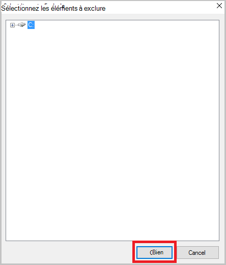

<properties
    pageTitle="Gérer les serveurs Azure en utilisant le modèle de déploiement classiques et les coffres-forts d’Azure sauvegarde | Microsoft Azure"
    description="Utilisez ce didacticiel pour apprendre à gérer les serveurs et les coffres-forts Azure sauvegarde."
    services="backup"
    documentationCenter=""
    authors="markgalioto"
    manager="jwhit"
    editor="tysonn"/>

<tags
    ms.service="backup"
    ms.workload="storage-backup-recovery"
    ms.tgt_pltfrm="na"
    ms.devlang="na"
    ms.topic="article"
    ms.date="09/27/2016"
    ms.author="jimpark;markgal"/>

# Gérer les coffres-forts Azure sauvegarde et les serveurs en utilisant le modèle de déploiement classique

> [AZURE.SELECTOR]
- [Gestionnaire de ressources](backup-azure-manage-windows-server.md)
- [Classique](backup-azure-manage-windows-server-classic.md)

Dans cet article, vous trouverez une vue d’ensemble des tâches de gestion de sauvegarde disponibles via le portail classique Azure et l’agent de sauvegarde de Microsoft Azure.

[AZURE.INCLUDE [learn-about-deployment-models](../../includes/learn-about-deployment-models-classic-include.md)]Modèle de déploiement du Gestionnaire de ressources.

## Tâches de gestion de portail
1. Connectez-vous au [portail de gestion](https://manage.windowsazure.com).

2. Cliquez sur **Services de récupération**, puis cliquez sur le nom de la chambre forte de sauvegarde pour afficher la page de démarrage rapide.

    

En sélectionnant les options en haut de la page de démarrage rapide, vous pouvez voir les tâches de gestion disponibles.

### Tableau de bord
Sélectionnez le **tableau de bord** pour voir la vue d’ensemble de l’utilisation du serveur. La **Présentation de l’utilisation** inclut :

- Le nombre de serveurs de Windows enregistré pour le nuage
- Le nombre d’Azure machines virtuelles protégées dans le nuage
- Le stockage total consommé dans Azure
- L’état des travaux récents

En bas du tableau de bord, vous pouvez effectuer les tâches suivantes :

- **Certificat de gestion** - si un certificat a été utilisé pour inscrire le serveur, puis utilisez cette option pour mettre à jour le certificat. Si vous utilisez des informations d’identification de la chambre forte, n’utilisez pas de **certificat de gérer**.
- **Supprimer** - supprime le coffre-fort de la sauvegarde en cours. Si un coffre-fort de sauvegarde est n’est plus utilisé, vous pouvez le supprimer pour libérer de l’espace de stockage. **Supprimer** est activé uniquement après que tous les serveurs enregistrés ont été supprimés de la chambre forte.

## Articles enregistrés
Sélectionnez **Les éléments enregistrés** pour afficher les noms des serveurs qui sont inscrits dans ce coffre-fort.

Le filtre de **Type** par défaut pour Azure Virtual Machine. Pour afficher les noms des serveurs qui sont inscrits à ce coffre-fort, sélectionnez **Windows server** dans le menu déroulant.

À partir de là, vous pouvez effectuer les tâches suivantes :

- **Autoriser la réinscription** - lorsque cette option est sélectionnée pour un serveur, vous pouvez utiliser l' **Assistant Inscription** de l’agent Microsoft Azure sauvegarde sur site pour inscrire le serveur avec le coffre-fort sauvegarde une deuxième fois. Vous devrez vous inscrire de nouveau en raison d’une erreur dans le certificat, ou si un serveur a dû être reconstruit.
- **Supprimer** - supprime un serveur de sauvegarde coffre-fort. Toutes les données stockées associées avec le serveur est supprimé immédiatement.

    

## Éléments protégés
Sélectionnez **Protégé des éléments** pour afficher les éléments qui ont été sauvegardés à partir des serveurs.

## Configurer

Sous l’onglet **configurer** , vous pouvez sélectionner l’option de redondance de stockage approprié. Le meilleur moment pour sélectionner l’option de redondance de stockage est droit après la création d’un coffre-fort et avant les ordinateurs inscrits auprès de lui.

>[AZURE.WARNING] Une fois qu’un élément a été enregistré dans la chambre forte, l’option de redondance de stockage est verrouillée et ne peut pas être modifiée.

Consultez cet article pour plus d’informations sur la [redondance de stockage](../storage/storage-redundancy.md).

## Tâches de l’agent de sauvegarde de Microsoft Azure

### Console

Ouvrez l' **agent Microsoft Azure Backup** (vous pouvez le trouver en recherchant votre machine *Microsoft Azure Backup*).

Dans les **Actions** disponibles à droite de la console de l’agent de sauvegarde, vous pouvez effectuer les tâches de gestion suivantes :

- Inscrire un serveur
- Planifier la sauvegarde
- Sauvegarder maintenant
- Modifier les propriétés

>[AZURE.NOTE] Pour **Récupérer des données**, reportez-vous à la section [restaurer les fichiers vers un serveur Windows ou d’un ordinateur de client de Windows](backup-azure-restore-windows-server.md).

### Modifier une sauvegarde existante

1. L’agent de sauvegarde de Microsoft Azure, cliquez sur **Planifier la sauvegarde**.

    

2. Dans l' **Assistant Planification de sauvegarde** , laissez l’option **apporter des modifications aux éléments de sauvegarde ou de temps** sélectionnée, puis cliquez sur **suivant**.

    

3. Si vous souhaitez ajouter ou modifier des éléments, cliquez sur **Ajouter des éléments**à l’écran **Sélection d’articles pour la sauvegarde** .

    Vous pouvez également définir des **Paramètres d’Exclusion** à partir de cette page de l’Assistant. Si vous souhaitez exclure des fichiers ou types de fichiers lire la procédure d’ajout de [paramètres d’exclusion](#exclusion-settings).

4. Sélectionnez les fichiers et les dossiers que vous souhaitez sauvegarder, puis cliquez sur **OK**.

    

5. Spécifier la **planification de la sauvegarde** , puis cliquez sur **suivant**.

    Vous pouvez planifier quotidiennement (au maximum 3 fois par jour) ou des sauvegardes hebdomadaires.

    

    >[AZURE.NOTE] Spécification de la planification de sauvegarde est expliquée en détail dans cet [article](backup-azure-backup-cloud-as-tape.md).

6. Sélectionnez la **Stratégie de rétention** pour la copie de sauvegarde, puis cliquez sur **suivant**.

    

7. Sur l’écran de **Confirmation de** passer en revue les informations et cliquez sur **Terminer**.

8. Une fois que l’Assistant a terminé la création de la **planification de la sauvegarde**, cliquez sur **Fermer**.

    Après avoir modifié la protection, vous pouvez vérifier que les sauvegardes sont correctement déclenchement en accédant à l’onglet **tâches** et de confirmer que les modifications sont répercutées dans les tâches de sauvegarde.

### Activer la limitation du réseau  
L’agent de sauvegarde d’Azure fournit un onglet de régulation qui permet de contrôler l’utilisation de la bande passante réseau pendant le transfert de données. Ce contrôle peut être utile si vous avez besoin sauvegarder des données pendant heures de travail, mais ne souhaitez pas que le processus de sauvegarde à interférer avec tout autre trafic internet. Transfert de données s’applique pour sauvegarder et restaurer des activités.  

Pour activer la limitation :

1. L' **agent de sauvegarde**, cliquez sur **Modifier les propriétés**.

2. Cochez la case **Activer l’utilisation de la bande passante internet de limitation pour les opérations de sauvegarde** .

    

3. Une fois que vous avez activé la limitation, spécifiez la largeur de bande autorisé pour le transfert de données de sauvegarde pendant les **heures de travail** et les **heures de travail-Non**.

    Les valeurs de bande passante commencent à 512 kilo-octets par seconde (Kbits/s) et peuvent aller jusqu'à 1 023 mégaoctets par seconde (Mbits/s). Vous pouvez également désigner le début et de fin pour les **heures de travail**et les jours de la semaine sont considérées comme travail jours. L’heure en dehors des heures de travail désignés est considéré comme les heures non travaillées.

4. Cliquez sur **OK**.

## Paramètres d’exclusion

1. Ouvrez l' **agent Microsoft Azure Backup** (vous pouvez le trouver en recherchant votre machine *Microsoft Azure Backup*).

    

2. L’agent de sauvegarde de Microsoft Azure, cliquez sur **Planifier la sauvegarde**.

    

3. Dans l’Assistant Planification de sauvegarde, laissez l’option **apporter des modifications aux éléments de sauvegarde ou de temps** sélectionnée, puis cliquez sur **suivant**.

    

4. Cliquez sur **paramètres d’exclusion**.

    

5. Cliquez sur **Ajouter une Exclusion**.

    

6. Sélectionnez l’emplacement et cliquez ensuite sur **OK**.

    

7. Ajouter l’extension de fichier dans le champ **Type de fichier** .

    

    Ajout d’une extension .mp3

    

    Pour ajouter une autre extension, cliquez sur **Ajouter des exclusions** et entrez une autre extension de fichier (en ajoutant une extension .jpeg).

    

8. Lorsque vous avez ajouté toutes les extensions, cliquez sur **OK**.

9. Poursuivez les étapes de l’Assistant Planification de sauvegarde en cliquant sur **suivant** jusqu'à ce que la **page de Confirmation**, puis cliquez sur **Terminer**.

    

## Étapes suivantes
- [Restauration du Client Windows Server ou Windows Azure](backup-azure-restore-windows-server.md)
- Pour en savoir plus sur la sauvegarde d’Azure, consultez [Vue d’ensemble de la sauvegarde Azure](backup-introduction-to-azure-backup.md)
- Visitez le [Forum de sauvegarde Azure](http://go.microsoft.com/fwlink/p/?LinkId=290933)
