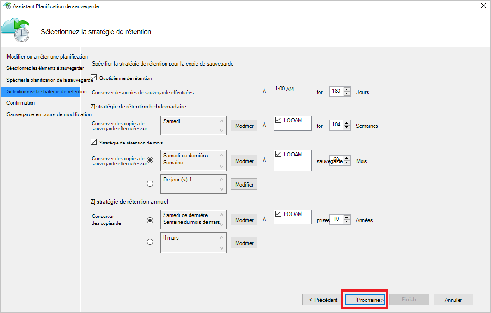

<properties
    pageTitle="Gérer les serveurs et les coffres-forts des services de récupération Azure | Microsoft Azure"
    description="Utilisez ce didacticiel pour apprendre à gérer les serveurs et les coffres-forts des services de récupération Azure."
    services="backup"
    documentationCenter=""
    authors="markgalioto"
    manager="cfreeman"
    editor="tysonn"/>

<tags
    ms.service="backup"
    ms.workload="storage-backup-recovery"
    ms.tgt_pltfrm="na"
    ms.devlang="na"
    ms.topic="article"
    ms.date="10/19/2016"
    ms.author="jimpark; markgal"/>


# <a name="monitor-and-manage-azure-recovery-services-vaults-and-servers-for-windows-machines"></a>Surveiller et gérer les coffres-forts des services de récupération Azure et serveurs pour les machines Windows

> [AZURE.SELECTOR]
- [Gestionnaire de ressources](backup-azure-manage-windows-server.md)
- [Classique](backup-azure-manage-windows-server-classic.md)

Dans cet article, vous trouverez une vue d’ensemble des tâches de gestion de sauvegarde disponibles via le portail Azure et l’agent de sauvegarde de Microsoft Azure.

[AZURE.INCLUDE [learn-about-deployment-models](../../includes/learn-about-deployment-models-rm-include.md)]modèle de déploiement classique.

## <a name="management-portal-tasks"></a>Tâches de gestion de portail

### <a name="access-your-recovery-services-vaults"></a>Accéder à vos coffres-forts Services de récupération

1. Connectez-vous au [Portail Azure](https://portal.azure.com/) à l’aide de votre abonnement Azure.

2. Dans le menu Hub, cliquez sur **Parcourir** , puis dans la liste des ressources, tapez **Les Services de récupération**. Comme vous commencez à taper, la liste de filtre en fonction de votre entrée. Cliquez sur **Services de récupération des coffres-forts**.

     <br/>

2. Sélectionnez le nom de la chambre forte que vous souhaitez afficher à partir de la liste pour ouvrir la lame de tableau de bord de Services de récupération coffre-fort.

     <br/>

## <a name="monitor-jobs-and-alerts"></a>Surveillance des tâches et des alertes
Pour surveiller les travaux et les alertes dans le Services de récupération coffre-fort du tableau de bord, où vous voyez :

- Détails de l’alerte de sauvegarde
- Fichiers et dossiers, ainsi que les machines virtuelles Azure protégés dans le nuage
- Stockage total consommé dans Azure
- Statut de la tâche de sauvegarde


Cliquez sur les informations de chacune de ces tuiles pour ouvrir la lame associée vous permet de gérer les tâches connexes.

À partir du haut du tableau de bord :

- Paramètres donne accès à des tâches de sauvegarde disponibles.
- Sauvegarde - vous aide à vous sauvegardez les nouveaux fichiers et dossiers (ou Azure VM) vers la chambre forte de Services de récupération.
- DELETE - si un coffre-fort de services de récupération est n’est plus utilisé, vous pouvez le supprimer pour libérer de l’espace de stockage. Supprimer est activé uniquement après que tous les serveurs protégés qui ont été supprimées depuis la chambre forte.


## <a name="alerts-for-backups-using-azure-backup-agent"></a>Alertes pour les sauvegardes à l’aide de l’agent de sauvegarde Azure :
| Niveau d’alerte  | Alertes envoyées |
| ------------- | ------------- |
| Critique | Échec de la sauvegarde, Échec de la récupération  |
| Avertissement  | Sauvegarde terminée avec des avertissements (lorsque les fichiers de moins de cent ne sont pas sauvegardés en raison de problèmes de corruption, plus d’un million de fichiers est sauvegardé)  |
| D’information  | Aucun  |
## <a name="manage-backup-alerts"></a>Gérer les alertes de sauvegarde
Cliquez sur la mosaïque **d’Alertes de sauvegarde** pour ouvrir la blade **d’Alertes de sauvegarde** et de gérer les alertes.


La mosaïque de sauvegarde alertes vous indique le nombre de :

- alertes critiques non résolus dans les dernières 24 heures
- alertes d’avertissement non résolus dans les dernières 24 heures

En cliquant sur chacun de ces liens permet d’atteindre la blade **d’Alertes de sauvegarde** avec une vue filtrée des alertes (critiques ou d’avertissement).

À partir de la blade d’alertes de sauvegarde, vous :

- Choisissez les informations appropriées à inclure avec vos alertes.

    

- Filtrer les alertes pour les heures de gravité, l’état et début et de fin.

    

- Configurer des notifications pour les destinataires, la fréquence et la gravité, mais aussi activer ou désactiver les alertes.

    

Si **Par alerte** est sélectionné en tant que la fréquence de **notification** aucun regroupement ou une réduction des e-mails se produit. Chaque alerte génère 1 notification. Il s’agit du paramètre par défaut et la résolution courriel est également envoyé en immédiatement.

Si le **Digest horaire** est sélectionné comme l’une e-mail fréquence de **notification** est envoyé à l’utilisateur indiquant qu’il n’y a pas résolu des nouvelles alertes générées durant la dernière heure. Un e-mail de résolution est envoyé à la fin de l’heure.

Les alertes peuvent être envoyées pour les niveaux de gravité suivants :

- critique
- avertissement
- informations

Vous désactivez l’alerte avec le bouton **désactiver** de la lame de détails de projet. Lorsque vous cliquez sur Désactiver, vous pouvez fournir des notes de résolution.

Vous choisissez les colonnes que vous souhaitez voir apparaître dans le cadre de l’alerte avec le bouton **Choisir les colonnes** .

>[AZURE.NOTE] À partir de la blade de **paramètres** , gérer les alertes de sauvegarde en sélectionnant **analyse et rapports > alertes et événements > alertes de sauvegarde** puis en cliquant sur **filtre** ou **Configurer les Notifications**.

## <a name="manage-backup-items"></a>Gérer les éléments de sauvegarde
La gestion des sauvegardes sur site est maintenant disponible dans le portail de gestion. Dans la section sauvegarde tableau de bord, la mosaïque **d’Éléments de sauvegarde** indique le nombre d’éléments de sauvegarde protégés vers la chambre forte.

Cliquez sur **Fichier-dossiers** dans la mosaïque d’éléments de sauvegarde.


La blade d’éléments de sauvegarde s’ouvre avec le filtre est défini pour le dossier du fichier lorsque vous consultez chaque élément répertorié de sauvegarde spécifique.


Si vous sélectionnez un élément de sauvegarde spécifique à partir de la liste, vous voyez les détails essentiels de cet élément.

>[AZURE.NOTE] À partir de la blade de **paramètres** , vous gérez des fichiers et des dossiers en sélectionnant **protégé par les articles > éléments de sauvegarde** , puis en sélectionnant **Fichier-dossiers** dans le menu déroulant.


## <a name="manage-backup-jobs"></a>Gérer les travaux de sauvegarde
Les opérations de sauvegarde pour les deux locaux (lorsque le serveur local est sauvegarde vers Azure) et les sauvegardes Azure sont visibles dans le tableau de bord.

Dans la section sauvegarde tableau de bord, la mosaïque de travail de sauvegarde indique le nombre de tâches :

- en cours
- Échec au cours des 24 dernières heures.

Pour gérer vos opérations de sauvegarde, cliquez sur le carreau **Les tâches de sauvegarde** , qui s’ouvre à la lame de travaux de sauvegarde.


Vous modifiez les informations disponibles dans la lame de travaux de sauvegarde avec le bouton **Choisir les colonnes** en haut de la page.

Le bouton **filtre** permet de choisir entre les fichiers et les dossiers et les sauvegarde Azure virtual machine.

Si vous ne voyez pas vos fichiers sauvegardés et les dossiers, cliquez sur le bouton de **filtre** en haut de la page et sélectionnez les **fichiers et dossiers** dans le menu Type de l’élément.

>[AZURE.NOTE] À partir de la blade de **paramètres** , gérer les tâches de sauvegarde en sélectionnant **analyse et rapports > tâches > tâches de sauvegarde** , puis en sélectionnant **Fichier-dossiers** dans le menu déroulant.

## <a name="monitor-backup-usage"></a>Surveiller l’utilisation de la sauvegarde
Dans la section sauvegarde tableau de bord, la mosaïque de l’utilisation de la sauvegarde indiquent le stockage utilisé dans Azure. L’utilisation du stockage est fournie pour :
- Utilisation du stockage au niveau LRS cloud associée à la chambre forte
- L’utilisation du stockage GRS associée à la chambre forte du nuage

## <a name="production-servers"></a>Serveurs de production
Pour gérer vos serveurs de production, cliquez sur **paramètres**. Sous gestion, cliquez sur **infrastructure de sauvegarde > serveurs de Production**.

Les listes de lame de serveurs de Production de tous vos serveurs de production disponibles. Cliquez sur un serveur dans la liste pour ouvrir les détails du serveur.


## <a name="microsoft-azure-backup-agent-tasks"></a>Tâches de l’agent de sauvegarde de Microsoft Azure

## <a name="open-the-backup-agent"></a>Ouvrir l’agent de sauvegarde

Ouvrez l' **agent Microsoft Azure Backup** (vous trouvez en recherchant votre machine *Microsoft Azure Backup*).


Dans les **Actions** disponibles à droite de la console de l’agent de sauvegarde, vous effectuez les tâches de gestion suivantes :

- Inscrire un serveur
- Planifier la sauvegarde
- Sauvegarder maintenant
- Modifier les propriétés


>[AZURE.NOTE] Pour **Récupérer des données**, reportez-vous à la section [restaurer les fichiers vers un serveur Windows ou d’un ordinateur de client de Windows](backup-azure-restore-windows-server.md).

## <a name="modify-an-existing-backup"></a>Modifier une sauvegarde existante

1. L’agent de sauvegarde de Microsoft Azure, cliquez sur **Planifier la sauvegarde**.

    

2. Dans l' **Assistant Planification de sauvegarde** , laissez l’option **apporter des modifications aux éléments de sauvegarde ou de temps** sélectionnée, puis cliquez sur **suivant**.

    

3. Si vous souhaitez ajouter ou modifier des éléments, cliquez sur **Ajouter des éléments**à l’écran **Sélection d’articles pour la sauvegarde** .

    Vous pouvez également définir des **Paramètres d’Exclusion** à partir de cette page de l’Assistant. Si vous souhaitez exclure des fichiers ou types de fichiers lire la procédure d’ajout de [paramètres d’exclusion](#exclusion-settings).

4. Sélectionnez les fichiers et les dossiers que vous souhaitez sauvegarder, puis cliquez sur **OK**.

    

5. Spécifier la **planification de la sauvegarde** , puis cliquez sur **suivant**.

    Vous pouvez planifier quotidiennement (au maximum 3 fois par jour) ou des sauvegardes hebdomadaires.

    

    >[AZURE.NOTE] Spécification de la planification de sauvegarde est expliquée en détail dans cet [article](backup-azure-backup-cloud-as-tape.md).

6. Sélectionnez la **Stratégie de rétention** pour la copie de sauvegarde, puis cliquez sur **suivant**.

    

7. Sur l’écran de **Confirmation de** passer en revue les informations et cliquez sur **Terminer**.

8. Une fois que l’Assistant a terminé la création de la **planification de la sauvegarde**, cliquez sur **Fermer**.

    Après avoir modifié la protection, vous pouvez vérifier que les sauvegardes sont correctement déclenchement en accédant à l’onglet **tâches** et de confirmer que les modifications sont répercutées dans les tâches de sauvegarde.

## <a name="enable-network-throttling"></a>Activer la limitation du réseau  
L’agent de sauvegarde d’Azure fournit un onglet de régulation qui permet de contrôler l’utilisation de la bande passante réseau pendant le transfert de données. Ce contrôle peut être utile si vous avez besoin sauvegarder des données pendant heures de travail, mais ne souhaitez pas que le processus de sauvegarde à interférer avec tout autre trafic internet. Transfert de données s’applique pour sauvegarder et restaurer des activités.  

Pour activer la limitation :

1. L' **agent de sauvegarde**, cliquez sur **Modifier les propriétés**.

2. La **limitation de l’onglet, sélectionnez **activer pour les opérations de sauvegarde ** la limitation de bande passante internet.

    

    Une fois que vous avez activé la limitation, spécifiez la largeur de bande autorisé pour le transfert de données de sauvegarde pendant les **heures de travail** et les **heures de travail-Non**.

    Les valeurs de bande passante commencent à 512 kilo-octets par seconde (Kbits/s) et peuvent aller jusqu'à 1 023 mégaoctets par seconde (Mbits/s). Vous pouvez également désigner le début et de fin pour les **heures de travail**et les jours de la semaine sont considérées comme travail jours. L’heure en dehors des heures de travail désignés est considéré comme les heures non travaillées.

3. Cliquez sur **OK**.

## <a name="manage-exclusion-settings"></a>Gérer les paramètres d’exclusion

1. Ouvrez l' **agent Microsoft Azure Backup** (vous pouvez le trouver en recherchant votre machine *Microsoft Azure Backup*).

    

2. L’agent de sauvegarde de Microsoft Azure, cliquez sur **Planifier la sauvegarde**.

    

3. Dans l’Assistant Planification de sauvegarde, laissez l’option **apporter des modifications aux éléments de sauvegarde ou de temps** sélectionnée, puis cliquez sur **suivant**.

    

4. Cliquez sur **paramètres d’exclusion**.

    

5. Cliquez sur **Ajouter une Exclusion**.

    

6. Sélectionnez l’emplacement et cliquez ensuite sur **OK**.

    

7. Ajouter l’extension de fichier dans le champ **Type de fichier** .

    

    Ajout d’une extension .mp3

    

    Pour ajouter une autre extension, cliquez sur **Ajouter des exclusions** et entrez une autre extension de fichier (en ajoutant une extension .jpeg).

    

8. Lorsque vous avez ajouté toutes les extensions, cliquez sur **OK**.

9. Poursuivez les étapes de l’Assistant Planification de sauvegarde en cliquant sur **suivant** jusqu'à ce que la **page de Confirmation**, puis cliquez sur **Terminer**.

    

## <a name="frequently-asked-questions"></a>Forum aux questions
**1ER TRIMESTRE. L’état du travail de sauvegarde affiche comme terminées dans l’agent de sauvegarde Azure, pourquoi n’il sera répercutée immédiatement dans le portail ?**

A1. Il est dans un délai maximal de 15 minutes entre l’état de l’opération de sauvegarde reflété dans l’agent de sauvegarde Azure et le portail Azure.

**Q.2 en cas d’échec d’une opération de sauvegarde, combien de temps faut-il pour déclencher une alerte ?**

A.2, une alerte est déclenchée dans les 20 minutes de l’échec de la sauvegarde Azure.

**AU 3E TRIMESTRE. Y a-t-il un cas dans lequel un message électronique ne seront pas envoyé si les notifications sont configurées ?**

A3. Voici les cas lorsque la notification n’enverra pas afin de réduire le bruit des alertes :

   - Si les notifications sont configurées de toutes les heures et une alerte est déclenchée et résolue dans l’heure
   - Le travail est annulé.
   - Deuxième opération de sauvegarde a échoué, car l’opération de sauvegarde d’origine est en cours.

## <a name="troubleshooting-monitoring-issues"></a>Résolution des problèmes d’analyse

**Problème :** Travaux et/ou des alertes de l’agent de sauvegarde d’Azure n’apparaissent pas dans le portail.

**Les étapes de dépannage :** Le processus, ```OBRecoveryServicesManagementAgent```, envoie les données de tâche et d’alerte pour le service de sauvegarde d’Azure. Il peut arriver que ce processus peuvent se coincer ou d’arrêt.

1. Pour vérifier que le processus n’est pas en cours d’exécution, ouvrez **Le Gestionnaire des tâches** et vérifiez si les ```OBRecoveryServicesManagementAgent``` est en cours.

2. En supposant que le processus ne s’exécute pas, ouvrez **Le panneau de configuration** et de parcourir la liste des services. Démarrez ou redémarrez **l’Agent de gestion des Services Microsoft Azure récupération**.

    Pour plus d’informations, consultez les journaux à :<br/>
`<AzureBackup_agent_install_folder>\Microsoft Azure Recovery Services Agent\Temp\GatewayProvider*`. Par exemple :<br/> `C:\Program Files\Microsoft Azure Recovery Services Agent\Temp\GatewayProvider0.errlog`.

## <a name="next-steps"></a>Étapes suivantes
- [Restauration du Client Windows Server ou Windows Azure](backup-azure-restore-windows-server.md)
- Pour en savoir plus sur la sauvegarde d’Azure, consultez [Vue d’ensemble de la sauvegarde Azure](backup-introduction-to-azure-backup.md)
- Visitez le [Forum de sauvegarde Azure](http://go.microsoft.com/fwlink/p/?LinkId=290933)
