<properties
  pageTitle="Préparation de votre environnement pour sauvegarder des charges de travail à l’aide du serveur de sauvegarde Azure | Microsoft Azure"
  description="Assurez-vous que votre environnement est correctement préparé pour sauvegarder des charges de travail à l’aide du serveur de sauvegarde Azure"
  services="backup"
  documentationCenter=""
  authors="pvrk"
  manager="shivamg"
  editor=""
  keywords="serveur de sauvegarde Azure ; chambre forte de sauvegarde"/>

<tags
  ms.service="backup"
  ms.workload="storage-backup-recovery"
  ms.tgt_pltfrm="na"
  ms.devlang="na"
  ms.topic="article"
  ms.date="08/22/2016"
  ms.author="jimpark;trinadhk;pullabhk; markgal"/>

# <a name="preparing-to-back-up-workloads-using-azure-backup-server"></a>Préparation de la sauvegarde des charges de travail à l’aide du serveur de sauvegarde Azure

> [AZURE.SELECTOR]
- [Serveur de sauvegarde Azure](backup-azure-microsoft-azure-backup.md)
- [SCDPM](backup-azure-dpm-introduction.md)
- [Serveur de sauvegarde Azure (classique)](backup-azure-microsoft-azure-backup-classic.md)
- [SCDPM (classique)](backup-azure-dpm-introduction-classic.md)


Cet article est sur la préparation de votre environnement pour sauvegarder des charges de travail à l’aide du serveur de sauvegarde Azure. Avec le serveur de sauvegarde Azure, vous pouvez protéger des charges de travail tels que les ordinateurs virtuels Hyper-V, Microsoft SQL Server, SharePoint Server, Microsoft Exchange et les clients Windows à partir d’une console unique.

>[AZURE.WARNING] Serveur de sauvegarde Azure hérite des fonctionnalités de Data Protection Manager (DPM) pour la sauvegarde de la charge de travail. Vous trouverez des pointeurs vers la documentation DPM pour certaines de ces fonctionnalités. Toutefois Azure Backup Server ne pas offrir une protection sur bande ou intégration avec System Center.

## <a name="1-windows-server-machine"></a>1. serveur Windows


La première étape vers la route Azure Backup Server doit disposer d’un ordinateur Windows Server.

| Emplacement | Configuration minimale requise | Instructions supplémentaires |
| -------- | -------------------- | ----------------------- |
| Azure | Azure VM IaaS<br><br>A2 Norme : 2 noyaux, 3,5 Go de RAM | Vous pouvez démarrer avec une image de la galerie simple de Windows Server 2012 R2 Datacenter. [Les charges de travail IaaS de protection à l’aide du serveur de sauvegarde Azure (DPM)](https://technet.microsoft.com/library/jj852163.aspx) a de nombreuses nuances. Assurez-vous de lire l’article complètement avant le déploiement de l’ordinateur. |
| Sur site | Ordinateur virtuel Hyper-V,<br> Machine virtuelle VMWare,<br> ou d’un hôte physique<br><br>2 de cœurs et de 4 Go de RAM | Vous pouvez Dédupliquez le stockage DPM à l’aide de déduplication du serveur Windows. Découvrez comment [DPM et déduplication](https://technet.microsoft.com/library/dn891438.aspx) collaborer lors du déploiement dans des ordinateurs virtuels Hyper-V. |

> [AZURE.NOTE] Il est recommandé que le serveur de sauvegarde Azure être installé sur un ordinateur avec Windows Server 2012 R2 Datacenter. Un grand nombre de conditions préalables sont traités automatiquement avec la dernière version du système d’exploitation Windows.

Si vous prévoyez d’ajouter ce serveur à un domaine à un moment donné, il est recommandé que l’activité de jonction de domaine soient effectuées avant l’installation du serveur de sauvegarde Azure. Déplacement d’un ordinateur de serveur de sauvegarde Azure existant vers un nouveau domaine après déploiement *non pris en charge*.

## <a name="2-backup-vault"></a>2. sauvegarde coffre-fort


Envoyer des données de sauvegarde vers Azure ou conservez-le localement, le logiciel doit être connecté à Azure. Pour être plus spécifique, l’ordinateur du serveur de sauvegarde Azure doit être enregistré avec un coffre-fort de sauvegarde.

Pour créer un coffre-fort de sauvegarde :

1. Connectez-vous au [portail de gestion](http://manage.windowsazure.com/).

2. Cliquez sur **Nouveau** > **les Services de données** > **Services de récupération de** > **sauvegarde coffre-fort** > **Création rapide**. Si vous disposez de plusieurs abonnements associés à votre compte d’organisation, cliquez sur l’abonnement approprié à associer à la chambre forte de sauvegarde.

3. Dans la zone **nom**, entrez un nom convivial pour identifier le coffre-fort. Il doit être unique pour chaque abonnement.

4. Dans la **zone**, sélectionnez la zone géographique pour la chambre forte. En règle générale, la région de la chambre forte est prélevée en fonction des contraintes de temps de latence de données relevant de la souveraineté ou de réseau.

    

5. Cliquez sur **créer un coffre-fort**. Elle peut prendre du temps pour le coffre-fort de sauvegarde à créer. Surveiller les notifications d’état au bas du portail.

    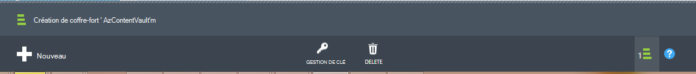

6. Un message confirme que le coffre-fort a été créé et qu’il apparaît dans la page Services de récupération active.
    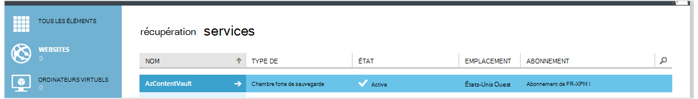

  > [AZURE.IMPORTANT] Assurez-vous que l’option de redondance de stockage approprié est choisie après que le coffre-fort a été créé. En savoir plus sur [geo redondante](../storage/storage-redundancy.md#geo-redundant-storage) et options [localement redondants](../storage/storage-redundancy.md#locally-redundant-storage) dans cette [vue d’ensemble](../storage/storage-redundancy.md).


## <a name="3-software-package"></a>3. package logiciel


### <a name="downloading-the-software-package"></a>Télécharger le package logiciel

Similaire en chambre forte des informations d’identification, vous pouvez télécharger Microsoft Azure sauvegarde pour des charges de travail à partir de la **Page de démarrage rapide** de la chambre forte de sauvegarde.

1. Cliquez sur **pour les charges de travail applicatives (disque à disque vers le Cloud)**. Ceci vous dirigera vers la page du centre de téléchargement à partir de laquelle le package de logiciels peut être téléchargé.

    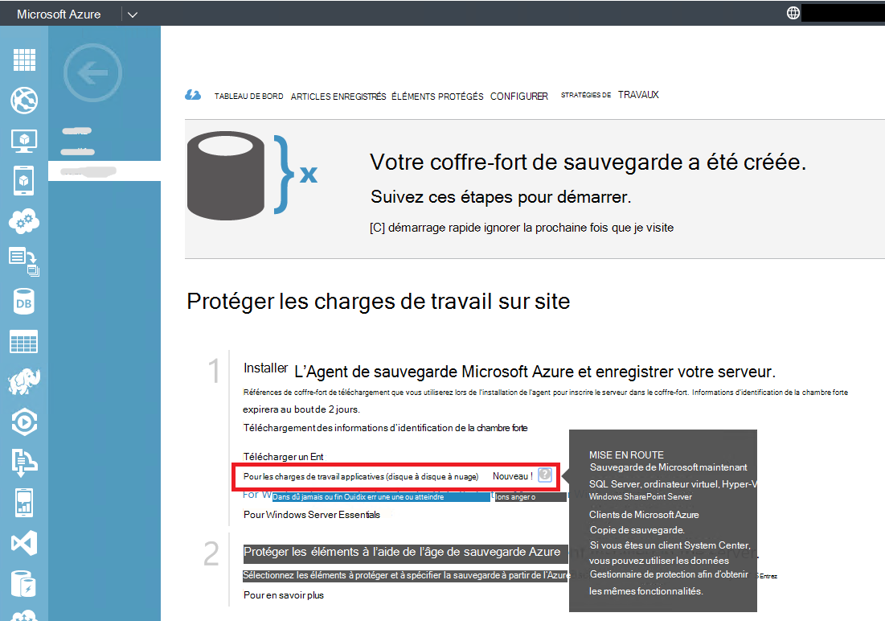

2. Cliquez sur **Télécharger**.

    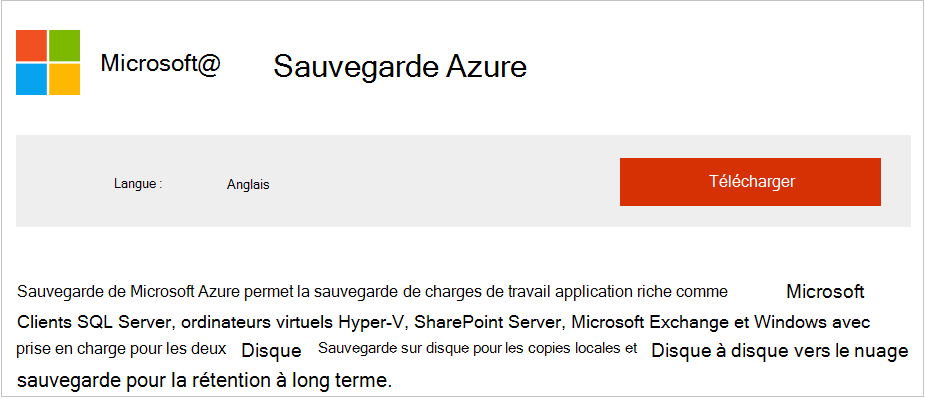

3. Sélectionnez tous les fichiers et cliquez sur **suivant**. Télécharger tous les fichiers provenant la page de téléchargement de Microsoft Azure Backup et placer tous les fichiers dans le même dossier.
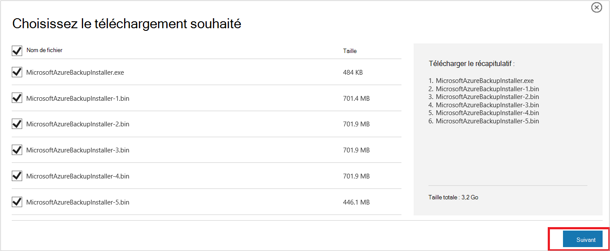

    Étant donné que la taille du téléchargement de tous les fichiers est ensemble > 3G, sur un 10 Mbits/s lien de téléchargement que peut prendre jusqu'à 60 minutes de la fin du téléchargement.


### <a name="extracting-the-software-package"></a>Extraction de l’ensemble de logiciels

Une fois que vous avez téléchargé tous les fichiers, cliquez sur **MicrosoftAzureBackupInstaller.exe**. Ceci démarrera l' **Assistant de configuration de sauvegarde Microsoft Azure** pour extraire les fichiers d’installation vers un emplacement spécifié par vous. Poursuivez les étapes de l’Assistant, cliquez sur le bouton **Extraire** pour commencer le processus d’extraction.

> [AZURE.WARNING] Au moins 4 Go d’espace libre est nécessaire pour extraire les fichiers d’installation.


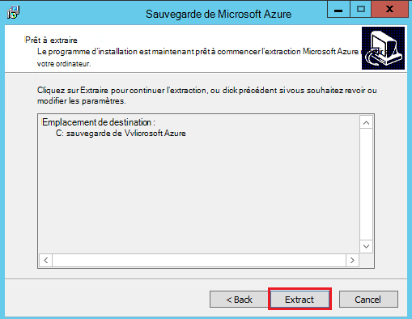

Une fois l’extraction traiter terminée, cochez la case pour lancer le fraîchement extraits *setup.exe* pour commencer l’installation du serveur de sauvegarde de Microsoft Azure et cliquez sur le bouton **Terminer** .

### <a name="installing-the-software-package"></a>L’installation du package logiciel

1. Cliquez sur **Microsoft Azure sauvegarde** pour lancer l’Assistant d’installation.

    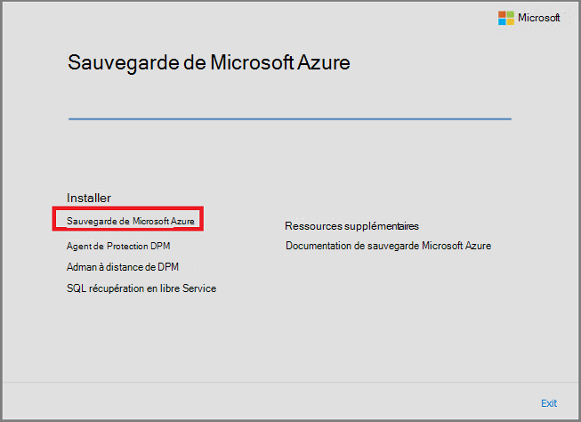

2. Sur l’écran de bienvenue, cliquez sur le bouton **suivant** . Vous accédez à la section *Vérifications préalables* . Sur cet écran, cliquez sur le bouton **Vérifier** pour déterminer si les composants matériels et logiciels requis pour le serveur de sauvegarde Azure ont été respectées. Si toutes les conditions préalables sont ont été satisfaits avec succès, vous verrez un message indiquant que l’ordinateur répond aux exigences. Cliquez sur le bouton **suivant** .

    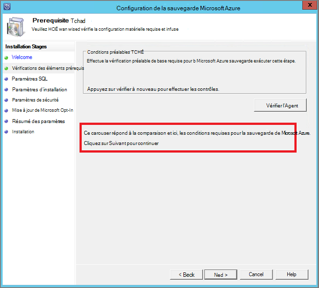

3. Serveur de sauvegarde de Microsoft Azure nécessite SQL Server Standard, et le package d’installation de serveur de sauvegarde Azure est livré avec les binaires SQL Server appropriés nécessaires. Lors du démarrage d’une nouvelle installation du serveur de sauvegarde Azure, vous devez choisir l’option **Installation nouvelle Instance de SQL Server avec ce programme d’installation** et cliquez sur le bouton **vérifier et installer** . Une fois les composants requis sont installés avec succès, cliquez sur **suivant**.

    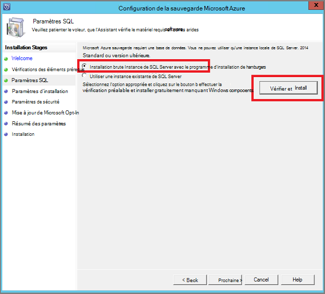

    Si une défaillance se produit avec une recommandation de redémarrer l’ordinateur, faites-le et cliquez sur **Vérifier à nouveau**.

    > [AZURE.NOTE] Serveur de sauvegarde Azure ne fonctionnera pas avec une instance de SQL Server à distance. L’instance utilisée par le serveur de sauvegarde Azure doit être local.

4. Fournir un emplacement pour l’installation des fichiers de serveur de sauvegarde de Microsoft Azure et cliquez sur **suivant**.

    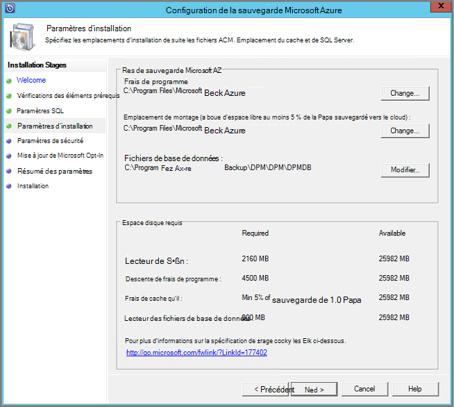

    L’emplacement de montage est une condition requise pour la sauvegarde sur Azure. Assurez-vous que l’emplacement de montage est d’au moins 5 % des données prévues pour être sauvegardé dans le cloud. Pour la protection des disques, des disques distincts doivent être configurés pour une fois l’installation terminée. Pour plus d’informations sur les pools de stockage, voir [configurer les pools de stockage et le stockage sur disque](https://technet.microsoft.com/library/hh758075.aspx).

5. Fournir un mot de passe pour les comptes d’utilisateur locaux restreints et cliquez sur **suivant**.

    

6. Indiquez si vous souhaitez utiliser *Microsoft Update* pour vérifier les mises à jour et cliquez sur **suivant**.

    >[AZURE.NOTE] Nous vous conseillons la mise à jour de Windows rediriger vers Microsoft Update, qui propose une sécurité et des mises à jour importantes pour Windows et d’autres produits comme le serveur de sauvegarde de Microsoft Azure.

    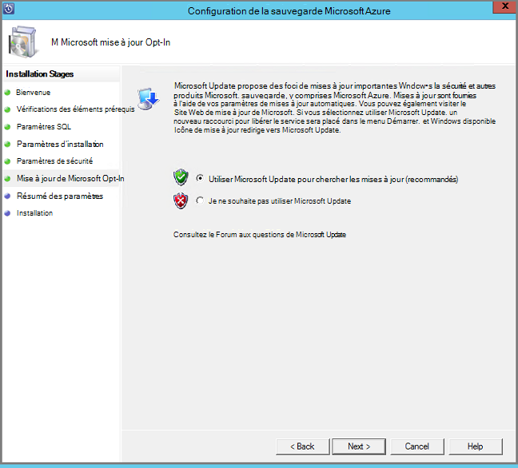

7. Passez en revue le *Résumé des paramètres* , puis cliquez sur **installer**.

    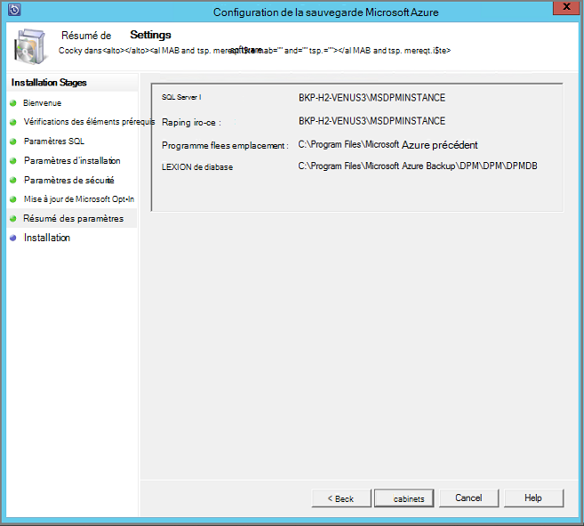

8. L’installation s’effectue en plusieurs phases. Dans la première phase, l’Agent de Services de récupération de Microsoft Azure est installé sur le serveur. L’Assistant vérifie également pour la connectivité Internet. Si la connexion Internet est disponible vous pouvez poursuivre l’installation, si ce n’est pas, vous devez fournir les détails proxy pour se connecter à Internet.

    L’étape suivante consiste à configurer l’Agent de Services de récupération de Microsoft Azure. Dans le cadre de la configuration, vous devrez fournir que vous êtes les informations d’identification de coffre-fort pour inscrire l’ordinateur dans la chambre forte de sauvegarde. Vous allez également fournir un mot de passe pour chiffrer/déchiffrer des données envoyées entre Azure et les locaux de l’entreprise. Vous pouvez automatiquement générer une phrase secrète ou fournir votre propre mot de passe 16 caractères minimum. Continuez avec l’Assistant jusqu'à ce que l’agent a été configuré.

    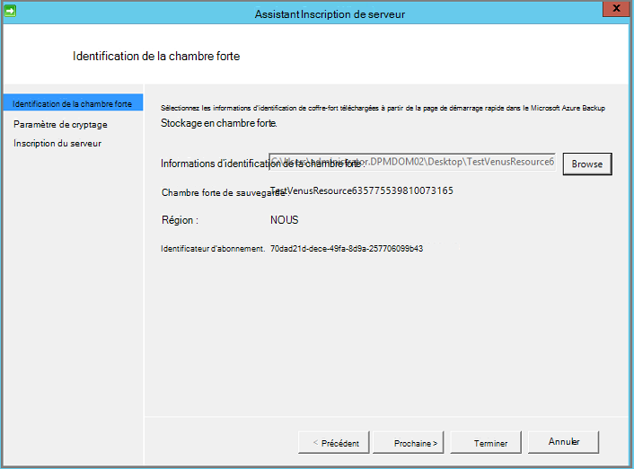

9. Une fois l’enregistrement du serveur Microsoft Azure sauvegarde terminée, l’Assistant de configuration globale procède à l’installation et la configuration de SQL Server et les composants du serveur de sauvegarde Azure. Une fois l’installation de composants SQL Server terminée, les composants du serveur de sauvegarde Azure sont installés.

    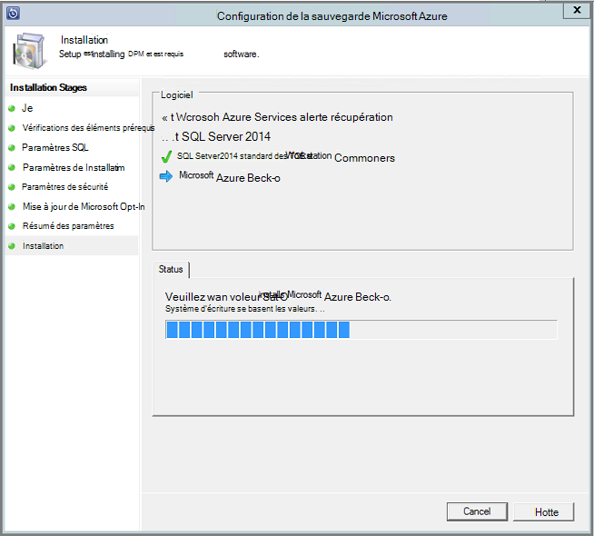


À l’issue de l’étape d’installation, les icônes du bureau du produit aura été créés ainsi. Double-cliquez sur l’icône pour lancer le produit.

### <a name="add-backup-storage"></a>Ajouter du stockage de sauvegarde

La première copie de sauvegarde est conservée sur le stockage relié à l’ordinateur du serveur de sauvegarde Azure. Pour plus d’informations sur l’ajout de disques, consultez [configurer les pools de stockage et le stockage sur disque](https://technet.microsoft.com/library/hh758075.aspx).

> [AZURE.NOTE] Vous devez ajouter le stockage de sauvegarde même si vous envisagez d’envoyer des données vers Azure. Dans l’architecture actuelle de serveur de sauvegarde Azure, le coffre-fort Azure sauvegarde conserve la *deuxième* copie des données, alors que le stockage local conserve la copie de sauvegarde de premier (et obligatoire).  

## <a name="4-network-connectivity"></a>4. connectivité réseau


Serveur de sauvegarde Azure nécessite une connexion pour le service de sauvegarde d’Azure pour le produit fonctionne correctement. Pour valider si l’ordinateur dispose de la connectivité d’Azure, utilisez le ```Get-DPMCloudConnection``` applet de commande dans la console PowerShell de serveur de sauvegarde Azure. Si la sortie de l’applet de commande est le vrai connectivité existe, sinon, il n’y a pas de connectivité.

Dans le même temps, l’abonnement Azure doit être dans un état sain. Pour déterminer l’état de votre abonnement et de le gérer, connectez-vous au [portail de l’abonnement]( https://account.windowsazure.com/Subscriptions).

Une fois que vous connaissez l’état de la connectivité d’Azure et de l’abonnement Azure, vous pouvez utiliser le tableau ci-dessous pour connaître l’impact sur la fonctionnalité de sauvegarde et de restauration proposée.

| État de la connectivité | Abonnement Azure | Sauvegarde vers Azure| Sauvegarde sur disque | Restaurer à partir d’Azure | Restaurer à partir du disque |
| -------- | ------- | --------------------- | ------------------- | --------------------------- | ----------------------- |
| Connecté | Active | Autorisé | Autorisé | Autorisé | Autorisé |
| Connecté | Expiré | Arrêté | Arrêté | Autorisé | Autorisé |
| Connecté | Arrêtés | Arrêté | Arrêté | Points de récupération arrêté et Azure supprimés | Arrêté |
| Perte de connectivité > 15 jours | Active | Arrêté | Arrêté | Autorisé | Autorisé |
| Perte de connectivité > 15 jours | Expiré | Arrêté | Arrêté | Autorisé | Autorisé |
| Perte de connectivité > 15 jours | Arrêtés | Arrêté | Arrêté |  Points de récupération arrêté et Azure supprimés | Arrêté |

### <a name="recovering-from-loss-of-connectivity"></a>Récupération à partir de la perte de la connectivité
Si vous disposez d’un pare-feu ou un proxy qui empêche l’accès sur Azure, vous devez d’autorisation les adresses de domaine suivantes dans le profil de pare-feu/proxy :

- www.msftncsi.com
- \*. Microsoft.com
- \*. WindowsAzure.com
- \*. microsoftonline.com
- \*. windows.net

Une fois la connectivité vers Azure a été restaurée sur la machine serveur de sauvegarde Azure, les opérations qui peuvent être effectuées sont déterminées par l’état d’abonnement Azure. Le tableau ci-dessus a plus d’informations sur les opérations autorisées dès que l’ordinateur est « connecté ».

### <a name="handling-subscription-states"></a>Gestion des États de l’abonnement

Il est possible de prendre un abonnement Azure à partir d’un état *expiré* ou *Deprovisioned* à l’état *actif* . Toutefois, ceci a certaines conséquences sur le comportement du produit alors que l’état n’est pas *actif*:

- Un abonnement *Deprovisioned* perd la fonctionnalité pour la période pour laquelle il est arrêté. Sur la sélection *Active*, les fonctionnalités du produit de sauvegarde/restauration sont réactivée. Les données de sauvegarde sur le disque local peuvent également être récupérées si elle a été conservé avec une période de rétention suffisante. Toutefois, les données de sauvegarde dans Azure sont irrémédiablement perdues une fois l’abonnement passe à l’état de *Deprovisioned* .
- Un abonnement *expiré* perd uniquement les fonctionnalités de jusqu'à ce qu’il a été rendu *actif* à nouveau. Toutes les sauvegardes planifiées pour la période que l’abonnement a *expiré* ne seront exécutera pas.


## <a name="troubleshooting"></a>Résolution des problèmes

Si le serveur de sauvegarde de Microsoft Azure échoue avec des erreurs au cours de la phase d’installation (ou de sauvegarde ou de restauration), reportez-vous à ce [document de codes d’erreur](https://support.microsoft.com/kb/3041338) pour plus d’informations.
Vous pouvez également faire référence à [Qu'azure sauvegarde liés à des questions fréquentes](backup-azure-backup-faq.md)


## <a name="next-steps"></a>Étapes suivantes

Vous pouvez obtenir des informations détaillées sur la [Préparation de votre environnement pour DPM](https://technet.microsoft.com/library/hh758176.aspx) sur le site TechNet de Microsoft. Il contient également des informations sur les configurations prises en charge sur lequel Azure Backup Server peuvent être déployé et utilisé.

Vous pouvez utiliser ces articles pour obtenir une bonne compréhension de la protection de la charge de travail à l’aide du serveur de sauvegarde de Microsoft Azure.

- [Sauvegarde de SQL Server](backup-azure-backup-sql.md)
- [Sauvegarde du serveur SharePoint](backup-azure-backup-sharepoint.md)
- [Sauvegarde de serveur de remplacement](backup-azure-alternate-dpm-server.md)
