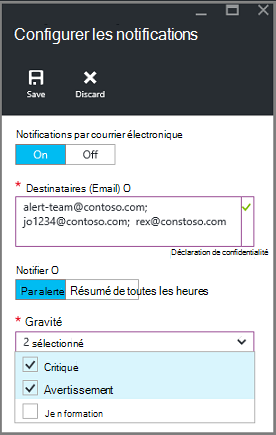

<properties
   pageTitle="Les sauvegardes déployés par le Gestionnaire de ressources de moniteur un ordinateur virtuel | Microsoft Azure"
   description="Surveiller les événements et les alertes à partir de sauvegardes de déployés par le Gestionnaire de ressources des machines virtuelles. Envoyer un e-mail en fonction des alertes."
   services="backup"
   documentationCenter="dev-center-name"
   authors="markgalioto"
   manager="cfreeman"
   editor=""/>

<tags
ms.service="backup"
ms.workload="storage-backup-recovery"
ms.tgt_pltfrm="na"
ms.devlang="na"
ms.topic="article"
ms.date="08/25/2016"
ms.author="trinadhk; giridham;"/>

# <a name="monitor-alerts-for-azure-virtual-machine-backups"></a>Alertes de l’analyseur pour Azure VM des sauvegardes

Les alertes sont des réponses du service qu’un seuil d’événements a été atteint ou dépassé. Permet de savoir lorsque les problèmes début peut être indispensable pour limiter les coûts de l’entreprise vers le bas. Alertes ne se produisent généralement pas sur un calendrier, et donc il est utile de savoir dès que possible après que les alertes se produisent. Par exemple, lorsqu’un travail de sauvegarde ou de restauration échoue, une alerte se produit dans les cinq minutes suivant la panne. Dans le tableau de bord en chambre forte, la mosaïque d’alertes de sauvegarde affiche les événements critiques et d’avertissement de niveau. Dans les paramètres des alertes de sauvegarde, vous pouvez afficher tous les événements. Mais que faire si une alerte se produit lorsque vous travaillez sur un problème différent ? Si vous ne connaissez pas lorsque l’alerte se produit, il peut être un désagrément mineur, ou il peut compromettre des données. Pour vous assurer que les personnes autorisées ne connaissent une alerte - lorsqu’il se produit, configurez le service pour envoyer des notifications d’alerte par e-mail. Pour plus d’informations sur la configuration des notifications par courrier électronique, consultez [configuration notifications](backup-azure-monitor-vms.md#configure-notifications).

## <a name="how-do-i-find-information-about-the-alerts"></a>Comment trouver des informations sur les alertes ?

Pour afficher des informations sur l’événement qui a généré une alerte, vous devez ouvrir la blade d’alertes de sauvegarde. Il existe deux façons d’ouvrir la lame de sauvegarde alertes : les alertes de sauvegarde à partir de mosaïque dans le tableau de bord en chambre forte, ou de la lame d’événements et les alertes.

Pour ouvrir la blade d’alertes de sauvegarde à partir de la mosaïque d’alertes de sauvegarde :

- Dans la fenêtre **d’Alertes de sauvegarde** sur le tableau de bord de coffre-fort, cliquez sur pour afficher les événements opérationnels pour ce niveau de gravité **critique** ou **Avertissement** .

    


Pour ouvrir la blade d’alertes de sauvegarde à partir de la blade d’alertes et d’événements :

1. Dans le tableau de bord de coffre-fort, cliquez sur **Tous les paramètres**. 

2. Sur la lame de **paramètres** , cliquez sur les **événements et les alertes**. 

3. Sur la blade **d’événements et les alertes** , cliquez sur **Alertes de sauvegarde**. 

    La blade **d’Alertes de sauvegarde** s’ouvre et affiche les alertes filtrées.

    

4. Pour afficher des informations détaillées sur une alerte donnée, à partir de la liste des événements, cliquez sur l’alerte pour ouvrir ses **Détails** de lame.

    

    Pour personnaliser les attributs affichés dans la liste, reportez-vous à la section [Afficher les attributs d’événements](backup-azure-monitor-vms.md#view-additional-event-attributes)

## <a name="configure-notifications"></a>Configurer les notifications

 Vous pouvez configurer le service pour envoyer des notifications par e-mail pour les alertes qui se sont produites sur l’heure en cours, ou lorsque des événements particuliers se produisent.

Pour configurer des notifications par courrier électronique pour les alertes

1. Dans le menu alertes de sauvegarde, cliquez sur **configurer notifications**

    

    La lame de notifications de configuration s’ouvre.

    

2. Sur la lame de notifications de configurer, de notifications par courrier électronique, cliquez **sur**.

    Les destinataires et la gravité boîtes de dialogue ont une étoile dans la mesure où ces informations sont requises. Fournir au moins une des adresses email et sélectionnez au moins une gravité.

3. Dans la boîte de dialogue **destinataires (Email)** , tapez les adresses de messagerie pour qui reçoivent les notifications. Utilisez le format : username@domainname.com. Séparez les adresses par un point-virgule ( ;).

4. Dans la zone de **notification** , choisissez **Par l’alerte** pour envoyer une notification lorsque l’alerte indiquée se produit, ou **Digest horaire** pour envoyer un résumé de la dernière heure.

5. Dans la boîte de dialogue de **gravité** , sélectionnez un ou plusieurs niveaux que vous souhaitez déclencher la notification par courrier électronique.

6. Cliquez sur **Enregistrer**.
### <a name="what-alert-types-are-available-for-azure-iaas-vm-backup"></a>Quels types d’alerte sont disponibles pour la sauvegarde de l’ordinateur virtuel IaaS de Azure ?
| Niveau d’alerte  | Alertes envoyées |
| ------------- | ------------- |
| Critique | Échec de la sauvegarde, Échec de la récupération  |
| Avertissement  | Aucun |
| D’information  | Aucun  |

### <a name="are-there-situations-where-email-isnt-sent-even-if-notifications-are-configured"></a>Y a-t-il des situations où le courrier électronique n’est pas envoyé même si les notifications sont configurées ?

Il existe des situations où une alerte n’est envoyée, même si les notifications ont été correctement configurées. Dans l’e-mail de situations suivant les notifications ne sont pas envoyées pour éviter le bruit des alertes :

- Si les notifications sont configurées pour un résumé de toutes les heures, et une alerte est déclenchée et résolue dans l’heure qui suit.
- Le travail est annulé.
- Une opération de sauvegarde est déclenchée et échoue, et une autre opération de sauvegarde est en cours.
- Démarrage d’une opération de sauvegarde planifiée pour un ordinateur virtuel de gestionnaire de ressources compatible, mais que la machine virtuelle n’existe plus.

## <a name="customize-your-view-of-events"></a>Personnaliser l’affichage des événements

Le paramètre de **journaux d’Audit** est livré avec un ensemble prédéfini de filtres et de colonnes présentant des informations d’événement opérationnel. Vous pouvez personnaliser l’affichage de sorte que lorsque la blade **d’événements** s’ouvre, elle affiche les informations que vous souhaitez.

1. Dans le [tableau de bord en chambre forte](./backup-azure-manage-vms.md#open-a-recovery-services-vault-in-the-dashboard), recherchez et cliquez sur **Journaux d’Audit** pour ouvrir la blade **d’événements** .

    

    La blade **d’événements** s’ouvre sur les événements opérationnels filtrés pour le coffre-fort actuel.

    

    La lame affiche la liste de critique, erreur, d’avertissement et les événements d’information qui s’est produite lors de la semaine. L’intervalle de temps est une valeur par défaut définie dans le **filtre**. La blade **d’événements** affiche également un graphique à barres de suivi lorsque les événements se sont produits. Si vous ne voulez pas voir le graphique à barres, dans le menu **Evénements** , cliquez sur **Masquer le graphique** pour activer / désactiver le graphique. L’affichage par défaut des événements affiche des informations d’opération, niveau, état, ressource et l’heure. Pour plus d’informations sur l’exposition d’autres attributs d’événement, reportez-vous à la section [développement d’informations sur l’événement](backup-azure-monitor-vms.md#view-additional-event-attributes).

2. Pour plus d’informations sur un événement opérationnel, dans la colonne **opération** , cliquez sur un événement opérationnel pour ouvrir sa carte. La lame contient des informations détaillées sur les événements. Les événements sont regroupés par leur ID de corrélation et la liste des événements qui ont eu lieu dans l’intervalle de temps.

    

3. Pour afficher des informations détaillées sur un événement particulier, à partir de la liste des événements, cliquez sur l’événement pour ouvrir ses **Détails** de lame.

    

    Les informations au niveau de l’événement soient aussi détaillées qu’Obtient des informations. Si vous préférez afficher autant d’informations sur chaque événement et que vous souhaitez ajouter ce niveau de détail à la blade **d’événements** , consultez la section [développement d’informations sur l’événement](backup-azure-monitor-vms.md#view-additional-event-attributes).


## <a name="customize-the-event-filter"></a>Personnaliser le filtre d’événements
Utilisez le **filtre** pour régler ou choisissez les informations qui apparaissent dans une lame particulier. Pour filtrer les informations de l’événement :

1. Dans le [tableau de bord en chambre forte](./backup-azure-manage-vms.md#open-a-recovery-services-vault-in-the-dashboard), recherchez et cliquez sur **Journaux d’Audit** pour ouvrir la blade **d’événements** .

    

    La blade **d’événements** s’ouvre sur les événements opérationnels filtrés pour le coffre-fort actuel.

    

2. Dans le menu **Evénements** , cliquez sur **filtre** pour ouvrir cette blade.

    

3. Sur la lame de **filtre** , réglez les filtres **au niveau** **d’intervalle de temps**et de **l’appelant** . Les autres filtres ne sont pas disponibles dans la mesure où elles ont été définies afin de fournir les informations actuelles de la chambre forte de Services de récupération.

    

    Vous pouvez spécifier le **niveau** d’événement : critique, erreur, avertissement ou information. Vous pouvez choisir n’importe quelle combinaison de niveaux d’événement, mais vous devez avoir au moins un niveau sélectionné. Activer ou désactiver le le niveau. Le filtre **intervalle de temps** vous permet de spécifier la durée de temps pour capturer des événements. Si vous utilisez un intervalle de temps personnalisé, vous pouvez définir les heures de début et de fin.

4. Une fois que vous êtes prêt à interroger les journaux d’opérations à l’aide de votre filtre, cliquez sur **mise à jour**. Les résultats s’affichent dans la blade **d’événements** .

    


### <a name="view-additional-event-attributes"></a>Afficher les attributs d’événements
À l’aide du bouton **colonnes** , vous pouvez activer les attributs d’événement supplémentaires apparaissent dans la liste sur la blade **d’événements** . La liste par défaut des événements affiche des informations pour l’opération, niveau, état, ressource et l’heure. Pour activer les attributs supplémentaires :

1. Sur la blade **d’événements** , cliquez sur **colonnes**.

    

    La lame de **Choisir les colonnes** s’ouvre.

    

2. Pour sélectionner l’attribut, cliquez sur la case à cocher. La case à cocher de l’attribut Active et se désactive.

3. Cliquez sur **Réinitialiser** pour réinitialiser la liste des attributs de la lame **d’événements** . Après l’ajout ou la suppression d’attributs à partir de la liste, utilisez la commande **Reset** permet d’afficher la nouvelle liste des attributs de l’événement.

4. Cliquez sur **mettre à jour** pour mettre à jour les données dans les attributs d’événement. Le tableau suivant fournit des informations sur chaque attribut.

| Nom de la colonne      |Description|
| -----------------|-----------|
| Opération|Le nom de l’opération|
| Niveau|Le niveau de l’opération, les valeurs peuvent être : information, avertissement, erreur ou critique|
|État|État descriptif de l’opération|
|Ressources|URL qui identifie la ressource ; également connu sous le nom l’ID de ressource|
|Heure|Durée, mesurée à partir de l’heure actuelle, lorsque l’événement s’est produit|
|Appelant|Qui ou quoi appelée ou a déclenché l’événement ; peut être le système ou un utilisateur|
|Horodatage|Lors du déclenchée de l’événement|
|Groupe de ressources|Le groupe de ressources|
|Type de ressource|Le type de ressource interne utilisé par le Gestionnaire de ressources|
|ID de l’abonnement|L’ID d’abonnement associé|
|Catégorie|Catégorie de l’événement|
|ID de corrélation|ID courant des événements associés|


## <a name="use-powershell-to-customize-alerts"></a>Utiliser PowerShell pour personnaliser les alertes
Vous pouvez obtenir des notifications d’alerte personnalisées pour les tâches dans le portail. Pour obtenir ces tâches, définir des règles d’alerte PowerShell sur les événements de journaux des opérations. Utilisation *PowerShell version version 1.3.0 ou une version ultérieure*.

Pour définir une notification personnalisée d’alerte pour les échecs de sauvegarde, utilisez une commande telle que le script suivant :

```
PS C:\> $actionEmail = New-AzureRmAlertRuleEmail -CustomEmail contoso@microsoft.com
PS C:\> Add-AzureRmLogAlertRule -Name backupFailedAlert -Location "East US" -ResourceGroup RecoveryServices-DP2RCXUGWS3MLJF4LKPI3A3OMJ2DI4SRJK6HIJH22HFIHZVVELRQ-East-US -OperationName Microsoft.Backup/RecoveryServicesVault/Backup -Status Failed -TargetResourceId /subscriptions/86eeac34-eth9a-4de3-84db-7a27d121967e/resourceGroups/RecoveryServices-DP2RCXUGWS3MLJF4LKPI3A3OMJ2DI4SRJK6HIJH22HFIHZVVELRQ-East-US/providers/microsoft.backupbvtd2/RecoveryServicesVault/trinadhVault -Actions $actionEmail
```

**ResourceId** : vous pouvez obtenir ResourceId à partir des journaux d’Audit. Le ResourceId est une URL fournie dans la colonne ressource des journaux de l’opération.

**OperationName** : NomOpération est dans le format « Microsoft.RecoveryServices/recoveryServicesVault/*EventName*» où *EventName* peut être :<br/>
- Enregistrer <br/>
- Annuler l’inscription <br/>
- ConfigureProtection <br/>
- Sauvegarde <br/>
- Restauration <br/>
- StopProtection <br/>
- DeleteBackupData <br/>
- CreateProtectionPolicy <br/>
- DeleteProtectionPolicy <br/>
- UpdateProtectionPolicy <br/>

**État** : valeurs prises en charge sont démarré, réussite ou échec.

**ResourceGroup** : c’est le groupe de ressources auquel appartient la ressource. Vous pouvez ajouter la colonne du groupe de ressources dans les journaux générés. Groupe de ressources est un des types d’informations sur les événements disponibles.

**Nom** : nom de la règle d’alerte.

**CustomEmail** : spécifiez l’adresse e-mail personnalisé auquel vous souhaitez envoyer une notification d’alerte

**SendToServiceOwners** : cette option envoie des notifications d’alerte à tous les administrateurs et les administrateurs de collègues de l’abonnement. Il peut être utilisé dans l’applet de commande **New-AzureRmAlertRuleEmail**

### <a name="limitations-on-alerts"></a>Limitations sur les alertes
Alertes basées sur les événements sont soumises aux restrictions suivantes :

1. Des alertes sont déclenchées sur tous les ordinateurs virtuels dans le coffre-fort de Services de récupération. Vous ne pouvez pas personnaliser l’alerte pour un sous-ensemble d’ordinateurs virtuels dans un coffre-fort de Services de récupération.
2. Cette fonctionnalité est en mode Aperçu. [Pour en savoir plus](../monitoring-and-diagnostics/insights-powershell-samples.md#create-alert-rules)
3. Les alertes sont envoyées à partir de "alerts-noreply@mail.windowsazure.com". Actuellement, vous ne pouvez pas modifier l’expéditeur de l’e-mail.


## <a name="next-steps"></a>Étapes suivantes

Journaux d’événements activer analyse post-mortem très et d’audit de la prise en charge pour les opérations de sauvegarde. Les opérations suivantes sont enregistrées :

- Enregistrer
- Annuler l’inscription
- Configurer la protection
- Sauvegarde (à la fois planifiées et sauvegarde)
- Restauration
- Arrêter la protection
- Supprimer les données de sauvegarde
- Ajouter une stratégie
- Supprimer la stratégie
- Stratégie de mise à jour
- Annuler le travail

Pour obtenir une explication large d’événements, les opérations et les journaux d’audit sur les services Azure, consultez l’article, [Afficher les événements et les journaux d’audit](../monitoring-and-diagnostics/insights-debugging-with-events.md).

Pour plus d’informations sur la création un ordinateur virtuel à partir d’un point de récupération, consultez [Restaurer des ordinateurs virtuels Azure](backup-azure-restore-vms.md). Si vous avez besoin d’informations sur la protection de vos ordinateurs virtuels, reportez-vous à la section [tout d’abord rechercher : sauvegarder des ordinateurs virtuels dans un coffre-fort de Services de récupération des](backup-azure-vms-first-look-arm.md). Obtenir des informations sur les tâches de gestion pour les sauvegardes de machines virtuelles dans l’article, [Azure de gérer les sauvegardes d’ordinateurs virtuels](backup-azure-manage-vms.md).
