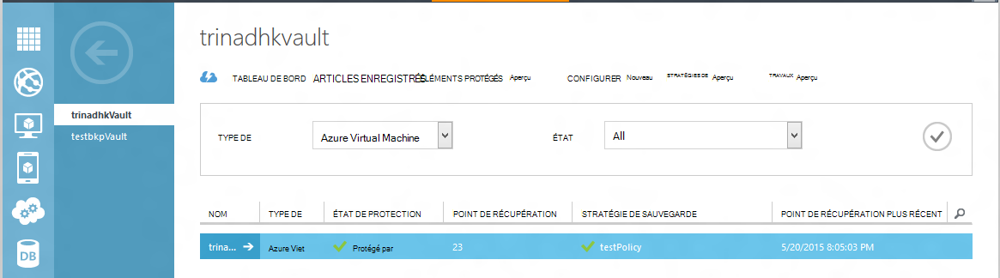
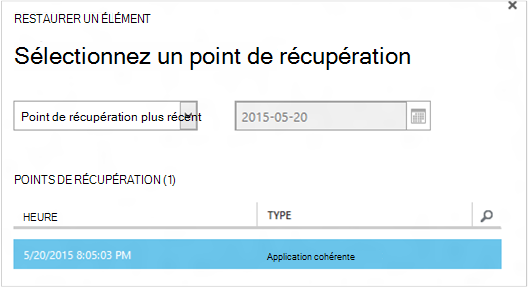
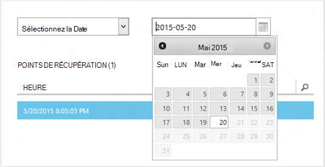
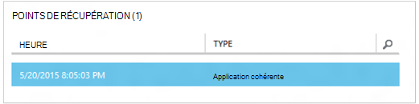
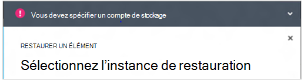
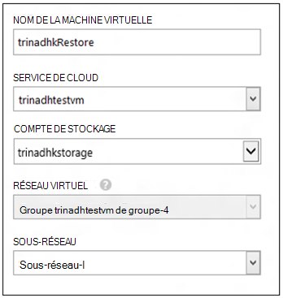
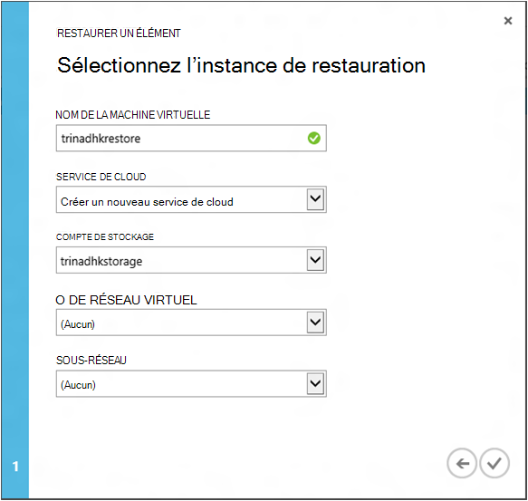
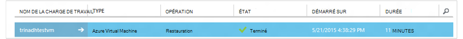

<properties
    pageTitle="Restaurer un machines virtuelles à partir de la sauvegarde | Microsoft Azure"
    description="Découvrez comment restaurer un ordinateur virtuel Azure à partir d’un point de récupération"
    services="backup"
    documentationCenter=""
    authors="trinadhk"
    manager="shreeshd"
    editor=""
    keywords="restaurer la sauvegarde ; Comment faire pour restaurer ; point de récupération ;"/>

<tags
    ms.service="backup"
    ms.workload="storage-backup-recovery"
    ms.tgt_pltfrm="na"
    ms.devlang="na"
    ms.topic="article"
    ms.date="08/02/2016"
    ms.author="trinadhk; jimpark;"/>

# Restaurer les ordinateurs virtuels dans Azure

> [AZURE.SELECTOR]
- [Restaurer des ordinateurs virtuels dans Azure portal](backup-azure-arm-restore-vms.md)
- [Restaurer des ordinateurs virtuels dans le portail de classique](backup-azure-restore-vms.md)

Restaurer un ordinateur virtuel à une machine virtuelle à partir des sauvegardes stockées dans un coffre-fort de sauvegarde Azure avec les étapes suivantes.

## Restaurer le flux de travail

### 1. Choisissez un élément à restaurer

1. Accédez à l’onglet **Protection des éléments** et sélectionnez l’ordinateur virtuel que vous souhaitez restaurer sur une nouvelle machine virtuelle.

    

    La colonne de **Point de récupération** dans la page **Éléments de protection** vous indiquera le nombre de points de récupération pour un ordinateur virtuel. La colonne de **Point de récupération plus récent** indique l’heure de la sauvegarde la plus récente à partir de laquelle un ordinateur virtuel peut être restauré.

2. Cliquez sur **restaurer** pour ouvrir l’Assistant **restauration d’un élément** .

    

### 2. Choisissez un point de récupération

1. Dans l’écran **Sélectionner un point de récupération** , vous pouvez restaurer à partir du point de récupération plus récent, ou à partir d’un point antérieur dans le temps. L’option par défaut lorsque l’Assistant s’ouvre est un *Point de récupération plus récent*.

    

2. Pour sélectionner un point antérieur dans le temps, choisissez l’option **Sélectionner une Date** dans la liste déroulante et sélectionnez une date dans le contrôle calendar en cliquant sur l' **icône du calendrier**. Dans le contrôle, toutes les dates qui ont des points de récupération sont remplies avec un dégradé de gris clair et peuvent être sélectionnés par l’utilisateur.

    

    Une fois que vous cliquez sur une date dans le contrôle calendar, la récupération des points disponibles sur que date est affichée dans le tableau de points de récupération ci-dessous. La colonne **heure** indique l’heure à laquelle l’instantané a été pris. La colonne **Type** affiche la [cohérence](https://azure.microsoft.com/documentation/articles/backup-azure-vms/#consistency-of-recovery-points) du point de récupération. L’en-tête du tableau indique le nombre de points de récupération disponibles à ce jour entre parenthèses.

    

3. Sélectionnez le point de récupération à partir de la table de **Points de récupération** , puis cliquez sur la flèche suivante pour passer à l’écran suivant.

### 3. Spécifiez un emplacement de destination

1. Dans l’écran **Sélectionnez restauration instance** spécifier où restaurer l’ordinateur virtuel.

  - Spécifiez le nom de l’ordinateur virtuel : dans un service cloud donné, le nom de l’ordinateur virtuel doit être unique. Nous ne gèrent pas écraser des machines virtuelles existantes. 
  - Sélectionnez un service en nuage pour la machine virtuelle : ce champ est obligatoire pour la création d’une machine virtuelle. Vous pouvez choisir d’utiliser un service cloud existant ou créer un nouveau service en nuage.

        Whatever cloud service name is picked should be globally unique. Typically, the cloud service name gets associated with a public-facing URL in the form of [cloudservice].cloudapp.net. Azure will not allow you to create a new cloud service if the name has already been used. If you choose to create select create a new cloud service, it will be given the same name as the virtual machine – in which case the VM name picked should be unique enough to be applied to the associated cloud service.

        We only display cloud services and virtual networks that are not associated with any affinity groups in the restore instance details. [Learn More](../virtual-network/virtual-networks-migrate-to-regional-vnet.md).

2. Sélectionnez un compte de stockage pour la machine virtuelle : ce champ est obligatoire pour la création de la machine virtuelle. Vous pouvez sélectionner à partir des comptes de stockage existant dans la même région, comme le coffre-fort de la sauvegarde d’Azure. Nous ne prend en charge les comptes de stockage qui sont redondantes ou de type de stockage de prime.

    S’il n’y a aucun compte de stockage avec la configuration prise en charge, créez un compte de stockage de configuration prise en charge avant de commencer l’opération de restauration.

    

3. Sélectionnez un réseau virtuel : le réseau virtuel (VNET) pour l’ordinateur virtuel doit être sélectionné au moment de la création de la machine virtuelle. La restauration l’interface utilisateur affiche tous les VNETs dans cet abonnement qui peut être utilisé. Il n’est pas obligatoire pour sélectionner un VNET pour la machine virtuelle restaurée, vous serez capable de se connecter à la machine virtuelle restaurée sur internet, même si le VNET n’est pas appliqué.

    Si le service en nuage sélectionné est associé à un réseau virtuel, vous ne pouvez pas modifier le réseau virtuel.

    

4. Sélectionner un sous-réseau : dans le cas où la VNET a des sous-réseaux, le premier sous-réseau sera sélectionné par défaut. Choisissez le sous-réseau de votre choix parmi les options de la liste déroulante. Pour les détails du sous-réseau, accédez à extension de réseaux dans la [page d’accueil de portail](https://manage.windowsazure.com/), accéder à **Des réseaux virtuels** , sélectionnez le réseau virtuel et descendre à configurer pour afficher les détails du sous-réseau.

    

5. Cliquez sur l’icône **d’envoi** dans l’Assistant pour envoyer les détails et de créer un travail de restauration.

## Effectuer le suivi de l’opération de restauration
Une fois que vous avez entrer toutes les informations dans l’Assistant Restauration et soumis Azure sauvegarde va tenter de créer une tâche pour effectuer le suivi de l’opération de restauration.

Si la création réussit, vous verrez un toast notification indiquant que le travail est créé. Vous pouvez obtenir plus de détails en cliquant sur le bouton **Afficher la tâche** , vous accédez à l’onglet **tâches** .

Une fois l’opération de restauration est terminée, il est marqué comme terminé dans l’onglet **tâches** .

Après la restauration de l’ordinateur virtuel, vous devrez peut-être réinstaller les extensions existant sur l’ordinateur virtuel d’origine et de [Modifier les points de terminaison](../virtual-machines/virtual-machines-windows-classic-setup-endpoints.md) pour l’ordinateur virtuel dans le portail Azure.

## Étapes après la restauration
Si vous utilisez une distribution de Linux en fonction de nuage-init comme Ubuntu, pour des raisons de sécurité, mot de passe sera bloqué valider la restauration. Veuillez utiliser l’extension de VMAccess sur l’ordinateur restauré virtuel pour [Réinitialiser le mot de passe](../virtual-machines/virtual-machines-linux-classic-reset-access.md). Nous vous recommandons d’utiliser SSH clés sur ces distributions pour éviter de réinitialiser le mot de passe post restauration. 

## Sauvegarde pour les machines virtuelles restaurées
Si vous avez restauré la machine virtuelle au même service de cloud avec le même nom que sauvegardé VM, la sauvegarde va se poursuivre la restauration de post de machine virtuelle. Si vous avez restauré la machine virtuelle à un service de nuage différent ou spécifié un autre nom de machine virtuelle restaurée, ce sera traité comme une nouvelle machine virtuelle et vous avez besoin pour la sauvegarde de la configuration de machine virtuelle restaurée.

## Restauration d’une machine virtuelle lors de la reprise après sinistre de centre de données Azure
Sauvegarde Azure permet la restauration sauvegardé les ordinateurs virtuels au centre de données associés au cas où les données principales du centre où ordinateurs virtuels en cours d’exécution après sinistre des expériences et vous avez configuré le coffre-fort de sauvegarde pour être géo-redondants. Au cours de ces scénarios, vous devez sélectionner un compte de stockage qui est présent dans le centre de données associés et le reste du processus de restauration reste la même. Sauvegarde Azure utilise le service de calcul du geo associé pour créer la machine virtuelle restaurée. 

## Restauration d’ordinateurs virtuels de contrôleur de domaine
Sauvegarde d’ordinateurs virtuels de contrôleur de domaine (DC) est un scénario pris en charge avec sauvegarde d’Azure. Toutefois certains doit veiller au cours du processus de restauration. L’expérience de la restauration est considérablement différent pour les machines virtuelles du contrôleur de domaine dans une configuration single-contrôleur de domaine et les ordinateurs virtuels dans une configuration multi-DC.

### Contrôleur de domaine unique
La machine virtuelle peut être restaurée (comme n’importe quel autre ordinateur virtuel) à partir de l’Azure portal ou à l’aide de PowerShell.

### Plusieurs contrôleurs de domaine
Lorsque vous avez un environnement multi-contrôleur de domaine, les contrôleurs de domaine ont leur propre méthode de synchronisation des données. Lorsqu’un point de sauvegarde antérieur est restaurée *sans les précautions nécessaires*, les processus de restauration de l’USN peuvent entraîner des problèmes dans un environnement multi-DC. Pour récupérer ce une machine virtuelle, la droite consiste à démarrer en mode DSRM.

Le défi se produit car le mode DSRM n’est pas présent dans Azure. Donc pour restaurer cet un ordinateur virtuel, vous ne pouvez pas utiliser le portail Azure. La seule prise en charge de restauration mécanisme est la restauration sur disque à l’aide de PowerShell.

>[AZURE.WARNING] VM de contrôleur de domaine dans un environnement multi-contrôleur de domaine, n’utilisez pas le portail Azure pour restauration ! Restauration de PowerShell en fonction uniquement est pris en charge.

Apprenez-en plus sur le [problème de restauration USN](https://technet.microsoft.com/library/dd363553) et les stratégies proposées pour le corriger.

## Restauration d’ordinateurs virtuels avec des configurations de réseau spécial
Sauvegarde Azure prend en charge la sauvegarde pour suivre les configurations de réseau spécial des machines virtuelles.

- Machines virtuelles sous un équilibreur de charge (interne et externe)
- Ordinateurs virtuels avec plusieurs IPs réservés
- Ordinateurs virtuels avec plusieurs cartes réseau

Ces configurations s’imposent à la suite de considérations lors de la restauration.

>[AZURE.TIP] Flux de restauration de PowerShell basé permet de recréer la configuration de réseau spécial de restauration post de machines virtuelles.

### Restauration à partir de l’interface utilisateur :
Lors de la restauration à partir de l’interface utilisateur, **Choisissez toujours un service en nuage**. Veuillez Notez qu’étant donné que le portail n’accepte que les paramètres obligatoires pendant le déroulement de la restauration, machines virtuelles restaurée à l’aide de l’interface utilisateur perdra la configuration réseau spéciale que dont ils disposent. En d’autres termes, restauration d’ordinateurs virtuels seront VMs normales sans configuration d’équilibrage de la charge ou multi carte d’interface réseau ou plusieurs IP réservée.

### Restauration à partir de PowerShell :
PowerShell a la possibilité de restaurer les disques de l’ordinateur virtuel à partir de la sauvegarde et ne crée pas la machine virtuelle. Ceci est utile lors de la restauration d’ordinateurs virtuels qui requièrent des mentined de configurations de réseau spécial ci-dessus.

Pour recréer entièrement les disques restauration post machine virtuelle, procédez comme suit :

1. Restaurer les disques de sauvegarde coffre-fort à l’aide de [PowerShell de sauvegarde Azure](../backup-azure-vms-classic-automation.md#restore-an-azure-vm)

2. Créer la configuration VM requise pour l’équilibrage de la charge / IP réservée plusieurs NIC/multiples à l’aide des applets de commande PowerShell et utilisez pour créer la machine virtuelle de souhaitée de configuration.
    - Créer la machine virtuelle dans un service cloud avec un [équilibreur de charge interne](https://azure.microsoft.com/documentation/articles/load-balancer-internal-getstarted/)
    - Créer l’ordinateur virtuel pour vous connecter à [Internet face équilibreur de charge] (https://azure.microsoft.com/en-us/documentation/articles/load-balancer-internet-getstarted/)
    - Créer un ordinateur virtuel avec [plusieurs cartes réseau](https://azure.microsoft.com/documentation/articles/virtual-networks-multiple-nics/)
    - Créer un ordinateur virtuel avec [plusieurs IPs réservés](https://azure.microsoft.com/documentation/articles/virtual-networks-reserved-public-ip/)

## Étapes suivantes
- [Résolution des erreurs](backup-azure-vms-troubleshoot.md#restore)
- [Gérer des ordinateurs virtuels](backup-azure-manage-vms.md)
