<properties
   pageTitle="Restaurer des données à un Client Windows ou de Windows Server à partir d’Azure en utilisant le modèle de déploiement classique | Microsoft Azure"
   description="Apprenez à restaurer à partir d’un Client Windows ou de Windows Server."
   services="backup"
   documentationCenter=""
   authors="saurabhsensharma"
   manager="shivamg"
   editor=""/>

<tags
   ms.service="backup"
   ms.workload="storage-backup-recovery"
     ms.tgt_pltfrm="na"
     ms.devlang="na"
     ms.topic="article"
     ms.date="08/02/2016"
     ms.author="trinadhk; jimpark; markgal;"/>

# Restaurer les fichiers vers un Windows server ou un ordinateur de client de Windows en utilisant le modèle de déploiement classique

> [AZURE.SELECTOR]
- [Portail classique](backup-azure-restore-windows-server-classic.md)
- [Azure portal](backup-azure-restore-windows-server.md)

Cet article décrit les étapes nécessaires pour effectuer les deux types d’opérations de restauration :

- Restaurer les données sur le même ordinateur que celui sur lequel les sauvegardes ont été prélevés.
- Restaurer les données sur une autre machine.

Dans les deux cas, les données sont récupérées à partir du coffre-fort Azure sauvegarde.

[AZURE.INCLUDE [learn-about-deployment-models](../../includes/learn-about-deployment-models-classic-include.md)]

## Restaurer des données sur le même ordinateur
Si vous avez accidentellement supprimé un fichier et que vous souhaitez restaurer sur le même ordinateur (à partir de laquelle est effectuée la sauvegarde), les étapes suivantes vous permettra de récupérer les données.

1. Ouvrez le composant logiciel enfichable **Microsoft Azure Backup** .
2. Cliquez sur **Récupérer les données** pour lancer le flux de travail.

    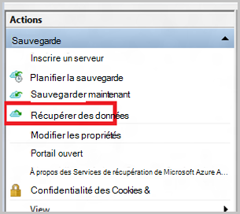

3. Sélectionnez le * *ce serveur (*yourmachinename*) ** option pour restaurer les données sauvegardées fichier sur la même machine.

    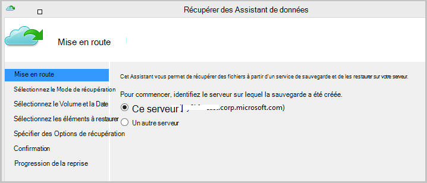

4. Choisissez cette option pour **Rechercher des fichiers** ou **Rechercher des fichiers**.

    Laissez l’option par défaut si vous souhaitez restaurer un ou plusieurs fichiers dont le chemin est connu. Si vous n’êtes pas sûr à propos de la structure de dossiers mais que vous souhaitez rechercher un fichier, choisissez l’option de **recherche des fichiers** . Dans cette section, nous continuerons avec l’option par défaut.

    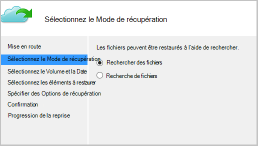

5. Sélectionnez le volume à partir duquel vous souhaitez restaurer le fichier.

    Vous pouvez restaurer à partir de n’importe quel point dans le temps. Les dates qui apparaissent en **gras** dans le contrôle calendar permet d’indiquer la disponibilité d’un point de restauration. Une fois qu’une date est sélectionnée, en fonction de votre planification de sauvegarde (et la réussite d’une opération de sauvegarde), vous pouvez sélectionner un point dans le temps dans la liste déroulante **heure** vers le bas.

    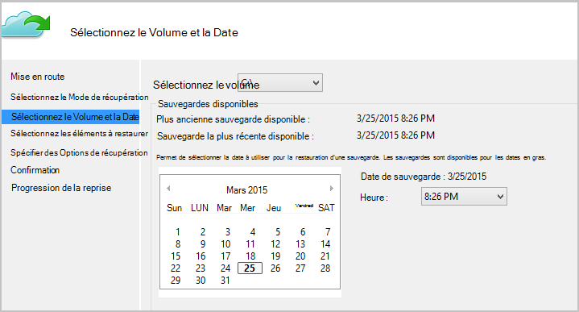

6. Sélectionnez les éléments à récupérer. Vous pouvez sélections plusieurs fichiers que vous souhaitez restaurer.

    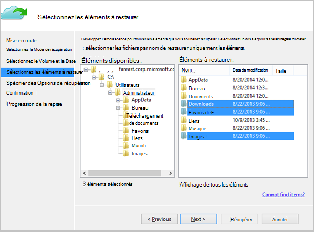

7. Spécifiez les paramètres de récupération.

    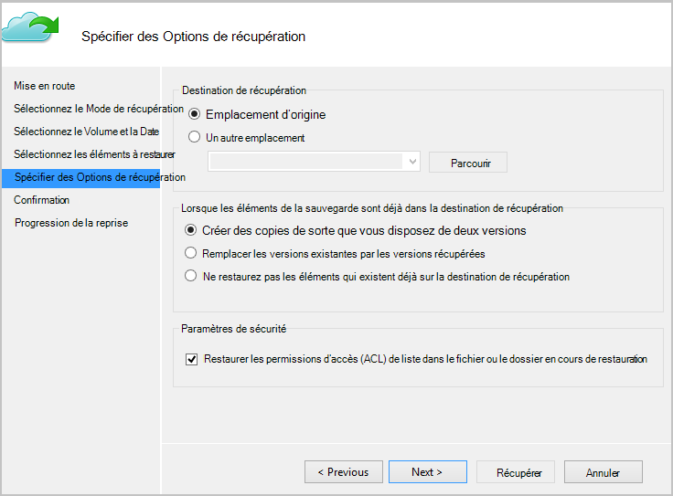

  - Vous disposez d’une option de restauration à l’emplacement d’origine (dans lequel le fichier/dossier seraient remplacé) ou vers un autre emplacement dans le même ordinateur.
  - Si le dossier que vous souhaitez restaurer existe dans l’emplacement cible, vous pouvez créer des copies (deux versions du même fichier), remplacer les fichiers dans l’emplacement cible ou ignorer la restauration des fichiers qui existent dans la cible.
  - Il est fortement recommandé que vous laissez l’option par défaut de la restauration des ACL sur les fichiers qui sont en cours de récupération.

8. Une fois que ces entrées sont fournies, cliquez sur **suivant**. Le flux de travail de récupération qui restaure les fichiers sur cet ordinateur, commencera.

## Récupérer à un autre ordinateur
Si l’intégralité du serveur est perdu, vous pouvez toujours récupérer des données à partir de la sauvegarde d’Azure vers une autre machine. Les étapes suivantes illustrent le flux de travail.  

La terminologie utilisée dans ces étapes comprend :

- *Machine source* – l’ordinateur d’origine à partir de laquelle la sauvegarde a été effectuée et qui n’est pas disponible.
- *L’ordinateur cible* – la machine à laquelle les données sont restaurées.
- *Coffre-fort d’exemple* – coffre-fort de la sauvegarde à laquelle la *machine Source* et *cible* sont enregistrés.  

> [AZURE.NOTE] Les sauvegardes effectuées à partir d’un ordinateur ne peut pas être restaurées sur un ordinateur qui exécute une version antérieure du système d’exploitation. Par exemple, si les sauvegardes sont effectuées à partir d’un ordinateur Windows 7, elle peut être restaurée sur un Windows 8 ou au-dessus de machine. Toutefois, l’inverse n’est pas vraie.

1. Ouvrez le composant logiciel enfichable de **Microsoft Azure Backup** dans sur l' *ordinateur cible*.
2. Assurez-vous que l' *ordinateur cible* et l' *ordinateur Source* sont enregistrés dans le coffre-fort de sauvegarde même.
3. Cliquez sur **Récupérer les données** pour lancer le flux de travail.

    

4. Sélectionnez **un autre serveur**

    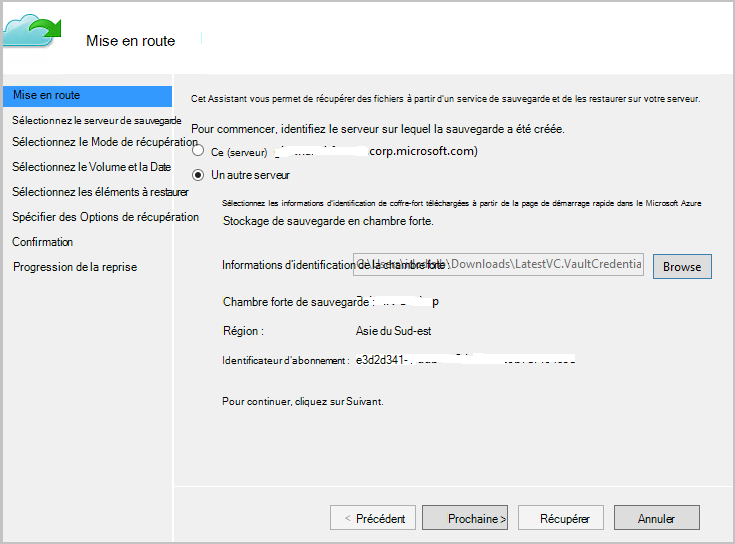

5. Fournir le fichier d’informations d’identification de chambre forte qui correspond dans le *coffre-fort de l’échantillon*. Si le fichier d’informations d’identification de coffre-fort est non valide (ou expirés) Télécharger un nouveau fichier d’informations d’identification de coffre-fort dans le *coffre-fort de l’échantillon* dans Azure portal classique. Une fois le fichier d’informations d’identification de coffre-fort est fourni, le coffre-fort de sauvegarde dans le fichier d’informations d’identification de coffre-fort s’affiche.

6. Sélectionnez la *machine Source* dans la liste des ordinateurs affichées.

    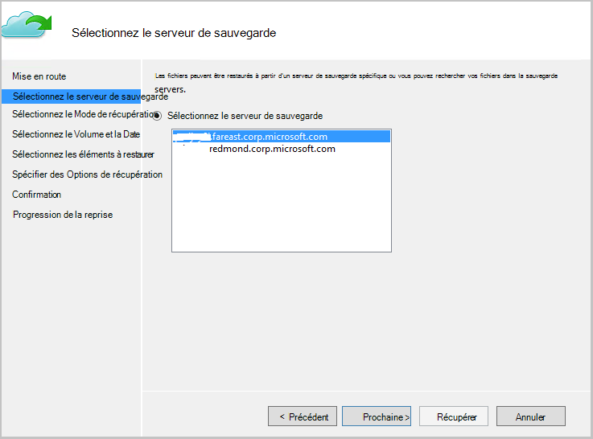

7. Sélectionnez l’option **Rechercher des fichiers** ou **Rechercher des fichiers** . Dans cette section, nous allons utiliser l’option de **recherche des fichiers** .

    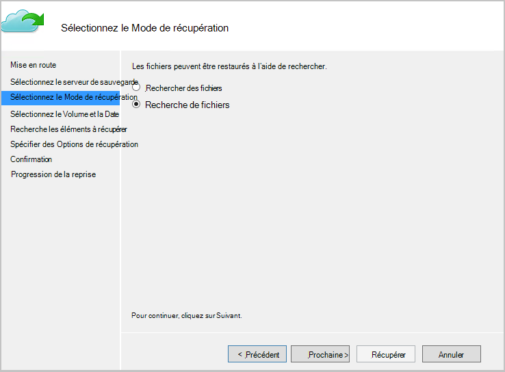

8. Dans l’écran suivant, sélectionnez le volume et la date. Recherchez le nom de fichier/dossier que vous souhaitez restaurer.

    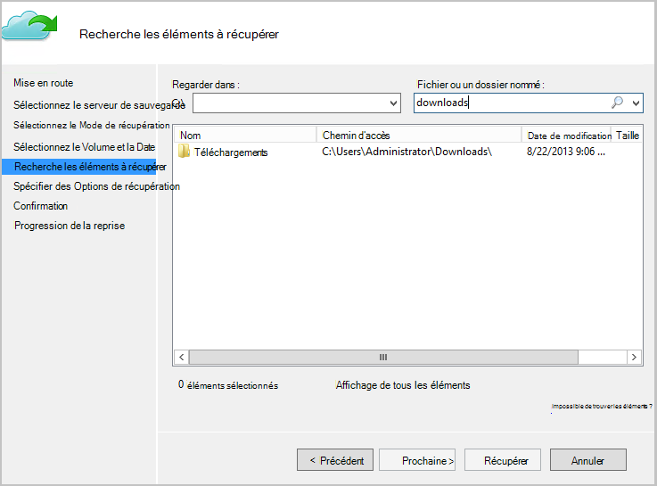

9. Sélectionnez l’emplacement où les fichiers doivent être restaurés.

    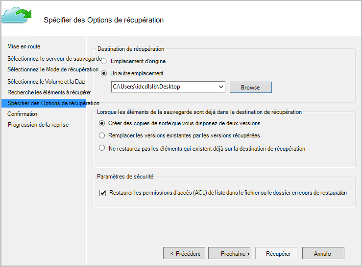

10. Fournir le mot de passe de chiffrement qui a été fourni lors de l’inscription de *l’ordinateur Source* au *coffre-fort de l’échantillon*.

    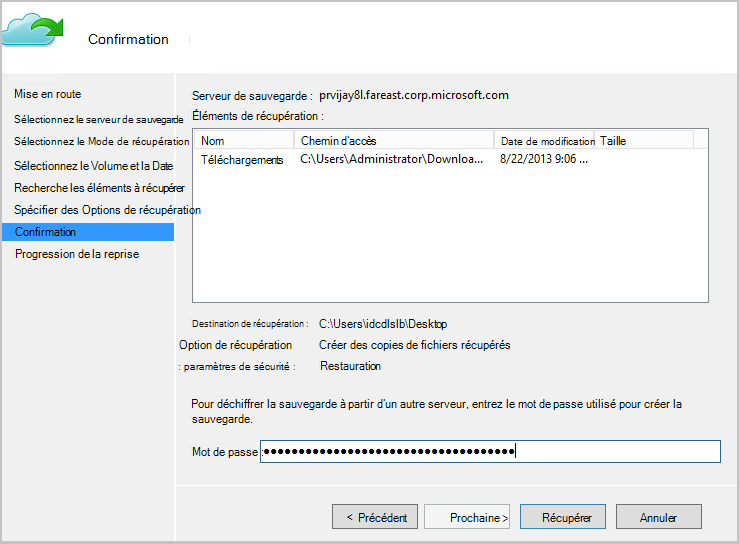

11. Une fois que l’entrée est fournie, cliquez sur **récupérer**, qui déclenche la restauration de fichiers sauvegardés à la destination prévues.

## Étapes suivantes
- [Forum aux questions de sauvegarde Azure](backup-azure-backup-faq.md)
- Visitez le [Forum de sauvegarde Azure](http://go.microsoft.com/fwlink/p/?LinkId=290933).

## Pour en savoir plus
- [Vue d’ensemble de la sauvegarde Azure](http://go.microsoft.com/fwlink/p/?LinkId=222425)
- [Sauvegarde les machines virtuelles Azure](backup-azure-vms-introduction.md)
- [Sauvegarde des charges de travail Microsoft](backup-azure-dpm-introduction.md)
