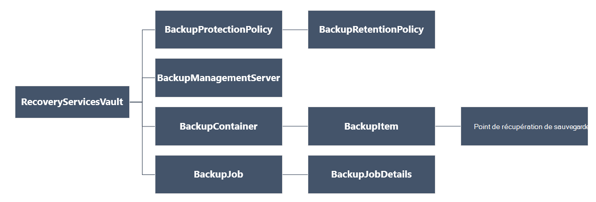

<properties
   pageTitle="Déployer et gérer des sauvegardes pour les machines virtuelles de déployés par le Gestionnaire de ressources à l’aide de PowerShell | Microsoft Azure"
   description="Utilisation de PowerShell pour déployer et gérer des sauvegardes dans Azure pour les machines virtuelles de déployés par le Gestionnaire de ressources"
   services="backup"
   documentationCenter=""
   authors="markgalioto"
   manager="cfreeman"
   editor=""/>

<tags
   ms.service="backup"
   ms.devlang="na"
   ms.topic="article"
   ms.tgt_pltfrm="na"
   ms.workload="storage-backup-recovery"
   ms.date="08/03/2016"
   ms.author="markgal; trinadhk"/>

# <a name="deploy-and-manage-backups-for-resource-manager-deployed-vms-using-powershell"></a>Déployer et gérer des sauvegardes pour les machines virtuelles de déployés par le Gestionnaire de ressources à l’aide de PowerShell

> [AZURE.SELECTOR]
- [Gestionnaire de ressources](backup-azure-vms-automation.md)
- [Classique](backup-azure-vms-classic-automation.md)

Cet article vous montre comment utiliser les applets de commande PowerShell de Azure pour sauvegarder et restaurer un ordinateur virtuel Azure (VM) à partir d’un coffre-fort de Services de récupération. Un coffre-fort de Services de récupération est une ressource de gestionnaire de ressources Azure et est utilisé pour protéger des données et des ressources dans les services Azure sauvegarde et de récupération de Site Azure. Vous pouvez utiliser un coffre-fort de Services de récupération de protection déployés par le Gestionnaire des services Azure de machines virtuelles, ainsi que déployés par le Gestionnaire de ressources Azure les ordinateurs virtuels.

>[AZURE.NOTE] Azure dispose de deux modèles de déploiement pour la création et l’utilisation des ressources : [le Gestionnaire de ressources et classique](../resource-manager-deployment-model.md). Cet article est pour une utilisation avec des machines virtuelles en utilisant le modèle de gestionnaire de ressources.

Cet article vous guide tout au long de l’utilisation de PowerShell pour protéger un ordinateur virtuel et restaurer les données à partir d’un point de récupération.

## <a name="concepts"></a>Concepts

Si vous n’êtes pas familiarisé avec le service de sauvegarde d’Azure, pour une vue d’ensemble du service, consultez [qu’est la sauvegarde d’Azure ?](backup-introduction-to-azure-backup.md) Avant de commencer, assurez-vous que vous couvre les notions fondamentales sur les conditions préalables nécessaires pour collaborer avec sauvegarde Azure et les limitations de la solution de sauvegarde de machine virtuelle en cours.

Pour pouvoir utiliser PowerShell efficacement, il est nécessaire de comprendre la hiérarchie d’objets et de point de départ.



Pour afficher la référence d’applet de commande AzureRmRecoveryServicesBackup PowerShell, consultez la [Sauvegarde Azure - applets de commande de Services de restauration](https://msdn.microsoft.com/library/mt723320.aspx) dans la bibliothèque Azure.
Pour afficher la référence d’applet de commande AzureRmRecoveryServicesVault PowerShell, voir les [Applets de commande Service de récupération Azure](https://msdn.microsoft.com/library/mt643905.aspx).


## <a name="setup-and-registration"></a>Le programme d’installation et d’enregistrement

Pour commencer :

1. [Télécharger la version la plus récente de PowerShell](https://github.com/Azure/azure-powershell/releases) (la version minimale requise est : 1.4.0)

2. Rechercher les applets de commande PowerShell de sauvegarde Azure disponible en tapant la commande suivante :

```
PS C:\> Get-Command *azurermrecoveryservices*

CommandType     Name                                               Version    Source
-----------     ----                                               -------    ------
Cmdlet          Backup-AzureRmRecoveryServicesBackupItem           1.4.0      AzureRM.RecoveryServices.Backup
Cmdlet          Disable-AzureRmRecoveryServicesBackupProtection    1.4.0      AzureRM.RecoveryServices.Backup
Cmdlet          Enable-AzureRmRecoveryServicesBackupProtection     1.4.0      AzureRM.RecoveryServices.Backup
Cmdlet          Get-AzureRmRecoveryServicesBackupContainer         1.4.0      AzureRM.RecoveryServices.Backup
Cmdlet          Get-AzureRmRecoveryServicesBackupItem              1.4.0      AzureRM.RecoveryServices.Backup
Cmdlet          Get-AzureRmRecoveryServicesBackupJob               1.4.0      AzureRM.RecoveryServices.Backup
Cmdlet          Get-AzureRmRecoveryServicesBackupJobDetails        1.4.0      AzureRM.RecoveryServices.Backup
Cmdlet          Get-AzureRmRecoveryServicesBackupManagementServer  1.4.0      AzureRM.RecoveryServices.Backup
Cmdlet          Get-AzureRmRecoveryServicesBackupProperties        1.4.0      AzureRM.RecoveryServices
Cmdlet          Get-AzureRmRecoveryServicesBackupProtectionPolicy  1.4.0      AzureRM.RecoveryServices.Backup
Cmdlet          Get-AzureRMRecoveryServicesBackupRecoveryPoint     1.4.0      AzureRM.RecoveryServices.Backup
Cmdlet          Get-AzureRmRecoveryServicesBackupRetentionPolic... 1.4.0      AzureRM.RecoveryServices.Backup
Cmdlet          Get-AzureRmRecoveryServicesBackupSchedulePolicy... 1.4.0      AzureRM.RecoveryServices.Backup
Cmdlet          Get-AzureRmRecoveryServicesVault                   1.4.0      AzureRM.RecoveryServices
Cmdlet          Get-AzureRmRecoveryServicesVaultSettingsFile       1.4.0      AzureRM.RecoveryServices
Cmdlet          New-AzureRmRecoveryServicesBackupProtectionPolicy  1.4.0      AzureRM.RecoveryServices.Backup
Cmdlet          New-AzureRmRecoveryServicesVault                   1.4.0      AzureRM.RecoveryServices
Cmdlet          Remove-AzureRmRecoveryServicesProtectionPolicy     1.4.0      AzureRM.RecoveryServices.Backup
Cmdlet          Remove-AzureRmRecoveryServicesVault                1.4.0      AzureRM.RecoveryServices
Cmdlet          Restore-AzureRMRecoveryServicesBackupItem          1.4.0      AzureRM.RecoveryServices.Backup
Cmdlet          Set-AzureRmRecoveryServicesBackupProperties        1.4.0      AzureRM.RecoveryServices
Cmdlet          Set-AzureRmRecoveryServicesBackupProtectionPolicy  1.4.0      AzureRM.RecoveryServices.Backup
Cmdlet          Set-AzureRmRecoveryServicesVaultContext            1.4.0      AzureRM.RecoveryServices
Cmdlet          Stop-AzureRmRecoveryServicesBackupJob              1.4.0      AzureRM.RecoveryServices.Backup
Cmdlet          Unregister-AzureRmRecoveryServicesBackupContainer  1.4.0      AzureRM.RecoveryServices.Backup
Cmdlet          Unregister-AzureRmRecoveryServicesBackupManagem... 1.4.0      AzureRM.RecoveryServices.Backup
Cmdlet          Wait-AzureRmRecoveryServicesBackupJob              1.4.0      AzureRM.RecoveryServices.Backup
```


Les tâches suivantes peuvent être automatisées avec PowerShell :

- Créer un coffre-fort de Services de récupération
- De sauvegarde ou de protéger les ordinateurs virtuels d’Azure
- Déclenche une opération de sauvegarde
- Surveiller une opération de sauvegarde
- Restauration d’une machine virtuelle Azure

## <a name="create-a-recovery-services-vault"></a>Créer un coffre-fort de services de récupération

Les étapes suivantes vous guident dans le processus de création d’un coffre-fort de Services de récupération. Un coffre-fort de Services de récupération est différent de celui d’un coffre-fort de sauvegarde.

1. Si vous utilisez une sauvegarde d’Azure pour la première fois, vous devez utiliser l’applet de commande **[Register-AzureRMResourceProvider](https://msdn.microsoft.com/library/mt679020.aspx)** pour enregistrer le fournisseur de services de récupération Azure avec votre abonnement.

    ```
    PS C:\> Register-AzureRmResourceProvider -ProviderNamespace "Microsoft.RecoveryServices"
    ```

2. Le coffre-fort de Services de récupération est une ressource de gestionnaire de ressources, vous devez le placer dans un groupe de ressources. Vous pouvez utiliser un groupe de ressources existant ou en créer un nouveau groupe de ressources avec l’applet de commande **[New-AzureRmResourceGroup](https://msdn.microsoft.com/library/mt678985.aspx)** . Lorsque vous créez un nouveau groupe de ressources, spécifiez le nom et l’emplacement du groupe de ressources.  

    ```
    PS C:\> New-AzureRmResourceGroup –Name "test-rg" –Location "West US"
    ```

3. Utilisez l’applet de commande **[New-AzureRmRecoveryServicesVault](https://msdn.microsoft.com/library/mt643910.aspx)** pour créer le nouveau coffre-fort. Veillez à spécifier le même emplacement pour le stockage en chambre forte que celle utilisée pour le groupe de ressources.

    ```
    PS C:\> New-AzureRmRecoveryServicesVault -Name "testvault" -ResourceGroupName " test-rg" -Location "West US"
    ```

4. Spécifier le type de redondance du stockage à utiliser ; Vous pouvez utiliser le [Stockage local redondants (LRS)](../storage/storage-redundancy.md#locally-redundant-storage) ou [Stockage redondant de Geo (GRS)](../storage/storage-redundancy.md#geo-redundant-storage). L’exemple suivant montre que l’option - BackupStorageRedundancy pour testVault a la valeur GeoRedundant.

    ```
    PS C:\> $vault1 = Get-AzureRmRecoveryServicesVault –Name "testVault"
    PS C:\> Set-AzureRmRecoveryServicesBackupProperties  -Vault $vault1 -BackupStorageRedundancy GeoRedundant
    ```

    > [AZURE.TIP] Nombreuses cmdlets Azure sauvegarde nécessitent l’objet de stockage en chambre forte des Services de récupération en tant qu’entrée. Pour cette raison, il est pratique stocker l’objet de stockage en chambre forte de Services de récupération de sauvegarde dans une variable.

## <a name="view-the-vaults-in-a-subscription"></a>Afficher les coffres-forts dans un abonnement
**[Get-AzureRmRecoveryServicesVault](https://msdn.microsoft.com/library/mt643907.aspx)** permet d’afficher la liste de tous les coffres-forts de l’abonnement en cours. Vous pouvez utiliser cette commande pour vérifier qu’un nouveau coffre-fort a été créé, ou voir les coffres-forts sont disponibles dans l’abonnement.

Exécutez la commande Get-AzureRmRecoveryServicesVault, et tous les coffres-forts dans l’abonnement sont répertoriés.

```
PS C:\> Get-AzureRmRecoveryServicesVault
Name              : Contoso-vault
ID                : /subscriptions/1234
Type              : Microsoft.RecoveryServices/vaults
Location          : WestUS
ResourceGroupName : Contoso-docs-rg
SubscriptionId    : 1234-567f-8910-abc
Properties        : Microsoft.Azure.Commands.RecoveryServices.ARSVaultProperties
```


## <a name="backup-azure-vms"></a>Sauvegarde VMs Azure
Maintenant que vous avez créé un coffre-fort de services de récupération, vous pouvez l’utiliser pour protéger un ordinateur virtuel. Toutefois avant d’appliquer la protection, vous devez définir le contexte de stockage en chambre forte et vous voulez vérifier la stratégie de protection. Contexte de coffre-fort définit le type de données qui sont protégés dans la chambre forte. La stratégie de protection est la planification de lorsque la tâche de sauvegarde s’exécute et combien de temps chaque instantané de sauvegarde est conservé.

Avant d’activer une protection sur un ordinateur virtuel, vous devez définir le contexte de la chambre forte. Le contexte est appliqué à toutes les applets de commande suivantes.

```
PS C:\> Get-AzureRmRecoveryServicesVault -Name testvault | Set-AzureRmRecoveryServicesVaultContext
```

### <a name="create-a-protection-policy"></a>Créer une stratégie de protection

Lorsque vous créez un nouveau coffre-fort, il est fourni avec une stratégie par défaut. Cette stratégie déclenche une opération de sauvegarde chaque jour à une heure spécifiée. Par la stratégie par défaut, l’instantané de sauvegarde est conservé pendant 30 jours. Vous pouvez utiliser la stratégie par défaut pour protéger rapidement votre machine virtuelle et modifier la stratégie ultérieurement avec les différents détails.

**[Get-AzureRmRecoveryServicesBackupProtectionPolicy](https://msdn.microsoft.com/library/mt723300.aspx)** permet d’afficher la liste des stratégies disponibles dans le coffre-fort :

```
PS C:\> Get-AzureRmRecoveryServicesBackupProtectionPolicy -WorkloadType AzureVM
Name                 WorkloadType       BackupManagementType BackupTime                DaysOfWeek
----                 ------------       -------------------- ----------                ----------
DefaultPolicy        AzureVM            AzureVM              4/14/2016 5:00:00 PM
```

> [AZURE.NOTE] Le fuseau horaire du champ BackupTime dans PowerShell est UTC. Toutefois, lorsque le temps de sauvegarde est affiché dans le portail Azure, l’heure est ajustée à votre fuseau horaire local.

Une stratégie de sauvegarde de protection est associée au moins une stratégie de rétention.  Stratégie de rétention définit la durée pendant laquelle un point de récupération est conservé avec sauvegarde d’Azure. Pour afficher la stratégie de rétention par défaut, utilisez **Get-AzureRmRecoveryServicesBackupRetentionPolicyObject** .  De même, vous pouvez utiliser **Get-AzureRmRecoveryServicesBackupSchedulePolicyObject** pour obtenir la stratégie de planification par défaut. Les objets de stratégie de rétention et de planification sont utilisés comme entrées dans l’applet de commande **New-AzureRmRecoveryServicesBackupProtectionPolicy** .

Une stratégie de protection de sauvegarde définit quand et à quelle fréquence la sauvegarde d’un élément est terminée. L’applet de commande New-AzureRmRecoveryServicesBackupProtectionPolicy crée un objet PowerShell qui contient des informations sur la stratégie de sauvegarde. La stratégie de sauvegarde est utilisée comme entrée pour l’applet de commande Enable-AzureRmRecoveryServicesBackupProtection.

```
PS C:\> $schPol = Get-AzureRmRecoveryServicesBackupSchedulePolicyObject -WorkloadType "AzureVM"
PS C:\>  $retPol = Get-AzureRmRecoveryServicesBackupRetentionPolicyObject -WorkloadType "AzureVM"
PS C:\>  New-AzureRmRecoveryServicesBackupProtectionPolicy -Name "NewPolicy" -WorkloadType AzureVM -RetentionPolicy $retPol -SchedulePolicy $schPol
Name                 WorkloadType       BackupManagementType BackupTime                DaysOfWeek
----                 ------------       -------------------- ----------                ----------
NewPolicy           AzureVM            AzureVM              4/24/2016 1:30:00 AM
```

### <a name="enable-protection"></a>Activer la protection

Activation de la protection implique deux objets - l’élément et la stratégie. Les deux objets sont requis pour activer la protection de la chambre forte. Une fois que la stratégie a été associée à la chambre forte, le workflow de sauvegarde est déclenché à l’heure définie dans la planification de la stratégie.

Pour activer la protection sur VMs de ARM non crypté

```
PS C:\> $pol=Get-AzureRmRecoveryServicesBackupProtectionPolicy -Name "NewPolicy"
PS C:\> Enable-AzureRmRecoveryServicesBackupProtection -Policy $pol -Name "V2VM" -ResourceGroupName "RGName1"
```

Pour activer la protection sur VMs cryptés [crypté à l’aide de BEK et KEK], vous devez accorder des autorisations pour le service de sauvegarde d’Azure lire les clés et les secrets à partir de la chambre forte de clé. 

```
PS C:\> Set-AzureRmKeyVaultAccessPolicy -VaultName 'KeyVaultName' -ResourceGroupName 'RGNameOfKeyVault' -PermissionsToKeys backup,get,list -PermissionsToSecrets get,list -ServicePrincipalName 262044b1-e2ce-469f-a196-69ab7ada62d3
PS C:\> $pol=Get-AzureRmRecoveryServicesBackupProtectionPolicy -Name "NewPolicy"
PS C:\> Enable-AzureRmRecoveryServicesBackupProtection -Policy $pol -Name "V2VM" -ResourceGroupName "RGName1"
```

Pour les ordinateurs virtuels basés sur l’ASM

```
PS C:\>  $pol=Get-AzureRmRecoveryServicesBackupProtectionPolicy -Name "NewPolicy"
PS C:\>  Enable-AzureRmRecoveryServicesBackupProtection -Policy $pol -Name "V1VM" -ServiceName "ServiceName1"
```

### <a name="modify-a-protection-policy"></a>Modification d’une stratégie de protection

Pour modifier la stratégie, modifier l’objet BackupSchedulePolicyObject ou BackupRetentionPolicy et modifier la stratégie à l’aide de Set-AzureRmRecoveryServicesBackupProtectionPolicy

L’exemple suivant modifie le nombre de rétention à 365.

```
PS C:\> $retPol = Get-AzureRmRecoveryServicesBackupRetentionPolicyObject -WorkloadType "AzureVM"
PS C:\> $retPol.DailySchedule.DurationCountInDays = 365
PS C:\> $pol= Get-AzureRmRecoveryServicesBackupProtectionPolicy -Name NewPolicy
PS C:\> Set-AzureRmRecoveryServicesBackupProtectionPolicy -Policy $pol  -RetentionPolicy  $RetPol
```

## <a name="run-an-initial-backup"></a>Exécuter une sauvegarde initiale

La planification de sauvegarde déclenche une complète sauvegarder sur l’initiale du retour pour l’article. Sur les sauvegardes, la sauvegarde est une copie incrémentielle. Si vous souhaitez forcer la sauvegarde initiale se produise à un moment donné ou même immédiatement, puis utilisez l’applet de commande **[Backup-AzureRmRecoveryServicesBackupItem](https://msdn.microsoft.com/library/mt723312.aspx)** :

```
PS C:\> $namedContainer = Get-AzureRmRecoveryServicesBackupContainer -ContainerType "AzureVM" -Status "Registered" -Name "V2VM"
PS C:\> $item = Get-AzureRmRecoveryServicesBackupItem -Container $namedContainer -WorkloadType "AzureVM"
PS C:\> $job = Backup-AzureRmRecoveryServicesBackupItem -Item $item
WorkloadName     Operation            Status               StartTime                 EndTime                   JobID
------------     ---------            ------               ---------                 -------                   ----------
V2VM              Backup               InProgress            4/23/2016 5:00:30 PM                       cf4b3ef5-2fac-4c8e-a215-d2eba4124f27
```

> [AZURE. Remarque : Le fuseau horaire des champs heure de début et de fin de PowerShell est UTC. Toutefois, lorsque l’heure est affichée dans le portail Azure, l’heure est ajustée à votre fuseau horaire local.

## <a name="monitoring-a-backup-job"></a>Surveillance d’une opération de sauvegarde

La plupart des opérations à long terme dans Azure sauvegarde soient reproduites en tant que tâche. Cela rend facile à suivre la progression sans avoir à maintenir le portail Azure ouvrir à tout moment.

Pour obtenir le dernier état d’un travail en cours, utilisez l’applet de commande Get-AzureRmRecoveryservicesBackupJob.

```
PS C:\ > $joblist = Get-AzureRmRecoveryservicesBackupJob –Status InProgress
PS C:\ > $joblist[0]
WorkloadName     Operation            Status               StartTime                 EndTime                   JobID
------------     ---------            ------               ---------                 -------                   ----------
V2VM             Backup               InProgress            4/23/2016 5:00:30 PM           cf4b3ef5-2fac-4c8e-a215-d2eba4124f27
```

Au lieu d’interroger ces travaux de réalisation, qui est un code supplémentaire inutile - utilisez l’applet de commande **[Wait-AzureRmRecoveryServicesBackupJob](https://msdn.microsoft.com/library/mt723321.aspx)** . Cette applet de commande suspend l’exécution jusqu'à la fin du travail ou la valeur de délai d’attente spécifié est atteint.

```
PS C:\> Wait-AzureRmRecoveryServicesBackupJob -Job $joblist[0] -Timeout 43200
```

## <a name="restore-an-azure-vm"></a>Restauration d’une machine virtuelle Azure

Il existe une différence fondamentale entre la restauration d’une machine virtuelle via le portail Azure et la restauration d’un ordinateur virtuel à l’aide de PowerShell. Avec PowerShell, l’opération de restauration est terminée une fois que les disques et les informations de configuration à partir du point de restauration sont créés. L’opération de restauration ne crée pas une machine virtuelle. Les instructions pour la création de la machine virtuelle à partir de disques sont fournies. Toutefois, pour restaurer entièrement un ordinateur virtuel, vous devez effectuer les procédures suivantes :

- Sélectionnez la machine virtuelle
- Choisissez un point de récupération
- Restaurer les disques
- Créer la machine virtuelle à partir de disques stockées

L’illustration ci-dessous montre la hiérarchie d’objets à partir de la RecoveryServicesVault à la BackupRecoveryPoint.


Pour restaurer les données de sauvegarde, identifier l’élément de sauvegarde et le point de récupération qui contient les données de point-à-temps. Puis, utilisez l’applet de commande **[Restore-AzureRmRecoveryServicesBackupItem](https://msdn.microsoft.com/library/mt723316.aspx)** pour restaurer les données à partir de la chambre forte sur le compte du client.

### <a name="select-the-vm"></a>Sélectionnez la machine virtuelle

Pour obtenir l’objet PowerShell qui identifie l’élément à restaurer, démarrez à partir du conteneur dans le coffre-fort et progressez vers le bas de la hiérarchie d’objets. Pour sélectionner le conteneur qui représente la machine virtuelle, utilisez l’applet de commande **[Get-AzureRmRecoveryServicesBackupContainer](https://msdn.microsoft.com/library/mt723319.aspx)** et du canal qui à l’applet de commande **[Get-AzureRmRecoveryServicesBackupItem](https://msdn.microsoft.com/library/mt723305.aspx)** .

```
PS C:\> $namedContainer = Get-AzureRmRecoveryServicesBackupContainer  -ContainerType AzureVM –Status Registered -Name 'V2VM'
PS C:\> $backupitem = Get-AzureRmRecoveryServicesBackupItem –Container $namedContainer  –WorkloadType "AzureVM"
```

### <a name="choose-a-recovery-point"></a>Choisissez un point de récupération

Pour répertorier tous les points de récupération pour l’élément de sauvegarde, utilisez l’applet de commande **[Get-AzureRmRecoveryServicesBackupRecoveryPoint](https://msdn.microsoft.com/library/mt723308.aspx)** . Choisissez ensuite le point de récupération pour restaurer. Si vous ne savez pas quel point de récupération à utiliser, il est conseillé de choisir la plus récente RecoveryPointType = point de AppConsistent dans la liste.

Dans le script suivant, la variable, **$rp**, est un tableau de points de récupération pour la sauvegarde sélectionnée. Le tableau est trié dans l’ordre inverse de temps avec le dernier point de récupération à l’index 0. Pour choisir le point de récupération, utilisez l’indexation de tableau PowerShell standard. Par exemple : $rp [0] sélectionne le dernier point de récupération.

```
PS C:\> $startDate = (Get-Date).AddDays(-7)
PS C:\> $endDate = Get-Date
PS C:\> $rp = Get-AzureRmRecoveryServicesBackupRecoveryPoint -Item $backupitem -StartDate $startdate.ToUniversalTime() -EndDate $enddate.ToUniversalTime()
PS C:\> $rp[0]
RecoveryPointAdditionalInfo :
SourceVMStorageType         : NormalStorage
Name                        : 15260861925810
ItemName                    : VM;iaasvmcontainer;RGName1;V2VM
RecoveryPointId             : /subscriptions/XX/resourceGroups/ RGName1/providers/Microsoft.RecoveryServices/vaults/testvault/backupFabrics/Azure/protectionContainers/IaasVMContainer;iaasvmcontainer;RGName1;V2VM/protectedItems/VM;iaasvmcontainer; RGName1;V2VM
                              /recoveryPoints/15260861925810
RecoveryPointType           : AppConsistent
RecoveryPointTime           : 4/23/2016 5:02:04 PM
WorkloadType                : AzureVM
ContainerName               : IaasVMContainer;iaasvmcontainer; RGName1;V2VM
ContainerType               : AzureVM
BackupManagementType        : AzureVM
```


### <a name="restore-the-disks"></a>Restaurer les disques

Pour restaurer les données et la configuration d’un élément de sauvegarde, à un point de récupération, utilisez l’applet de commande **[Restore-AzureRmRecoveryServicesBackupItem](https://msdn.microsoft.com/library/mt723316.aspx)** . Une fois que vous avez identifié un point de récupération l’utiliser comme valeur pour le paramètre **- RecoveryPoint** . Dans l’exemple de code précédent, **$rp [0]** a été choisi comme le point de récupération à utiliser. Dans l’exemple de code ci-dessous, **$rp [0]** est spécifié en tant que point de récupération à utiliser pour la restauration sur disque.

Pour restaurer les disques et les informations de configuration

```
PS C:\> $restorejob = Restore-AzureRmRecoveryServicesBackupItem -RecoveryPoint $rp[0] -StorageAccountName DestAccount -StorageAccountResourceGroupName DestRG
PS C:\> $restorejob
WorkloadName     Operation          Status               StartTime                 EndTime            JobID
------------     ---------          ------               ---------                 -------          ----------
V2VM              Restore           InProgress           4/23/2016 5:00:30 PM                        cf4b3ef5-2fac-4c8e-a215-d2eba4124f27
```

Une fois l’opération de restauration terminée, utilisez l’applet de commande **[Get-AzureRmRecoveryServicesBackupJobDetails](https://msdn.microsoft.com/library/mt723310.aspx)** pour obtenir les détails de l’opération de restauration. La propriété JobDetails a les informations nécessaires pour reconstruire l’ordinateur virtuel.

```
PS C:\> $restorejob = Get-AzureRmRecoveryServicesBackupJob -Job $restorejob
PS C:\> $details = Get-AzureRmRecoveryServicesBackupJobDetails
```

Une fois que vous restaurez les disques, passez à la section suivante pour plus d’informations sur la création de la machine virtuelle.

### <a name="create-a-vm-from-restored-disks"></a>Créer un ordinateur virtuel à partir des disquettes de restauration

Après avoir restauré les disques, suivez ces étapes pour créer et configurer l’ordinateur virtuel à partir du disque.

1. Interroger les propriétés de restauration de disque pour les détails de la tâche.

    ```
    PS C:\> $properties = $details.properties
    PS C:\> $storageAccountName = $properties["Target Storage Account Name"]
    PS C:\> $containerName = $properties["Config Blob Container Name"]
    PS C:\> $blobName = $properties["Config Blob Name"]
    ```

2. Définir le contexte de stockage Azure et restaurer le fichier de configuration de JSON.

    ```
    PS C:\> Set-AzureRmCurrentStorageAccount -Name $storageaccountname -ResourceGroupName testvault
    PS C:\> $destination_path = "C:\vmconfig.json"
    PS C:\> Get-AzureStorageBlobContent -Container $containerName -Blob $blobName -Destination $destination_path
    PS C:\> $obj = ((Get-Content -Path $destination_path -Encoding Unicode)).TrimEnd([char]0x00) | ConvertFrom-Json
    ```

3. Le fichier de configuration de JSON permet de créer la configuration de la machine virtuelle.

    ```
  PS C:\> $vm = New-AzureRmVMConfig -VMSize $obj.HardwareProfile.VirtualMachineSize -VMName "testrestore"
    ```

4. Attachez le disque du système d’exploitation et les disques de données.

      Pour les machines virtuelles de non cryptés,

       ```
       PS C:\> Set-AzureRmVMOSDisk -VM $vm -Name "osdisk" -VhdUri $obj.StorageProfile.OSDisk.VirtualHardDisk.Uri -CreateOption “Attach”
       PS C:\> $vm.StorageProfile.OsDisk.OsType = $obj.StorageProfile.OSDisk.OperatingSystemType foreach($dd in $obj.StorageProfile.DataDisks)
       {
       $vm = Add-AzureRmVMDataDisk -VM $vm -Name "datadisk1" -VhdUri $dd.VirtualHardDisk.Uri -DiskSizeInGB 127 -Lun $dd.Lun -CreateOption Attach
       }
       ```
      Pour les machines virtuelles de crypté, vous devez spécifier les [informations de stockage en chambre forte de clé](https://msdn.microsoft.com/library/dn868052.aspx) avant d’associer des disques.
      
      ```
      PS C:\> Set-AzureRmVMOSDisk -VM $vm -Name "osdisk" -VhdUri $obj.StorageProfile.OSDisk.VirtualHardDisk.Uri -DiskEncryptionKeyUrl "https://ContosoKeyVault.vault.azure.net:443/secrets/ContosoSecret007" -DiskEncryptionKeyVaultId "/subscriptions/abcdedf007-4xyz-1a2b-0000-12a2b345675c/resourceGroups/ContosoRG108/providers/Microsoft.KeyVault/vaults/ContosoKeyVault" -KeyEncryptionKeyUrl "https://ContosoKeyVault.vault.azure.net:443/keys/ContosoKey007" -KeyEncryptionKeyVaultId "subscriptions/abcdedf007-4xyz-1a2b-0000-12a2b345675c/resourceGroups/ContosoRG108/providers/Microsoft.KeyVault/vaults/ContosoKeyVault" -CreateOption "Attach" -Windows
      PS C:\> $vm.StorageProfile.OsDisk.OsType = $obj.StorageProfile.OSDisk.OperatingSystemType foreach($dd in $obj.StorageProfile.DataDisks)
       {
       $vm = Add-AzureRmVMDataDisk -VM $vm -Name "datadisk1" -VhdUri $dd.VirtualHardDisk.Uri -DiskSizeInGB 127 -Lun $dd.Lun -CreateOption Attach
       }
      ```
      
5. Définir les paramètres réseau.

    ```
    PS C:\> $nicName="p1234"
    PS C:\> $pip = New-AzureRmPublicIpAddress -Name $nicName -ResourceGroupName "test" -Location "WestUS" -AllocationMethod Dynamic
    PS C:\> $vnet = Get-AzureRmVirtualNetwork -Name "testvNET" -ResourceGroupName "test"
    PS C:\> $nic = New-AzureRmNetworkInterface -Name $nicName -ResourceGroupName "test" -Location "WestUS" -SubnetId $vnet.Subnets[$subnetindex].Id -PublicIpAddressId $pip.Id
    PS C:\> $vm=Add-AzureRmVMNetworkInterface -VM $vm -Id $nic.Id
    ```

6. Créer l’ordinateur virtuel.

    ```
    PS C:\> $vm.StorageProfile.OsDisk.OsType = $obj.StorageProfile.OSDisk.OperatingSystemType
    PS C:\> New-AzureRmVM -ResourceGroupName "test" -Location "WestUS" -VM $vm
    ```

## <a name="next-steps"></a>Étapes suivantes

Si vous préférez l’utilisation de PowerShell pour collaborer avec vos ressources Azure, consultez l’article PowerShell pour protéger Windows Server, [déployer et gérer Backup de Windows Server](./backup-client-automation.md). Il existe également un article PowerShell pour la gestion des sauvegardes DPM, [déployer et gérer la sauvegarde de DPM](./backup-dpm-automation.md). Ces deux articles ont une version pour les déploiements du Gestionnaire de ressources, ainsi que les déploiements standard.  
